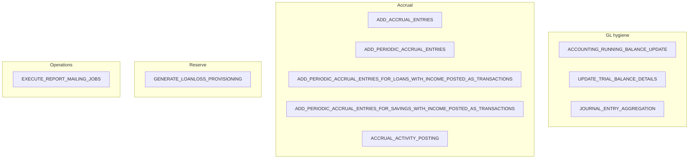
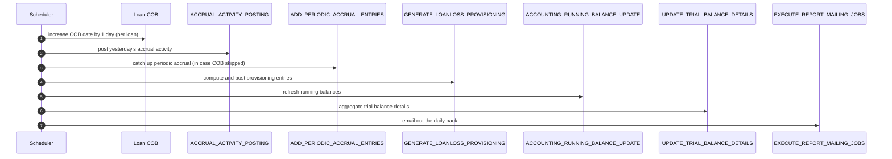

Apache Fineract registers a handful of Spring Batch jobs whose purpose is to maintain the GL: running balances, trial-balance pre-aggregation, periodic accrual, accrual activity posting, loan loss provisioning, and report mailing. Their `JobName` constants live in `fineract-core/.../infrastructure/jobs/service/JobName.java`. This page is the catalogue — what each job does, which tasklet implements it, and where its code lives.

## Tasklet locations

```
fineract-accounting/.../accounting/glaccount/jobs/
└── updatetrialbalancedetails/
    ├── UpdateTrialBalanceDetailsConfig.java
    └── UpdateTrialBalanceDetailsTasklet.java

fineract-provider/.../accounting/jobs/
└── accountrunningbalanceupdate/
    ├── AccountRunningBalanceUpdateConfig.java
    └── AccountRunningBalanceUpdateTasklet.java

fineract-loan/.../portfolio/loanaccount/jobs/
└── addperiodicaccrualentries/AddPeriodicAccrualEntriesTasklet.java

fineract-provider/.../portfolio/loanaccount/jobs/
├── accrualactivityposting/AccrualActivityPostingTasklet.java
├── addaccrualentries/AddAccrualEntriesTasklet.java
└── addperiodicaccrualentriesforloanswithincomepostedastransactions/
    └── AddPeriodicAccrualEntriesForLoansTasklet.java

fineract-provider/.../portfolio/savings/jobs/
└── addaccrualtransactionforsavings/AddAccrualTransactionForSavingsTasklet.java
```

## Catalogue



### `ACCOUNTING_RUNNING_BALANCE_UPDATE` — "Update Accounting Running Balances"

- **Tasklet:** `AccountRunningBalanceUpdateTasklet` (`fineract-provider /accounting/jobs/accountrunningbalanceupdate/`)
- **Purpose:** Recompute the per-account running balance cached in `acc_gl_journal_entry.office_running_balance` and `organization_running_balance` for every entry whose running-balance columns are stale.
- **Triggers:** Scheduled nightly. Also callable on demand via `/v1/journalentries?command=updateRunningBalance&officeId=…`.
- **Idempotent:** Yes — only entries past the cached watermark per office are re-walked.

<Note>
  This is the job that makes "show me the running balance per GL account" answer in O(1) lookup time. Disable it and the running-balance column drifts; you can still derive the value by summing journal entries on demand, but reports get slow.
</Note>

### `UPDATE_TRIAL_BALANCE_DETAILS` — "Update Trial Balance Details"

- **Tasklet:** `UpdateTrialBalanceDetailsTasklet` (`fineract-accounting /.../glaccount/jobs/updatetrialbalancedetails/`).
- **Purpose:** Two-pass refresh of `m_trial_balance`: (1) insert missing aggregate rows for any past business date that has journal entries newer than the table; (2) fill `closing_balance` per `(office, account)` by rolling forward from the last known balance.
- **Triggers:** Scheduled nightly.
- **Detail:** See [Trial Balance](/accounting/trial-balance) for the algorithm.

### `JOURNAL_ENTRY_AGGREGATION` — "Journal Entry Aggregation"

- **Purpose:** Lightweight aggregation pre-stage for downstream reports. Where enabled, it summarises journal entries by office/account/date into a workspace table consumed by tenant-defined reports.
- **Triggers:** Scheduled.

### `ADD_ACCRUAL_ENTRIES` — "Add Accrual Transactions"

- **Tasklet:** `AddAccrualEntriesTasklet` (`fineract-provider /.../jobs/addaccrualentries/`).
- **Purpose:** Upfront-mode accrual — accrues the full schedule's interest/fees/penalties at disbursement for loan products configured `ACCRUAL_UPFRONT`.
- **Triggers:** Scheduled or on demand. Most banks using upfront accrual let this run nightly to catch newly disbursed loans.

### `ADD_PERIODIC_ACCRUAL_ENTRIES` — "Add Periodic Accrual Transactions"

- **Tasklet:** `AddPeriodicAccrualEntriesTasklet` (`fineract-loan /.../jobs/addperiodicaccrualentries/`).
- **Purpose:** Periodic accrual — walks all `ACCRUAL_PERIODIC` loans and posts `ACCRUAL` transactions per installment up to `businessDate`.
- **Internals:** `loanAccrualsProcessingService.addPeriodicAccruals(DateUtils.getBusinessLocalDate())`.
- **Errors:** Captured into a `MultiException`, then wrapped in `JobExecutionException` so the scheduler sees a single failed step.

### `ADD_PERIODIC_ACCRUAL_ENTRIES_FOR_LOANS_WITH_INCOME_POSTED_AS_TRANSACTIONS`

- **Tasklet:** `AddPeriodicAccrualEntriesForLoansTasklet` (`fineract-provider /.../jobs/addperiodicaccrualentriesforloanswithincomepostedastransactions/`).
- **Purpose:** Same as the periodic job, but for loan products that post income as separate transactions rather than embedded in repayment splits.
- **Triggers:** Scheduled nightly.

### `ACCRUAL_ACTIVITY_POSTING` — "Accrual Activity Posting"

- **Tasklet:** `AccrualActivityPostingTasklet` (`fineract-provider /.../jobs/accrualactivityposting/`).
- **Purpose:** For each loan that had accrual-affecting activity yesterday, create one `ACCRUAL_ACTIVITY` transaction summarising the day's effect. Operates on `yesterday = businessDate - 1`.
- **Source query:** `loanAccrualActivityRepository.fetchLoanIdsForAccrualActivityPosting(yesterday, LoanTransactionType.ACCRUAL_ACTIVITY, LoanStatus.ACTIVE)`.

### `ADD_PERIODIC_ACCRUAL_ENTRIES_FOR_SAVINGS_WITH_INCOME_POSTED_AS_TRANSACTIONS` — "Add Accrual Transactions For Savings"

- **Tasklet:** `AddAccrualTransactionForSavingsTasklet` (`fineract-provider /.../portfolio/savings/jobs/addaccrualtransactionforsavings/`).
- **Purpose:** Counterpart for savings products that post income as transactions (most commonly accrued interest on long-tenor term deposits).

### `GENERATE_LOANLOSS_PROVISIONING` — "Generate Loan Loss Provisioning"

- **Service:** `ProvisioningEntriesWritePlatformService.createProvisioningJournalEntries(...)` (`fineract-provider /.../provisioning/service/`).
- **Purpose:** Compute the day's `ProvisioningEntry` and post its `LoanProductProvisioningEntry` debits/credits.
- **Detail:** See [Provisioning](/accounting/provisioning).

### `EXECUTE_REPORT_MAILING_JOBS` — "Execute Report Mailing Jobs"

- **Purpose:** Although not strictly under `fineract-accounting`, this job is operationally bundled with the accounting close: it mails the daily trial-balance, journal entry, and provisioning reports to configured recipients.
- **Triggers:** Scheduled after the trial-balance refresh.

## Suggested ordering on a typical night



In a COB-enabled deployment most loan-level accrual work happens inside COB via `AddPeriodicAccrualEntriesBusinessStep` and `AccrualActivityPostingBusinessStep`. The standalone jobs are then disabled or kept as a safety net.

## Operating the jobs

All accounting jobs are exposed through the standard `/v1/jobs` admin API:

| Method | Path | Action |
| --- | --- | --- |
| `GET` | `/v1/jobs` | List every registered scheduled job with its cron expression and last-run status |
| `GET` | `/v1/jobs/{id}` | Single job detail + history |
| `POST` | `/v1/jobs/{id}?command=executeJob` | Run on demand |
| `PUT` | `/v1/jobs/{id}` | Edit schedule, enable/disable |

The job IDs differ between tenants because each tenant has its own scheduler row, but the `displayName` matches the strings shown above (the constructor argument to each `JobName` enum constant).

<Warning>
  These jobs are not independent. Posting provisioning before periodic accrual on a given day can produce a different reserve number than the reverse order. Pick an order, document it, and keep COB and the jobs in agreement.
</Warning>

## Failure handling

Each tasklet follows the same pattern:

1. Iterate the work unit (per office, per loan, per account).
2. Catch exceptions per unit; collect them.
3. After the loop, if any unit failed, throw `JobExecutionException` with the collected throwables.

This means a single failing loan does not abort the run for everyone else — it only marks the Spring Batch step as failed at the end. The scheduler then retries based on the configured retry policy.

## Per-job error semantics

| Job | Per-unit error handling | Step result |
| --- | --- | --- |
| `ACCOUNTING_RUNNING_BALANCE_UPDATE` | Per office; partial progress committed | FAILED if any office errored |
| `UPDATE_TRIAL_BALANCE_DETAILS` | Per-date inserts and per-(office, account) closing balance | FAILED on any unhandled JDBC exception |
| `ADD_PERIODIC_ACCRUAL_ENTRIES` | Per loan; collected into `MultiException` | FAILED if `MultiException` non-empty |
| `ACCRUAL_ACTIVITY_POSTING` | Per loan; collected into `errors` list | FAILED if any loan threw |
| `GENERATE_LOANLOSS_PROVISIONING` | Per `(office, product)` slice; aborts whole run if criteria invalid | FAILED on validation; otherwise completes |

The COB jobs (loan COB, COB business steps) have a different model — they record a per-loan COB row marking the failed loan so the next night's pipeline can retry it individually rather than re-processing the whole tenant.

## Tenant scope

All scheduled jobs run inside a tenant context. The scheduler iterates known tenants and, for each, sets `ThreadLocalContextUtil` before invoking the tasklet. The tasklets themselves never look up tenants; they take the context as given. This is why most tasklet code uses `RoutingDataSourceServiceFactory.determineDataSourceService().retrieveDataSource()` to get its connection — it reads the per-thread tenant.

## Configuration footprint per job

Each tasklet has a paired `*Config` class that declares:

- A `@Bean Step` named after the job
- A `@Bean Job` wrapping that single step
- A `@Bean Tasklet` whose dependencies are autowired from the application context

For example `UpdateTrialBalanceDetailsConfig` in the accounting module exposes the `UpdateTrialBalanceDetailsTasklet` bean and a `Step` / `Job` pair. The runtime job registrar picks up these `Job` beans automatically and stores per-tenant scheduling state in `m_scheduled_job`.

## When to disable a job

Common scenarios:

- **COB is enabled, COB does periodic accrual** → disable `ADD_PERIODIC_ACCRUAL_ENTRIES` and `ACCRUAL_ACTIVITY_POSTING`. Keep them as a safety net by re-enabling on operator demand.
- **Cash-basis only deployment** → disable every accrual job. They simply find no loans to act on, but disabling shortens nightly windows.
- **Provisioning approval is manual (maker-checker)** → disable `GENERATE_LOANLOSS_PROVISIONING`; let finance trigger `createprovisioningentry` followed by `createjournalentries` via the API.
- **High write volume + small report set** → disable `UPDATE_TRIAL_BALANCE_DETAILS` and rebuild from `acc_gl_journal_entry` on demand for the few reports that need it. The trade-off is slower report response.

## Observability

Each job leaves a trail in:

- `m_scheduler_job_run_history` — start time, end time, status, error message.
- The application log via `Tasklet`-level `Slf4j` loggers — most tasklets log per-unit progress at `DEBUG` and per-step status at `INFO`.
- External events (when enabled) — job run lifecycle events that downstream systems can consume to know when the GL is "current as of X".

Operationally the most useful query is:

```sql
SELECT job_name, status, start_time, end_time, trigger_type, error_message
FROM m_scheduler_job_run_history
WHERE start_time >= CURRENT_DATE - INTERVAL '7 days'
ORDER BY start_time DESC;
```

This is what a tenant operator monitors after enabling/disabling individual jobs.

## Cross-references

<CardGroup cols={2}>
  <Card title="Accounting jobs deep dive" href="/jobs/accounting-jobs-deep-dive">
    Operational view: cron expressions, COB ordering, retry behaviour, and per-tenant tuning.
  </Card>
  <Card title="Accrual Engine" href="/accounting/accrual-engine">
    The accrual mechanics that several of these jobs drive.
  </Card>
  <Card title="Trial Balance" href="/accounting/trial-balance">
    The algorithm `UPDATE_TRIAL_BALANCE_DETAILS` implements.
  </Card>
  <Card title="Provisioning" href="/accounting/provisioning">
    What `GENERATE_LOANLOSS_PROVISIONING` produces.
  </Card>
  <Card title="Spring Batch integration" href="/core/spring-batch-integration">
    How tasklets and configs are wired into the scheduler.
  </Card>
  <Card title="Jobs domain" href="/core/jobs-domain">
    The `JobName` enum and registration mechanism.
  </Card>
</CardGroup>
