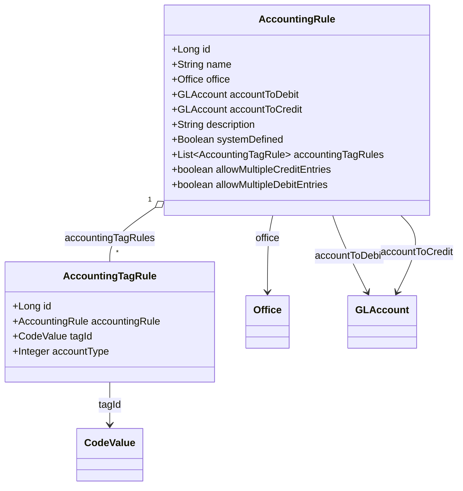
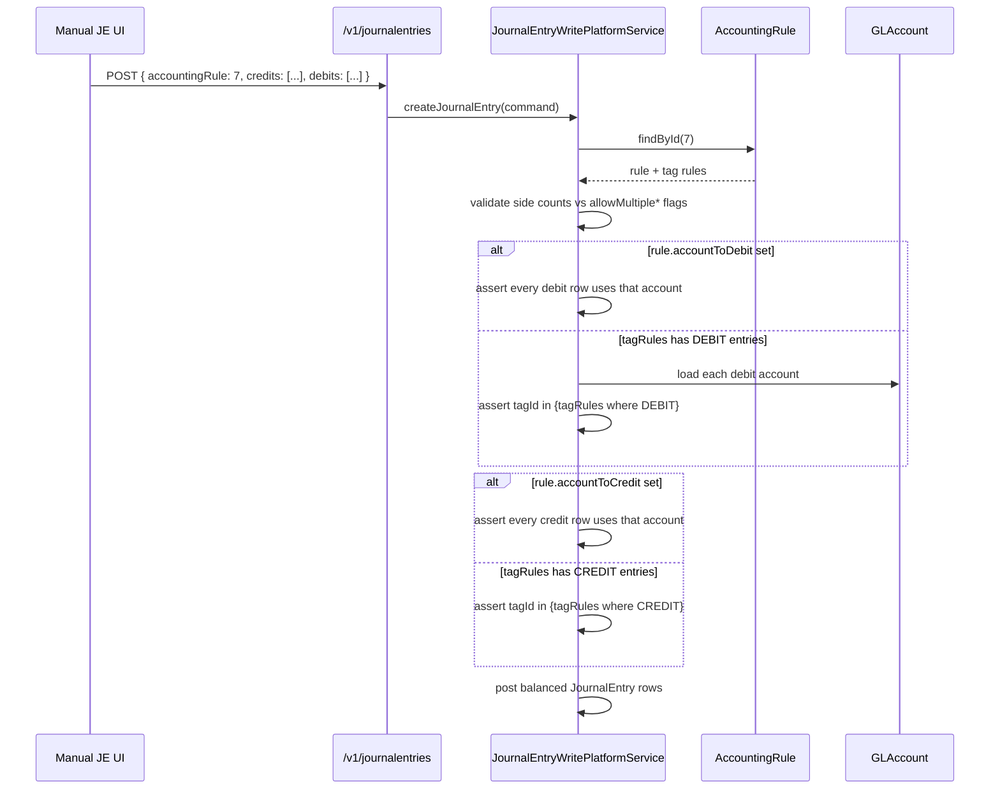

Apache Fineract uses `AccountingRule` as the named, reusable template that powers the manual journal entry screen. The entity lives in `fineract-accounting/src/main/java/org/apache/fineract/accounting/rule/domain/AccountingRule.java` and the table is `acc_accounting_rule`. Banks define rules like "Petty cash purchase", "Branch cash transfer", or "Office expense" once and operators pick them from a dropdown — the rule constrains which accounts can appear on either side and how many.

## Two-entity model



A rule can constrain by **specific account** (set `accountToDebit` / `accountToCredit`) **or** by **tag set** (one or more `AccountingTagRule` children) — but not both for the same side.

## `AccountingRule` fields

| Field | Column | Notes |
| --- | --- | --- |
| `name` | `name` | Unique (`accounting_rule_name_unique`). Length 500. |
| `office` | `office_id` | Optional. When set, the rule is only available to operators of that office; null means head-office-wide. |
| `accountToDebit` | `debit_account_id` | Optional. If set, the debit side is locked to this one GL account. |
| `accountToCredit` | `credit_account_id` | Optional. If set, the credit side is locked to this one GL account. |
| `description` | `description` | Length 500. |
| `systemDefined` | `system_defined` | `true` for rules seeded for built-in scenarios (e.g. opening balances). System-defined rules cannot be deleted via the API. |
| `accountingTagRules` | `acc_rule_tags` | Per-side tag constraints, `cascade = ALL`, `orphanRemoval = true`, `fetch = EAGER`. |
| `allowMultipleCreditEntries` | `allow_multiple_credits` | If `false`, the manual entry form must produce exactly one credit row. |
| `allowMultipleDebitEntries` | `allow_multiple_debits` | If `false`, the manual entry form must produce exactly one debit row. |

## `AccountingTagRule` fields

The child table `acc_rule_tags` carries the per-side tag filter:

| Field | Column | Notes |
| --- | --- | --- |
| `accountingRule` | `acc_rule_id` | Back-reference. |
| `tagId` | `tag_id` | `@ManyToOne CodeValue` — references one of the GL account tag code-sets. |
| `accountType` | `acc_type_enum` | `JournalEntryType.DEBIT` or `CREDIT` — which side this tag constrains. |

The composite key `(acc_rule_id, tag_id, acc_type_enum)` is unique (`UNIQUE_ACCOUNT_RULE_TAGS`), so a rule cannot list the same tag twice on the same side.

## How the rule is consumed



A rule with no `accountTo*` and no tag rules on a given side leaves that side fully open — operators can pick any DETAIL account with `manualEntriesAllowed = true`.

## Construction from JSON

`AccountingRule.fromJson(office, accountToDebit, accountToCredit, command, allowMultipleCreditEntries, allowMultipleDebitEntries)` reads `AccountingRuleJsonInputParams`. Top-level parameters:

- `name`, `description`
- `officeId`
- `accountToDebit`, `accountToCredit` (mutually exclusive with tags on the same side)
- `debitTags`, `creditTags` — arrays of `CodeValue` ids
- `allowMultipleCreditEntries`, `allowMultipleDebitEntries`

`update(command)` produces the standard diff `Map` consumed by the command framework for audit and event emission.

## API surface

The resource lives at `/v1/accountingrules`:

| Method | Path | Action |
| --- | --- | --- |
| `GET` | `/v1/accountingrules` | List with permissions filtered to caller's office |
| `GET` | `/v1/accountingrules/{id}` | Single rule with template (offices + accounts + tags) |
| `POST` | `/v1/accountingrules` | Create |
| `PUT` | `/v1/accountingrules/{id}` | Update — only the changed fields are sent |
| `DELETE` | `/v1/accountingrules/{id}` | Delete — rejected if `systemDefined = true` |

### Create request example

```json
{
  "name": "Petty cash expense",
  "officeId": 1,
  "description": "Office supplies, cleaning, low-value consumables",
  "accountToDebit": 142,
  "creditTags": [201, 202, 203],
  "allowMultipleCreditEntries": false,
  "allowMultipleDebitEntries": false
}
```

This rule:

- Locks the debit to GL account `142` (e.g. "Petty cash float").
- Lets operators pick any credit account whose tag is in `{201, 202, 203}` (e.g. "Office supplies expense", "Cleaning expense").
- Requires exactly one debit row and one credit row.

## Validation rules

The serializer (`rule/serialization`) enforces:

| Rule | Reason |
| --- | --- |
| Either `accountToDebit` xor `debitTags` may be set | Not both — a fixed account is incompatible with a tag set |
| Either `accountToCredit` xor `creditTags` may be set | Same as above for the credit side |
| Tag `CodeValue` must belong to the appropriate tag code-set | Asset, liability, equity, income, or expense tag set |
| `name` is unique | DB constraint `accounting_rule_name_unique` |
| `accountToDebit` and `accountToCredit` must be DETAIL, enabled, `manualEntriesAllowed = true` | Else the rule would always fail at posting time |
| Cannot delete `systemDefined = true` rule | Seeded rules are platform invariants |

## Where rules show up

<CardGroup cols={2}>
  <Card title="Manual journal entry UI" icon="pencil">
    A required dropdown on the Create Journal Entry page. Selecting a rule restricts the account picker and the count of debit/credit rows.
  </Card>
  <Card title="Opening balances" icon="play">
    A seeded system rule pairs the `OPENING_BALANCES_TRANSFER_CONTRA` financial activity account with any DETAIL GL on the other side to record one-time opening balances.
  </Card>
  <Card title="Branch operations" icon="building">
    Office-scoped rules let head office define the only postings a branch teller may originate (cash transfers, float top-ups, expense reimbursements).
  </Card>
  <Card title="Audit and SoD" icon="shield">
    Because the rule restricts accounts, the maker-checker queue review reduces to "did the operator pick a sensible amount and date" rather than "is this a sensible account combination at all".
  </Card>
</CardGroup>

## Read service

`AccountingRuleReadPlatformService` exposes:

- `retrieveAllAccountingRules()` — list, filtered by the caller's office hierarchy.
- `retrieveAccountingRuleById(Long id)` — single rule with all tag rules eagerly fetched.
- `retrieveAccountingRuleTemplate()` — picker template: offices, GL accounts (DETAIL + enabled), and the asset/liability/equity/income/expense tag code-sets.

The template endpoint is what the manual journal entry UI calls to populate dropdowns when an operator opens the form.

## Permissions and SoD

Accounting rules participate in the standard Fineract maker-checker pipeline:

| Permission | Action |
| --- | --- |
| `READ_ACCOUNTINGRULE` | List and get |
| `CREATE_ACCOUNTINGRULE` | POST |
| `UPDATE_ACCOUNTINGRULE` | PUT |
| `DELETE_ACCOUNTINGRULE` | DELETE |
| `CREATE_ACCOUNTINGRULE_CHECKER` | Approve a maker-checker-routed create |

Because rules constrain which accounts can appear on manual journal entries, the controls on the rule itself are usually tighter than the controls on the manual entry. Banks commonly grant `CREATE_JOURNALENTRY` widely (tellers, branch managers) but reserve `CREATE_ACCOUNTINGRULE` for the chief accountant.

## Worked example: opening balances

Fineract seeds a system-defined rule named `Opening Balances Transfer Contra` that pairs the `OPENING_BALANCES_TRANSFER_CONTRA` financial activity account (an EQUITY contra) with any DETAIL account on the other side. The manual entry UI uses it as follows:

1. Operator opens the "Define opening balances" page.
2. UI calls `/v1/accountingrules` and finds the rule by name.
3. The rule's tag set or `accountToCredit` lock the contra side to the EQUITY contra account.
4. Operator fills the other side with the cash/loan/savings/whatever account being seeded plus the opening amount.
5. POST `/v1/journalentries?command=defineOpeningBalance` issues the balanced entry — the rule guards the contra side.

This is a typical pattern: a single seeded rule wraps a workflow that finance teams would otherwise execute through ad hoc rules.

## Storage layout

```text
acc_accounting_rule
├── id                                   bigint PK
├── name                                 varchar(500) UNIQUE
├── office_id                            bigint -> m_office
├── debit_account_id                     bigint -> acc_gl_account
├── credit_account_id                    bigint -> acc_gl_account
├── description                          varchar(500)
├── system_defined                       bit
├── allow_multiple_credits               bit
└── allow_multiple_debits                bit

acc_rule_tags
├── id                                   bigint PK
├── acc_rule_id                          bigint -> acc_accounting_rule
├── tag_id                               bigint -> m_code_value
├── acc_type_enum                        int  /* 1=CREDIT, 2=DEBIT */
└── UNIQUE (acc_rule_id, tag_id, acc_type_enum)
```

`AccountingRule` does not extend an auditable base — historical reasoning was that rules are configuration, not events. In practice the command-source log captures every create/update/delete with operator and timestamp.

## Multi-currency

A rule does not pin a currency. The currency is chosen at posting time and applies to every leg of the posting. The validator at posting time still enforces that all picked accounts share a currency — because GL accounts themselves do not pin currency either, this is asserted indirectly via the office and product configuration.

## Related pages

<CardGroup cols={2}>
  <Card title="Journal Entries" href="/accounting/journal-entries">
    Where `accountingRule` is consumed on posting.
  </Card>
  <Card title="GL Accounts" href="/accounting/gl-accounts">
    Tags and `manualEntriesAllowed` referenced here.
  </Card>
  <Card title="Codes" href="/core/codes">
    The `CodeValue` infrastructure backing rule tags.
  </Card>
  <Card title="GL Closure" href="/accounting/closure">
    The other gate every manual posting must pass.
  </Card>
</CardGroup>
