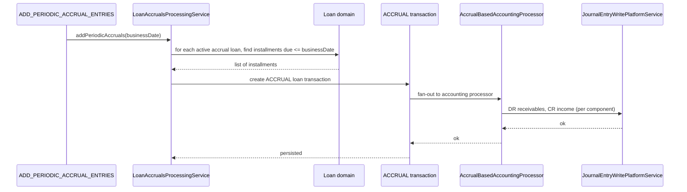

Apache Fineract supports accrual-basis accounting on loan products through a small set of cooperating pieces: an API resource that takes a `tillDate`, a Spring Batch tasklet that runs nightly with `tillDate = today's business date`, and an activity-posting tasklet that converts already-accrued amounts into GL postings. The accrual subpackage lives in `fineract-accounting/src/main/java/org/apache/fineract/accounting/accrual/` and the tasklet implementations live next to the loan domain.

## Subpackage layout

```
fineract-accounting/.../accrual/
├── api/                      # AccrualAccountingApiResource — POST /v1/runaccruals
│                             # AccrualAccountingConstants
├── handler/                  # ExecutePeriodicAccrualCommandHandler
├── request/                  # AccrualAccountRequest (just { tillDate })
├── serialization/            # AccrualAccountingDataValidator
└── service/                  # AccrualAccountingWritePlatformService (interface)

fineract-provider/.../accrual/service/
└── AccrualAccountingWritePlatformServiceImpl

Tasklets (in fineract-loan and fineract-provider):
- AddPeriodicAccrualEntriesTasklet
- AddPeriodicAccrualEntriesForLoansTasklet           (income-as-transactions variant)
- AddAccrualEntriesTasklet                            (upfront variant)
- AccrualActivityPostingTasklet                       (post yesterday's accrual activity)
```

## Two flavours of "accrual"

Apache Fineract distinguishes between **computing** an accrual and **posting** the resulting transactions to the GL:

```mermaid
flowchart LR
    SCH[Loan repayment schedule<br/>installment k<br/>due_date d_k] --> COMPUTE[LoanAccrualsProcessingService<br/>addPeriodicAccruals(tillDate)]
    COMPUTE --> TX[ACCRUAL loan transactions<br/>per installment up to tillDate]
    TX --> POST[Loan transaction handler]
    POST --> JE[Balanced JournalEntry pair<br/>using AccrualAccountsForLoan mapping]
    JE --> GL[(acc_gl_journal_entry)]

    SCHED[Daily activity] --> ACT[AccrualActivityPostingTasklet]
    ACT --> ACTTX[ACCRUAL_ACTIVITY transactions<br/>summarise yesterday's events]
    ACTTX --> POST
```

`ACCRUAL` is the per-installment accrual transaction; `ACCRUAL_ADJUSTMENT` reverses one. `ACCRUAL_ACTIVITY` is the daily activity summary transaction. All three are members of `LoanTransactionType` and all three fan out through the normal loan accounting processor into `JournalEntry` rows.

## API entry point: `/v1/runaccruals`

`AccrualAccountingApiResource`:

```java
@Path("/v1/runaccruals")
public class AccrualAccountingApiResource {

    @POST
    public CommandProcessingResult executePeriodicAccrualAccounting(
            AccrualAccountRequest accrualAccountRequest) {
        CommandWrapper commandRequest = new CommandWrapperBuilder()
            .excuteAccrualAccounting()
            .withJson(apiJsonSerializerService.serialize(accrualAccountRequest))
            .build();
        return commandsSourceWritePlatformService.logCommandSource(commandRequest);
    }
}
```

Request body:

```json
{ "tillDate": "27 May 2025", "dateFormat": "dd MMMM yyyy", "locale": "en" }
```

The handler `ExecutePeriodicAccrualCommandHandler` reads `tillDate`, then invokes `AccrualAccountingWritePlatformService.executeLoansPeriodicAccrual(tillDate)`. That service walks active loans whose product is `ACCRUAL_PERIODIC` and processes installments up to the chosen `tillDate`.

This is the **till-date** variant — useful when you need to catch up after the nightly job has been disabled, or to reproduce a specific cut-off for an audit.

## Scheduled variant: `ADD_PERIODIC_ACCRUAL_ENTRIES`

`AddPeriodicAccrualEntriesTasklet`:

```java
public RepeatStatus execute(StepContribution contribution, ChunkContext chunkContext) throws Exception {
    try {
        addPeriodicAccruals(DateUtils.getBusinessLocalDate());
    } catch (MultiException e) {
        throw new JobExecutionException(e);
    }
    return RepeatStatus.FINISHED;
}

private void addPeriodicAccruals(final LocalDate tilldate) throws MultiException {
    loanAccrualsProcessingService.addPeriodicAccruals(tilldate);
}
```

It is the same `LoanAccrualsProcessingService` call, with `tillDate = today's business date`. The job is registered as `ADD_PERIODIC_ACCRUAL_ENTRIES` ("Add Periodic Accrual Transactions") in `JobName`.

A second tasklet — `AddPeriodicAccrualEntriesForLoansTasklet` in the `addperiodicaccrualentriesforloanswithincomepostedastransactions` package — handles the "income posted as transactions" variant for loan products with the corresponding flag. It is registered as `ADD_PERIODIC_ACCRUAL_ENTRIES_FOR_LOANS_WITH_INCOME_POSTED_AS_TRANSACTIONS`.

## How a periodic accrual posting is built

For each loan with `accounting_type ∈ {ACCRUAL_PERIODIC, ACCRUAL_UPFRONT}`:

1. Find installments whose `due_date <= tillDate` and that have not yet been fully accrued.
2. For each installment, compute the accrued interest, fees, and penalties between the last accrual date and either the installment due date or `tillDate` (whichever is earlier).
3. Create one `ACCRUAL` loan transaction per installment.
4. The transaction handler invokes the accrual-basis accounting processor, which reads `ProductToGLAccountMapping` and emits journal entries:

| Component | Debit | Credit |
| --- | --- | --- |
| Interest accrued | `INTEREST_RECEIVABLE` (code 7) | `INTEREST_ON_LOANS` (code 3) |
| Fee accrued | `FEES_RECEIVABLE` (code 8) | `INCOME_FROM_FEES` (code 4) |
| Penalty accrued | `PENALTIES_RECEIVABLE` (code 9) | `INCOME_FROM_PENALTIES` (code 5) |

When the borrower actually pays, the cash-basis side of the same product mapping reverses the receivable: DR Fund Source, CR Interest/Fee/Penalty Receivable.



## Activity posting: `ACCRUAL_ACTIVITY_POSTING`

`AccrualActivityPostingTasklet`:

```java
public RepeatStatus execute(StepContribution contribution, ChunkContext chunkContext) {
    final LocalDate yesterday = DateUtils.getBusinessLocalDate().minusDays(1);
    Set<Long> loanAccounts = loanAccrualActivityRepository
        .fetchLoanIdsForAccrualActivityPosting(
            yesterday, LoanTransactionType.ACCRUAL_ACTIVITY, LoanStatus.ACTIVE);
    for (Long accountId : loanAccounts) {
        loanAccrualActivityProcessingService
            .makeAccrualActivityTransaction(accountId, yesterday);
    }
    return RepeatStatus.FINISHED;
}
```

The job:

- Targets yesterday's business date — accrual activity is always "for the day that just finished".
- Loads the loans that had accrual-affecting activity on that day (`fetchLoanIdsForAccrualActivityPosting` filters by status ACTIVE and by the absence of an existing `ACCRUAL_ACTIVITY` transaction for that date).
- Calls `makeAccrualActivityTransaction(accountId, yesterday)` per loan, which creates one `ACCRUAL_ACTIVITY` transaction summarising the net effect and emits its corresponding journal entries.

Errors per loan are collected and rethrown as `JobExecutionException` at the end so a single bad loan does not stop the whole job.

## Loan-product flags that matter

A loan product's behaviour is driven by three columns:

| Column | Values | Effect on accrual |
| --- | --- | --- |
| `accounting_type` | NONE/CASH/ACCRUAL_PERIODIC/ACCRUAL_UPFRONT | Determines whether accrual postings happen at all and on which schedule. |
| `is_interest_recalculation_enabled` | bool | Influences how installments are recomputed; the accrual engine reads the current schedule. |
| `is_income_from_transactions_enabled` (income-as-transactions) | bool | If true, the loan flows through `ADD_PERIODIC_ACCRUAL_ENTRIES_FOR_LOANS_WITH_INCOME_POSTED_AS_TRANSACTIONS` instead of the basic job. |

## Upfront accrual

`AddAccrualEntriesTasklet` (in `fineract-provider /.../jobs/addaccrualentries`) is the historic "Add Accrual Transactions" tasklet (job `ADD_ACCRUAL_ENTRIES`). It accrues at disbursement / schedule generation rather than periodically — used by products configured `ACCRUAL_UPFRONT`. The job name string is "Add Accrual Transactions".

| Job constant | Schedule | What it accrues |
| --- | --- | --- |
| `ADD_ACCRUAL_ENTRIES` | Upfront, when called | Full schedule on `ACCRUAL_UPFRONT` products |
| `ADD_PERIODIC_ACCRUAL_ENTRIES` | Nightly | Per installment up to today on `ACCRUAL_PERIODIC` products |
| `ADD_PERIODIC_ACCRUAL_ENTRIES_FOR_LOANS_WITH_INCOME_POSTED_AS_TRANSACTIONS` | Nightly | Per installment on income-as-transactions products |
| `ACCRUAL_ACTIVITY_POSTING` | Nightly | One `ACCRUAL_ACTIVITY` per active loan summarising yesterday |
| `ADD_PERIODIC_ACCRUAL_ENTRIES_FOR_SAVINGS_WITH_INCOME_POSTED_AS_TRANSACTIONS` | Nightly | Savings counterpart |

## COB integration

The same processing is also wired into the loan COB (Close-of-Business) pipeline as business steps:

- `AddPeriodicAccrualEntriesBusinessStep` — equivalent to running the periodic accrual for one loan inside COB.
- `AccrualActivityPostingBusinessStep` — equivalent to the activity tasklet, for one loan.

When the loan COB is enabled, the per-tenant operator typically disables the standalone jobs for individual loans and relies on COB ordering to interleave accrual with delinquency classification and arrears ageing on the same loan in the same business-date window.

<Tip>
  If accrual postings start lagging, check three things in order: (1) is the loan product's `accounting_type` ACCRUAL_*?; (2) does the product have rows in `acc_product_mapping` for `INTEREST_RECEIVABLE`, `FEES_RECEIVABLE`, `PENALTIES_RECEIVABLE` (codes 7/8/9 in `AccrualAccountsForLoan`)?; (3) is `ADD_PERIODIC_ACCRUAL_ENTRIES` enabled and succeeding in the scheduler?
</Tip>

## Service-layer interfaces

```java
public interface LoanAccrualsProcessingService {
    void addPeriodicAccruals(LocalDate tillDate) throws MultiException;
    void addAccrualAccounting(Long loanId, LocalDate tillDate);
}

public interface LoanAccrualActivityProcessingService {
    void makeAccrualActivityTransaction(Long loanId, LocalDate businessDate);
}

public interface AccrualAccountingWritePlatformService {
    CommandProcessingResult executeLoansPeriodicAccrual(JsonCommand command);
}
```

`LoanAccrualsProcessingService` is the heart of the periodic path. The `MultiException` it can throw is a Fineract container for "this failed for some loans but processing continued for the rest" — each inner exception carries the loan id so operators can re-run for just the affected loans.

## Idempotency

Re-running the periodic accrual job after a successful run finds no new installments to accrue for any loan that has been brought up to date. Concretely:

- Each loan tracks its accrual high-water-mark via `loan_accrual_charges` and the `accrued_*` columns on the installments.
- The query for "installments to accrue" filters out anything where the high-water-mark is at or past the installment.
- Calling the API twice with the same `tillDate` produces postings the first time and zero postings the second time.

For the activity-posting job the dedup is the existence of an `ACCRUAL_ACTIVITY` transaction on yesterday's date: `fetchLoanIdsForAccrualActivityPosting` excludes loans that already have one.

## Reversals

Reversing an accrual posting goes through the loan transaction's `ACCRUAL_ADJUSTMENT` type rather than direct journal entry manipulation. The flow:

1. Operator (or system) requests reversal of an `ACCRUAL` transaction.
2. Loan transaction handler marks the original transaction reversed and creates an `ACCRUAL_ADJUSTMENT` for the same amount with opposite sign.
3. The adjustment fans out into accounting and produces compensating journal entries automatically — DR `INTEREST_ON_LOANS`, CR `INTEREST_RECEIVABLE` (and same for fees/penalties).

This means the GL is always consistent with the loan ledger; nothing in the accounting module needs special-casing to handle accrual reversals.

## Related pages

<CardGroup cols={2}>
  <Card title="Journal Entries" href="/accounting/journal-entries">
    The output of every accrual run.
  </Card>
  <Card title="Product Mapping" href="/accounting/product-to-account-mapping">
    The receivables-mapping that makes accrual postings possible.
  </Card>
  <Card title="Accounting Jobs" href="/accounting/accounting-jobs">
    All accrual-related jobs catalogued in one place.
  </Card>
  <Card title="Loan accounting hooks" href="/accounting/product-to-account-mapping">
    Where `ACCRUAL`, `ACCRUAL_ADJUSTMENT`, and `ACCRUAL_ACTIVITY` are emitted.
  </Card>
</CardGroup>
