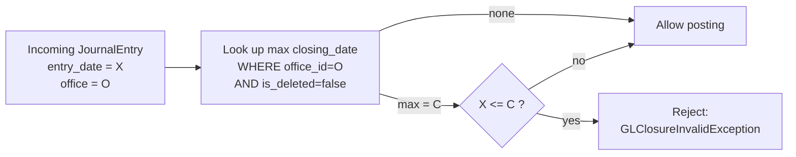
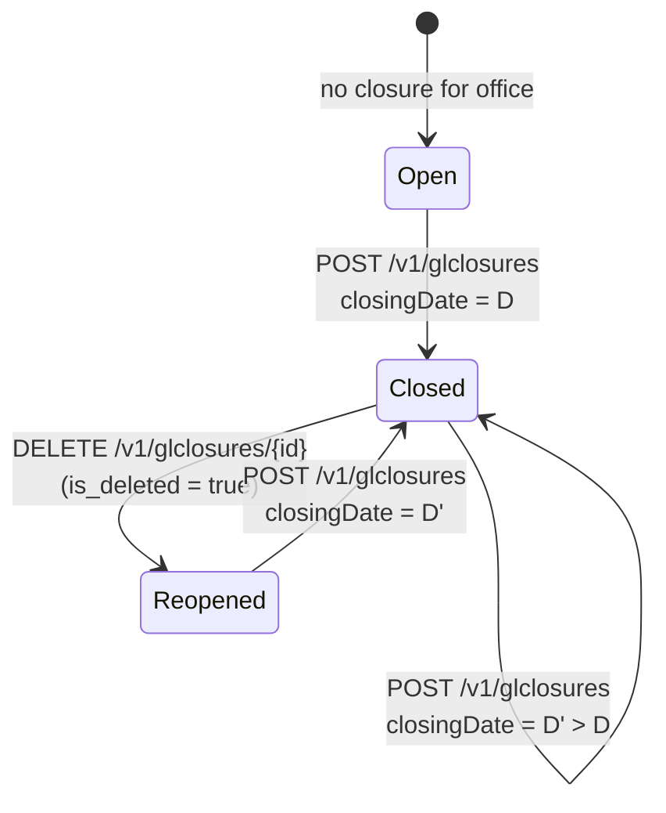
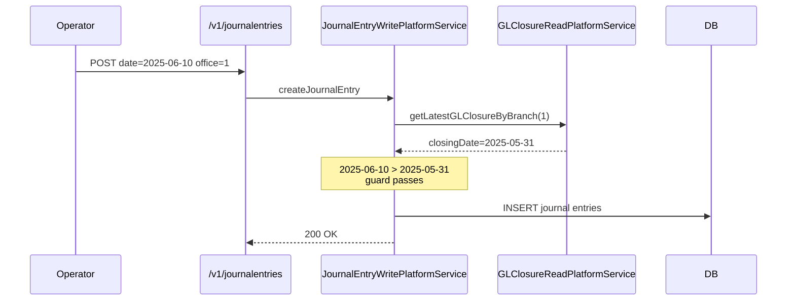
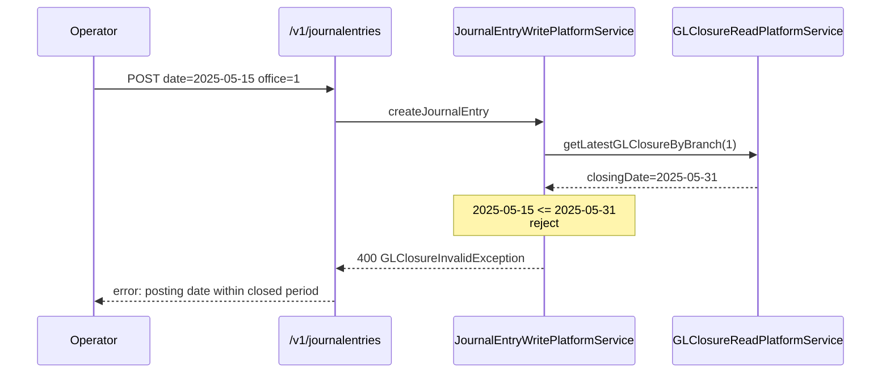
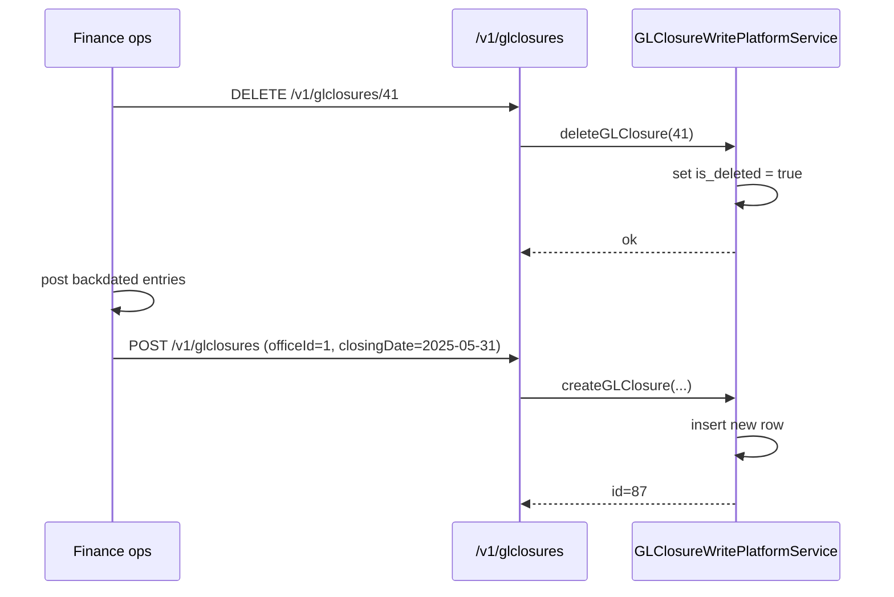

Apache Fineract gives finance teams a simple, per-office cut-off for postings: the `GLClosure` entity. Once an office is "closed through" a given date, the journal entry write service refuses to insert any `JournalEntry` whose `entry_date` is on or before that date. The entity lives in `fineract-accounting/src/main/java/org/apache/fineract/accounting/closure/domain/GLClosure.java` and persists to `acc_gl_closure`.

## Entity shape

```java
@Entity
@Table(name = "acc_gl_closure", uniqueConstraints = {
    @UniqueConstraint(columnNames = {"office_id", "closing_date"}, name = "office_id_closing_date")
})
public class GLClosure extends AbstractAuditableCustom {
    @ManyToOne @JoinColumn(name = "office_id", nullable = false)
    private Office office;

    @Column(name = "is_deleted", nullable = false)
    private boolean deleted = true;   // flipped to false in the constructor

    @Column(name = "closing_date")
    private LocalDate closingDate;

    @Column(name = "comments", nullable = true, length = 500)
    private String comments;
}
```

| Field | Column | Notes |
| --- | --- | --- |
| `office` | `office_id` | The branch (or head office) this closure applies to. Required. |
| `deleted` | `is_deleted` | Soft-delete flag. The constructor sets it to `false`; the API delete operation flips it back to `true`. |
| `closingDate` | `closing_date` | Inclusive end of the locked period. Any posting on or before this date is rejected. |
| `comments` | `comments` | Free text — typically the period name or auditor reference. |

`GLClosure extends AbstractAuditableCustom`, so it carries `created_by`, `created_date`, `last_modified_by`, `last_modified_date` from the audit framework.

The `(office_id, closing_date)` pair is unique — you cannot create two closure records for the same office on the same date.

## Semantics

For each office, the "current" closure is the row with the largest `closing_date` where `is_deleted = false`. There is no separate concept of an "open period" entity: the period is simply `(currentClosingDate, today]`. Reopening a period means soft-deleting the closure row.



This check runs inside `JournalEntryWritePlatformServiceJpaRepositoryImpl` for every posting — manual or system. Loan and savings transaction handlers therefore inherit it transitively: dating a loan repayment into a closed period throws the same exception via the accounting fan-out.

## Creating a closure

`GLClosure.fromJson(office, command)` reads `GLClosureJsonInputParams.CLOSING_DATE` and `COMMENTS`. The constructor stores the closing date and trims comments.

```java
public GLClosure(final Office office, final LocalDate closingDate, final String comments) {
    this.office = office;
    this.deleted = false;
    this.closingDate = closingDate;
    this.comments = StringUtils.defaultIfEmpty(comments, null);
    if (this.comments != null) {
        this.comments = this.comments.trim();
    }
}
```

`update(command)` only allows `comments` to change — closing dates and the office are immutable once the closure exists. To change a date you delete and recreate.

## Validation rules

The write service enforces a set of guards before the row is saved:

| Rule | Detail |
| --- | --- |
| `closingDate <= today` | Cannot close into the future. |
| No future-date journal entries already exist after `closingDate` is reset | Reopening + closing again is allowed; pure-create must be from today's perspective. |
| For every child office, the closure date must be >= the parent office's closure date... | Or, depending on configuration, equal. The check walks `Office.parent`. |
| `closingDate` strictly greater than any existing non-deleted `closing_date` for the office | You cannot create a closure earlier than the current one — that would be a reopen, which has its own DELETE call. |
| `office` must exist | FK enforced both at validation and DB level. |

<Warning>
  Soft-deleting a closure does not roll back any postings — it just lifts the date guard. Backdating into a re-opened period requires a permission separate from normal posting permission, typically restricted to a "Period reopen" role.
</Warning>

## Lifecycle



In practice most banks close monthly: at month-end they POST a closure with `closingDate = last day of month`. The next month's postings flow normally; backdating into the closed month requires an operator to delete the closure row, post, and re-close.

## API surface

The resource is `GLClosureApiResource` and serves `/v1/glclosures`:

| Method | Path | Action |
| --- | --- | --- |
| `GET` | `/v1/glclosures` | List all closures, optionally filtered by `officeId` |
| `GET` | `/v1/glclosures/{id}` | Single closure |
| `POST` | `/v1/glclosures` | Create new closure |
| `PUT` | `/v1/glclosures/{id}` | Update — only `comments` is editable |
| `DELETE` | `/v1/glclosures/{id}` | Soft delete (reopen the period) |
| `GET` | `/v1/glclosures/template` | Picker template (offices list) |

### Create request

```json
{
  "officeId": 1,
  "closingDate": "31 May 2025",
  "comments": "May 2025 month-end close",
  "locale": "en",
  "dateFormat": "dd MMMM yyyy"
}
```

## How it interacts with other features

<CardGroup cols={2}>
  <Card title="Loan & savings backdating" icon="rotate-left">
    Backdating a loan transaction (e.g. an adjustment) into a closed period fails with the same `GLClosureInvalidException` raised from the accounting fan-out.
  </Card>
  <Card title="Periodic accrual" icon="calendar">
    The periodic accrual job posts against the business date, never a backdated one — it cannot conflict with a normal forward-moving closure schedule.
  </Card>
  <Card title="Office hierarchy" icon="sitemap">
    Closures are office-scoped. Closing the head office does not automatically close branches; each branch carries its own row.
  </Card>
  <Card title="Audit" icon="shield-check">
    Every closure carries audit columns from `AbstractAuditableCustom`. Combined with the maker-checker workflow this gives finance a tamper-evident close trail.
  </Card>
</CardGroup>

## Read service

`GLClosureReadPlatformService` exposes:

- `retrieveAllGLClosures(officeId)` — list view
- `retrieveGLClosureById(id)` — single
- `getLatestGLClosureByBranch(officeId)` — used by the journal entry write service for the date guard. Returns `null` if no non-deleted closure exists.

## Sample sequences

### Normal posting passes the guard



### Backdate into a closed period



### Period reopen workflow



## SQL underpinnings

The check during posting is the equivalent of:

```sql
SELECT MAX(closing_date)
FROM acc_gl_closure
WHERE office_id = ?
  AND is_deleted = false;
```

For multi-office postings (a manual JE that touches more than one office in a complex setup), the validator runs the check per office and rejects the whole transaction if any office is closed at the given date.

## Read service interface

```java
public interface GLClosureReadPlatformService {
    List<GLClosureData> retrieveAllGLClosures(Long officeId);
    GLClosureData retrieveGLClosureById(Long id);
    GLClosureData getLatestGLClosureByBranch(Long officeId);
}
```

The third method is the hot path — called from `JournalEntryWritePlatformServiceJpaRepositoryImpl` on every write. Its query is parameterised and short, so even at heavy write volume the guard adds negligible latency.

## Related pages

<CardGroup cols={2}>
  <Card title="Journal Entries" href="/accounting/journal-entries">
    The write service that consults `GLClosure` on every posting.
  </Card>
  <Card title="Offices" href="/organisation/offices">
    The hierarchy that closure rows hang off.
  </Card>
  <Card title="Accrual Engine" href="/accounting/accrual-engine">
    The forward-moving job that closure shapes the boundary for.
  </Card>
  <Card title="Overview" href="/accounting/overview">
    Where closure fits in the wider posting flow.
  </Card>
</CardGroup>
