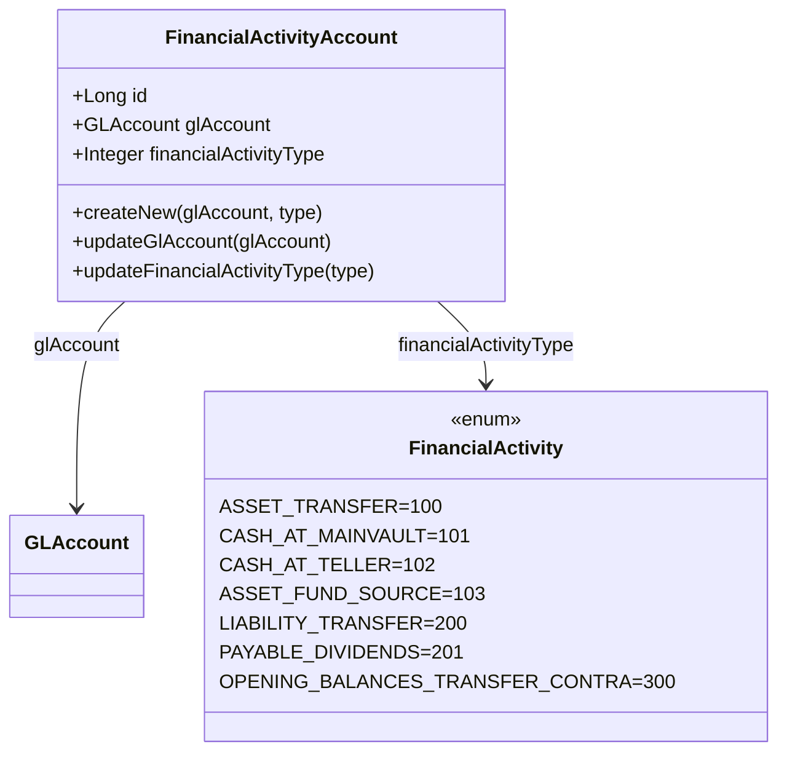
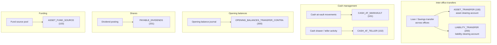

Apache Fineract has a handful of accounting flows that are not tied to a specific loan, savings, or share product — they are global to the organisation. Examples: the contra account used to record opening balances, the cash-at-vault account, the payable dividends liability, the asset transfer clearing account. These are configured once via the `FinancialActivityAccount` entity in `fineract-accounting/src/main/java/org/apache/fineract/accounting/financialactivityaccount/`.

## Package layout

```
financialactivityaccount/
├── api/                # FinancialActivityAccountApiResource — /v1/financialactivityaccounts
├── data/               # FinancialActivityAccountData, FinancialActivityData
├── domain/             # FinancialActivityAccount, repositories
├── exception/          # Not-found, duplicate, type mismatch exceptions
├── handler/            # Command handlers (create / update / delete)
├── serialization/      # JSON validator
└── service/            # Read + write platform services
```

## Entity shape

```java
@Entity
@Table(name = "acc_gl_financial_activity_account")
public class FinancialActivityAccount extends AbstractPersistableCustom<Long> {

    @ManyToOne(fetch = FetchType.EAGER)
    @JoinColumn(name = "gl_account_id")
    private GLAccount glAccount;

    @Column(name = "financial_activity_type", nullable = false)
    private Integer financialActivityType;
}
```

Just two columns of business state: which `GLAccount` and which financial activity code. The activity code values come from `AccountingConstants.FinancialActivity` in `fineract-core`.

## `FinancialActivity` enum

Each enum constant carries an integer code, a JSON-friendly camelCase string, and the `GLAccountType` the mapped account must have:

| Constant | Code | JSON code | Required `GLAccountType` |
| --- | --- | --- | --- |
| `ASSET_TRANSFER` | 100 | `assetTransfer` | ASSET |
| `CASH_AT_MAINVAULT` | 101 | `cashAtMainVault` | ASSET |
| `CASH_AT_TELLER` | 102 | `cashAtTeller` | ASSET |
| `ASSET_FUND_SOURCE` | 103 | `fundSource` | ASSET |
| `LIABILITY_TRANSFER` | 200 | `liabilityTransfer` | LIABILITY |
| `PAYABLE_DIVIDENDS` | 201 | `payableDividends` | LIABILITY |
| `OPENING_BALANCES_TRANSFER_CONTRA` | 300 | `openingBalancesTransferContra` | EQUITY |

The serializer rejects any attempt to map an activity to an account whose `GLAccountType` does not match — for instance you cannot point `ASSET_TRANSFER` at a LIABILITY account.



## Where each activity is consumed



| Activity | Used by |
| --- | --- |
| `ASSET_TRANSFER` (100) | Inter-office loan/savings asset transfers (clearing leg on the originating side). |
| `LIABILITY_TRANSFER` (200) | Inter-office savings/share liability transfers (clearing leg). |
| `CASH_AT_MAINVAULT` (101) | Main vault cash position; the cashier journal posts the contra here. |
| `CASH_AT_TELLER` (102) | Per-teller cashbox positions. |
| `ASSET_FUND_SOURCE` (103) | Generic fund source account when no product-level fund source is configured. |
| `OPENING_BALANCES_TRANSFER_CONTRA` (300) | Equity contra account used when seeding opening balances via the manual journal entry API. |
| `PAYABLE_DIVIDENDS` (201) | Share dividend posting writes the liability leg here. |

## Construction

```java
FinancialActivityAccount.createNew(GLAccount glAccount, Integer financialAccountType);
```

Mutators:

```java
public void updateGlAccount(GLAccount glAccount);
public void updateFinancialActivityType(Integer financialActivityType);
```

There is no `fromJson` factory — the JSON command flows through `FinancialActivityAccountDataValidator` which validates the activity code and the account type compatibility, then the service calls `createNew` directly.

## API surface

The resource is `FinancialActivityAccountApiResource` and serves `/v1/financialactivityaccounts`:

| Method | Path | Action |
| --- | --- | --- |
| `GET` | `/v1/financialactivityaccounts` | List every mapping |
| `GET` | `/v1/financialactivityaccounts/template` | Picker template (activities + GL accounts grouped by type) |
| `GET` | `/v1/financialactivityaccounts/{id}` | Single mapping |
| `POST` | `/v1/financialactivityaccounts` | Create — body `{ "financialActivityId": 100, "glAccountId": 42 }` |
| `PUT` | `/v1/financialactivityaccounts/{id}` | Update either side |
| `DELETE` | `/v1/financialactivityaccounts/{id}` | Delete the mapping |

### Create request

```json
{
  "financialActivityId": 100,
  "glAccountId": 42
}
```

If GL account `42` is not an ASSET account, validation fails because `FinancialActivity.ASSET_TRANSFER.getMappedGLAccountType()` returns `ASSET`.

## Validation rules

| Rule | Source |
| --- | --- |
| `financialActivityId` is a known `FinancialActivity` code | `FinancialActivity.fromInt(...)` returns non-null |
| `glAccountId` references an existing, enabled, DETAIL `GLAccount` | Read service join |
| `glAccount.type` equals `financialActivity.getMappedGLAccountType()` | Serializer check |
| Each `financialActivityType` value has at most one mapping | DB uniqueness — duplicate insert raises `FinancialActivityAccountInvalidException` |

## Read service

`FinancialActivityAccountReadPlatformService` returns:

- `findAll()` → `Collection<FinancialActivityAccountData>` — used by the API list endpoint
- `findById(id)` → `FinancialActivityAccountData`
- `findByFinancialActivityType(int)` → `FinancialActivityAccountData` — used by the inter-office transfer code and the opening-balance flow to look up the correct account at posting time

`FinancialActivityAccountRepositoryWrapper` is the consumer-side wrapper that throws `FinancialActivityAccountNotFoundException` on miss — handy for the inter-office transfer service which should never silently skip a posting.

## Opening balances flow

Defining opening balances goes through `/v1/journalentries?command=defineOpeningBalance`. The handler:

1. Looks up the `OPENING_BALANCES_TRANSFER_CONTRA` mapping.
2. Asserts it exists; if not, raises `FinancialActivityAccountNotFoundException`.
3. For each opening balance row submitted, builds a balanced posting: the named account on one side, the contra account on the other.
4. Stamps the posting as manual (`manualEntry = true`) with a single shared `transactionId`.

This is why most production deployments configure `OPENING_BALANCES_TRANSFER_CONTRA` immediately after creating the chart of accounts — without it the opening-balance endpoint is dead.

<Tip>
  When promoting an existing instance into multi-office, define `ASSET_TRANSFER` and `LIABILITY_TRANSFER` before turning on inter-office transfers. The transfer handler will fail loudly if either mapping is missing, but the failure mode is "transfer rejected" rather than "transfer with no contra posting".
</Tip>

## Exception types

The package ships three domain exceptions in `financialactivityaccount/exception/`:

| Exception | When | HTTP |
| --- | --- | --- |
| `FinancialActivityAccountNotFoundException` | Lookup by id fails, or `findByFinancialActivityType(int)` returns null on a hot path | 404 |
| `DuplicateFinancialActivityAccountFoundException` | Attempt to insert a second mapping for an activity that already has one | 403 |
| `FinancialActivityAccountInvalidException` | The GL account type does not match the activity's required `GLAccountType` | 403 |

The third is the most common in practice — operators see it when they try to point `PAYABLE_DIVIDENDS` at an EQUITY account or `CASH_AT_TELLER` at an INCOME account.

## Service interfaces

```java
public interface FinancialActivityAccountReadPlatformService {
    Collection<FinancialActivityAccountData> retrieveAll();
    FinancialActivityAccountData retrieve(Long id);
    FinancialActivityAccountData findByFinancialActivityType(int financialActivityType);
    FinancialActivityAccountData getFinancialActivityAccountTemplate();
}

public interface FinancialActivityAccountWritePlatformService {
    CommandProcessingResult createGLAccountActivityMapping(JsonCommand command);
    CommandProcessingResult updateGLAccountActivityMapping(Long id, JsonCommand command);
    CommandProcessingResult deleteGLAccountActivityMapping(Long id);
}
```

`FinancialActivityAccountRepositoryWrapper` is the consumer-side wrapper that throws `FinancialActivityAccountNotFoundException` rather than returning `null`, used by the inter-office transfer service and the opening-balance handler so a missing mapping fails loudly.

## Worked example: configuring a fresh tenant

A bank stand-up typically maps every used financial activity right after seeding the chart of accounts:

```http
POST /v1/financialactivityaccounts
{"financialActivityId": 300, "glAccountId": 4001}   # Opening balances contra (EQUITY)

POST /v1/financialactivityaccounts
{"financialActivityId": 100, "glAccountId": 1501}   # Asset transfer clearing (ASSET)

POST /v1/financialactivityaccounts
{"financialActivityId": 200, "glAccountId": 2501}   # Liability transfer clearing (LIABILITY)

POST /v1/financialactivityaccounts
{"financialActivityId": 101, "glAccountId": 1010}   # Cash at main vault (ASSET)

POST /v1/financialactivityaccounts
{"financialActivityId": 201, "glAccountId": 2601}   # Payable dividends (LIABILITY)
```

Operators that try to seed opening balances or configure share dividends before completing this matrix will receive `FinancialActivityAccountNotFoundException` at the corresponding feature's API call.

## Related pages

<CardGroup cols={2}>
  <Card title="GL Accounts" href="/accounting/gl-accounts">
    The accounts pointed at by financial activity mappings.
  </Card>
  <Card title="Journal Entries" href="/accounting/journal-entries">
    Where opening balance + transfer postings land.
  </Card>
  <Card title="Product Mapping" href="/accounting/product-to-account-mapping">
    Per-product variant of the same idea, but indexed by product instead of activity.
  </Card>
  <Card title="Offices" href="/organisation/offices">
    Inter-office transfers consume `ASSET_TRANSFER` and `LIABILITY_TRANSFER`.
  </Card>
</CardGroup>
