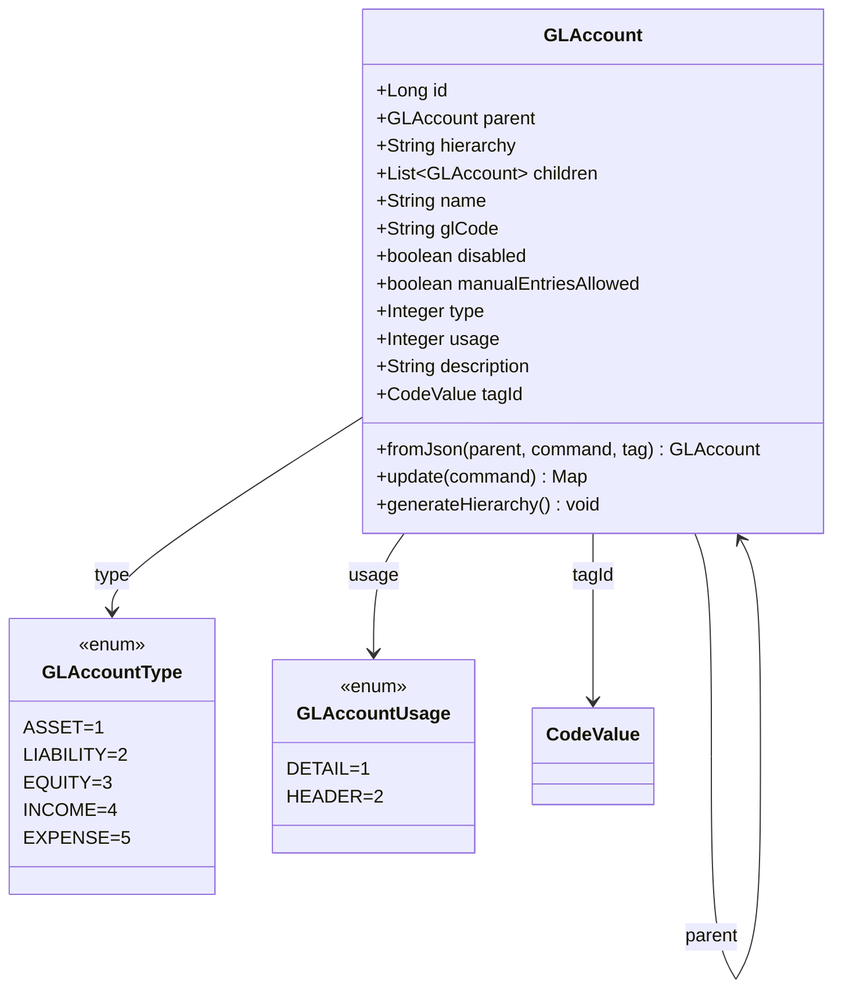
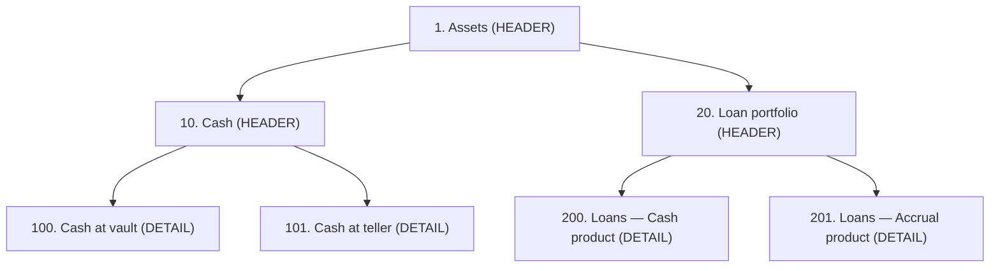

Apache Fineract represents its chart of accounts with a single self-referential entity, `GLAccount`, defined in `fineract-core/src/main/java/org/apache/fineract/accounting/glaccount/domain/GLAccount.java` and persisted to the `acc_gl_account` table. Every leaf account that participates in postings, every header/group that organises the tree, and every account referenced by a product mapping, an accounting rule, or a financial activity is a row in this table.

## Entity shape

`GLAccount extends AbstractPersistableCustom<Long>` and declares the following persistent state:

| Field | Column | Notes |
| --- | --- | --- |
| `parent` | `parent_id` | `@ManyToOne` self-reference to the immediate parent. `null` at roots. |
| `hierarchy` | `hierarchy` | Cached `.`-separated path of ancestor ids, e.g. `.1.7.42.` — used for subtree queries. |
| `children` | (inverse `parent_id`) | `@OneToMany` collection — populated lazily. |
| `name` | `name` | Length 45, required. |
| `glCode` | `gl_code` | Length 100, required. Globally unique via `acc_gl_code` constraint. |
| `disabled` | `disabled` | Boolean. Disabled accounts cannot receive new postings. |
| `manualEntriesAllowed` | `manual_journal_entries_allowed` | Defaults to `true`. Toggled off for system-only accounts. |
| `type` | `classification_enum` | Integer code for `GLAccountType`. |
| `usage` | `account_usage` | Integer code for `GLAccountUsage` (HEADER or DETAIL). |
| `description` | `description` | Length 500. |
| `tagId` | `tag_id` | `@ManyToOne CodeValue` — categorises asset/liability/etc tags. |



## GLAccountType — the five classifications

`GLAccountType` (same package) enumerates exactly the five accounting types every double-entry ledger needs:

```java
ASSET(1, "accountType.asset"),
LIABILITY(2, "accountType.liability"),
EQUITY(3, "accountType.equity"),
INCOME(4, "accountType.income"),
EXPENSE(5, "accountType.expense");
```

The integer values are persisted in `classification_enum`. The enum also exposes convenience predicates `isAssetType()`, `isLiabilityType()`, `isEquityType()`, `isIncomeType()`, `isExpenseType()`, used heavily by the trial-balance and running-balance code to choose between debit-positive and credit-positive aggregation.

### Posting-side conventions

| Type | "Normal" side | Debit effect | Credit effect |
| --- | --- | --- | --- |
| ASSET | Debit | Increase | Decrease |
| LIABILITY | Credit | Decrease | Increase |
| EQUITY | Credit | Decrease | Increase |
| INCOME | Credit | Decrease | Increase |
| EXPENSE | Debit | Increase | Decrease |

Fineract does not store sign; it stores `JournalEntryType.DEBIT` or `JournalEntryType.CREDIT` plus an unsigned `amount`. The running balance update job (`ACCOUNTING_RUNNING_BALANCE_UPDATE`) applies the table above to compute per-account net balance.

## GLAccountUsage — HEADER vs DETAIL

```java
DETAIL(1, "accountUsage.detail"),
HEADER(2, "accountUsage.header");
```

- **DETAIL** — a leaf account that can hold journal entries. Product mappings, financial activity mappings, and the manual journal entry API all require DETAIL accounts. Hooks enforce this at validation time.
- **HEADER** — an organising node that groups DETAIL children. HEADER accounts may not be selected as the `glAccount` of any `JournalEntry`, `AccountingRule.accountToDebit`, `AccountingRule.accountToCredit`, `ProductToGLAccountMapping.glAccount`, or `FinancialActivityAccount.glAccount`.

<Warning>
  Attempting to post against a HEADER account, a DISABLED account, or — for manual postings — an account with `manualEntriesAllowed = false` produces a platform validation exception from the journal entry write service, not a database constraint violation.
</Warning>

## Parent–child hierarchy

The `parent` self-reference plus the materialised `hierarchy` string lets the read service answer "give me every descendant of node X" with a single `LIKE` query against `hierarchy`. When you create or move an account, `generateHierarchy()` walks up `parent` and rebuilds the dotted path.



Two cross-cutting rules apply to the tree:

1. A parent must have the same `GLAccountType` as its children. The serializer in `glaccount/serialization` rejects mismatches.
2. A DETAIL account may not be the parent of any other account — only HEADER accounts can have children.

## Tag codes

`tagId` references a `CodeValue` (see `fineract-core` / codes module). The seed data ships five system code-sets, one per `GLAccountType`:

- `AssetAccountTags`
- `LiabilityAccountTags`
- `EquityAccountTags`
- `IncomeAccountTags`
- `ExpenseAccountTags`

The serializer picks the code set matching the account's `type` and validates `tagId` against its `CodeValue` rows. Tags are descriptive — they show up on the trial-balance report and let banks group accounts the same way they appear on a statutory return without changing the tree.

## `manualEntriesAllowed`

The boolean `manual_journal_entries_allowed` column gates whether the `/v1/journalentries` REST endpoint will accept a debit or credit against this account. System accounts that should only ever be moved by loan/savings transactions — for example the `LOAN_PORTFOLIO` clearing account or `OVERPAYMENT` — are typically created with this flag set to `false`.

| Flag | Manual REST posting | System posting (loan/savings/share) |
| --- | --- | --- |
| `true` (default) | Allowed | Allowed |
| `false` | Rejected with validation error | Allowed |

## Construction from JSON

`GLAccount.fromJson(parent, command, glAccountTagType)` reads the standard `JsonCommand` envelope used across Fineract commands. The parameter names live in `GLAccountJsonInputParams`:

- `NAME`, `GL_CODE`, `DESCRIPTION`
- `DISABLED`, `MANUAL_ENTRIES_ALLOWED`
- `TYPE` (integer 1..5), `USAGE` (1=DETAIL, 2=HEADER)
- `PARENT_ID`, `TAGID`

`update()` produces a `Map<String, Object>` of changed fields so the command framework can emit an audit event with only the diff.

## API surface

The CRUD lives at `/v1/glaccounts` (`glaccount/api`):

| Method | Path | Action |
| --- | --- | --- |
| `GET` | `/v1/glaccounts` | List with optional `type`, `usage`, `manualEntriesAllowed`, `disabled` filters |
| `GET` | `/v1/glaccounts/{id}` | Single account with template fields |
| `POST` | `/v1/glaccounts` | Create — body matches `GLAccountJsonInputParams` |
| `PUT` | `/v1/glaccounts/{id}` | Update — partial diff only |
| `DELETE` | `/v1/glaccounts/{id}` | Soft delete (sets `disabled = true`) |
| `GET` | `/v1/glaccounts/downloadtemplate` | Bulk import template |
| `POST` | `/v1/glaccounts/uploadtemplate` | Bulk import |

<Note>
  A GL account may not be deleted while it is referenced by any journal entry, accounting rule, product mapping, financial activity mapping, or provisioning entry. The handler returns `GLAccountInvalidUpdateException` with the dependency reason.
</Note>

## Read services

`GLAccountReadPlatformService` produces `GLAccountData` DTOs for the API and exposes:

- `retrieveAllGLAccounts(type, searchParam, usage, manualEntriesAllowed, disabled, ...)`
- `retrieveAllEnabledDetailGLAccounts(type)` — for product mapping pickers
- `retrieveAllEnabledHeaderGLAccounts(type)` — for parent pickers
- `retrieveGLAccountById(id)`

The picker endpoints are how the loan-product configuration UI fills its dropdowns when an admin chooses which account principal disbursements should hit.

## Bulk import

The `/v1/glaccounts/downloadtemplate` endpoint returns an Excel template with one sheet per `GLAccountType`. Operators fill in name, GL code, parent code, tag, disabled, and `manualEntriesAllowed`; `/v1/glaccounts/uploadtemplate` parses it through the standard bulk import pipeline (see [bulk import](/core/bulk-import)).

Parent linkage is resolved by `gl_code` lookup so the operator does not need to know the database id of the parent. Validation errors are reported per row in the import response, with the offending row left out of the commit.

## Repository surface

```java
public interface GLAccountRepository extends JpaRepository<GLAccount, Long> {
    GLAccount findByName(String name);
    GLAccount findByGlCode(String glCode);
    List<GLAccount> findByHierarchyLike(String hierarchyPrefix);
}
```

`GLAccountRepositoryWrapper` throws `GLAccountNotFoundException` on miss — used everywhere a missing account is a programming error rather than a user input error.

`findByHierarchyLike` is what powers "every descendant of node X" — the read service computes `parent.hierarchy + parent.id + "."` and queries with that prefix. A trial-balance run for a top-of-tree node therefore visits each descendant in one go.

## Sample chart-of-accounts wire

A small but realistic chart of accounts in JSON, parent-by-parent:

```http
POST /v1/glaccounts  { "name": "Assets",         "glCode": "1",   "type": 1, "usage": 2 }
POST /v1/glaccounts  { "name": "Cash",           "glCode": "10",  "type": 1, "usage": 2, "parentId": 1 }
POST /v1/glaccounts  { "name": "Cash at vault",  "glCode": "100", "type": 1, "usage": 1, "parentId": 2 }
POST /v1/glaccounts  { "name": "Cash at teller", "glCode": "101", "type": 1, "usage": 1, "parentId": 2 }
POST /v1/glaccounts  { "name": "Loan portfolio", "glCode": "20",  "type": 1, "usage": 2, "parentId": 1 }
POST /v1/glaccounts  { "name": "Loans — Cash",   "glCode": "200", "type": 1, "usage": 1, "parentId": 5 }
```

After seeding, downstream wiring uses:

- `Loans — Cash` for the `LOAN_PORTFOLIO` financial account type on cash-mode loan products.
- `Cash at vault` for the `CASH_AT_MAINVAULT` financial activity mapping.
- `Cash at teller` for the `CASH_AT_TELLER` financial activity mapping.

## Storage layout

```text
acc_gl_account
├── id                                  bigint PK
├── parent_id                           bigint -> acc_gl_account
├── hierarchy                           varchar(50)
├── name                                varchar(45) NOT NULL
├── gl_code                             varchar(100) NOT NULL UNIQUE
├── disabled                            bit NOT NULL
├── manual_journal_entries_allowed      bit NOT NULL DEFAULT 1
├── classification_enum                 int NOT NULL  /* GLAccountType */
├── account_usage                       int NOT NULL  /* GLAccountUsage */
├── description                         varchar(500)
└── tag_id                              bigint -> m_code_value
```

The `hierarchy` column is the materialised dotted path used for subtree queries; it is kept in sync by `generateHierarchy()` on insert and re-parenting.

## Related pages

<CardGroup cols={2}>
  <Card title="Journal Entries" href="/accounting/journal-entries">
    How `GLAccount` rows are referenced from `acc_gl_journal_entry`.
  </Card>
  <Card title="Product Mapping" href="/accounting/product-to-account-mapping">
    Per-product GL routing — only DETAIL, enabled accounts of the right type.
  </Card>
  <Card title="Trial Balance" href="/accounting/trial-balance">
    Aggregation across `GLAccount` and `GLAccountType` sign conventions.
  </Card>
  <Card title="Codes module" href="/core/codes">
    The `CodeValue` infrastructure that powers `tagId`.
  </Card>
</CardGroup>
