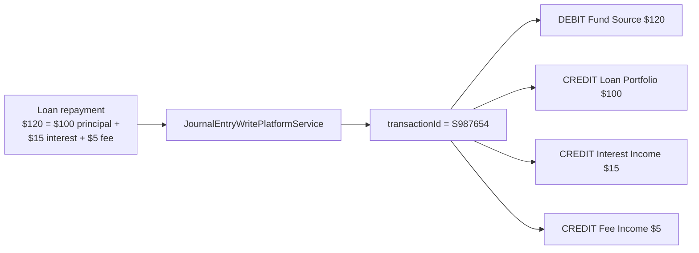
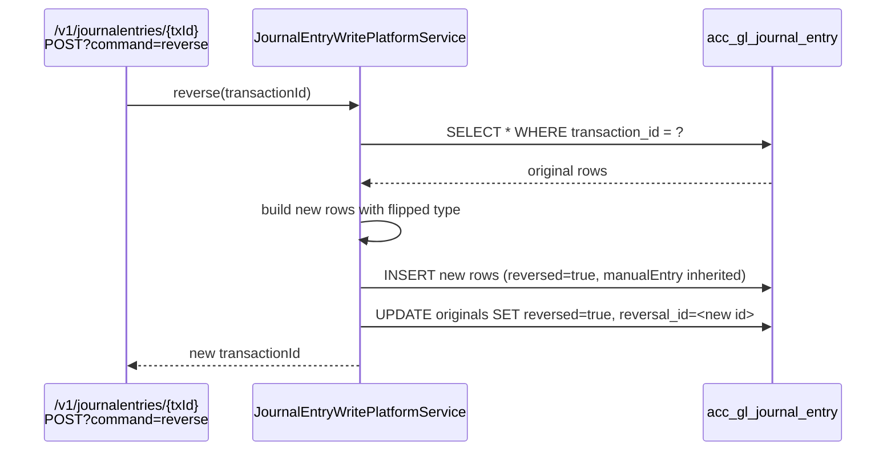

Apache Fineract records every general-ledger movement as a single row in `acc_gl_journal_entry`. The JPA mapping lives in `fineract-accounting/src/main/java/org/apache/fineract/accounting/journalentry/domain/JournalEntry.java`. Each row is one side of a posting — a debit or a credit — and rows are stitched together into balanced postings through a shared `transactionId` string.

## Entity shape

`JournalEntry extends AbstractAuditableWithUTCDateTimeCustom<Long>` — it carries the standard audit columns (`created_on_utc`, `created_by`, `last_modified_on_utc`, `last_modified_by`) on top of its accounting fields.

| Field | Column | Notes |
| --- | --- | --- |
| `office` | `office_id` | `@ManyToOne Office`, required. Posting scope for `GLClosure` and trial balance. |
| `paymentDetail` | `payment_details_id` | Optional `PaymentDetail` link (payment type, receipt/cheque/routing/bank/account number). |
| `glAccount` | `account_id` | `@ManyToOne GLAccount`, required. Must be DETAIL + enabled. |
| `currencyCode` | `currency_code` | 3-char ISO code. |
| `reversalJournalEntry` | `reversal_id` | Self-reference. On a reversed pair this points from each original row to the row that cancels it. |
| `transactionId` | `transaction_id` | Length 50. Groups all debit/credit legs of one posting. Required, never null. |
| `loanTransactionId` | `loan_transaction_id` | Optional FK-by-id back to the originating `m_loan_transaction.id`. |
| `savingsTransactionId` | `savings_transaction_id` | Optional FK-by-id back to `m_savings_account_transaction.id`. |
| `clientTransactionId` | `client_transaction_id` | Optional FK-by-id back to `m_client_transaction.id`. |
| `shareTransactionId` | `share_transaction_id` | Optional FK-by-id back to share product transactions. |
| `reversed` | `reversed` | Boolean. `true` on both legs of a reversed transaction. |
| `manualEntry` | `manual_entry` | `true` if posted via `/v1/journalentries`, `false` for system-generated. |
| `transactionDate` | `entry_date` | Business date the posting applies to. |
| `type` | `type_enum` | 1 = CREDIT, 2 = DEBIT — see `JournalEntryType`. |
| `amount` | `amount` | `DECIMAL(19,6)` — always positive. Sign is carried by `type`. |
| `description` | `description` | Length 500. |
| `entityType` | `entity_type_enum` | Owner kind code (LOAN, SAVINGS, CLIENT, ...). |
| `entityId` | `entity_id` | Owner row id matching `entityType`. |
| `referenceNumber` | `ref_num` | Free text — receipt/cheque/external reference. |
| `submittedOnDate` | `submitted_on_date` | Business date the row was inserted. |

## `JournalEntryType`

```java
public enum JournalEntryType {
    CREDIT(1, "journalEntryType.credit"),
    DEBIT(2, "journalEntrytType.debit");
}
```

Two predicates — `isDebitType()` and `isCreditType()` — are used everywhere the posting must know which side it is on. The unsigned `amount` plus a `type` is the canonical encoding; downstream summing code (running balance, trial balance) reads `JournalEntry.isDebitEntry()` / `isCreditEntry()` and applies the sign for the account's `GLAccountType`.

## Transaction grouping

A "posting" in business terms is one or more debit rows plus one or more credit rows whose amounts balance. They are linked by `transaction_id`. The string is generated by the write platform service — typically `S<id>` for system postings and `M<id>` for manual ones, optionally prefixed with reversal markers.



Reading a transaction is therefore "select all rows where `transaction_id = ?` order by `id`", which is exactly what the `/v1/journalentries/{transactionId}` endpoint does.

## Construction

```java
public static JournalEntry createNew(
    Office office, PaymentDetail paymentDetail, GLAccount glAccount,
    String currencyCode, String transactionId, boolean manualEntry,
    LocalDate transactionDate, JournalEntryType journalEntryType,
    BigDecimal amount, String description,
    Integer entityType, Long entityId, String referenceNumber,
    Long loanTransaction, Long savingsTransaction,
    Long clientTransaction, Long shareTransactionId)
```

The protected constructor sets `reversed = false`, `reversalJournalEntry = null`, and stamps `submittedOnDate = DateUtils.getBusinessLocalDate()`. Callers never construct a single isolated row — they always emit balanced sets through the write service.

## Manual vs system entries

| Source | `manualEntry` | `transactionId` prefix | Trigger |
| --- | --- | --- | --- |
| `/v1/journalentries` POST | `true` | `M` | Operator submits a balanced set |
| Loan disbursal/repayment/fee/waiver/write-off | `false` | `S` | Loan transaction handler |
| Savings deposit/withdrawal/interest/fee | `false` | `S` | Savings transaction handler |
| Share transactions | `false` | `S` | Share account transaction handler |
| Client charges | `false` | `S` | Client charge handler |
| Periodic accrual job | `false` | `S` | `ADD_PERIODIC_ACCRUAL_ENTRIES` tasklet |
| Provisioning entry | `false` | `S` | `ProvisioningEntriesWritePlatformService` |

Manual entries are gated by `GLAccount.manualEntriesAllowed`. System entries bypass that gate because they come from trusted handlers.

## Reversals

A reversal does not delete rows. The handler:

1. Loads every row sharing the original `transactionId`.
2. For each row, inserts a new row with the opposite `type` and the same `amount`.
3. Sets `reversed = true` on every original row and on every new row.
4. Cross-links `reversal_id` on both sides so the API can show "this is the reversal of …".



<Warning>
  System-generated transactions tied to a still-open loan or savings transaction usually cannot be reversed directly through `/v1/journalentries` — the business module owns reversal semantics. Reversing the underlying loan transaction produces a new compensating accounting posting.
</Warning>

## Cash and accrual bridge

The same `JournalEntry` rows back both cash-basis and accrual-basis postings; the difference is which `financial_account_type` codes the `ProductToGLAccountMapping` rows carry and therefore which accounts get debited/credited.

| Event | Cash posting | Accrual posting |
| --- | --- | --- |
| Interest charged | (no posting) | DR `INTEREST_RECEIVABLE`, CR `INTEREST_ON_LOANS` |
| Interest paid | DR Fund Source, CR `INTEREST_ON_LOANS` | DR Fund Source, CR `INTEREST_RECEIVABLE` |
| Fee charged | (no posting) | DR `FEES_RECEIVABLE`, CR `INCOME_FROM_FEES` |
| Fee paid | DR Fund Source, CR `INCOME_FROM_FEES` | DR Fund Source, CR `FEES_RECEIVABLE` |
| Disbursement | DR `LOAN_PORTFOLIO`, CR Fund Source | DR `LOAN_PORTFOLIO`, CR Fund Source |
| Write-off | DR `LOSSES_WRITTEN_OFF`, CR `LOAN_PORTFOLIO` | DR `LOSSES_WRITTEN_OFF`, CR `LOAN_PORTFOLIO` |

The set of valid `financial_account_type` codes for each posting style lives in `AccountingConstants.CashAccountsForLoan` and `AccountingConstants.AccrualAccountsForLoan` (`fineract-core`).

## API surface

| Method | Path | Action |
| --- | --- | --- |
| `GET` | `/v1/journalentries` | Search by office, GL account, currency, date range, transaction id, loan/savings/client id |
| `GET` | `/v1/journalentries/{transactionId}` | Fetch every leg of a transaction |
| `POST` | `/v1/journalentries` | Create a balanced set (manual entry) |
| `POST` | `/v1/journalentries/{transactionId}?command=reverse` | Reverse a transaction |
| `POST` | `/v1/journalentries?command=updateRunningBalance` | Synchronous running balance update for an office |
| `POST` | `/v1/journalentries?command=defineOpeningBalance` | Seed opening balances via the contra account |

The Jersey resource is `JournalEntryApiResource` in `fineract-provider`.

## Manual entry request shape

```json
{
  "officeId": 1,
  "transactionDate": "27 May 2025",
  "currencyCode": "USD",
  "comments": "petty-cash float top-up",
  "referenceNumber": "PCF-2025-05-27",
  "accountingRule": 4,
  "credits": [
    { "glAccountId": 25, "amount": 500.00, "comments": "" }
  ],
  "debits": [
    { "glAccountId": 12, "amount": 500.00, "comments": "" }
  ],
  "paymentTypeId": 3,
  "receiptNumber": "RC-12001"
}
```

The validator (`journalentry/serialization`) enforces:

- Sum of `debits[].amount` equals sum of `credits[].amount`.
- Every `glAccountId` is DETAIL, enabled, and (for manual entries) has `manualEntriesAllowed = true`.
- `transactionDate` is not before the latest `GLClosure.closingDate` for `officeId`.
- All accounts carry the same `currencyCode`.

## Repository

`JournalEntryRepository extends JpaRepository<JournalEntry, Long>` is intentionally thin. The bulk of read access goes through `JournalEntryReadPlatformService` which issues hand-tuned JDBC for paged search and grouped retrieval by transaction id. The repository does expose two query methods used by the trial-balance and running-balance jobs:

| Method | Purpose |
| --- | --- |
| `findTransactionDatesAfter(LocalDate baseline)` | List distinct `entry_date` values newer than the baseline — drives `UPDATE_TRIAL_BALANCE_DETAILS` gap detection |
| `findTrialBalanceLinesForDate(LocalDate date)` | Group by `(office_id, account_id)` and SUM the signed amount for one day — drives the aggregate row inserts |

## Running balance columns

Every `JournalEntry` row also carries two denormalised columns that the `ACCOUNTING_RUNNING_BALANCE_UPDATE` job maintains:

- `office_running_balance` — net balance for `(office_id, account_id)` after this entry.
- `organization_running_balance` — net balance across all offices for `account_id` after this entry.

These columns are not modelled as JPA fields on `JournalEntry` itself but are updated via JDBC by the running-balance tasklet. They let "current balance for GL account X" answers in O(1) instead of an aggregate over millions of rows.

## Cross-module FKs by id

Note the `loanTransactionId`, `savingsTransactionId`, `clientTransactionId`, `shareTransactionId` columns: they are `Long` ids, not JPA relationships. This keeps the accounting module decoupled from the loan, savings, client, and share entities — the `fineract-accounting` Gradle subproject does not depend on `fineract-loan` or `fineract-savings`. The trade-off is that JPA cannot enforce referential integrity on these columns; the application enforces it at write time.

## Querying

The `GET /v1/journalentries` endpoint supports a wide filter set:

| Query parameter | Type | Effect |
| --- | --- | --- |
| `officeId` | Long | Restrict to one office |
| `glAccountId` | Long | Restrict to entries on one GL account |
| `manualEntriesOnly` | bool | If true, exclude system entries |
| `fromDate` / `toDate` | date | Inclusive `entry_date` range |
| `submittedOnDateFrom` / `submittedOnDateTo` | date | When the entry was posted |
| `transactionId` | string | Exact match |
| `loanId` / `savingsId` | Long | Entries linked to the underlying account id |
| `transactionDetails` | bool | Include `PaymentDetail` and reference number |
| `runningBalance` | bool | Include `office_running_balance` and `organization_running_balance` |

Pagination is via `offset` / `limit`. The response is `Page<JournalEntryData>`; each row carries the GL account id + code + name, the office, the amount with sign-aware presentation, and (if requested) the running balances.

## Exception types

| Exception | Cause |
| --- | --- |
| `JournalEntryInvalidException` | Debits and credits do not balance, mixed currencies, or empty side |
| `GLClosureInvalidException` | `entry_date` falls within a closed period for the office |
| `JournalEntryRunningBalanceUpdateException` | Running-balance recomputation failed mid-walk |
| `JournalEntriesNotFoundException` | Search by `transactionId` matched zero rows |
| `JournalEntryInvalidException.GL_JOURNAL_ENTRY_INVALID_REASON` | Catch-all reason codes: invalid account type, disabled account, header account, etc. |

## Audit context

Because `JournalEntry` extends `AbstractAuditableWithUTCDateTimeCustom`, every row is created with `created_by` and `created_on_utc` filled in from the security context. Combined with `manualEntry` and `entityType / entityId`, every row in `acc_gl_journal_entry` can be traced back to either the source business transaction (system entry) or the operator who originated it (manual entry). This is the foundation for the audit-trail report used in regulatory inspections.

## Storage layout

```text
acc_gl_journal_entry
├── id                                bigint PK
├── office_id                         bigint -> m_office, NOT NULL
├── payment_details_id                bigint -> m_payment_details, NULL
├── account_id                        bigint -> acc_gl_account, NOT NULL
├── currency_code                     varchar(3) NOT NULL
├── reversal_id                       bigint -> acc_gl_journal_entry, NULL
├── transaction_id                    varchar(50) NOT NULL
├── loan_transaction_id               bigint NULL  /* not a JPA FK */
├── savings_transaction_id            bigint NULL
├── client_transaction_id             bigint NULL
├── share_transaction_id              bigint NULL
├── reversed                          bit NOT NULL DEFAULT 0
├── manual_entry                      bit NOT NULL DEFAULT 0
├── entry_date                        date
├── type_enum                         int NOT NULL  /* 1=CREDIT, 2=DEBIT */
├── amount                            decimal(19,6) NOT NULL
├── description                       varchar(500)
├── entity_type_enum                  int
├── entity_id                         bigint
├── ref_num                           varchar
├── submitted_on_date                 date NOT NULL
├── office_running_balance            decimal(19,6)  /* maintained by job */
├── organization_running_balance      decimal(19,6)
├── created_on_utc                    timestamp
├── created_by                        bigint
├── last_modified_on_utc              timestamp
└── last_modified_by                  bigint
```

Indexing strategy in production deployments typically covers `(transaction_id)`, `(office_id, entry_date)`, `(account_id, entry_date)`, and `(loan_transaction_id)` / `(savings_transaction_id)` — the four hot read paths.

## Related pages

<CardGroup cols={2}>
  <Card title="GL Accounts" href="/accounting/gl-accounts">
    The accounts referenced by `JournalEntry.glAccount`.
  </Card>
  <Card title="Accounting Rules" href="/accounting/accounting-rules">
    Templates that drive the manual posting UI.
  </Card>
  <Card title="GL Closure" href="/accounting/closure">
    The date guard that journal entry creation respects.
  </Card>
  <Card title="Accrual Engine" href="/accounting/accrual-engine">
    Where periodic accrual `JournalEntry` rows come from.
  </Card>
</CardGroup>
