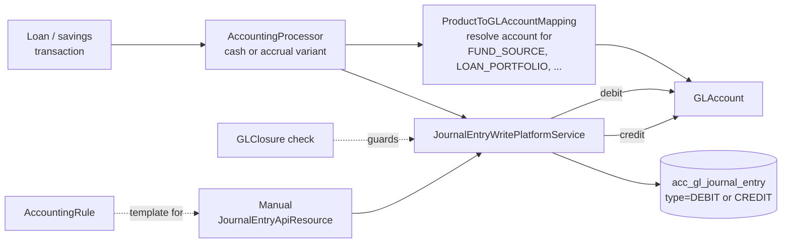
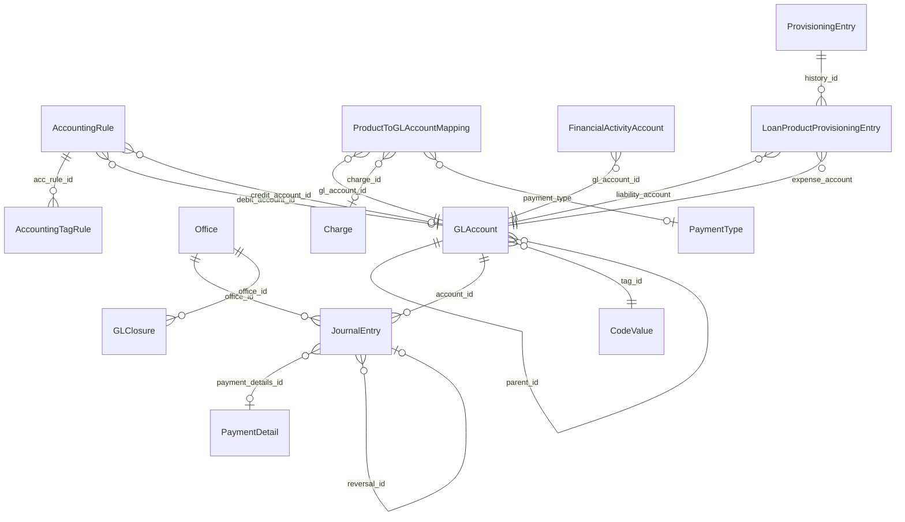
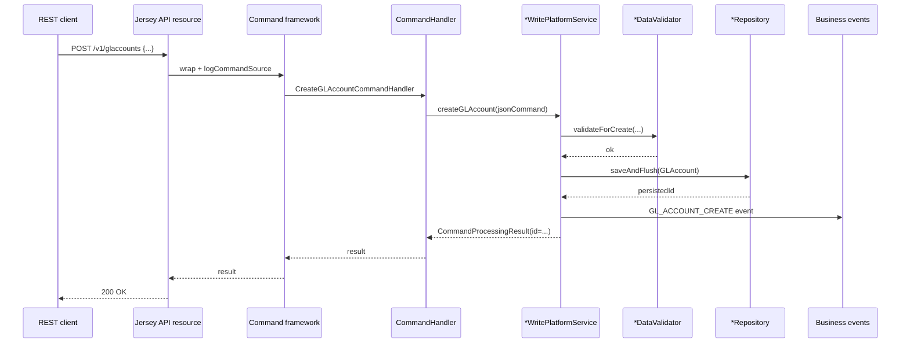

Apache Fineract ships a complete general ledger inside the `fineract-accounting` Gradle subproject. Every loan disbursement, repayment, savings deposit, interest posting, fee waiver, write-off, and inter-office transfer eventually lands here as a balanced pair of journal entries against accounts in a chart of accounts (`acc_gl_account`). This page is the map of `fineract-accounting/src/main/java/org/apache/fineract/accounting/` — what each subpackage owns and where to read further.

## Package layout

```
fineract-accounting/src/main/java/org/apache/fineract/accounting/
├── accrual/                       # AccrualAccountingApiResource — execute periodic accrual command
├── closure/                       # GLClosure entity — lock office periods for backdated postings
├── common/                        # Shared utilities (see fineract-core for AccountingConstants)
├── financialactivityaccount/      # FinancialActivityAccount — cross-product GL mappings
├── glaccount/                     # GLAccount, GLAccountType, GLAccountUsage, TrialBalance, jobs/
├── journalentry/                  # JournalEntry domain, JournalEntryType, repositories
├── producttoaccountmapping/       # ProductToGLAccountMapping — per-product GL routing
├── provisioning/                  # ProvisioningEntry write + read services, API resource
├── rule/                          # AccountingRule, AccountingTagRule — manual JE templates
└── trialbalance/                  # Trial balance exception types
```

Two companion modules complete the picture:

- **`fineract-core`** owns the JPA entities and enums (`GLAccount`, `GLAccountType`, `GLAccountUsage`, `JournalEntryType`, and `AccountingConstants` with the `CashAccountsForLoan`, `AccrualAccountsForLoan`, `FinancialActivity` enums).
- **`fineract-provider`** wires the Spring bean implementations, the accrual write service, the provisioning domain (`ProvisioningEntry`, `LoanProductProvisioningEntry`), and the `accountrunningbalanceupdate` job.

<Note>
  The accounting module never originates business actions. It is a sink: business modules (loan, savings, share, client charges) emit transactions; `JournalEntryWritePlatformServiceJpaRepositoryImpl` translates them via the per-product `ProductToGLAccountMapping` rows into balanced `JournalEntry` pairs.
</Note>

## How a posting flows



Every posting in Fineract is double-entry: the write service rejects any `transactionId` whose debit total does not equal its credit total. Rows share that string `transactionId` so the API can return them grouped.

## Cash vs accrual

Each loan and savings product picks an `accounting_type`:

| Code | Meaning | Effect |
| --- | --- | --- |
| `1` NONE | No GL postings | Disbursements/repayments do not touch the GL |
| `2` CASH | Cash basis | Interest, fees, penalties posted only when paid |
| `3` ACCRUAL_PERIODIC | Accrual via scheduled job | Periodic accrual job posts accruals nightly |
| `4` ACCRUAL_UPFRONT | Accrual on schedule | Accrual posted at disbursal or schedule generation |

The `ProductToGLAccountMapping.financial_account_type` column carries a value from either `CashAccountsForLoan` or `AccrualAccountsForLoan` (`AccountingConstants`). Accrual mode adds `INTEREST_RECEIVABLE`, `FEES_RECEIVABLE`, `PENALTIES_RECEIVABLE` to the mapping table.

## Subsystem map

<CardGroup cols={2}>
  <Card title="GL Accounts" href="/accounting/gl-accounts">
    `GLAccount` hierarchy, the five `GLAccountType` values, HEADER vs DETAIL `GLAccountUsage`, tag codes, `manualEntriesAllowed` flag.
  </Card>
  <Card title="Journal Entries" href="/accounting/journal-entries">
    `JournalEntry` entity — debit/credit posting, transaction-id grouping, reversals, manual vs system entries, payment detail link.
  </Card>
  <Card title="Accounting Rules" href="/accounting/accounting-rules">
    `AccountingRule` and `AccountingTagRule` — preconfigured templates for manual journal entry that lock down allowed debits and credits.
  </Card>
  <Card title="GL Closure" href="/accounting/closure">
    `GLClosure` — close periods per office to forbid backdated postings, and the `/v1/glclosures` API.
  </Card>
  <Card title="Financial Activity" href="/accounting/financial-activity-accounts">
    `FinancialActivityAccount` — global mappings for asset transfer, opening balances, cash at main vault, payable dividends.
  </Card>
  <Card title="Product Mapping" href="/accounting/product-to-account-mapping">
    `ProductToGLAccountMapping` — per-product GL routing for principal, interest, fees, penalty, write-off, charge-off, with CASH vs ACCRUAL variants.
  </Card>
  <Card title="Provisioning" href="/accounting/provisioning">
    `ProvisioningEntry` and `LoanProductProvisioningEntry` — periodic loan loss reserve calculations and the journal entries that follow.
  </Card>
  <Card title="Trial Balance" href="/accounting/trial-balance">
    `TrialBalance` table, the `UPDATE_TRIAL_BALANCE_DETAILS` job, and the read service summing entries per office and account.
  </Card>
  <Card title="Accrual Engine" href="/accounting/accrual-engine">
    `AccrualAccountingApiResource`, `AddPeriodicAccrualEntriesTasklet`, `AccrualActivityPostingTasklet`, and the till-date variant.
  </Card>
  <Card title="Accounting Jobs" href="/accounting/accounting-jobs">
    Scheduled jobs owned by the module: running balance update, trial balance refresh, accrual, provisioning, report mailing.
  </Card>
</CardGroup>

## Entity ER diagram



## REST entry points

| Resource | Path | Owner |
| --- | --- | --- |
| GL accounts CRUD | `/v1/glaccounts` | `glaccount/api` |
| Journal entries | `/v1/journalentries` | `fineract-provider /accounting/journalentry/api` |
| Accounting rules | `/v1/accountingrules` | `rule/api` |
| GL closures | `/v1/glclosures` | `closure/api` |
| Financial activity accounts | `/v1/financialactivityaccounts` | `financialactivityaccount/api` |
| Provisioning entries | `/v1/provisioningentries` | `provisioning/api` |
| Periodic accrual | `/v1/runaccruals` | `accrual/api` |

<Tip>
  When debugging a missing posting, start at `JournalEntryWritePlatformServiceJpaRepositoryImpl` in `fineract-provider`. Most "the loan disbursed but nothing hit the GL" tickets are either a missing `ProductToGLAccountMapping` row (FK lookup throws), a `NONE` product type (no postings emitted), or a `GLClosure` blocking the date.
</Tip>

## Read services

Every domain in `fineract-accounting` ships a paired pattern:

- A JPA repository for owning code (`*Repository`) and a "wrapper" (`*RepositoryWrapper`) that throws domain-specific not-found exceptions.
- A `*ReadPlatformService` that returns DTOs (`*Data` records) over hand-tuned JDBC for paged search; used by the API layer to build templates and search results without touching the persistence context.
- A `*WritePlatformService` that takes `JsonCommand` envelopes, validates them via `*DataValidator`, and emits domain events.

| Subsystem | Repository | Read service DTO |
| --- | --- | --- |
| GL accounts | `GLAccountRepository` | `GLAccountData` |
| Journal entries | `JournalEntryRepository` | `JournalEntryData`, `JournalEntryTransactionItemData` |
| Accounting rules | `AccountingRuleRepository` | `AccountingRuleData` |
| GL closure | `GLClosureRepository` | `GLClosureData` |
| Financial activity | `FinancialActivityAccountRepository` | `FinancialActivityAccountData` |
| Product mapping | `ProductToGLAccountMappingRepository` | `ProductToGLAccountMappingData` |
| Provisioning | `ProvisioningEntryRepository` | `ProvisioningEntryData`, `LoanProductProvisioningEntryData` |
| Trial balance | `TrialBalanceRepository` | `TrialBalanceData` |

## Command flow



Every accounting write goes through the same `CommandWrapperBuilder` → `PortfolioCommandSourceWritePlatformService.logCommandSource` path that the rest of Fineract uses. That means accounting actions get the same audit trail, retry semantics, and idempotency guarantees as portfolio actions.

## Where to start reading

For a tour of how a single business transaction propagates into GL postings, follow this trail through the source:

1. The loan/savings transaction handler emits the business transaction.
2. The transaction type triggers a fan-out into `AccountingProcessorHelper`.
3. `AccountingProcessorHelper` picks the cash vs accrual processor for the product's `accounting_type`.
4. The chosen processor walks each posting component (principal, interest, fees, …) and reads the matching `ProductToGLAccountMapping` row to find the GL account.
5. `JournalEntryWritePlatformServiceJpaRepositoryImpl.createJournalEntry(...)` validates against `GLClosure`, builds the balanced row pair, and inserts.

## Multi-tenant scope

Everything in the accounting module lives inside the tenant schema. There is no shared global accounting data; each tenant has its own `acc_gl_account`, `acc_gl_journal_entry`, `acc_product_mapping`, `acc_gl_closure`, `acc_gl_financial_activity_account`, `acc_accounting_rule`, `acc_rule_tags`, `m_provisioning_history`, `m_loanproduct_provisioning_entry`, and `m_trial_balance`. The COB and scheduler iterate tenants and run the accounting jobs once per tenant per night, so accounting throughput scales with the number of tenants.

## Common configuration mistakes

A short triage list — these account for most "the GL is wrong" tickets:

| Symptom | Likely cause |
| --- | --- |
| Disbursal completed but no GL movement | Loan product `accounting_type = NONE` |
| Disbursal completed, no GL movement, no error | Loan product missing required `ProductToGLAccountMapping` rows for the relevant cash/accrual legs |
| Backdated transaction rejected with "closure" error | `GLClosure` for the office covers the chosen `transactionDate` |
| Trial balance off by yesterday's interest | Periodic accrual job failed or is disabled |
| Provisioning posted but reserve already exists | A previous run's postings were not reversed before recompute |
| "Account is a header account" on POST `/v1/journalentries` | Picked HEADER account; pick a DETAIL child |
| "Manual entries not allowed for this account" | `manual_journal_entries_allowed = false` on the chosen GL row |
| Inter-office transfer fails on contra side | `ASSET_TRANSFER` or `LIABILITY_TRANSFER` financial activity mapping is missing |

## Versioning of the schema

The accounting tables are managed through the standard Fineract Liquibase + Flyway changelogs in `fineract-core/.../db/changelog`. Schema changes that affect accounting are released alongside the corresponding Java entity changes and shipped as new changesets. The table names (`acc_gl_*`, `m_provisioning_history`, `m_loanproduct_provisioning_entry`, `m_trial_balance`) have been stable across major Fineract versions; new columns are appended without removing existing ones, so external reporting built on top of `acc_gl_journal_entry` is largely forward-compatible.

## Related modules

<CardGroup cols={2}>
  <Card title="Loan accounting hooks" href="/accounting/product-to-account-mapping">
    Where loan transactions fan into accounting postings.
  </Card>
  <Card title="Savings accounting hooks" href="/accounting/product-to-account-mapping">
    Savings deposit/withdrawal/interest posting paths.
  </Card>
  <Card title="Provisioning criteria" href="/organisation/provisioning-criteria">
    The organisation-level rule that feeds `ProvisioningEntry`.
  </Card>
  <Card title="Accounting jobs deep dive" href="/jobs/accounting-jobs-deep-dive">
    Operational view of the Spring Batch tasklets.
  </Card>
  <Card title="Commands framework" href="/core/commands-framework">
    The `CommandWrapperBuilder` plumbing every accounting write reuses.
  </Card>
  <Card title="Business events" href="/core/business-events">
    The event types emitted on GL changes.
  </Card>
</CardGroup>
