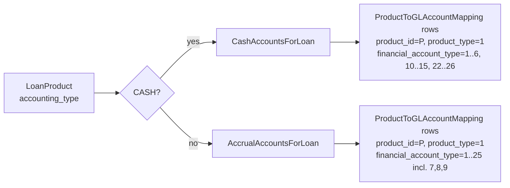
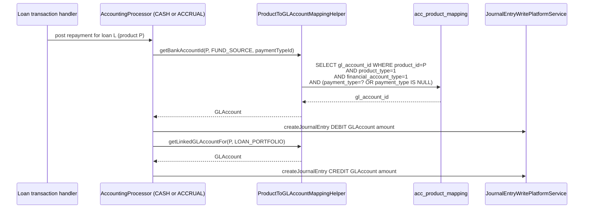
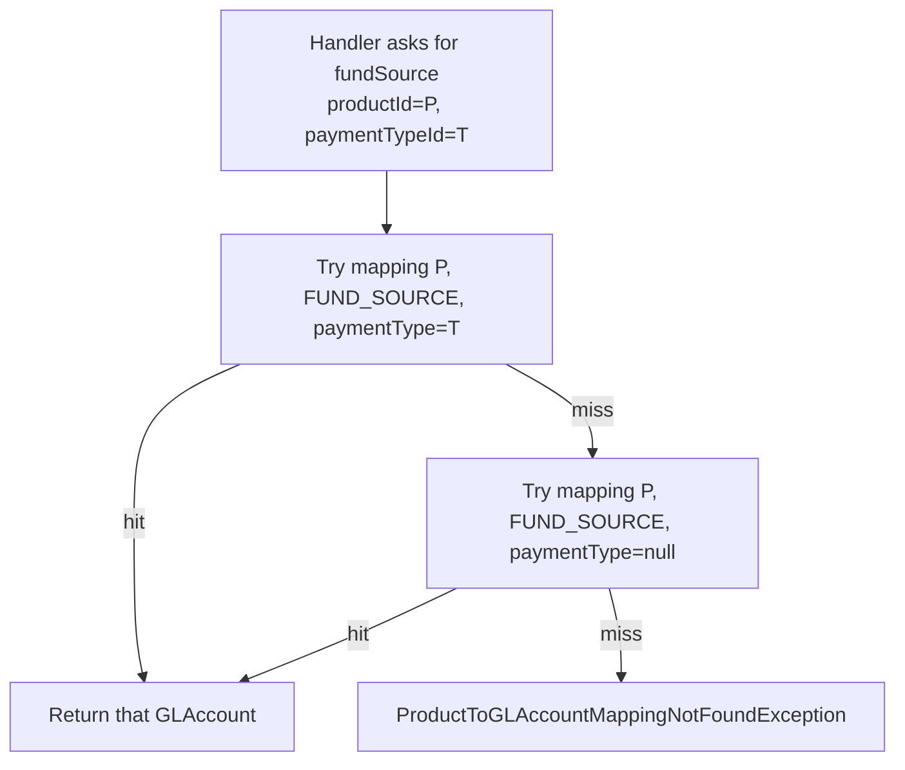

Apache Fineract carries the per-product GL routing in a single skinny table, `acc_product_mapping`, joined back to `acc_gl_account` for each leg a loan or savings product needs to post. The JPA entity is `ProductToGLAccountMapping` under `fineract-accounting/src/main/java/org/apache/fineract/accounting/producttoaccountmapping/domain/`. Whenever a transaction handler asks "which GL account do I credit for interest income on product 7?", it queries this table.

## Package layout

```
producttoaccountmapping/
├── domain/             # ProductToGLAccountMapping, ProductToGLAccountMappingRepository
├── exception/          # ProductToGLAccountMappingInvalidException, NotFound exceptions
├── serialization/      # LoanProductAccountingDataValidator, SavingsProductAccountingDataValidator, etc.
└── service/            # ProductToGLAccountMappingWritePlatformService and Helper, ReadPlatformService
```

## Entity shape

```java
@Entity
@Table(name = "acc_product_mapping",
    uniqueConstraints = { @UniqueConstraint(
        columnNames = {"product_id", "product_type", "financial_account_type", "payment_type"},
        name = "financial_action") })
public class ProductToGLAccountMapping extends AbstractPersistableCustom<Long> {
    @ManyToOne @JoinColumn(name = "gl_account_id")  private GLAccount glAccount;
    @Column(name = "product_id")                    private Long productId;
    @ManyToOne @JoinColumn(name = "payment_type")   private PaymentType paymentType;
    @ManyToOne @JoinColumn(name = "charge_id")      private Charge charge;
    @Column(name = "product_type")                  private int productType;
    @Column(name = "financial_account_type")        private int financialAccountType;
    @ManyToOne @JoinColumn(name = "charge_off_reason_id")
        private CodeValue chargeOffReason;
    @ManyToOne @JoinColumn(name = "write_off_reason_id")
        private CodeValue writeOffReason;
    @ManyToOne @JoinColumn(name = "capitalized_income_classification_id")
        private CodeValue capitalizedIncomeClassification;
    @ManyToOne @JoinColumn(name = "buydown_fee_classification_id")
        private CodeValue buydownFeeClassification;
}
```

| Field | Purpose |
| --- | --- |
| `glAccount` | The destination GL account for this leg. |
| `productId` | The loan / savings / share product id. |
| `productType` | Discriminator — see "Product types" below. |
| `financialAccountType` | What kind of leg this mapping is (fund source, loan portfolio, interest income, …). |
| `paymentType` | Optional — for payment-channel-to-fund-source mappings. |
| `charge` | Optional — for charge-specific income or receivable mappings. |
| `chargeOffReason` | Optional — for per-reason charge-off expense routing. |
| `writeOffReason` | Optional — for per-reason write-off routing. |
| `capitalizedIncomeClassification` | Optional — accrual-mode capitalised income variant. |
| `buydownFeeClassification` | Optional — accrual-mode buy-down fee variant. |

The composite unique constraint `(product_id, product_type, financial_account_type, payment_type)` means: for a given product and leg, you can have at most one mapping per payment type (or one with `payment_type = null` for the "no specific channel" default).

## Product types

The `product_type` discriminator separates the three product families that participate in accounting:

| Code | Product family | Constants enum |
| --- | --- | --- |
| 1 | Loan | `CashAccountsForLoan` / `AccrualAccountsForLoan` |
| 2 | Savings | `CashAccountsForSavings` / `AccrualAccountsForSavings` |
| 3 | Share | `CashAccountsForShares` |

## CASH vs ACCRUAL — the two variants

The `financialAccountType` integer is interpreted against the enum that matches the product's `accounting_type`. For loans:

### `CashAccountsForLoan` (loan product `accounting_type = CASH`)

| Code | Constant | Typical GL type |
| --- | --- | --- |
| 1 | FUND_SOURCE | ASSET |
| 2 | LOAN_PORTFOLIO | ASSET |
| 3 | INTEREST_ON_LOANS | INCOME |
| 4 | INCOME_FROM_FEES | INCOME |
| 5 | INCOME_FROM_PENALTIES | INCOME |
| 6 | LOSSES_WRITTEN_OFF | EXPENSE |
| 10 | TRANSFERS_SUSPENSE | ASSET |
| 11 | OVERPAYMENT | LIABILITY |
| 12 | INCOME_FROM_RECOVERY | INCOME |
| 13 | GOODWILL_CREDIT | EXPENSE |
| 14 | INCOME_FROM_CHARGE_OFF_INTEREST | INCOME |
| 15 | INCOME_FROM_CHARGE_OFF_FEES | INCOME |
| 16 | CHARGE_OFF_EXPENSE | EXPENSE |
| 17 | CHARGE_OFF_FRAUD_EXPENSE | EXPENSE |
| 18 | INCOME_FROM_CHARGE_OFF_PENALTY | INCOME |
| 19 | INCOME_FROM_GOODWILL_CREDIT_INTEREST | INCOME |
| 20 | INCOME_FROM_GOODWILL_CREDIT_FEES | INCOME |
| 21 | INCOME_FROM_GOODWILL_CREDIT_PENALTY | INCOME |
| 22 | CLASSIFICATION_INCOME | INCOME |
| 23 | DEFERRED_INCOME_LIABILITY | LIABILITY |
| 24 | INCOME_FROM_DISCOUNT_FEE | INCOME |
| 25 | FEES_RECEIVABLE | ASSET |
| 26 | PENALTIES_RECEIVABLE | ASSET |

### `AccrualAccountsForLoan` (loan product `accounting_type = ACCRUAL_PERIODIC` or `ACCRUAL_UPFRONT`)

Same code numbers for the first six entries, plus the receivables block and the accrual-only classifications:

| Code | Constant | Notes |
| --- | --- | --- |
| 1..6 | Same as cash (`FUND_SOURCE`, `LOAN_PORTFOLIO`, `INTEREST_ON_LOANS`, …, `LOSSES_WRITTEN_OFF`) | |
| 7 | INTEREST_RECEIVABLE | Required in accrual mode |
| 8 | FEES_RECEIVABLE | |
| 9 | PENALTIES_RECEIVABLE | |
| 10 | TRANSFERS_SUSPENSE | |
| 11 | OVERPAYMENT | |
| 12 | INCOME_FROM_RECOVERY | |
| 13 | GOODWILL_CREDIT | |
| 14..21 | Charge-off / goodwill credit variants | |
| 22 | INCOME_FROM_CAPITALIZATION | Accrual only |
| 23 | DEFERRED_INCOME_LIABILITY | |
| 24 | BUY_DOWN_EXPENSE | Accrual only |
| 25 | INCOME_FROM_BUY_DOWN | Accrual only |



## How a transaction reads the mapping



`ProductToGLAccountMappingHelper.getBankAccountId(...)` performs the payment-type fallback: it first tries to find a row with the matching `payment_type`, and if none exists falls back to the row with `payment_type IS NULL`. That is how the "default fund source plus payment-channel overrides" UX is implemented.

## Construction

```java
ProductToGLAccountMapping.createNew(
    GLAccount glAccount, Long productId, int productType,
    int financialAccountType, CodeValue chargeOffReason,
    CodeValue capitalizedIncomeClassification,
    CodeValue buydownFeeClassification);
```

There is no JSON factory — mappings are always created from inside the loan/savings/share product create or update flow. The validator (`LoanProductAccountingDataValidator` and siblings) walks the submitted product JSON and produces one mapping row per required leg, plus optional rows for payment channel and per-charge overrides.

## Payment-channel and per-charge overrides

Two collections inside a loan/savings product payload:

```json
{
  "paymentChannelToFundSourceMappings": [
    { "paymentTypeId": 3, "fundSourceAccountId": 51 },
    { "paymentTypeId": 7, "fundSourceAccountId": 52 }
  ],
  "feeToIncomeAccountMappings": [
    { "chargeId": 21, "incomeAccountId": 73 }
  ],
  "penaltyToIncomeAccountMappings": [
    { "chargeId": 35, "incomeAccountId": 74 }
  ]
}
```

Each entry produces a `ProductToGLAccountMapping` row with the corresponding `paymentType` or `charge` set, so at posting time the helper picks the override row when the payment type or charge matches and otherwise falls back to the product-level default.

## Charge-off and write-off reason routing

Banks often need different expense accounts depending on the reason for a charge-off or write-off (default vs fraud vs voluntary surrender, …). The `chargeOffReason` and `writeOffReason` columns let one product carry multiple reason-specific routes. The loan transaction handler reads the operator-selected reason from the underlying loan transaction and picks the matching mapping.

## API surface

There is no standalone REST resource for product mappings — they live inside the product configuration endpoints:

| Path | Where mappings live |
| --- | --- |
| `POST /v1/loanproducts` | Body includes accounting fields whose IDs become mapping rows |
| `PUT /v1/loanproducts/{id}` | Updates re-derive mappings; rows for omitted legs are deleted |
| `POST /v1/savingsproducts` | Same idea for savings |
| `POST /v1/products/share` | Same for share products |

`ProductToGLAccountMappingReadPlatformService` is used internally to enrich product GET responses and to validate that all required legs are mapped before a product is moved to "Active" state.

## Validation rules

| Rule | Source |
| --- | --- |
| Required legs differ by `accounting_type` | Cash mode needs `FUND_SOURCE`, `LOAN_PORTFOLIO`, `INTEREST_ON_LOANS`, `INCOME_FROM_FEES`, `INCOME_FROM_PENALTIES`, `LOSSES_WRITTEN_OFF`, `OVERPAYMENT`; accrual adds the three receivables |
| GL accounts must be DETAIL + enabled | Header / disabled accounts rejected |
| Each leg's GL account type must match | E.g. `LOAN_PORTFOLIO` must be ASSET, `INTEREST_ON_LOANS` must be INCOME |
| Payment-channel overrides must point at ASSET accounts | Same `GLAccountType` rule as the underlying `FUND_SOURCE` |

## Read service

```java
public interface ProductToGLAccountMappingReadPlatformService {
    Map<String, Object> fetchAccountMappingDetailsForLoanProduct(Long loanProductId, Integer accountingType);
    Map<String, Object> fetchAccountMappingDetailsForSavingsProduct(Long savingsProductId, Integer accountingType);
    Map<String, Object> fetchAccountMappingDetailsForShareProduct(Long shareProductId, Integer accountingType);
    PaymentTypeToGLAccountMapper fetchPaymentTypeToGLAccountMapper(Long productId, Integer productType);
    List<ChargeToGLAccountMapper> fetchChargeToIncomeAccountMappingsForLoanProduct(Long loanProductId);
}
```

The map-returning methods build the right key set for the requested `accountingType`: for a cash loan they include keys like `fundSourceAccountId`, `loanPortfolioAccountId`, `interestOnLoanAccountId`, etc.; for accrual they add `receivableInterestAccountId`, `receivableFeeAccountId`, `receivablePenaltyAccountId`. The keys match the strings in `LoanProductAccountingParams`, so the API serializer can echo them back unchanged into the product GET response.

## Helper service

`ProductToGLAccountMappingHelper` is the runtime lookup used by transaction handlers. Its job is to translate `(productId, productType, financialAccountType, ?paymentTypeId, ?chargeId)` into a `GLAccount` instance. The behaviour:



The same fallback applies for charges: if no per-charge mapping exists for `INCOME_FROM_FEES`, the helper falls back to the product-level `INCOME_FROM_FEES`. This is how the fee-to-income override list is implemented without inflating the schema.

## Validation lifecycle

Validation runs at three points:

1. **Product create** — `LoanProductAccountingDataValidator.validateForLoanProductCreate(...)` checks that every required leg for the chosen `accountingType` has a non-null GL id and that the picked accounts are DETAIL + enabled + match the expected `GLAccountType`.
2. **Product update** — the same validator runs again. Removing a required leg is an error; switching the GL id is fine; adding optional rows (payment channel overrides) is fine.
3. **Transaction posting** — when the handler asks for an account that turns out missing, `ProductToGLAccountMappingNotFoundException` aborts the transaction. In practice this only happens for partially-configured products that snuck past step 1.

## Charge-off and write-off reason flow

For loans, an operator entering a charge-off picks both the charge-off date and a reason from `ChargeOffReasons` `CodeValue` set. The transaction handler then queries:

```text
SELECT gl_account_id FROM acc_product_mapping
WHERE product_id = ? AND product_type = 1
  AND financial_account_type = 16  /* CHARGE_OFF_EXPENSE */
  AND charge_off_reason_id = ?
```

Falling back to the row with `charge_off_reason_id IS NULL` if no per-reason row exists. The write-off path uses `write_off_reason_id` against `financial_account_type = 6` (`LOSSES_WRITTEN_OFF`).

## Related pages

<CardGroup cols={2}>
  <Card title="GL Accounts" href="/accounting/gl-accounts">
    The accounts each mapping points at.
  </Card>
  <Card title="Journal Entries" href="/accounting/journal-entries">
    Where the resolved accounts show up as `account_id`.
  </Card>
  <Card title="Accrual Engine" href="/accounting/accrual-engine">
    The accrual job exercises the `*_RECEIVABLE` legs.
  </Card>
  <Card title="Loan accounting hooks" href="/accounting/product-to-account-mapping">
    The product side of the relationship.
  </Card>
</CardGroup>
