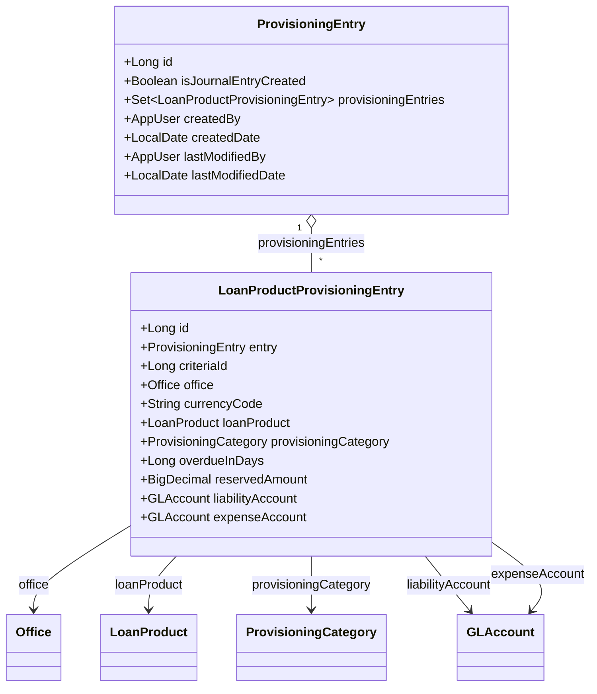
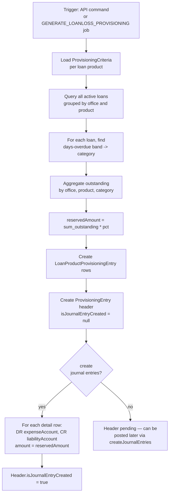
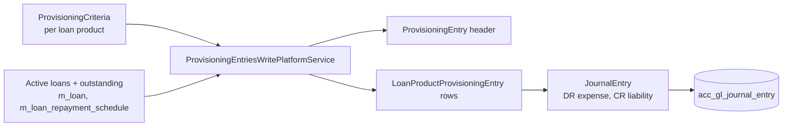

Apache Fineract maintains its loan loss reserve through the **provisioning entry** subsystem: a process that walks active loans, classifies each outstanding balance by days-past-due against organisation-level criteria, multiplies the configured percentages, and posts a balanced journal entry per loan product and office. The domain lives in `fineract-provider/src/main/java/org/apache/fineract/accounting/provisioning/domain/` and the API + read service in `fineract-accounting/.../provisioning/`.

## Two-level entity model



### `ProvisioningEntry` (`m_provisioning_history`)

The "run" itself — one row per provisioning batch:

| Field | Column | Notes |
| --- | --- | --- |
| `isJournalEntryCreated` | `journal_entry_created` | `null` while pending, `true` once postings are applied. |
| `provisioningEntries` | (inverse) | `Set<LoanProductProvisioningEntry>`, cascade ALL, orphan-removal. |
| `createdBy` | `createdby_id` | App user who triggered the run. |
| `createdDate` | `created_date` | Business date the run was computed for. |
| `lastModifiedBy`, `lastModifiedDate` | | Standard. |

### `LoanProductProvisioningEntry` (`m_loanproduct_provisioning_entry`)

One detail row per `(office, loan_product, provisioning_category)` slice within a run:

| Field | Column | Notes |
| --- | --- | --- |
| `entry` | `history_id` | Back-reference to the `ProvisioningEntry`. |
| `criteriaId` | `criteria_id` | The `ProvisioningCriteria` row used to compute this slice. |
| `office` | `office_id` | Office slice. |
| `currencyCode` | `currency_code` | 3-char. |
| `loanProduct` | `product_id` | The loan product slice. |
| `provisioningCategory` | `category_id` | E.g. STANDARD, SUB_STANDARD, DOUBTFUL, LOSS. |
| `overdueInDays` | `overdue_in_days` | The cap of the band for this category from the criteria. |
| `reservedAmount` | `reseve_amount` | The provisioned reserve amount = sum(outstanding) × category percentage. (Note the historic typo in the column name.) |
| `liabilityAccount` | `liability_account` | The LIABILITY account to credit. |
| `expenseAccount` | `expense_account` | The EXPENSE account to debit. |

## How a run is computed

The write service is `ProvisioningEntriesWritePlatformServiceJpaRepositoryImpl` (`fineract-provider`). For a target date `D`:



The detail row is computed even if posting is deferred — that lets finance teams preview the impact before approving the postings.

## Provisioning categories and criteria

The categories (STANDARD, SUB_STANDARD, DOUBTFUL, LOSS, …) are seeded in `m_provisioning_category` and configured per-product via `ProvisioningCriteria`. Each criteria row defines, per category:

- `min_age` / `max_age` — the days-overdue band
- `provisioning_percentage` — e.g. 1, 25, 50, 100
- `liability_account` and `expense_account` GL accounts to post against

The detail entry captures `criteriaId`, `overdueInDays`, and the two GL accounts so that even if criteria are later edited, the historical run still reflects the inputs at the time.

See [`/organisation/provisioning-criteria`](/organisation/provisioning-criteria) for the criteria configuration side.

## API surface

The resource `ProvisioningEntriesApiResource` (`provisioning/api`) serves `/v1/provisioningentries`:

| Method | Path | Action |
| --- | --- | --- |
| `GET` | `/v1/provisioningentries` | List all runs |
| `GET` | `/v1/provisioningentries/{id}` | Single run with detail rows |
| `GET` | `/v1/provisioningentries/entries?provisioningEntryId=…` | Search detail rows for a run, filtered by office/product |
| `POST` | `/v1/provisioningentries?command=createprovisioningentry` | Compute a new run for today, without posting |
| `POST` | `/v1/provisioningentries?command=createandapproveprovisioningentry` | Compute and immediately post |
| `POST` | `/v1/provisioningentries/{id}?command=createjournalentries` | Post the journal entries for a pending run |
| `POST` | `/v1/provisioningentries/{id}?command=recreateprovisioningentry` | Rebuild the detail rows (e.g. after a criteria change) |

### Create request

```json
{
  "date": "31 May 2025",
  "dateFormat": "dd MMMM yyyy",
  "locale": "en",
  "createjournalentries": false
}
```

## Posting semantics

For every `LoanProductProvisioningEntry` whose `reservedAmount > 0`, the write service emits one balanced posting:

| Side | Account | Amount |
| --- | --- | --- |
| DEBIT | `expenseAccount` | `reservedAmount` |
| CREDIT | `liabilityAccount` | `reservedAmount` |

The posting carries:

- `office_id = entry.office.id`
- `currency_code = entry.currencyCode`
- `entry_date = provisioningEntry.createdDate`
- `manualEntry = false`
- `transactionId = "P" + provisioningEntry.id + "-" + detailEntry.id` (one transactionId per detail row)

Subsequent runs do not net against earlier ones — each run posts the full reserve. Banks that want delta postings achieve that operationally by holding the reserve liability at the cumulative level and treating each run as the new total: the difference is then a journal adjustment posted outside this subsystem.

<Warning>
  A run whose `isJournalEntryCreated = true` cannot be recomputed in place. To replace it, reverse the underlying journal entries via `/v1/journalentries/{transactionId}?command=reverse` and create a new provisioning entry — the recreate command only operates on pending (not-yet-posted) runs.
</Warning>

## Scheduled trigger

The `GENERATE_LOANLOSS_PROVISIONING` job (see [accounting jobs](/accounting/accounting-jobs)) is the unattended counterpart of the create-and-approve API call. It runs the same write service and emits the same postings; teams that prefer maker-checker approval typically disable the job and run the API in two steps.

## Read service

`ProvisioningEntriesReadPlatformServiceImpl` (`provisioning/service`) exposes:

- `retrieveAllProvisioningEntries(offset, limit)` — the list view
- `retrieveProvisioningEntryData(id)` — single run with detail rows
- `retrieveProvisioningEntries(searchParameters)` — detail-level search by office, product, category
- `retrieveExistingProvisioningIdDateWithJournals()` — used by the job to skip dates already processed

## Data flow summary



## API request/response shapes

### `createprovisioningentry` response

```json
{
  "officeId": null,
  "commandId": 12001,
  "resourceId": 47,
  "resourceIdentifier": "47",
  "changes": null
}
```

`resourceId` is the new `m_provisioning_history.id`. To retrieve detail rows the client follows up with `GET /v1/provisioningentries/47?associations=loanProductProvisioningEntries`.

### Detail row response shape

```json
{
  "id": 1432,
  "historyId": 47,
  "officeId": 1,
  "officeName": "Head office",
  "loanProductId": 3,
  "productName": "Working capital",
  "currencyCode": "USD",
  "categoryId": 5,
  "categoryName": "DOUBTFUL",
  "overdueInDays": 90,
  "amountreserved": 12500.00,
  "liabilityAccount": 251,
  "expenseAccount": 651
}
```

## Edge cases

| Case | Effect | Behaviour |
| --- | --- | --- |
| No active loans for a product | Detail row not created for that `(office, product, category)` | Run continues |
| Loan in arrears past the largest band's `max_age` | Falls into the highest band's category (typically LOSS) | Run continues |
| Currency mismatch within a product | Detail row sliced by currency | Currency carried on detail row |
| `reservedAmount = 0` | Detail row still created | But no posting emitted in the journal-entry pass |
| Criteria has no expense or liability account for a category | Whole run aborts with validation error | Operator must complete the criteria first |

## Permissions

The resource is gated by:

- `READ_PROVISIONINGENTRY` — list / get
- `CREATE_PROVISIONINGENTRY` — POST create
- `CREATE_PROVISIONINGJOURNALENTRIES` — separate permission so finance can split "compute" from "post"
- `UPDATE_PROVISIONINGENTRY` — recreate / recompute

## Storage layout

```text
m_provisioning_history
├── id                                   bigint PK
├── journal_entry_created                bit       /* null = pending, true = posted */
├── createdby_id                         bigint -> m_appuser
├── created_date                         date
├── lastmodifiedby_id                    bigint -> m_appuser
└── lastmodified_date                    date

m_loanproduct_provisioning_entry
├── id                                   bigint PK
├── history_id                           bigint -> m_provisioning_history
├── criteria_id                          bigint
├── office_id                            bigint -> m_office
├── currency_code                        varchar(3)
├── product_id                           bigint -> m_product_loan
├── category_id                          bigint -> m_provisioning_category
├── overdue_in_days                      bigint
├── reseve_amount                        decimal(19,6)
├── liability_account                    bigint -> acc_gl_account
└── expense_account                      bigint -> acc_gl_account
```

The historic typo `reseve_amount` is preserved for backwards compatibility — DTOs and APIs expose it as `amountreserved` in the JSON layer.

## Related pages

<CardGroup cols={2}>
  <Card title="Provisioning Criteria" href="/organisation/provisioning-criteria">
    The configuration that drives the per-product, per-category percentages.
  </Card>
  <Card title="Journal Entries" href="/accounting/journal-entries">
    Where the DR/CR pairs are recorded.
  </Card>
  <Card title="Accounting Jobs" href="/accounting/accounting-jobs">
    The `GENERATE_LOANLOSS_PROVISIONING` scheduled job.
  </Card>
  <Card title="GL Accounts" href="/accounting/gl-accounts">
    The expense and liability accounts referenced per detail row.
  </Card>
</CardGroup>
