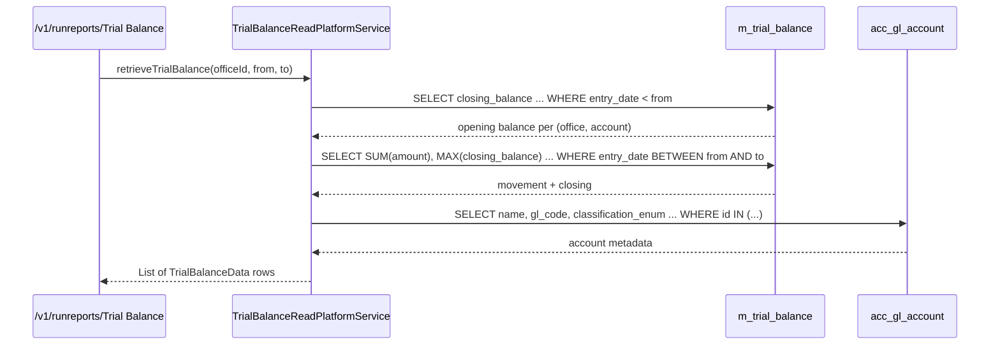

Apache Fineract pre-aggregates trial balance data into a denormalised table, `m_trial_balance`, rather than recomputing it from `acc_gl_journal_entry` on every report request. The entity is `TrialBalance` (`fineract-accounting/.../glaccount/domain/TrialBalance.java`) and is maintained by the `UPDATE_TRIAL_BALANCE_DETAILS` scheduled job — `UpdateTrialBalanceDetailsTasklet` — which fills in missing days and rolls running closing balances forward per office and account.

## `TrialBalance` entity

```java
@Entity
@Table(name = "m_trial_balance")
public class TrialBalance extends AbstractPersistableCustom<Long> {
    @Column(name = "office_id")        private Long officeId;
    @Column(name = "account_id")       private Long glAccountId;
    @Column(name = "amount")           private BigDecimal amount;
    @Column(name = "entry_date")       private LocalDate entryDate;
    @Column(name = "created_date")     private LocalDate transactionDate;
    @Column(name = "closing_balance")  private BigDecimal closingBalance;
}
```

| Field | Column | Meaning |
| --- | --- | --- |
| `officeId` | `office_id` | Office slice. Foreign key by id rather than `@ManyToOne` to keep aggregation cheap. |
| `glAccountId` | `account_id` | GL account slice. |
| `amount` | `amount` | Net movement on this slice for `entryDate`. Signed: debit positive, credit negative for ASSET/EXPENSE; flipped for LIABILITY/EQUITY/INCOME. |
| `entryDate` | `entry_date` | The business date the movement is attributed to. |
| `transactionDate` | `created_date` | The date the underlying journal entry was actually inserted (useful for late postings). |
| `closingBalance` | `closing_balance` | Running balance after `amount` is applied. Filled in by the closing-balance pass. |

The unique key in practice is `(office_id, account_id, entry_date)` plus the surrogate `id`.

## What the job actually does

`UpdateTrialBalanceDetailsTasklet.execute()` runs two passes:

```mermaid
flowchart TB
    START[Spring Batch step] --> P1[processTrialBalanceGaps]
    P1 --> MAX[findMaxCreatedDate from m_trial_balance]
    MAX --> GAPS["findTransactionDatesAfter(maxDate)<br/>across acc_gl_journal_entry"]
    GAPS --> FOREACH[For each date D < businessDate]
    FOREACH --> AGG[findTrialBalanceLinesForDate(D)<br/>SELECT office, account, SUM(signed amount), entry_date, txn_date, NULL closing]
    AGG --> INS[INSERT TrialBalance rows]
    INS --> P2[updateClosingBalances]
    P2 --> OFC[findDistinctOfficeIdsWithNullClosingBalance]
    OFC --> ACC[findDistinctAccountIdsWithNullClosingBalanceByOfficeId]
    ACC --> PREV[findLastClosingBalance for office+account]
    PREV --> ROLL[For each new row, ordered by entry_date:<br/>closing_balance = previous + amount]
    ROLL --> SAVE[Persist updated rows]
```

### Pass 1 — fill gaps

`processTrialBalanceGaps`:

1. `findMaxCreatedDate()` returns the latest `entry_date` already in `m_trial_balance`, or defaults to `2010-01-01`.
2. `findTransactionDatesAfter(baselineDate)` returns the distinct dates in `acc_gl_journal_entry` newer than the baseline.
3. For each gap date strictly before today's business date, `findTrialBalanceLinesForDate(date)` groups the journal entries on that date by `(office_id, account_id)` and SUMs the signed amounts.
4. Each `(office, account, sumAmount, entryDate, transactionDate, null closingBalance)` tuple becomes a fresh `TrialBalance` row.

### Pass 2 — fill closing balances

`updateClosingBalances`:

1. `findDistinctOfficeIdsWithNullClosingBalance()` — every office that has at least one row with a missing closing balance.
2. For each office, `findDistinctAccountIdsWithNullClosingBalanceByOfficeId(officeId)` lists the accounts that need rolling.
3. For each `(office, account)`, `findLastClosingBalance(officeId, accountId)` fetches the most recent already-computed closing balance (or zero if none).
4. The new rows for that `(office, account)` are walked in `entry_date` order; each row's `closing_balance = previousClosing + amount`.

The two-pass design keeps the job idempotent: re-running it on a day that has nothing new produces zero inserts and zero updates.

<Note>
  The job only inserts rows for `entry_date < businessLocalDate`, so today's in-progress activity is not yet reflected. A trial balance report for today reads from `acc_gl_journal_entry` directly via the read service; reports for any prior date use `m_trial_balance`.
</Note>

## Sign convention

`amount` is stored signed so that downstream aggregation is a plain SUM. The signing follows the natural side of each `GLAccountType`:

| `GLAccountType` | Debit row contributes | Credit row contributes |
| --- | --- | --- |
| ASSET | `+amount` | `-amount` |
| EXPENSE | `+amount` | `-amount` |
| LIABILITY | `-amount` | `+amount` |
| EQUITY | `-amount` | `+amount` |
| INCOME | `-amount` | `+amount` |

The native SQL behind `findTrialBalanceLinesForDate` performs this CASE expression as part of the SUM so the value in `m_trial_balance.amount` is "increase to the account's normal balance".

## Read service

`TrialBalanceReadPlatformService` (in `fineract-provider`) exposes the report-facing API. Conceptual signature:

```java
Page<TrialBalanceData> retrieveTrialBalance(
    Long officeId,
    LocalDate fromDate,
    LocalDate toDate,
    SearchParameters search);
```

For a date range:

1. Sum `amount` per `(office_id, account_id)` between `fromDate` and `toDate` from `m_trial_balance`.
2. Join `acc_gl_account` to enrich with name, GL code, type.
3. Compute opening balance as the `closing_balance` of the row immediately preceding `fromDate` for each `(office, account)`.
4. Compute period movement as the SUM in step 1.
5. Closing = opening + movement (matches the latest row inside the window).



## When the data is stale

| Scenario | Effect | Fix |
| --- | --- | --- |
| Job hasn't run since yesterday's postings | Trial balance is one day behind | Run `UPDATE_TRIAL_BALANCE_DETAILS` ad hoc |
| Backdated journal entry posted into an already-aggregated date | Aggregate diverges from raw `acc_gl_journal_entry` | The job's "gap" pass only inserts new dates; for backdated rows operators rerun a manual refresh that re-aggregates the affected dates |
| Journal entry reversed | Original sum still correct (reversal posts new opposite-sign rows on the reversal date) | No action |
| Multi-tenant | Each tenant has its own `m_trial_balance` because routing is via `ThreadLocalContextUtil.getTenant()` | No action |

## Time period parameters

The trial balance report is driven by:

- `officeId` — optional. If null, the report aggregates across all offices (subject to user permissions).
- `fromDate` / `toDate` — inclusive period bounds.
- `currencyCode` — optional filter, since the aggregate ignores currency by default.

## Why not just sum `acc_gl_journal_entry`?

Three reasons:

1. **Volume.** A long-lived deployment has tens of millions of journal entry rows; recomputing closing balances per report request is expensive.
2. **Closing-balance semantics.** A correct trial balance needs the running balance per `(office, account)`; that is window-function territory that not every supported database handles uniformly. Pre-aggregation sidesteps it.
3. **Multi-tenant fairness.** Pre-aggregated rows are partitioned per tenant, so a heavy tenant's report does not lock primary GL tables for other tenants.

## Tasklet wiring

The tasklet is registered as a Spring Batch `Tasklet` bean via `UpdateTrialBalanceDetailsConfig`. It receives four collaborators:

```java
private final RoutingDataSourceServiceFactory dataSourceServiceFactory;
private final TrialBalanceRepositoryWrapper trialBalanceRepositoryWrapper;
private final TrialBalanceRepository trialBalanceRepository;
private final JournalEntryRepository journalEntryRepository;
```

`RoutingDataSourceServiceFactory` is how the tasklet gets the *tenant's* connection — never the platform connection. That is what makes the job multi-tenant safe: `ThreadLocalContextUtil.getTenant()` resolves the tenant inside the scheduled task and `determineDataSourceService()` returns its `DataSource`.

Inside `processTrialBalanceGaps`:

```java
LocalDate maxCreatedDate = trialBalanceRepository.findMaxCreatedDate();
LocalDate baselineDate = maxCreatedDate != null ? maxCreatedDate : LocalDate.of(2010, 1, 1);
List<LocalDate> tbGaps = journalEntryRepository.findTransactionDatesAfter(baselineDate);
for (LocalDate tbGap : tbGaps) {
    if (DateUtils.getExactDifferenceInDays(tbGap, DateUtils.getBusinessLocalDate()) < 1) {
        continue;
    }
    insertTrialBalanceForDate(tbGap);
}
```

`insertTrialBalanceForDate` builds `TrialBalance` instances from the raw `Object[]` rows returned by `findTrialBalanceLinesForDate` — `(officeId, glAccountId, amount, entryDate, transactionDate, closingBalance=null)` — and bulk-saves them via the repository wrapper.

Inside `updateClosingBalances`:

```java
final List<Long> officeIds = trialBalanceRepository.findDistinctOfficeIdsWithNullClosingBalance();
for (Long officeId : officeIds) {
    updateClosingBalancesForOffice(jdbcTemplate, officeId);
}
```

The per-account roll forward is:

```java
private void updateTrialBalanceRows(List<TrialBalance> tbRows, BigDecimal initialClosingBalance) {
    BigDecimal closingBalance = initialClosingBalance;
    for (TrialBalance row : tbRows) {
        if (closingBalance != null) {
            closingBalance = closingBalance.add(row.getAmount());
        }
        row.setClosingBalance(closingBalance);
    }
}
```

A plain running sum — the heavy lifting is in the SUM happening in step 1.

## Equality and dedup

The entity overrides `equals` and `hashCode` on the natural tuple `(officeId, glAccountId, amount, entryDate, transactionDate, closingBalance)`. The job uses this to detect duplicates during chunked saves: re-inserting a row that already exists has no effect because the wrapper checks identity before persisting.

## Storage layout

```text
m_trial_balance
├── id                  bigint PK
├── office_id           bigint   /* not an FK in JPA — denormalised */
├── account_id          bigint   /* GL account id */
├── amount              decimal(19,6)  /* signed per type rules */
├── entry_date          date     /* business date */
├── created_date        date     /* underlying txn date — may differ for backdating */
└── closing_balance     decimal(19,6)  /* nullable until pass 2 runs */
```

The natural read pattern is one of:

- `WHERE entry_date = ?` — single-day movement per office/account (rare; usually filtered by office)
- `WHERE entry_date BETWEEN ? AND ? AND office_id = ?` — period view per office
- `WHERE entry_date < ? AND office_id = ? AND account_id = ?` then `MAX(closing_balance)` — opening balance lookup

Indexing the table by `(office_id, account_id, entry_date)` makes all three patterns O(log n).

## Concurrency considerations

The job is single-threaded within one Spring Batch step. Two tenants run in parallel because the scheduler iterates them concurrently, but each tenant's run is serial. This keeps the closing-balance walk straightforward — there is no need to reason about parallel writers updating the running sum on the same `(office, account)` series.

## Related pages

<CardGroup cols={2}>
  <Card title="GL Accounts" href="/accounting/gl-accounts">
    The type column drives the sign convention.
  </Card>
  <Card title="Journal Entries" href="/accounting/journal-entries">
    The source rows that the job aggregates.
  </Card>
  <Card title="Accounting Jobs" href="/accounting/accounting-jobs">
    `UPDATE_TRIAL_BALANCE_DETAILS` and friends.
  </Card>
  <Card title="Spring Batch integration" href="/core/spring-batch-integration">
    How `Tasklet` beans like this one are wired.
  </Card>
</CardGroup>
