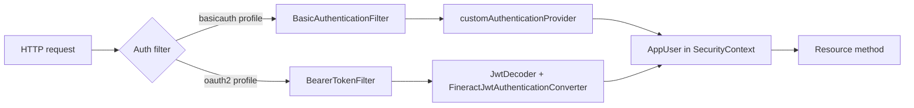
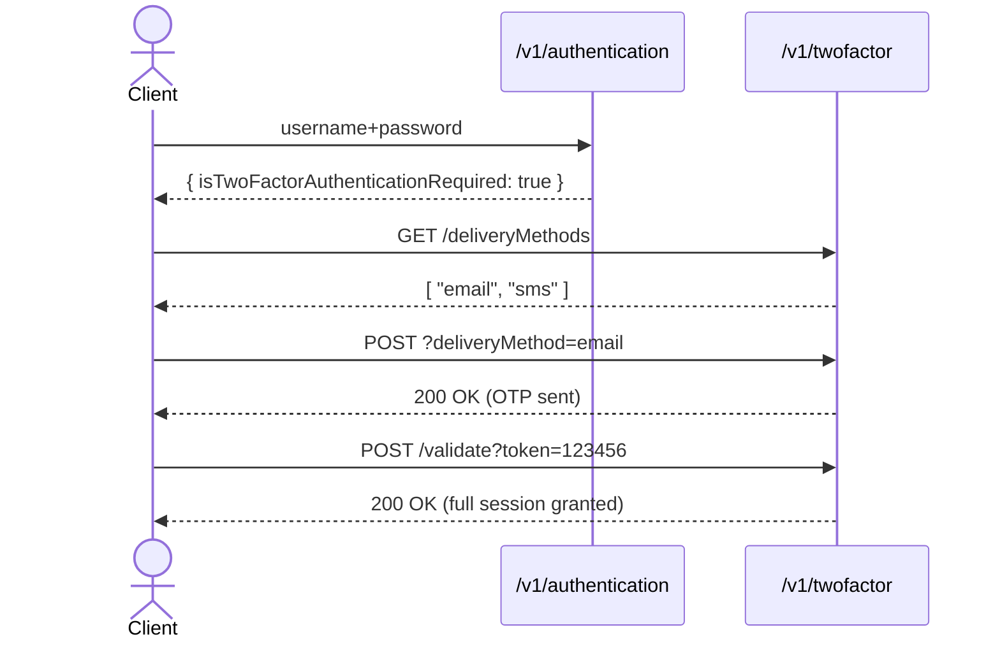

Apache Fineract supports two authentication modes that are mutually exclusive at runtime: HTTP Basic
authentication backed by the local user store, and OAuth2/OIDC where bearer JWTs are minted by an external
identity provider. Both modes share the same downstream authorisation pipeline — once a request has been
authenticated, the platform builds an `AppUser`, attaches it to the Spring `SecurityContext`, and the rest
of the API enforces permissions via `context.authenticatedUser().validateHasPermission(...)`.

The endpoints documented on this page are the *entry* into that pipeline. They give clients a way to verify
credentials, obtain the list of roles and permissions associated with a session, and trigger password reset
flows. They are switched on or off by the `fineract.security.basicauth.enabled` and
`fineract.security.oauth2.enabled` properties, which are mutually exclusive.

## Resource files

| Resource | File |
| --- | --- |
| `AuthenticationApiResource` | `fineract-security/src/main/java/org/apache/fineract/infrastructure/security/api/AuthenticationApiResource.java` |
| `UserDetailsApiResource` | `fineract-security/src/main/java/org/apache/fineract/infrastructure/security/api/UserDetailsApiResource.java` |
| `ForgotPasswordApiResource` | `fineract-provider/src/main/java/org/apache/fineract/useradministration/api/ForgotPasswordApiResource.java` |
| `PasswordPreferencesApiResource` | `fineract-provider/src/main/java/org/apache/fineract/useradministration/api/PasswordPreferencesApiResource.java` |

## Endpoints

| Verb | Path | Mode | Notes |
| --- | --- | --- | --- |
| `POST` | `/v1/authentication` | Basic | Verify username+password, return roles and permissions. |
| `GET` | `/v1/userdetails` | OAuth2 | Decode the incoming JWT, return the resolved `AppUser`. |
| `POST` | `/v1/forgotPassword` | Basic | Initiate a password reset flow. |
| `GET` | `/v1/passwordpreferences` | Both | Fetch the active password policy. |
| `PUT` | `/v1/passwordpreferences` | Both | Update the password policy (admin only). |

## Authentication modes



Only one branch is active per deployment. The `@ConditionalOnProperty` annotation on each resource ensures
`/v1/authentication` exists only under Basic auth and `/v1/userdetails` only under OAuth2.

## POST /v1/authentication

Source: `AuthenticationApiResource.authenticate`. Returns the same `AuthenticatedUserData` payload that
the `/v1/userdetails` endpoint returns under OAuth2, plus a base64-encoded `authenticationKey` that clients
can paste into subsequent `Authorization: Basic ...` headers.

<ParamField body="username" type="string" required>
  Login name of the platform user. Validated against the `m_appuser` table.
</ParamField>

<ParamField body="password" type="string" required>
  Plain-text password. The server hashes and compares against the stored credential.
</ParamField>

### Request

```json
{
  "username": "mifos",
  "password": "password"
}
```

### Response

<ResponseField name="username" type="string">
  Echo of the supplied username.
</ResponseField>

<ResponseField name="userId" type="integer">
  Primary key of `m_appuser`.
</ResponseField>

<ResponseField name="base64EncodedAuthenticationKey" type="string">
  `base64(username:password)` — convenient for clients that want to skip computing it themselves.
</ResponseField>

<ResponseField name="authenticated" type="boolean">
  `true` when the credentials matched.
</ResponseField>

<ResponseField name="officeId" type="integer">
  The user's home office.
</ResponseField>

<ResponseField name="officeName" type="string">
  Display name of the home office.
</ResponseField>

<ResponseField name="staffId" type="integer">
  Optional staff member linked to the user.
</ResponseField>

<ResponseField name="roles" type="array">
  <Expandable title="role">
    <ResponseField name="id" type="integer" />
    <ResponseField name="name" type="string" />
    <ResponseField name="description" type="string" />
    <ResponseField name="disabled" type="boolean" />
  </Expandable>
</ResponseField>

<ResponseField name="permissions" type="array">
  Flat list of permission codes the caller may exercise (e.g. `READ_LOAN`, `APPROVE_LOAN`).
</ResponseField>

<ResponseField name="shouldRenewPassword" type="boolean">
  Set when the password has expired under the active password policy.
</ResponseField>

<ResponseField name="isTwoFactorAuthenticationRequired" type="boolean">
  Set when `fineract.security.2fa.enabled=true` and the user has not yet supplied a second factor.
</ResponseField>

### Sample response

```json
{
  "username": "mifos",
  "userId": 1,
  "base64EncodedAuthenticationKey": "bWlmb3M6cGFzc3dvcmQ=",
  "authenticated": true,
  "officeId": 1,
  "officeName": "Head Office",
  "roles": [
    { "id": 1, "name": "Super user", "description": "all permissions", "disabled": false }
  ],
  "permissions": [
    "ALL_FUNCTIONS",
    "CHECKER_SUPER_USER",
    "READ_LOAN",
    "CREATE_LOAN",
    "APPROVE_LOAN"
  ],
  "shouldRenewPassword": false,
  "isTwoFactorAuthenticationRequired": false
}
```

## GET /v1/userdetails

Source: `UserDetailsApiResource.fetchAuthenticatedUserData`. Available only when
`fineract.security.oauth2.enabled=true`. The caller is expected to present a bearer token issued by the
configured authorisation server (Keycloak, Auth0, Okta, …). The filter decodes the token, resolves an
`AppUser`, and stores a `FineractJwtAuthenticationToken` on the `SecurityContext`.

The response is the same `AuthenticatedUserData` shape as `POST /v1/authentication`, minus the
`base64EncodedAuthenticationKey` — the access token already serves that purpose. The endpoint is typically
called once at session start so the UI can render menus based on the user's permissions.

### Required headers

```
Authorization: Bearer eyJhbGciOi...
Fineract-Platform-TenantId: default
```

### Sample response

```json
{
  "username": "alice@example.com",
  "userId": 12,
  "officeId": 3,
  "officeName": "Branch 3",
  "authenticated": true,
  "roles": [
    { "id": 2, "name": "Loan Officer", "description": "branch loans" }
  ],
  "permissions": [
    "READ_LOAN", "CREATE_LOAN", "APPROVE_LOAN", "DISBURSE_LOAN",
    "READ_CLIENT", "CREATE_CLIENT", "ACTIVATE_CLIENT"
  ],
  "isTwoFactorAuthenticationRequired": false
}
```

<Info>
Token validation is delegated to Spring Security's `JwtDecoder`. The mapping from token claims to
`AppUser` is performed by `KeycloakRoleConverter` (or a custom converter configured via
`FineractJwtAuthenticationConverter`).
</Info>

## Two-factor authentication

When `fineract.security.2fa.enabled=true`, both authentication entry points set
`isTwoFactorAuthenticationRequired=true` on first contact and the caller must then exchange the partial
session for an OTP-verified one through the two-factor endpoints. The OTP delivery method (SMS, email,
TOTP) is configured per user.



## Password preferences

`PasswordPreferencesApiResource` exposes the active password policy at `/v1/passwordpreferences`. It returns
the policy id, description, and the regex used to validate new passwords. Administrators can `PUT` a
different policy id to switch policies — five built-in policies range from minimal complexity to
"strong, must include symbols and digits".

```json
{
  "id": 4,
  "key": "password-policy-key",
  "description": "Strong password — min 8 chars, mixed case, digit, symbol"
}
```

## Forgot password

`ForgotPasswordApiResource` is a thin wrapper that initiates the platform's reset flow. The endpoint
accepts an email or username, triggers an out-of-band reset (typically by enqueueing an email through
the `EmailCampaignApiResource` infrastructure), and returns `202 Accepted`. Self-service registration
flows are exposed by the same machinery on the front-end side; on the server, registration creates a
provisional `AppUser` with the `Self Service User` role and a follow-up activation step.

## Self-service variant

Customer-facing apps (mobile banking) authenticate against the same `/v1/authentication` URL but the
backing `AppUser` carries the `isSelfServiceUser=true` flag, which restricts the visible permission
set and routes the user to the `/v1/self/*` endpoint family (loans, savings, clients, beneficiaries).
The login itself is identical; the role membership is what differentiates the session.

## Common errors

| Status | Cause |
| --- | --- |
| `400` | Missing `username` or `password` in the request body. |
| `401` | Bad credentials, expired JWT, missing `Authorization` header. |
| `403` | `PasswordResetRequiredException` — the user must reset their password before continuing. |
| `403` | Account is locked or disabled. |
| `503` | `Fineract-Platform-TenantId` is missing or refers to an unknown tenant. |

## Related

- [API reference overview](/api/overview) for the tenant header and base path.
- [Clients API](/api/clients-api) for the self-service client lifecycle.
- [Loans API](/api/loans-api) for the permissions enforced on loan endpoints.
