Apache Fineract's close-of-business (COB) jobs do not run a single hard-coded
routine. Each COB job — `LOAN_COB`, `SAVINGS_COB`, and the working-capital
variant `WORKING_CAPITAL_LOAN_COB` — drives an ordered pipeline of *business
steps*. A step is a small, idempotent unit of work (e.g. "Apply Charge to
Overdue Loans", "Loan Delinquency Classification", "Update Loan Summary") that
the deployment can switch on or off, reorder, or extend with custom code.

The `ConfigureBusinessStepApiResource` resource is what operators (and CI/CD
pipelines) use to inspect and tune that pipeline at runtime, without an
application restart.

## Source file

`fineract-provider/src/main/java/org/apache/fineract/cob/api/ConfigureBusinessStepApiResource.java`

The resource is mounted under `/v1/jobs` so it sits next to
`SchedulerJobApiResource` — semantically it is a job-configuration sibling.

## Endpoint catalog

| Verb | Path | `command` | Permission |
| --- | --- | --- | --- |
| `GET` | `/v1/jobs/names` | – | `READ_SCHEDULER` |
| `GET` | `/v1/jobs/{jobName}/steps` | – | `READ_SCHEDULER` |
| `PUT` | `/v1/jobs/{jobName}/steps` | – | `UPDATE_BUSINESS_STEP_CONFIG` |
| `GET` | `/v1/jobs/{jobName}/available-steps` | – | `READ_SCHEDULER` |

<Info>
There is no `?command=` query parameter on these endpoints. The reorder
operation is the `PUT` itself; the body fully replaces the configured
ordering for that job.
</Info>

## Known job names

The `{jobName}` path parameter accepts the symbolic job identifier, not the
human-readable display name from the scheduler catalog.

| `jobName` | Display name | Module |
| --- | --- | --- |
| `LOAN_COB` | Loan COB | `fineract-cob` (core) |
| `SAVINGS_COB` | Savings COB | `fineract-savings-cob` |
| `WORKING_CAPITAL_LOAN_COB` | Working Capital Loan COB | `fineract-working-capital-loan` |

`GET /v1/jobs/names` is the runtime-truth source: it returns whichever of the
above are actually wired into the running tenant.

## Listing configured steps

```json GET /v1/jobs/LOAN_COB/steps
{
  "jobName": "LOAN_COB",
  "businessSteps": [
    { "stepName": "APPLY_CHARGE_TO_OVERDUE_LOANS", "order": 1 },
    { "stepName": "LOAN_DELINQUENCY_CLASSIFICATION", "order": 2 },
    { "stepName": "CHECK_LOAN_REPAYMENT_DUE", "order": 3 },
    { "stepName": "CHECK_LOAN_REPAYMENT_OVERDUE", "order": 4 },
    { "stepName": "UPDATE_LOAN_ARREARS_AGING", "order": 5 },
    { "stepName": "ADD_PERIODIC_ACCRUAL_ENTRIES", "order": 6 },
    { "stepName": "EXTERNAL_ASSET_OWNER_TRANSFER", "order": 7 },
    { "stepName": "LOAN_TICKLER", "order": 8 }
  ]
}
```

The list is canonical — the `LOAN_COB` job iterates the steps in `order` and
skips any step not present in the list.

## Discovering available steps

```json GET /v1/jobs/LOAN_COB/available-steps
{
  "jobName": "LOAN_COB",
  "availableBusinessSteps": [
    { "stepName": "APPLY_CHARGE_TO_OVERDUE_LOANS", "description": "Apply Charge To Overdue Loans" },
    { "stepName": "LOAN_DELINQUENCY_CLASSIFICATION", "description": "Loan Delinquency Classification" },
    { "stepName": "CHECK_LOAN_REPAYMENT_DUE", "description": "Check Loan Repayment Due" },
    { "stepName": "CHECK_LOAN_REPAYMENT_OVERDUE", "description": "Check Loan Repayment Overdue" },
    { "stepName": "UPDATE_LOAN_ARREARS_AGING", "description": "Update Loan Arrears Aging" },
    { "stepName": "ADD_PERIODIC_ACCRUAL_ENTRIES", "description": "Add Periodic Accrual Entries" },
    { "stepName": "EXTERNAL_ASSET_OWNER_TRANSFER", "description": "External Asset Owner Transfer" },
    { "stepName": "LOAN_TICKLER", "description": "Loan Tickler" }
  ]
}
```

The available list is the universe of steps wired into the running JAR for
that job category — anything you can legally include in a `PUT` body.

## Reordering steps

```json PUT /v1/jobs/LOAN_COB/steps
{
  "businessSteps": [
    { "stepName": "APPLY_CHARGE_TO_OVERDUE_LOANS", "order": 1 },
    { "stepName": "CHECK_LOAN_REPAYMENT_DUE", "order": 2 },
    { "stepName": "CHECK_LOAN_REPAYMENT_OVERDUE", "order": 3 },
    { "stepName": "LOAN_DELINQUENCY_CLASSIFICATION", "order": 4 },
    { "stepName": "UPDATE_LOAN_ARREARS_AGING", "order": 5 },
    { "stepName": "ADD_PERIODIC_ACCRUAL_ENTRIES", "order": 6 },
    { "stepName": "LOAN_TICKLER", "order": 7 }
  ]
}
```

The response is `204 No Content` — Fineract logs a command source and the
update lands in the `batch_business_steps` table. The next time the
`LOAN_COB` job fires it will read the new ordering.

<Warning>
Steps you drop from the list are not run on the next COB. If you remove
`UPDATE_LOAN_ARREARS_AGING`, the `mlsi_*` arrears columns will stop being
refreshed. Be deliberate when shortening the pipeline.
</Warning>

## Savings example

```json PUT /v1/jobs/SAVINGS_COB/steps
{
  "businessSteps": [
    { "stepName": "POST_INTEREST_FOR_SAVINGS", "order": 1 },
    { "stepName": "UPDATE_DORMANCY_STATUS", "order": 2 }
  ]
}
```

## Names endpoint

```json GET /v1/jobs/names
{
  "jobNames": ["LOAN_COB", "SAVINGS_COB"]
}
```

The shape is a single-key DTO — the array length is whichever COB job
categories are deployed.

## Pipeline at a glance

```mermaid
flowchart LR
    T[Scheduler trigger] --> COB[LOAN_COB job]
    COB --> S1[APPLY_CHARGE_TO_OVERDUE_LOANS]
    S1 --> S2[LOAN_DELINQUENCY_CLASSIFICATION]
    S2 --> S3[CHECK_LOAN_REPAYMENT_DUE]
    S3 --> S4[CHECK_LOAN_REPAYMENT_OVERDUE]
    S4 --> S5[UPDATE_LOAN_ARREARS_AGING]
    S5 --> S6[ADD_PERIODIC_ACCRUAL_ENTRIES]
    S6 --> S7[EXTERNAL_ASSET_OWNER_TRANSFER]
    S7 --> S8[LOAN_TICKLER]
    S8 --> R[(batch_business_step_execution rows)]
```



## Validation rules

The `PUT` handler enforces three invariants before persisting the new
ordering:

<CardGroup cols={2}>
  <Card title="Step belongs to job">
    Each `stepName` must appear in the job's `available-steps` list, otherwise
    the call fails with `BusinessStepNotBelongsToJobException`.
  </Card>
  <Card title="Unique order">
    The `order` values across all entries must be distinct positive integers.
  </Card>
  <Card title="No duplicates">
    A `stepName` can appear at most once in the array.
  </Card>
  <Card title="Atomic replace">
    The submitted list is treated as the new full configuration; absent steps
    are deactivated for that job.
  </Card>
</CardGroup>

## Custom steps

Custom JARs that implement `COBBusinessStep<T>` and a matching
`BusinessStepCategory` are auto-discovered at boot. Once your bean is on the
classpath it shows up in `/v1/jobs/{jobName}/available-steps`, and you can
splice it into the running pipeline with a single `PUT` — no Fineract source
fork required.

<Tip>
The reference `acme` custom module (`custom/acme/loan/cob/`) ships a
`AcmeNoopBusinessStep` you can copy as a starting point. It joins the
`LOAN_COB` category and shows the minimum interface a step must implement.
</Tip>

## End-to-end recipe

The typical promotion of a new COB step from "available" to "in production"
follows three calls:

```bash
# 1. discover the universe of steps Fineract knows about for this job
GET /v1/jobs/LOAN_COB/available-steps

# 2. read the current ordering you are about to mutate
GET /v1/jobs/LOAN_COB/steps

# 3. write the new ordering back
PUT /v1/jobs/LOAN_COB/steps
```

In a CI/CD context you typically store the desired ordering as a YAML or
JSON file and have the deploy step `PUT` it on every release. Because the
operation is idempotent, replays are safe.

## SAVINGS_COB shape

Savings COB tends to be shorter than its loan counterpart — it focuses on
interest accrual and dormancy state transitions.

```json GET /v1/jobs/SAVINGS_COB/available-steps
{
  "jobName": "SAVINGS_COB",
  "availableBusinessSteps": [
    { "stepName": "POST_INTEREST_FOR_SAVINGS", "description": "Post Interest For Savings" },
    { "stepName": "UPDATE_DORMANCY_STATUS", "description": "Update Savings Dormancy Status" }
  ]
}
```

## Error responses

A `PUT` with an unknown step name returns `400 Bad Request`:

```json
{
  "developerMessage": "The business step UNKNOWN_STEP does not belong to job LOAN_COB",
  "userMessageGlobalisationCode": "error.msg.business.step.not.belongs.to.job",
  "parameterName": "stepName"
}
```

A duplicate order number is rejected before persistence:

```json
{
  "developerMessage": "Duplicate order value in business step configuration",
  "userMessageGlobalisationCode": "error.msg.business.step.order.duplicate",
  "parameterName": "order"
}
```

## See also

<CardGroup cols={2}>
  <Card title="Scheduler API" href="/api/scheduler-jobs-api">
    Trigger the parent `LOAN_COB` job and inspect run history.
  </Card>
  <Card title="Loans API" href="/api/loans-api">
    The loan-account fields these steps maintain (status, arrears, accrual).
  </Card>
</CardGroup>
