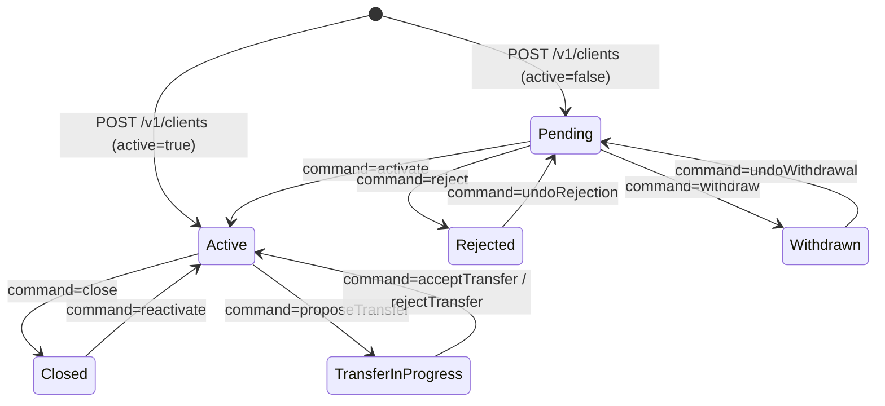

A client in Apache Fineract is the natural or juridical person that holds
loans, savings, and deposit accounts. `ClientsApiResource` covers their full
lifecycle — pending submission, activation, optional transfers between
offices, rejection or withdrawal, and finally closure — together with a tight
group of companion resources that manage identifiers, addresses, charges, and
profile photos.

The resource is mounted at `/v1/clients` and uses the `CLIENT` resource name
for permission checks; companion resources use `CLIENTIDENTIFIER`,
`CLIENTADDRESS`, `CLIENTCHARGE`, and `CLIENTIMAGE`.

## Source files

| Concern | File |
| --- | --- |
| Client lifecycle | `fineract-provider/src/main/java/org/apache/fineract/portfolio/client/api/ClientsApiResource.java` |
| Identifiers (NID, passport, …) | `ClientIdentifiersApiResource.java` |
| Addresses (when `Enable-Address` configuration is on) | `ClientAddressApiResource.java` |
| Charges attached to a client | `ClientChargesApiResource.java` |
| Profile image upload | `ClientImagesApiResource.java` |

## Endpoint catalog

### Clients

| Verb | Path | `command` | Permission |
| --- | --- | --- | --- |
| `GET` | `/v1/clients/template` | – | `READ_CLIENT` |
| `GET` | `/v1/clients` | – | `READ_CLIENT` |
| `GET` | `/v1/clients/{clientId}` | – | `READ_CLIENT` |
| `GET` | `/v1/clients/external-id/{externalId}` | – | `READ_CLIENT` |
| `GET` | `/v1/clients/{clientId}/accounts` | – | `READ_CLIENT` |
| `POST` | `/v1/clients` | – | `CREATE_CLIENT` |
| `PUT` | `/v1/clients/{clientId}` | – | `UPDATE_CLIENT` |
| `DELETE` | `/v1/clients/{clientId}` | – | `DELETE_CLIENT` |
| `POST` | `/v1/clients/{clientId}` | `activate` | `ACTIVATE_CLIENT` |
| `POST` | `/v1/clients/{clientId}` | `close` | `CLOSE_CLIENT` |
| `POST` | `/v1/clients/{clientId}` | `reject` | `REJECT_CLIENT` |
| `POST` | `/v1/clients/{clientId}` | `withdraw` | `WITHDRAW_CLIENT` |
| `POST` | `/v1/clients/{clientId}` | `reactivate` | `REACTIVATE_CLIENT` |
| `POST` | `/v1/clients/{clientId}` | `undoRejection` | `UNDOREJECTION_CLIENT` |
| `POST` | `/v1/clients/{clientId}` | `undoWithdrawal` | `UNDOWITHDRAWAL_CLIENT` |
| `POST` | `/v1/clients/{clientId}` | `assignStaff` / `unassignStaff` | `UPDATE_CLIENT` |
| `POST` | `/v1/clients/{clientId}` | `proposeTransfer` | `PROPOSETRANSFER_CLIENT` |
| `POST` | `/v1/clients/{clientId}` | `acceptTransfer` | `ACCEPTTRANSFER_CLIENT` |
| `POST` | `/v1/clients/{clientId}` | `rejectTransfer` | `REJECTTRANSFER_CLIENT` |
| `POST` | `/v1/clients/{clientId}` | `withdrawTransfer` | `WITHDRAWTRANSFER_CLIENT` |
| `POST` | `/v1/clients/{clientId}` | `updateSavingsAccount` | `UPDATESAVINGSACCOUNT_CLIENT` |
| `POST` | `/v1/clients/uploadtemplate` | – | `CREATE_CLIENT` |

### Identifiers

| Verb | Path | Permission |
| --- | --- | --- |
| `GET` | `/v1/clients/{clientId}/identifiers` | `READ_CLIENTIDENTIFIER` |
| `POST` | `/v1/clients/{clientId}/identifiers` | `CREATE_CLIENTIDENTIFIER` |
| `PUT` | `/v1/clients/{clientId}/identifiers/{identifierId}` | `UPDATE_CLIENTIDENTIFIER` |
| `DELETE` | `/v1/clients/{clientId}/identifiers/{identifierId}` | `DELETE_CLIENTIDENTIFIER` |

### Charges

| Verb | Path | `command` | Permission |
| --- | --- | --- | --- |
| `GET` | `/v1/clients/{clientId}/charges` | – | `READ_CLIENTCHARGE` |
| `POST` | `/v1/clients/{clientId}/charges` | – | `CREATE_CLIENTCHARGE` |
| `POST` | `/v1/clients/{clientId}/charges/{chargeId}` | `paycharge` | `PAY_CLIENTCHARGE` |
| `POST` | `/v1/clients/{clientId}/charges/{chargeId}` | `waive` | `WAIVE_CLIENTCHARGE` |
| `DELETE` | `/v1/clients/{clientId}/charges/{chargeId}` | – | `DELETE_CLIENTCHARGE` |

### Image and address

| Verb | Path | Purpose |
| --- | --- | --- |
| `POST` | `/v1/clients/{clientId}/images` | Upload base64 or multipart photo |
| `GET` | `/v1/clients/{clientId}/images` | Fetch photo as JPEG |
| `DELETE` | `/v1/clients/{clientId}/images` | Remove the photo |
| `GET` | `/v1/client/{clientId}/addresses` | List addresses |
| `POST` | `/v1/client/{clientId}/addresses` | Add an address of a configured type |

## Creating a client

<CodeGroup>

```json POST /v1/clients (person)
{
  "officeId": 1,
  "legalFormId": 1,
  "firstname": "Aisha",
  "lastname": "Okafor",
  "externalId": "CL-0001",
  "mobileNo": "+2348012345678",
  "dateOfBirth": "12 May 1992",
  "genderId": 12,
  "clientTypeId": 23,
  "active": true,
  "activationDate": "01 February 2025",
  "submittedOnDate": "01 February 2025",
  "savingsProductId": 1,
  "dateFormat": "dd MMMM yyyy",
  "locale": "en"
}
```

```json POST /v1/clients (entity)
{
  "officeId": 1,
  "legalFormId": 2,
  "fullname": "Okafor Trading Ltd",
  "externalId": "CL-0002",
  "active": false,
  "submittedOnDate": "01 February 2025",
  "clientNonPersonDetails": {
    "constitutionId": 35,
    "incorpNumber": "RC-1234567",
    "incorpValidityTillDate": "01 January 2030",
    "mainBusinessLineId": 41,
    "remarks": "Sole proprietorship"
  },
  "dateFormat": "dd MMMM yyyy",
  "locale": "en"
}
```

</CodeGroup>

## State transition

```json POST /v1/clients/{clientId}?command=activate
{
  "activationDate": "01 February 2025",
  "dateFormat": "dd MMMM yyyy",
  "locale": "en"
}
```

`?command=close` requires a `closureReasonId` drawn from the
`ClientClosureReason` code list, and `?command=reject` similarly demands a
`rejectionReasonId`.

## Example response

```json
{
  "officeId": 1,
  "clientId": 102,
  "resourceId": 102,
  "changes": {
    "active": true,
    "activationDate": "01 February 2025",
    "locale": "en",
    "dateFormat": "dd MMMM yyyy"
  }
}
```

## Lifecycle



## Inter-office transfer flow

<Note>
A transfer cannot be one-shot. The source office calls
`proposeTransfer` with the destination office id, the receiving office then
calls `acceptTransfer`. Either side can cancel with `withdrawTransfer` or
`rejectTransfer` until the proposal is accepted.
</Note>

```json POST /v1/clients/{clientId}?command=proposeTransfer
{
  "destinationOfficeId": 4,
  "note": "Customer relocated to branch 4"
}
```

## Identifier example

```json POST /v1/clients/{clientId}/identifiers
{
  "documentTypeId": 11,
  "documentKey": "NID-9988-7766-5544",
  "description": "National ID card",
  "status": "ACTIVE"
}
```

## Charge example

```json POST /v1/clients/{clientId}/charges
{
  "chargeId": 18,
  "amount": "5.00",
  "dueDate": "01 March 2025",
  "locale": "en",
  "dateFormat": "dd MMMM yyyy"
}
```

The pay-charge command settles the charge against the client's linked
savings account when the product permits it; otherwise the operator must
nominate a payment type.

```json POST /v1/clients/{clientId}/charges/{chargeId}?command=paycharge
{
  "transactionDate": "05 March 2025",
  "amount": "5.00",
  "locale": "en",
  "dateFormat": "dd MMMM yyyy"
}
```

## Client accounts roll-up

```bash
GET /v1/clients/{clientId}/accounts
```

The response groups loan, savings, deposit, and share accounts attached to
the client, each with status, balance, and product name. This is the
endpoint the reference UI uses to render the customer landing page.

```json
{
  "loanAccounts": [
    { "id": 42, "accountNo": "000000042", "productName": "Personal Loan 12m", "status": { "id": 300, "code": "loanStatusType.active" } }
  ],
  "savingsAccounts": [
    { "id": 14, "accountNo": "000000014", "productName": "Regular Savings", "status": { "id": 300, "code": "savingsAccountStatusType.active" } }
  ],
  "memberLoanAccounts": [],
  "guarantorAccounts": []
}
```

## Image upload

The image endpoint accepts either a multipart form with a `file` part or a
data-URL-encoded JSON body — useful for SPAs that already hold a
`FileReader.readAsDataURL` result.

```json POST /v1/clients/{clientId}/images
{
  "encodedImage": "data:image/jpeg;base64,/9j/4AAQSkZJRgABA…"
}
```

<Warning>
The configured `image-storage` location decides where the JPEG lands — by
default it is the database, but production deployments typically point at a
filesystem or S3 bucket. Switching providers does not migrate existing
images automatically.
</Warning>

## See also

<CardGroup cols={2}>
  <Card title="Groups API" href="/api/groups-and-centers-api">
    Bundle clients into groups and centers for joint products.
  </Card>
  <Card title="Loans API" href="/api/loans-api">
    Apply for an individual loan against the new `clientId`.
  </Card>
</CardGroup>
