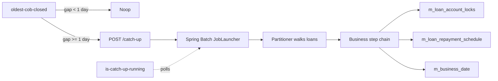
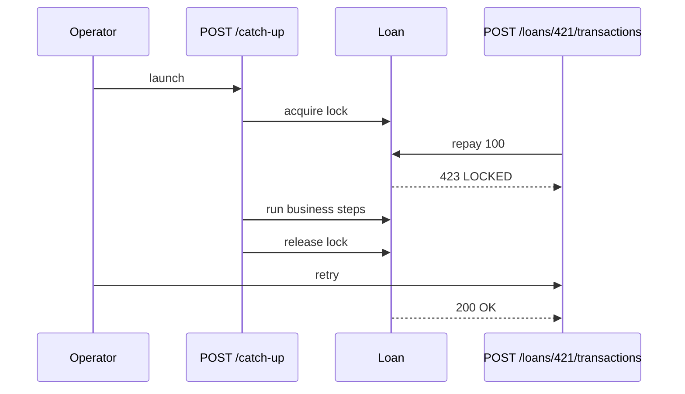

Apache Fineract closes the business day with three Spring Batch jobs — `LOAN_COB`, `SAVINGS_COB`, `WORKING_CAPITAL_LOAN_COB` — that each walk every active account and run a configurable chain of business steps. The `/v1/loans/catch-up` family of endpoints lets operators ask the platform to recover from an outage in which several days of COB were missed, and the lock endpoints expose which accounts are currently held by a tasklet and therefore cannot be touched by online APIs.

This page collects the four resources: `LoanCOBCatchUpApiResource`, `WorkingCapitalLoanCOBCatchUpApiResource`, `LoanAccountLockApiResource`, and the supporting `AccountLockApiResource` perspective on the same `m_loan_account_locks` table.

## Source files

| Resource | File |
| --- | --- |
| `LoanCOBCatchUpApiResource` | `fineract-provider/.../cob/api/LoanCOBCatchUpApiResource.java` |
| `WorkingCapitalLoanCOBCatchUpApiResource` | `fineract-provider/.../cob/api/WorkingCapitalLoanCOBCatchUpApiResource.java` |
| `LoanAccountLockApiResource` | `fineract-provider/.../cob/api/LoanAccountLockApiResource.java` |
| `InternalLoanAccountLockApiResource` | `fineract-provider/.../cob/api/InternalLoanAccountLockApiResource.java` (test-only) |

## How the catch-up works



The catch-up job is *not* a one-shot — it advances the COB business date one day at a time, executing the same chain that the nightly scheduler runs. If you have missed five days, the job runs five COB days serially.

## `LoanCOBCatchUpApiResource` — `/v1/loans`

| Verb | Path | Purpose |
| --- | --- | --- |
| GET | `/v1/loans/oldest-cob-closed` | Returns the business date of the oldest loan whose COB has been closed (i.e. the date the COB engine has advanced past). |
| POST | `/v1/loans/catch-up` | Launches the COB catch-up job. |
| GET | `/v1/loans/is-catch-up-running` | Whether the catch-up job is currently executing. |

### Example: find the COB gap

```http
GET /fineract-provider/api/v1/loans/oldest-cob-closed
```

Response:

```json
{ "date": [2024, 5, 7] }
```

If "today" is `2024-05-12` and this returns `2024-05-07`, COB has not closed for five business days and a catch-up is required.

### Example: launch a catch-up

```http
POST /fineract-provider/api/v1/loans/catch-up
```

```json
{}
```

The body is empty: the job already knows the gap (from `oldest-cob-closed`) and the chain of steps to execute (from `BusinessStepConfigurationApiResource`). The response is `204 No Content` once the job has been *submitted* to the launcher — not when it completes.

### Example: poll for completion

```http
GET /fineract-provider/api/v1/loans/is-catch-up-running
```

Response:

```json
{ "isCatchUpRunning": true }
```

Keep polling every few seconds. Re-querying `oldest-cob-closed` after `isCatchUpRunning` flips back to `false` confirms the gap has closed.

## `WorkingCapitalLoanCOBCatchUpApiResource` — `/v1/working-capital-loans`

Same shape as the loan resource, scoped to the working-capital-loan portfolio. The two job chains are independent — you can run them in parallel.

| Verb | Path | Purpose |
| --- | --- | --- |
| GET | `/v1/working-capital-loans/oldest-cob-closed` | Oldest WCL COB date. |
| POST | `/v1/working-capital-loans/catch-up` | Launch WCL catch-up. |
| GET | `/v1/working-capital-loans/is-catch-up-running` | WCL catch-up state. |

### Example: launch a WCL catch-up

```http
POST /fineract-provider/api/v1/working-capital-loans/catch-up
```

```json
{}
```

## `LoanAccountLockApiResource` — `/v1/loans/locked`

A *lock* is a row in `m_loan_account_locks` that says "loan #X is currently being processed by the COB engine for chunk Y". Tasklets check it at the top of every step; online write APIs (disburse, repay, undo) check it inside the command handler. If you see a `423 Locked` from a loan command, this endpoint is where you go to look up what is holding the row.

| Verb | Path | Purpose |
| --- | --- | --- |
| GET | `/v1/loans/locked` | Paged list of currently locked loans. Supports `page`, `limit`. |

### Example: list locked loans

```http
GET /fineract-provider/api/v1/loans/locked?page=0&limit=50
```

Response:

```json
{
  "totalFilteredRecords": 2,
  "pageItems": [
    { "loanId": 421, "version": 7, "error": null },
    { "loanId": 503, "version": 3, "error": "TimeoutException at step ApplyChargeToOverdueLoans" }
  ]
}
```

A non-null `error` means the tasklet died mid-chunk and the lock was not released; in that case the COB chunk will be retried on the next nightly job, but the loan is also frozen for online operations until then.

## Internal lock manipulation

`InternalLoanAccountLockApiResource` (mounted at `/v1/internal/loans/locked`) is gated behind the `fineract.mode.read-only-mode` profile guard and is intended for integration tests only — production builds should not expose it. It lets you POST a synthetic lock or DELETE one. Two example calls (test-only):

```http
POST /fineract-provider/api/v1/internal/loans/421/lock
DELETE /fineract-provider/api/v1/internal/loans/421/lock
```

These are no-ops in a release build; they are documented here so operators can recognise the URLs in test logs without confusion.

## Lock + catch-up interaction



Operators integrating a real-time channel should retry `423` with exponential backoff and surface the `error` from `/v1/loans/locked` in the customer-facing message when a stuck lock is detected.

## Sample full flow

A typical operator runbook after a 2-day outage looks like:

```http
GET  /v1/loans/oldest-cob-closed
{ "date": [2024, 5, 10] }

GET  /v1/loans/is-catch-up-running
{ "isCatchUpRunning": false }

POST /v1/loans/catch-up
{}

GET  /v1/loans/is-catch-up-running
{ "isCatchUpRunning": true }

# ... wait ...

GET  /v1/loans/is-catch-up-running
{ "isCatchUpRunning": false }

GET  /v1/loans/oldest-cob-closed
{ "date": [2024, 5, 12] }
```

## Common pitfalls

<AccordionGroup>
  <Accordion title="Catch-up returns immediately but nothing changes">
  The COB business date has not moved because the gap was zero. Confirm with `GET /v1/loans/oldest-cob-closed`. If `oldest-cob-closed` equals today's business date, there is no work to do.
  </Accordion>
  <Accordion title="423 Locked persists hours after catch-up finishes">
  A previous tasklet died with the lock held. Check `GET /v1/loans/locked` for a non-null `error` field. The only safe remedies are: re-run the failing step (it will release the lock) or, in dev, manually `DELETE FROM m_loan_account_locks WHERE loan_id = ...`.
  </Accordion>
  <Accordion title="Two catch-up POSTs in parallel">
  The second call returns `204` but the underlying Spring Batch JobLauncher rejects the second submission as `JobExecutionAlreadyRunningException` — visible in the application log. Use `is-catch-up-running` to gate the launch.
  </Accordion>
</AccordionGroup>

## See also

<CardGroup cols={2}>
  <Card title="COB engine" icon="moon" href="/cob/overview">Step chain and partitioning.</Card>
  <Card title="Loan account lock" icon="lock" href="/cob/loan-account-lock">The `m_loan_account_locks` table and write-API integration.</Card>
  <Card title="Catch-up runbook" icon="rotate" href="/cob/cob-catch-up">Operator playbook with rollback steps.</Card>
  <Card title="Business steps" icon="list" href="/cob/business-step-engine">How to register and reorder steps.</Card>
</CardGroup>
