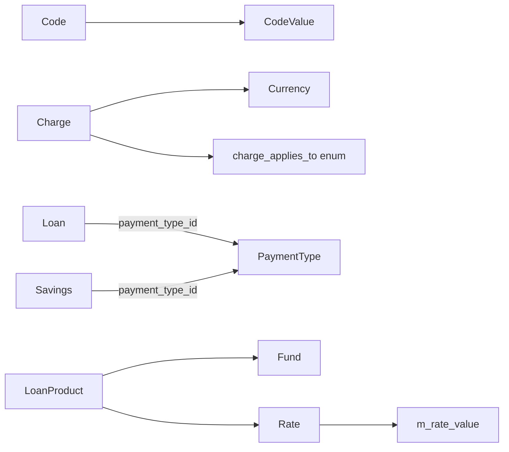
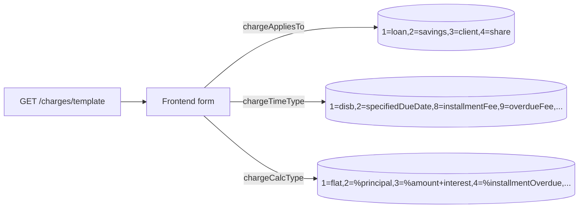

Apache Fineract avoids hard-coding "magic" enumerations. Instead, free-text dropdowns (gender, marital status, ID document type, loan purpose, …) are modelled as `Code` rows with attached `CodeValue` rows; monetary slabs (interest concessions, fees) live in `Fund`, `Rate`, `Charge` and `PaymentType` tables. Together these are the reference-data resources every front-end form pulls from. They sit under `/fineract-provider/api/v1/...` and `/fineract-core/api/v1/...`, and every write goes through the standard `CommandWrapperBuilder` plumbing.

This page collects the six resources: `CodesApiResource`, `CodeValuesApiResource`, `FundsApiResource`, `RatesApiResource`, `PaymentTypeApiResource` and `ChargesApiResource`.

## Source files

| Resource | File |
| --- | --- |
| `CodesApiResource` | `fineract-provider/.../infrastructure/codes/api/CodesApiResource.java` |
| `CodeValuesApiResource` | `fineract-provider/.../infrastructure/codes/api/CodeValuesApiResource.java` |
| `FundsApiResource` | `fineract-provider/.../portfolio/fund/api/FundsApiResource.java` |
| `RateApiResource` | `fineract-provider/.../portfolio/rate/api/RateApiResource.java` |
| `PaymentTypeApiResource` | `fineract-core/.../portfolio/paymenttype/api/PaymentTypeApiResource.java` |
| `ChargesApiResource` | `fineract-charge/.../portfolio/charge/api/ChargesApiResource.java` |

## Model overview



## `CodesApiResource` — `/v1/codes`

A `Code` is a named bucket. System codes (those with `is_system_defined = 1`) cannot be deleted or renamed; user-defined codes are fully mutable.

| Verb | Path | Purpose |
| --- | --- | --- |
| GET | `/v1/codes` | List all codes. |
| GET | `/v1/codes/{codeId}` | Fetch one. |
| GET | `/v1/codes/name/{codeName}` | Fetch by name. |
| POST | `/v1/codes` | Create a code. |
| PUT | `/v1/codes/{codeId}` | Rename a code. |
| DELETE | `/v1/codes/{codeId}` | Delete a non-system code. |

### Example: register a "Loan Purpose" code

```http
POST /fineract-provider/api/v1/codes
```

```json
{ "name": "Loan Purpose" }
```

The response carries `{ "resourceId": <codeId> }`. Use it to attach values via `CodeValuesApiResource`.

### Example: rename a code

```http
PUT /fineract-provider/api/v1/codes/27
```

```json
{ "name": "Loan Purpose v2" }
```

## `CodeValuesApiResource` — `/v1/codes/{codeId}/codevalues`

Every code value carries a label, an optional integer `position` for sort order, an `isActive` flag, and an opaque `description`. Values can also be looked up by parent code name, which is handy when you don't want to pin a numeric id into the client.

| Verb | Path | Purpose |
| --- | --- | --- |
| GET | `/v1/codes/{codeId}/codevalues` | List values for a code. |
| GET | `/v1/codes/{codeId}/codevalues/{codeValueId}` | Fetch one. |
| POST | `/v1/codes/{codeId}/codevalues` | Create a value. |
| PUT | `/v1/codes/{codeId}/codevalues/{codeValueId}` | Update label / position / active flag. |
| DELETE | `/v1/codes/{codeId}/codevalues/{codeValueId}` | Delete. |
| GET | `/v1/codes/name/{codeName}/codevalues` | Same list addressed by code name. |
| GET | `/v1/codes/name/{codeName}/codevalues/{codeValueId}` | Same fetch addressed by code name. |

### Example: add "Agriculture" to Loan Purpose

```http
POST /fineract-provider/api/v1/codes/27/codevalues
```

```json
{
  "name": "Agriculture",
  "description": "Seasonal input financing",
  "position": 10,
  "isActive": true
}
```

### Example: re-order Loan Purpose values

```http
PUT /fineract-provider/api/v1/codes/27/codevalues/154
```

```json
{ "position": 1 }
```

Position is a tie-breaker for the front-end dropdown; it has no semantic effect beyond sort order.

## `FundsApiResource` — `/v1/funds`

`Fund` is a free-text label attached to loans and loan products for portfolio reporting — typical values are "Donor X tranche 2024" or "Internal capital". Funds carry no balance of their own; they are pure tags.

| Verb | Path | Purpose |
| --- | --- | --- |
| GET | `/v1/funds` | List funds. |
| GET | `/v1/funds/{fundId}` | Fetch one. |
| POST | `/v1/funds` | Create. |
| PUT | `/v1/funds/{fundId}` | Update name / external id. |

### Example: tag a donor tranche

```http
POST /fineract-provider/api/v1/funds
```

```json
{
  "name": "USAID 2024 Q2",
  "externalId": "FND-USAID-24Q2"
}
```

The id can then be set on `LoanProduct.fundId` or per-loan via the loan create payload.

## `RateApiResource` — `/v1/rates`

`Rate` is a multi-tier interest concession structure: a parent `Rate` row with a list of `RateValue` slabs. It is attached to a `LoanProduct` and modulates the headline interest rate (e.g., "−2% for women clients", "+1% for loans over 12 months").

| Verb | Path | Purpose |
| --- | --- | --- |
| GET | `/v1/rates` | List rates. |
| GET | `/v1/rates/{rateId}` | Fetch one (with slabs). |
| POST | `/v1/rates` | Create rate + slabs. |
| PUT | `/v1/rates/{rateId}` | Replace rate + slabs. |

### Example: a women-borrowers concession

```http
POST /fineract-provider/api/v1/rates
```

```json
{
  "name": "Women's concession",
  "percentage": -2.0,
  "productApplicable": "loan",
  "active": true,
  "approveUserId": 1
}
```

`percentage` is the headline number; for tiered slabs add a `rateValues` array of `{ minRange, maxRange, percentage }` rows.

### Example: deactivate a rate

```http
PUT /fineract-provider/api/v1/rates/9
```

```json
{ "active": false }
```

## `PaymentTypeApiResource` — `/v1/paymenttypes`

A `PaymentType` is the channel attached to every cash transaction: "Cash", "M-Pesa", "Bank Transfer", "Cheque". The `isCashPayment` flag drives till reconciliation, and `position` orders the dropdown.

| Verb | Path | Purpose |
| --- | --- | --- |
| GET | `/v1/paymenttypes` | List payment types. |
| GET | `/v1/paymenttypes?onlyWithCode=true` | Limit to those with a `codeName`. |
| GET | `/v1/paymenttypes/{paymentTypeId}` | Fetch one. |
| POST | `/v1/paymenttypes` | Create. |
| PUT | `/v1/paymenttypes/{paymentTypeId}` | Update. |
| DELETE | `/v1/paymenttypes/{paymentTypeId}` | Delete if unused. |

### Example: register an M-Pesa channel

```http
POST /fineract-core/api/v1/paymenttypes
```

```json
{
  "name": "M-Pesa Paybill",
  "description": "Safaricom M-Pesa B2C / C2B",
  "isCashPayment": false,
  "position": 5,
  "codeName": "MPESA-PB"
}
```

### Example: hide a payment type

```http
PUT /fineract-core/api/v1/paymenttypes/3
```

```json
{ "position": 99, "name": "(legacy) Cheque" }
```

There is no `isActive` flag — operators usually rename and demote unused types instead of deleting them, because deletion fails if any historical transaction references the row.

## `ChargesApiResource` — `/v1/charges`

Charges are the canonical fee catalogue: flat or percentage, applied at disbursement, on each installment, on overdue, or as a one-off. The `chargeAppliesTo` enum decides which product types may pick the charge from the dropdown.

| Verb | Path | Purpose |
| --- | --- | --- |
| GET | `/v1/charges` | List charges. |
| GET | `/v1/charges/{chargeId}` | Fetch one. |
| GET | `/v1/charges/template` | Form dropdowns: currencies, applies-to, calc type, time type, payment modes. |
| POST | `/v1/charges` | Create a charge. |
| PUT | `/v1/charges/{chargeId}` | Update. |
| DELETE | `/v1/charges/{chargeId}` | Delete if unused. |

### Example: a 2 % disbursement fee

```http
POST /fineract-charge/api/v1/charges
```

```json
{
  "name": "Disbursement fee 2%",
  "chargeAppliesTo": 1,
  "currencyCode": "KES",
  "chargeTimeType": 1,
  "chargeCalculationType": 2,
  "amount": 2.0,
  "active": true,
  "penalty": false,
  "chargePaymentMode": 0,
  "locale": "en",
  "monthDayFormat": "dd MMMM"
}
```

Reading the enums: `chargeAppliesTo = 1` (loan), `chargeTimeType = 1` (disbursement), `chargeCalculationType = 2` (percent of approved amount), `chargePaymentMode = 0` (regular — added to balance).

### Example: a late-payment penalty

```json
{
  "name": "Late payment penalty",
  "chargeAppliesTo": 1,
  "currencyCode": "KES",
  "chargeTimeType": 9,
  "chargeCalculationType": 4,
  "amount": 5.0,
  "active": true,
  "penalty": true,
  "chargePaymentMode": 0
}
```

`chargeTimeType = 9` is "Overdue Fees"; `chargeCalculationType = 4` is "% of overdue amount". When `penalty = true` the charge accrues to a separate penalty GL account.

## Picking enum values



If you are building integrations, always fetch `/v1/charges/template` first and cache the enum lists — they are versioned with the product DB and not promised to stay stable across releases.

## See also

<CardGroup cols={2}>
  <Card title="Charges in depth" icon="receipt" href="/reference/charges">Calculation matrix and accounting hooks.</Card>
  <Card title="Funds reference" icon="sack-dollar" href="/reference/funds">Where the tag flows through the schedule.</Card>
  <Card title="Rates reference" icon="percent" href="/reference/rates">Slab maths and product binding.</Card>
  <Card title="Payment types" icon="credit-card" href="/reference/payment-types">Cash flag and till reconciliation.</Card>
</CardGroup>
