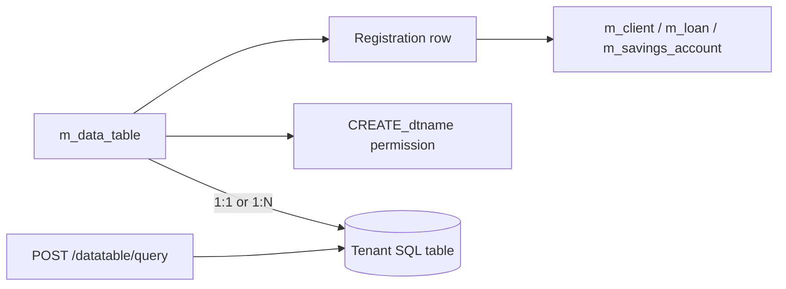

Apache Fineract lets tenants extend the core schema without forking by creating *datatables*: regular SQL tables, owned by the platform's tenant migration, that are *registered* against a core entity (client, loan, savings account, group, office). Once registered, the platform exposes generic CRUD endpoints under `/v1/datatables/{datatableName}/{apptableId}` so a front-end form can read and write rows without any custom code. The same resource also supports parameterised structured queries — the so-called *advanced query* — that let analysts ask "give me every row of `dt_kyc_documents` where `verified_on` is in the last 30 days" without writing SQL.

`DatatablesApiResource` is the single REST entry point. It lives in `fineract-provider/src/main/java/org/apache/fineract/infrastructure/dataqueries/api/DatatablesApiResource.java` and is mounted at `/fineract-provider/api/v1/datatables`. All write operations are routed through the standard `CommandWrapperBuilder` pipeline and respect maker-checker.

## Source file

| Resource | File |
| --- | --- |
| `DatatablesApiResource` | `fineract-provider/.../infrastructure/dataqueries/api/DatatablesApiResource.java` |
| `EntityDatatableChecksApiResource` | `fineract-provider/.../infrastructure/dataqueries/api/EntityDatatableChecksApiResource.java` (gates state transitions on datatable presence) |

## Model



Datatables come in two shapes. **One-to-one** tables have a `PRIMARY KEY` matching the `apptableId` (one extra row per core record). **One-to-many** tables have their own autoincrement primary key and reference the apptable through a foreign key (zero or more rows per core record). The same resource supports both: `PUT /{datatable}/{apptableId}` is the 1-to-1 update, `PUT /{datatable}/{apptableId}/{datatableId}` is the 1-to-many update.

## Endpoint table

| Verb | Path | Purpose |
| --- | --- | --- |
| GET | `/v1/datatables` | List registered datatables (filter by `apptable`). |
| GET | `/v1/datatables/{datatable}` | Fetch the datatable's column metadata. |
| POST | `/v1/datatables` | Create a new datatable and its columns. |
| PUT | `/v1/datatables/{datatable}` | Add/drop/change columns. |
| DELETE | `/v1/datatables/{datatable}` | Drop the table entirely. |
| POST | `/v1/datatables/register/{datatable}/{apptable}` | Register an existing table against an apptable. |
| POST | `/v1/datatables/deregister/{datatable}` | Remove the registration without dropping the table. |
| GET | `/v1/datatables/{datatable}/query` | Parameterised structured query (GET — query params drive the filter). |
| POST | `/v1/datatables/{datatable}/query` | Advanced query with paging, sorting and a JSON filter envelope. |
| GET | `/v1/datatables/{datatable}/{apptableId}` | Fetch the row(s) attached to one core record. |
| GET | `/v1/datatables/{datatable}/{apptableId}/{datatableId}` | One-to-many row by id. |
| POST | `/v1/datatables/{datatable}/{apptableId}` | Insert a row attached to a core record. |
| PUT | `/v1/datatables/{datatable}/{apptableId}` | Update one-to-one row. |
| PUT | `/v1/datatables/{datatable}/{apptableId}/{datatableId}` | Update one-to-many row. |
| DELETE | `/v1/datatables/{datatable}/{apptableId}` | Delete every row attached to a core record. |
| DELETE | `/v1/datatables/{datatable}/{apptableId}/{datatableId}` | Delete one row of a one-to-many table. |

## Create a datatable

### Example: KYC documents (one-to-many on `m_client`)

```http
POST /fineract-provider/api/v1/datatables
```

```json
{
  "datatableName": "kyc_documents",
  "apptableName": "m_client",
  "multiRow": true,
  "columns": [
    { "name": "document_type", "type": "Dropdown", "code": "Identity Document Type", "mandatory": true },
    { "name": "document_number", "type": "String", "length": 80, "mandatory": true },
    { "name": "issued_on", "type": "Date" },
    { "name": "verified_on", "type": "Date" },
    { "name": "verified_by", "type": "String", "length": 80 }
  ]
}
```

The supported `type` values are: `Boolean`, `Date`, `DateTime`, `Decimal`, `Dropdown`, `Number`, `String`, `Text`. A `Dropdown` column also needs `code` — the *name* of an existing `Code` (see `CodesApiResource`); Fineract then stores the chosen `code_value_id` rather than free text.

Behind the scenes the call:

1. Generates a `CREATE TABLE` DDL and runs it against the tenant database (the table is named `dt_kyc_documents`).
2. Inserts a row into `x_registered_table` with `application_table_name = m_client`.
3. Auto-creates the three permission codes `CREATE_kyc_documents`, `UPDATE_kyc_documents` and `DELETE_kyc_documents`.

## CRUD on rows

### Example: insert a KYC row

```http
POST /fineract-provider/api/v1/datatables/kyc_documents/411
```

```json
{
  "document_type_cv": 17,
  "document_number": "ID-99812345",
  "issued_on": "10 January 2019",
  "verified_on": "12 May 2024",
  "verified_by": "amelia.harris",
  "dateFormat": "dd MMMM yyyy",
  "locale": "en"
}
```

For a `Dropdown` column named `document_type`, the JSON key is `document_type_cv` and the value is the `m_code_value.id` chosen from the code attached at registration time.

### Example: update a one-to-many row

```http
PUT /fineract-provider/api/v1/datatables/kyc_documents/411/8
```

```json
{ "verified_on": "13 May 2024", "verified_by": "michel.ndege", "dateFormat": "dd MMMM yyyy", "locale": "en" }
```

`411` is the client id, `8` is the row id within `dt_kyc_documents`.

### Example: fetch all rows for one client

```http
GET /fineract-provider/api/v1/datatables/kyc_documents/411
```

Response (one-to-many returns an array; one-to-one returns a single object):

```json
{
  "columnHeaders": [
    { "columnName": "client_id", "columnType": "BIGINT" },
    { "columnName": "id", "columnType": "BIGINT" },
    { "columnName": "document_type_cv", "columnType": "INT" },
    { "columnName": "document_number", "columnType": "VARCHAR" },
    { "columnName": "issued_on", "columnType": "DATE" },
    { "columnName": "verified_on", "columnType": "DATE" },
    { "columnName": "verified_by", "columnType": "VARCHAR" }
  ],
  "data": [
    { "row": ["411", "8", "17", "ID-99812345", "2019-01-10", "2024-05-13", "michel.ndege"] }
  ]
}
```

## Advanced query

`POST /v1/datatables/{datatable}/query` runs a structured filter against the datatable using a JSON DSL. Columns are referenced by name; operators are `eq`, `neq`, `gt`, `gte`, `lt`, `lte`, `in`, `nin`, `like`, `between`. The endpoint paginates via `page` and `size` and supports multi-column sort.

### Example: rows verified in the last 30 days

```http
POST /fineract-provider/api/v1/datatables/kyc_documents/query
```

```json
{
  "request": {
    "queryConditions": [
      { "columnName": "verified_on", "operator": "between",
        "value": ["13 April 2024", "13 May 2024"] }
    ],
    "resultColumns": ["client_id", "document_type_cv", "document_number", "verified_on", "verified_by"],
    "dateFormat": "dd MMMM yyyy",
    "locale": "en"
  },
  "page": 0,
  "size": 100,
  "sorts": [ { "property": "verified_on", "direction": "DESC" } ]
}
```

Response:

```json
{
  "totalElements": 47,
  "content": [
    { "client_id": 411, "document_type_cv": 17, "document_number": "ID-99812345",
      "verified_on": [2024,5,13], "verified_by": "michel.ndege" }
  ]
}
```

### Example: GET query for one-shot integrations

```http
GET /fineract-provider/api/v1/datatables/kyc_documents/query?columnFilter=verified_by&valueFilter=michel.ndege&resultColumns=document_number,verified_on
```

The GET variant is the lightweight wrapper for callers that just need an `=`-filter on one column — it does not support paging or sorting.

## Register an existing table

If you have already DDL'd the table outside Fineract:

```http
POST /fineract-provider/api/v1/datatables/register/legacy_kyc/m_client
```

```json
{ "category": 100 }
```

The body's `category` controls which of the four canonical visibility groups the table belongs to (used by the UI to decide which tab the table appears under). The endpoint:

1. Validates the table exists.
2. Inserts the `x_registered_table` row.
3. Creates the three permission codes.

Conversely, `POST /v1/datatables/deregister/legacy_kyc` removes the registration row without dropping the table.

## Relationship to `EntityDatatableChecks`

A sibling resource, `EntityDatatableChecksApiResource`, lets you gate a state transition on a datatable having at least one row. Typical example: "a client cannot be activated unless `dt_kyc_documents` has at least one row." That resource owns the rules; the datatable resource owns the data.

```mermaid
flowchart LR
  Activate[POST /clients/{id}?command=activate] --> Check[EntityDatatableCheck]
  Check -->|row count > 0| OK[allow]
  Check -->|row count = 0| Block[400 datatable.entry.required]
  Datatable[dt_kyc_documents] -. counted .-> Check
```

## Common pitfalls

<AccordionGroup>
  <Accordion title="Created the datatable but CRUD returns 403">
  The three permission codes `CREATE_<name>`, `UPDATE_<name>` and `DELETE_<name>` are auto-created but not attached to any role. Bind them via `PUT /v1/roles/{id}/permissions`.
  </Accordion>
  <Accordion title="Dropdown value not stored">
  Datatable dropdown columns expect the suffixed JSON key, e.g. `document_type_cv` not `document_type`. The unsuffixed value is silently ignored.
  </Accordion>
  <Accordion title="Advanced query returns columns I didn't ask for">
  `resultColumns` is a projection hint, not a strict whitelist — the apptable foreign-key column is always included for join-back. To strip it, post-process the result.
  </Accordion>
  <Accordion title="Cannot drop a datatable">
  Tables referenced by an `EntityDatatableCheck` row cannot be deleted. Remove the check first via `DELETE /v1/entityDatatableChecks/{id}`.
  </Accordion>
</AccordionGroup>

## See also

<CardGroup cols={2}>
  <Card title="Datatable model" icon="table" href="/core/data-queries">Storage layout and migrations.</Card>
  <Card title="Entity datatable checks" icon="shield-check" href="/core/data-queries">State-transition gating.</Card>
  <Card title="Reports API" icon="chart-line" href="/api/reports-api">Sibling analytics surface.</Card>
  <Card title="Codes & values" icon="list" href="/api/codes-and-reference-api">For Dropdown columns.</Card>
</CardGroup>
