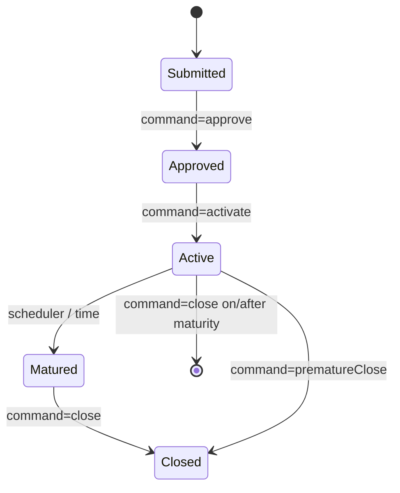

Apache Fineract treats fixed-term and recurring deposits as two specialized
flavors of the savings account model. They reuse the savings transaction
machinery but layer on deposit-specific concerns: a contracted term, a maturity
amount calculation, premature-close penalties, recurring deposit installments,
and configurable post-maturity instructions (transfer, renew, or close).

The two resources are mounted at `/v1/fixeddepositaccounts` and
`/v1/recurringdepositaccounts` and check the `FIXEDDEPOSITACCOUNT` and
`RECURRINGDEPOSITACCOUNT` permission names respectively.

## Source files

| Concern | File |
| --- | --- |
| Fixed deposit accounts | `fineract-provider/src/main/java/org/apache/fineract/portfolio/savings/api/FixedDepositAccountsApiResource.java` |
| Recurring deposit accounts | `fineract-provider/src/main/java/org/apache/fineract/portfolio/savings/api/RecurringDepositAccountsApiResource.java` |

<Info>
Product templates for both account types live under
`/v1/fixeddepositproducts` and `/v1/recurringdepositproducts`. The chart of
interest slabs (`chartId`) used by deposit products is managed via
`/v1/interestratecharts`.
</Info>

## Endpoint catalog — fixed deposits

| Verb | Path | `command` | Permission |
| --- | --- | --- | --- |
| `GET` | `/v1/fixeddepositaccounts/template` | – | `READ_FIXEDDEPOSITACCOUNT` |
| `GET` | `/v1/fixeddepositaccounts` | – | `READ_FIXEDDEPOSITACCOUNT` |
| `GET` | `/v1/fixeddepositaccounts/{accountId}` | – | `READ_FIXEDDEPOSITACCOUNT` |
| `POST` | `/v1/fixeddepositaccounts` | – | `CREATE_FIXEDDEPOSITACCOUNT` |
| `PUT` | `/v1/fixeddepositaccounts/{accountId}` | – | `UPDATE_FIXEDDEPOSITACCOUNT` |
| `DELETE` | `/v1/fixeddepositaccounts/{accountId}` | – | `DELETE_FIXEDDEPOSITACCOUNT` |
| `POST` | `/v1/fixeddepositaccounts/{accountId}` | `approve` | `APPROVE_FIXEDDEPOSITACCOUNT` |
| `POST` | `/v1/fixeddepositaccounts/{accountId}` | `undoApproval` | `APPROVALUNDO_FIXEDDEPOSITACCOUNT` |
| `POST` | `/v1/fixeddepositaccounts/{accountId}` | `reject` | `REJECT_FIXEDDEPOSITACCOUNT` |
| `POST` | `/v1/fixeddepositaccounts/{accountId}` | `withdrawnByApplicant` | `WITHDRAW_FIXEDDEPOSITACCOUNT` |
| `POST` | `/v1/fixeddepositaccounts/{accountId}` | `activate` | `ACTIVATE_FIXEDDEPOSITACCOUNT` |
| `POST` | `/v1/fixeddepositaccounts/{accountId}` | `close` | `CLOSE_FIXEDDEPOSITACCOUNT` |
| `POST` | `/v1/fixeddepositaccounts/{accountId}` | `prematureClose` | `PREMATURECLOSE_FIXEDDEPOSITACCOUNT` |
| `POST` | `/v1/fixeddepositaccounts/{accountId}` | `calculatePrematureAmount` | `CALCULATEPREMATUREAMOUNT_FIXEDDEPOSITACCOUNT` |
| `POST` | `/v1/fixeddepositaccounts/{accountId}` | `calculateInterest` | `CALCULATEINTEREST_FIXEDDEPOSITACCOUNT` |
| `POST` | `/v1/fixeddepositaccounts/{accountId}` | `postInterest` | `POSTINTEREST_FIXEDDEPOSITACCOUNT` |
| `POST` | `/v1/fixeddepositaccounts/{accountId}/transactions` | `deposit` / `withdrawal` | savings permissions reused |

## Endpoint catalog — recurring deposits

| Verb | Path | `command` | Permission |
| --- | --- | --- | --- |
| `GET` | `/v1/recurringdepositaccounts/template` | – | `READ_RECURRINGDEPOSITACCOUNT` |
| `GET` | `/v1/recurringdepositaccounts` | – | `READ_RECURRINGDEPOSITACCOUNT` |
| `GET` | `/v1/recurringdepositaccounts/{accountId}` | – | `READ_RECURRINGDEPOSITACCOUNT` |
| `POST` | `/v1/recurringdepositaccounts` | – | `CREATE_RECURRINGDEPOSITACCOUNT` |
| `PUT` | `/v1/recurringdepositaccounts/{accountId}` | – | `UPDATE_RECURRINGDEPOSITACCOUNT` |
| `DELETE` | `/v1/recurringdepositaccounts/{accountId}` | – | `DELETE_RECURRINGDEPOSITACCOUNT` |
| `POST` | `/v1/recurringdepositaccounts/{accountId}` | `approve` / `undoApproval` | `APPROVE_RECURRINGDEPOSITACCOUNT` |
| `POST` | `/v1/recurringdepositaccounts/{accountId}` | `activate` | `ACTIVATE_RECURRINGDEPOSITACCOUNT` |
| `POST` | `/v1/recurringdepositaccounts/{accountId}` | `reject` / `withdrawnByApplicant` | `REJECT_RECURRINGDEPOSITACCOUNT` |
| `POST` | `/v1/recurringdepositaccounts/{accountId}` | `close` | `CLOSE_RECURRINGDEPOSITACCOUNT` |
| `POST` | `/v1/recurringdepositaccounts/{accountId}` | `prematureClose` | `PREMATURECLOSE_RECURRINGDEPOSITACCOUNT` |
| `POST` | `/v1/recurringdepositaccounts/{accountId}` | `calculatePrematureAmount` | `CALCULATEPREMATUREAMOUNT_RECURRINGDEPOSITACCOUNT` |
| `POST` | `/v1/recurringdepositaccounts/{accountId}/transactions` | `deposit` / `withdrawal` | savings permissions |

## Opening a fixed deposit

<CodeGroup>

```json POST /v1/fixeddepositaccounts
{
  "clientId": 1,
  "productId": 1,
  "locale": "en",
  "dateFormat": "dd MMMM yyyy",
  "submittedOnDate": "01 March 2025",
  "depositAmount": "10000",
  "depositPeriod": 12,
  "depositPeriodFrequencyId": 2,
  "interestCompoundingPeriodType": 4,
  "interestPostingPeriodType": 4,
  "interestCalculationType": 1,
  "interestCalculationDaysInYearType": 365
}
```

```json POST /v1/recurringdepositaccounts
{
  "clientId": 1,
  "productId": 2,
  "locale": "en",
  "dateFormat": "dd MMMM yyyy",
  "submittedOnDate": "01 March 2025",
  "mandatoryRecommendedDepositAmount": "500",
  "depositPeriod": 24,
  "depositPeriodFrequencyId": 2,
  "recurringFrequency": 1,
  "recurringFrequencyType": 2,
  "expectedFirstDepositOnDate": "10 March 2025",
  "interestCompoundingPeriodType": 4,
  "interestPostingPeriodType": 4,
  "interestCalculationType": 1,
  "interestCalculationDaysInYearType": 365
}
```

</CodeGroup>

## Maturity instructions

Both account types accept a `closedOnDate` and a `onAccountClosureId` selector
when closing on or after the maturity date:

| `onAccountClosureId` | Meaning |
| --- | --- |
| `100` | `withdraw_deposit` — pay out and close |
| `200` | `transfer_to_savings` — sweep into a linked savings account |
| `300` | `reinvest` (fixed) / `transfer_to_savings` (recurring) — renew at maturity rate |

```json POST /v1/fixeddepositaccounts/{accountId}?command=close
{
  "closedOnDate": "01 March 2026",
  "onAccountClosureId": 200,
  "toSavingsAccountId": 14,
  "transferDescription": "Maturity sweep",
  "locale": "en",
  "dateFormat": "dd MMMM yyyy"
}
```

## Premature close

<CodeGroup>

```json POST .../{accountId}?command=calculatePrematureAmount
{
  "closedOnDate": "15 September 2025",
  "locale": "en",
  "dateFormat": "dd MMMM yyyy"
}
```

```json POST .../{accountId}?command=prematureClose
{
  "closedOnDate": "15 September 2025",
  "onAccountClosureId": 100,
  "note": "Customer requested early withdrawal",
  "locale": "en",
  "dateFormat": "dd MMMM yyyy"
}
```

</CodeGroup>

The first call returns the maturity figure adjusted for the premature-close
interest rate chart; the second actually performs the closure.

## Example response

```json
{
  "officeId": 1,
  "clientId": 1,
  "savingsId": 22,
  "resourceId": 22,
  "changes": {
    "status": {
      "id": 300,
      "code": "savingsAccountStatusType.active",
      "value": "Active",
      "active": true
    },
    "activatedOnDate": [2025, 3, 5]
  }
}
```

## Recurring deposit lifecycle



<Warning>
Recurring deposit installments are tracked via the standard
`POST /v1/recurringdepositaccounts/{accountId}/transactions?command=deposit`
flow. The `Update Deposit Accounts Maturity details` scheduled job is what
flips an account into the `Matured` status; until that runs, the account stays
`Active` even past its maturity date.
</Warning>

## Charts of interest rates

Both deposit product types reference an interest-rate chart (a `chartId`).
The chart defines slabs — by tenor, amount band, and optionally
demographic — that determine the contracted rate. Charts are managed under
`/v1/interestratecharts` and chart slabs under
`/v1/interestratecharts/{chartId}/chartslabs`.

```json POST /v1/interestratecharts/{chartId}/chartslabs
{
  "description": "12-23 months, 10k-50k",
  "periodType": 2,
  "fromPeriod": 12,
  "toPeriod": 23,
  "amountRangeFrom": 10000,
  "amountRangeTo": 50000,
  "annualInterestRate": 6.25,
  "currencyCode": "USD",
  "locale": "en"
}
```

<Tip>
Use the `template` endpoints
(`/v1/fixeddepositproducts/template`, `/v1/recurringdepositproducts/template`)
to enumerate valid `periodType` and `currencyCode` values before drafting a
chart slab.
</Tip>

## Transaction examples

Once the account is `Active`, deposits and withdrawals flow through the same
endpoints exposed by the savings resource family:

```json POST /v1/recurringdepositaccounts/{accountId}/transactions?command=deposit
{
  "transactionDate": "10 March 2025",
  "transactionAmount": "500",
  "paymentTypeId": 1,
  "locale": "en",
  "dateFormat": "dd MMMM yyyy"
}
```

For fixed deposits the initial deposit is created automatically when the
account is activated, but additional top-ups are blocked unless the product
sets `allowFurtherDepositsBeyondMatured` or similar feature flags.

## Charges on a deposit account

| Verb | Path | Purpose |
| --- | --- | --- |
| `GET` | `/v1/fixeddepositaccounts/{accountId}/charges` | List attached charges |
| `POST` | `/v1/fixeddepositaccounts/{accountId}/charges` | Attach a charge |
| `POST` | `/v1/recurringdepositaccounts/{accountId}/charges` | Attach a charge |
| `POST` | `/v1/fixeddepositaccounts/{accountId}/charges/{id}?command=waive` | Waive a charge |

## See also

<CardGroup cols={2}>
  <Card title="Savings API" href="/api/savings-api">
    The base savings transaction machinery that deposits build on.
  </Card>
  <Card title="Scheduler" href="/api/scheduler-jobs-api">
    Maturity, interest posting, and renewal jobs for deposits.
  </Card>
</CardGroup>
