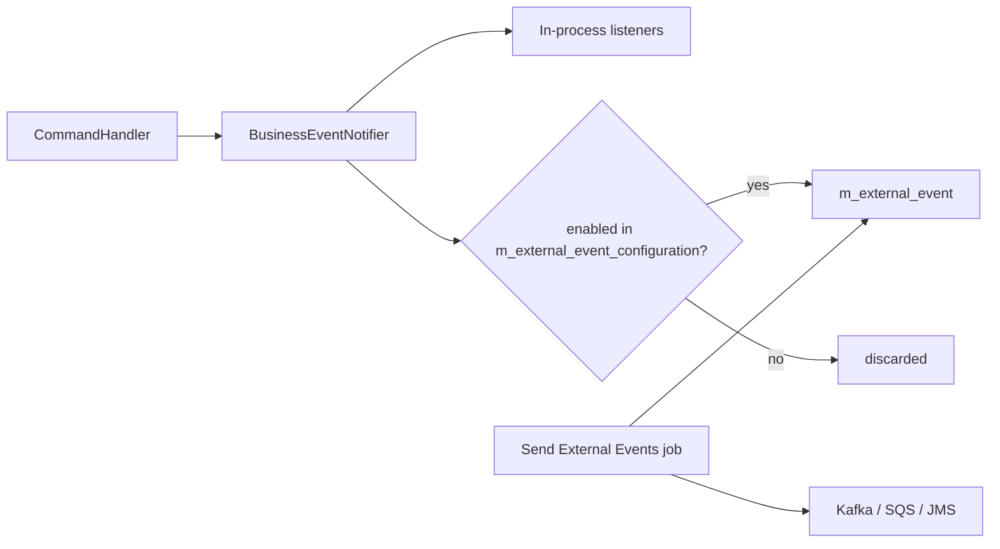
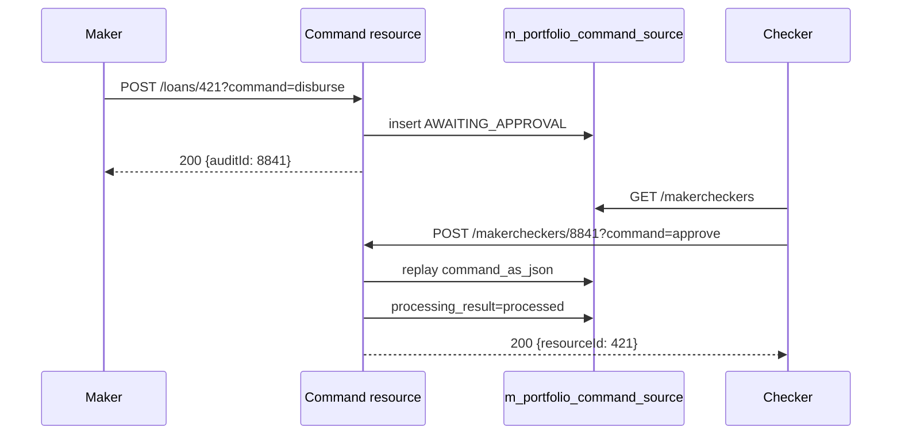

Apache Fineract publishes every business decision as a domain event. A subset of those events is also serialised onto the *external events* outbox — a transactional store-and-forward queue (`m_external_event`) that downstream brokers (Kafka, Postgres LISTEN/NOTIFY, message bus) drain via the `Send External Events` job. Operators control which event types make it to the outbox via `ExternalEventConfigurationApiResource`; integrators inspect the recent outbox contents via the internal read endpoint; and auditors trace every command back to its initiator via `AuditsApiResource` and `MakercheckersApiResource`.

This page collects those four resources. All endpoints are mounted under `/fineract-provider/api/v1/...` or `/fineract-core/api/v1/...`.

## Source files

| Resource | File |
| --- | --- |
| `ExternalEventConfigurationApiResource` | `fineract-core/.../infrastructure/event/external/api/ExternalEventConfigurationApiResource.java` |
| `InternalExternalEventsApiResource` | `fineract-core/.../infrastructure/event/external/api/InternalExternalEventsApiResource.java` |
| `AuditsApiResource` | `fineract-provider/.../commands/api/AuditsApiResource.java` |
| `MakercheckersApiResource` | `fineract-provider/.../commands/api/MakercheckersApiResource.java` |

## Event production pipeline



The configuration table is consulted on every event emission — there is no application-restart penalty for flipping a flag.

## `ExternalEventConfigurationApiResource` — `/v1/externalevents/configuration`

This resource exposes a single named bitmap: every event type in the codebase has a row in `m_external_event_configuration` with an `enabled` boolean.

| Verb | Path | Purpose |
| --- | --- | --- |
| GET | `/v1/externalevents/configuration` | Return the full event catalogue with enabled state. |
| PUT | `/v1/externalevents/configuration` | Bulk-update enabled state. |

### Example: list configuration

```http
GET /fineract-core/api/v1/externalevents/configuration
```

Response (abridged):

```json
{
  "externalEventConfiguration": [
    { "type": "LoanCreatedBusinessEvent",         "enabled": true  },
    { "type": "LoanApprovedBusinessEvent",        "enabled": true  },
    { "type": "LoanDisbursedBusinessEvent",       "enabled": true  },
    { "type": "LoanWrittenOffBusinessEvent",      "enabled": false },
    { "type": "SavingsApprovedBusinessEvent",     "enabled": false }
  ]
}
```

### Example: enable disbursal and write-off events

```http
PUT /fineract-core/api/v1/externalevents/configuration
```

```json
{
  "externalEventConfigurations": {
    "LoanDisbursedBusinessEvent": true,
    "LoanWrittenOffBusinessEvent": true,
    "LoanRepaymentBusinessEvent": true,
    "LoanRejectedBusinessEvent": false
  }
}
```

Each key flips one row. Unmentioned event types keep their previous state.

## `InternalExternalEventsApiResource` — `/v1/internal/externalevents`

A read-only window onto the outbox, intended for integration tests and debugging. It is gated by `FineractProperties.modeProperties` — production builds do not register this resource.

| Verb | Path | Purpose |
| --- | --- | --- |
| GET | `/v1/internal/externalevents` | Return recent outbox events. |
| DELETE | `/v1/internal/externalevents` | Truncate the outbox (test only). |

### Example: peek at the outbox

```http
GET /fineract-core/api/v1/internal/externalevents
```

Response:

```json
[
  { "id": 1014, "type": "LoanDisbursedBusinessEvent", "createdAt": "2024-05-12T09:24:01Z",
    "businessDate": [2024,5,12], "category": "LOAN", "data": { "loanId": 421 } },
  { "id": 1015, "type": "LoanRepaymentBusinessEvent", "createdAt": "2024-05-12T10:01:14Z",
    "businessDate": [2024,5,12], "category": "LOAN", "data": { "loanId": 421, "amount": "500.00" } }
]
```

### Example: truncate (test-only)

```http
DELETE /fineract-core/api/v1/internal/externalevents
```

The outbox is wiped. The send job ignores already-acked rows so the operation is safe in development.

<Note>
In production, the recommended way to inspect outbox contents is by reading the `m_external_event` table directly with a read-only credential — the internal endpoint is deliberately disabled.
</Note>

## `AuditsApiResource` — `/v1/audits`

Every command runs through `m_portfolio_command_source`. `AuditsApiResource` is the paged search over that table — what we display in the UI as "Audit Trail".

| Verb | Path | Purpose |
| --- | --- | --- |
| GET | `/v1/audits` | Paged search. Query: `actionName`, `entityName`, `resourceId`, `makerId`, `checkerId`, `makerDateTimeFrom`, `makerDateTimeTo`, `processingResult`, `paged`, `offset`, `limit`. |
| GET | `/v1/audits/{auditId}` | Full detail of one audit row including the `command_as_json` payload. |
| GET | `/v1/audits/searchtemplate` | Dropdown values (action names, entity names, processing result codes) for the search UI. |

### Example: who disbursed loan 421?

```http
GET /fineract-provider/api/v1/audits?entityName=LOAN&actionName=DISBURSE&resourceId=421&paged=true&limit=20
```

Response (abridged):

```json
{
  "totalFilteredRecords": 1,
  "pageItems": [
    {
      "id": 8841,
      "actionName": "DISBURSE",
      "entityName": "LOAN",
      "resourceId": 421,
      "maker": "amelia.harris",
      "madeOnDate": "2024-05-12T09:23:55Z",
      "processingResult": "processed"
    }
  ]
}
```

### Example: full payload by audit id

```http
GET /fineract-provider/api/v1/audits/8841
```

Response includes the original `commandAsJson` so an operator can replay the exact body that was submitted.

## `MakercheckersApiResource` — `/v1/makercheckers`

Same backing table as `AuditsApiResource`, scoped to rows whose `processing_result = AWAITING_APPROVAL`. This is the "approvals inbox".

| Verb | Path | Purpose |
| --- | --- | --- |
| GET | `/v1/makercheckers` | List awaiting-approval entries, same query params as `/audits`. |
| GET | `/v1/makercheckers/searchtemplate` | Dropdown values. |
| POST | `/v1/makercheckers/{auditId}?command=approve\|reject` | Act on an entry. |
| DELETE | `/v1/makercheckers/{auditId}` | Withdraw / delete an entry. |

### Example: approve a queued disbursal

```http
POST /fineract-provider/api/v1/makercheckers/8841?command=approve
```

```json
{}
```

The handler reloads `command_as_json`, executes the original command, and writes back `processing_result = processed`. The checker is recorded in `checker_id` and `checked_on_date`.

### Example: reject

```http
POST /fineract-provider/api/v1/makercheckers/8841?command=reject
```

```json
{}
```

Status flips to `rejected`; no domain side-effect.

### Example: withdraw an entry

```http
DELETE /fineract-provider/api/v1/makercheckers/8841
```

Only the original maker (or an `ADMIN` role) can delete an awaiting entry. The row is removed entirely — the audit chain is broken intentionally to make "withdraw" feel distinct from "reject".

## Audit + maker-checker flow



## Common pitfalls

<AccordionGroup>
  <Accordion title="External outbox stays empty even after PUT /configuration">
  The event type might be a synthetic alias. Confirm with `GET /externalevents/configuration` that the exact type name is present. Some events (e.g. `BusinessDateChangedBusinessEvent`) are emitted only by background jobs — they will not appear until the next nightly run.
  </Accordion>
  <Accordion title="Audit search returns nothing for a known disbursal">
  The `entityName` filter is case-sensitive and uses the entity name as registered in `CommandWrapperBuilder` (e.g. `LOAN`, `SAVINGSACCOUNT`, `CLIENT`). Drop the filter or use `searchtemplate` to find the exact spelling.
  </Accordion>
  <Accordion title="Maker-checker DELETE returns 403">
  Only the original maker or a user with `ADMIN` role can withdraw a queued entry. A different checker must use the `reject` command instead.
  </Accordion>
</AccordionGroup>

## See also

<CardGroup cols={2}>
  <Card title="External events" icon="bolt" href="/events/external-events-pipeline">Outbox semantics and downstream consumers.</Card>
  <Card title="Command source pipeline" icon="diagram-project" href="/commands/command-source">From REST resource to command handler.</Card>
  <Card title="Maker-checker" icon="user-check" href="/commands/makercheckers">Per-permission flag and approvals UI.</Card>
  <Card title="Audit trail" icon="clipboard-list" href="/commands/audits">What we record and what we don't.</Card>
</CardGroup>
