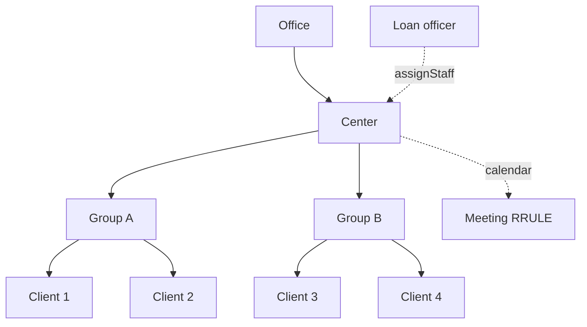

Apache Fineract organizes clients into a two-level hierarchy that supports
group lending and microfinance field operations. A **group** is a collection
of clients that can co-sign loans and share a meeting calendar; a **center**
is a higher-level aggregation of groups that meets together, typically
mirroring a loan officer's territory. `GroupsApiResource` and
`CentersApiResource` expose the same command pattern as the clients resource —
state transitions through `?command=` — together with meeting management and
transfer flows.

Both resources are mounted under `/v1/groups` and `/v1/centers` and check the
`GROUP` and `CENTER` permission names.

## Source files

| Concern | File |
| --- | --- |
| Groups | `fineract-provider/src/main/java/org/apache/fineract/portfolio/group/api/GroupsApiResource.java` |
| Centers | `fineract-provider/src/main/java/org/apache/fineract/portfolio/group/api/CentersApiResource.java` |
| Group accounts roll-up | `GroupSummaryApiResource.java` |

## Endpoint catalog — groups

| Verb | Path | `command` | Permission |
| --- | --- | --- | --- |
| `GET` | `/v1/groups/template` | – | `READ_GROUP` |
| `GET` | `/v1/groups` | – | `READ_GROUP` |
| `GET` | `/v1/groups/{groupId}` | – | `READ_GROUP` |
| `GET` | `/v1/groups/{groupId}/accounts` | – | `READ_GROUP` |
| `POST` | `/v1/groups` | – | `CREATE_GROUP` |
| `PUT` | `/v1/groups/{groupId}` | – | `UPDATE_GROUP` |
| `DELETE` | `/v1/groups/{groupId}` | – | `DELETE_GROUP` |
| `POST` | `/v1/groups/{groupId}` | `activate` | `ACTIVATE_GROUP` |
| `POST` | `/v1/groups/{groupId}` | `close` | `CLOSE_GROUP` |
| `POST` | `/v1/groups/{groupId}` | `associateClients` | `ASSOCIATECLIENTS_GROUP` |
| `POST` | `/v1/groups/{groupId}` | `disassociateClients` | `DISASSOCIATECLIENTS_GROUP` |
| `POST` | `/v1/groups/{groupId}` | `transferClients` | `TRANSFERCLIENTS_GROUP` |
| `POST` | `/v1/groups/{groupId}` | `assignStaff` | `ASSIGNSTAFF_GROUP` |
| `POST` | `/v1/groups/{groupId}` | `unassignStaff` | `UNASSIGNSTAFF_GROUP` |
| `POST` | `/v1/groups/{groupId}` | `assignRole` | `ASSIGNROLE_GROUP` |
| `POST` | `/v1/groups/{groupId}` | `unassignRole` | `UNASSIGNROLE_GROUP` |
| `POST` | `/v1/groups/{groupId}` | `saveCollectionSheet` | `SAVECOLLECTIONSHEET_GROUP` |
| `POST` | `/v1/groups/{groupId}` | `proposeTransfer` | `PROPOSETRANSFER_GROUP` |
| `POST` | `/v1/groups/{groupId}` | `acceptTransfer` | `ACCEPTTRANSFER_GROUP` |
| `POST` | `/v1/groups/{groupId}` | `proposeAndAcceptTransfer` | `PROPOSEANDACCEPTTRANSFER_GROUP` |
| `POST` | `/v1/groups/{groupId}` | `withdrawTransfer` | `WITHDRAWTRANSFER_GROUP` |

## Endpoint catalog — centers

| Verb | Path | `command` | Permission |
| --- | --- | --- | --- |
| `GET` | `/v1/centers/template` | – | `READ_CENTER` |
| `GET` | `/v1/centers` | – | `READ_CENTER` |
| `GET` | `/v1/centers/{centerId}` | – | `READ_CENTER` |
| `GET` | `/v1/centers/{centerId}/accounts` | – | `READ_CENTER` |
| `POST` | `/v1/centers` | – | `CREATE_CENTER` |
| `PUT` | `/v1/centers/{centerId}` | – | `UPDATE_CENTER` |
| `DELETE` | `/v1/centers/{centerId}` | – | `DELETE_CENTER` |
| `POST` | `/v1/centers/{centerId}` | `activate` | `ACTIVATE_CENTER` |
| `POST` | `/v1/centers/{centerId}` | `close` | `CLOSE_CENTER` |
| `POST` | `/v1/centers/{centerId}` | `associateGroups` | `ASSOCIATEGROUPS_CENTER` |
| `POST` | `/v1/centers/{centerId}` | `disassociateGroups` | `DISASSOCIATEGROUPS_CENTER` |
| `POST` | `/v1/centers/{centerId}` | `saveCollectionSheet` | `SAVECOLLECTIONSHEET_CENTER` |
| `GET` | `/v1/centers/{centerId}/collectionsheet` | – | `READ_COLLECTIONSHEET` |

## Creating a group

<CodeGroup>

```json POST /v1/groups
{
  "officeId": 1,
  "name": "Bama Self-Help Group",
  "externalId": "GRP-0001",
  "active": false,
  "submittedOnDate": "01 February 2025",
  "clientMembers": [1, 2, 3],
  "dateFormat": "dd MMMM yyyy",
  "locale": "en"
}
```

```json POST /v1/groups/{groupId}?command=activate
{
  "activationDate": "05 February 2025",
  "dateFormat": "dd MMMM yyyy",
  "locale": "en"
}
```

</CodeGroup>

## Membership commands

```json POST /v1/groups/{groupId}?command=associateClients
{
  "clientMembers": [11, 12, 13]
}
```

```json POST /v1/groups/{groupId}?command=transferClients
{
  "clients": [11],
  "destinationGroupId": 4,
  "inheritDestinationGroupLoanOfficer": true
}
```

## Meeting management

Groups and centers both rely on the calendar module. Once the parent entity is
active, attach a meeting via the calendar resource:

```bash
POST /v1/groups/{groupId}/calendars
POST /v1/centers/{centerId}/calendars
```

Each call accepts a recurrence string (RRULE) and a start date, after which
the collection-sheet preview at
`GET /v1/centers/{centerId}/collectionsheet?meetingDate=…` aggregates every
loan and savings repayment due that day across the center's groups.

## Inter-office transfer

<Note>
Group transfers follow the same propose/accept handshake as clients, with a
shortcut `proposeAndAcceptTransfer` command for when both offices share a
common parent and the operator has rights at both ends.
</Note>

```json POST /v1/groups/{groupId}?command=proposeAndAcceptTransfer
{
  "destinationOfficeId": 5,
  "destinationGroupId": null,
  "staffId": 7,
  "note": "Consolidating field operations"
}
```

## Example response

```json
{
  "officeId": 1,
  "groupId": 21,
  "resourceId": 21,
  "changes": {
    "active": true,
    "activationDate": "05 February 2025",
    "locale": "en",
    "dateFormat": "dd MMMM yyyy"
  }
}
```

## Center hierarchy



## Collection sheet

The collection sheet is the daily worksheet a field officer prints for a
group or center meeting. It rolls up every due installment and pending charge.

```bash
GET /v1/centers/{centerId}/collectionsheet?meetingDate=05 February 2025
POST /v1/centers/{centerId}?command=saveCollectionSheet
```

The save command body carries the actual transactions captured at the meeting
and posts them as loan repayments, savings deposits, and charge payments in a
single command envelope.

<Tip>
Group-loan accounts created via the loans API with `"loanType": "group"` are
the primary reason centers and meetings exist — they unify scheduling, joint
liability, and collection sheets for the field officer.
</Tip>

## Group roles

A role assignment ties a client to a named responsibility within the group
(treasurer, president, secretary). The role identifiers come from the
`GroupRoles` code value.

```json POST /v1/groups/{groupId}?command=assignRole
{
  "clientId": 11,
  "role": 56
}
```

```json POST /v1/groups/{groupId}?command=unassignRole
{
  "role": 56
}
```

## Center activation example

```json POST /v1/centers
{
  "officeId": 1,
  "name": "Bama Center",
  "externalId": "CTR-001",
  "active": false,
  "submittedOnDate": "01 February 2025",
  "groupMembers": [21, 22],
  "dateFormat": "dd MMMM yyyy",
  "locale": "en"
}
```

```json POST /v1/centers/{centerId}?command=activate
{
  "activationDate": "05 February 2025",
  "dateFormat": "dd MMMM yyyy",
  "locale": "en"
}
```

## Closure constraints

Groups and centers can only close when every active product they carry has
been settled. Trying to close a group while it still has an active loan
account returns an error:

```json
{
  "developerMessage": "Group with identifier 21 cannot be closed because it has active loan or savings accounts.",
  "userMessageGlobalisationCode": "error.msg.group.has.active.loan.or.savings"
}
```

<Warning>
Closing a center with `?command=close` does not cascade to its member
groups. Disassociate or close each group first; otherwise the center will
fail validation.
</Warning>

## See also

<CardGroup cols={2}>
  <Card title="Clients API" href="/api/clients-api">
    The member clients referenced by `clientMembers`.
  </Card>
  <Card title="Loans API" href="/api/loans-api">
    Group loans and the GLIM model that builds on this hierarchy.
  </Card>
</CardGroup>
