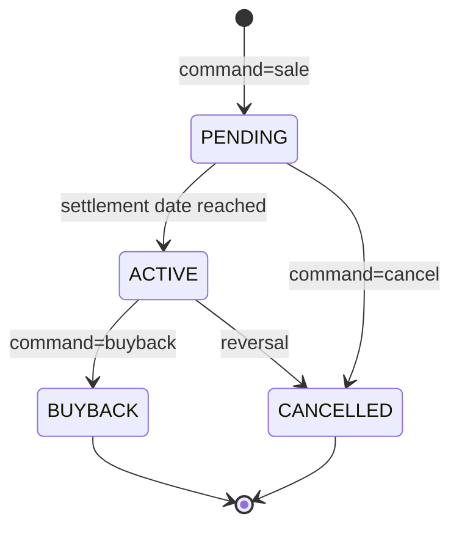
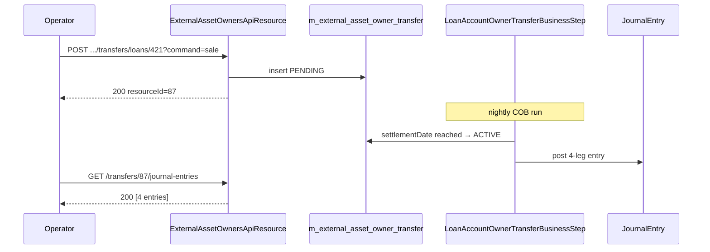

Apache Fineract's investor module lets a microfinance institution offload loans onto a third party — typically a fund manager or a securitisation vehicle — while continuing to service the loans operationally. The model is built around two entities: an `ExternalAssetOwner` (the buyer) and an `ExternalAssetOwnerTransfer` (one event in the lifecycle of a loan against that buyer). Transfers move through `PENDING → ACTIVE → BUYBACK/CANCELLED` and the corresponding `JournalEntry` rows recognise the cash leg and the receivable transfer in the GL.

`ExternalAssetOwnersApiResource` is the single REST entry point, mounted at `/fineract-provider/api/v1/external-asset-owners`. Writes are routed through `CommandWrapperBuilder`; the resource also exposes a paged search endpoint over the transfer history and a read-only journal-entry view per transfer or per owner.

## Source file

| Resource | File |
| --- | --- |
| `ExternalAssetOwnersApiResource` | `fineract-investor/.../investor/api/ExternalAssetOwnersApiResource.java` |
| `ExternalAssetOwnerLoanProductAttributesApiResource` | `fineract-investor/.../investor/api/ExternalAssetOwnerLoanProductAttributesApiResource.java` (per-product flags) |

## Transfer state machine



The state transition is performed by `LoanAccountOwnerTransferBusinessStep` during the loan COB job — the API call schedules the intent, COB makes it real. That means a `sale` POST returns immediately with a `PENDING` transfer; the row only flips to `ACTIVE` once the COB engine has processed the loan past `settlementDate`.

## Endpoint table

| Verb | Path | Purpose |
| --- | --- | --- |
| POST | `/v1/external-asset-owners` | Register a new owner identified by `externalId`. |
| GET | `/v1/external-asset-owners` | List all registered owners. |
| POST | `/v1/external-asset-owners/transfers/loans/{loanId}?command=sale\|buyback\|cancel` | Queue a transfer on the loan id. |
| POST | `/v1/external-asset-owners/transfers/loans/external-id/{loanExternalId}?command=...` | Same, addressed by loan external id. |
| POST | `/v1/external-asset-owners/transfers/{id}?command=buyback\|cancel` | Operate on an existing transfer. |
| POST | `/v1/external-asset-owners/transfers/external-id/{externalId}?command=...` | Same, by transfer external id. |
| GET | `/v1/external-asset-owners/transfers` | Paged list of transfers (filtered by loan id / external id / owner external id / status). |
| GET | `/v1/external-asset-owners/transfers/active-transfer` | Currently active transfer for a given loan. |
| GET | `/v1/external-asset-owners/transfers/{transferId}/journal-entries` | GL impact of a single transfer. |
| GET | `/v1/external-asset-owners/owners/external-id/{ownerExternalId}/journal-entries` | GL impact of all transfers under one owner. |
| POST | `/v1/external-asset-owners/search` | Paged search by free text, settlement date range or effective date range. |

## `POST /external-asset-owners` — register a buyer

```http
POST /fineract-provider/api/v1/external-asset-owners
```

```json
{ "externalId": "OWNER-FUND-A" }
```

The owner is a flat record. There is no name field — the `externalId` is the stable handle the GL and reporting layers join on. The response is the usual `CommandProcessingResult` with the new `resourceId`.

## `POST .../transfers/loans/{loanId}?command=sale` — sell a loan

```http
POST /fineract-provider/api/v1/external-asset-owners/transfers/loans/421?command=sale
```

```json
{
  "ownerExternalId": "OWNER-FUND-A",
  "transferExternalId": "TX-421-2024-05-12",
  "settlementDate": "13 May 2024",
  "purchasePriceRatio": "0.98",
  "dateFormat": "dd MMMM yyyy",
  "locale": "en"
}
```

What happens:

1. A `m_external_asset_owner_transfer` row is inserted with `status = PENDING`.
2. The transfer's `settlementDate` is checked against business date during loan COB; once reached, the `LoanAccountOwnerTransferBusinessStep` flips status to `ACTIVE`, writes the GL legs (debit cash, credit receivable) and snapshots the schedule.
3. `purchasePriceRatio` is multiplied by the loan's outstanding principal to compute the cash leg.

<Note>
Only one transfer can be `PENDING` or `ACTIVE` per loan at any given time. Calling `sale` again returns a validation error.
</Note>

## `POST .../transfers/loans/{loanId}?command=buyback` — buy back a loan

```http
POST /fineract-provider/api/v1/external-asset-owners/transfers/loans/421?command=buyback
```

```json
{
  "settlementDate": "01 August 2024",
  "transferExternalId": "TX-421-BUYBACK-1",
  "dateFormat": "dd MMMM yyyy",
  "locale": "en"
}
```

The previously-active transfer flips to `BUYBACK` and the next COB run posts the reversal GL entries. The loan returns to the originator's books for the residual outstanding.

## `POST .../transfers/loans/{loanId}?command=cancel` — cancel a pending transfer

```http
POST /fineract-provider/api/v1/external-asset-owners/transfers/loans/421?command=cancel
```

```json
{}
```

`cancel` is only valid while the transfer is `PENDING` (settlement has not yet occurred). It does not produce GL entries — the row simply transitions to `CANCELLED` and the loan is free to be sold again.

## `GET .../transfers` — paged list

Supports the following query params: `loanId`, `loanExternalId`, `transferExternalId`, `ownerExternalId`, `status`, `effectiveFrom`, `effectiveTo`, `offset`, `limit`.

```http
GET /fineract-provider/api/v1/external-asset-owners/transfers?ownerExternalId=OWNER-FUND-A&status=ACTIVE&limit=50
```

Response:

```json
{
  "totalFilteredRecords": 12,
  "pageItems": [
    {
      "transferId": 87,
      "transferExternalId": "TX-421-2024-05-12",
      "loanId": 421,
      "ownerExternalId": "OWNER-FUND-A",
      "status": "ACTIVE",
      "settlementDate": [2024, 5, 13],
      "effectiveFrom": [2024, 5, 13],
      "purchasePriceRatio": "0.98"
    }
  ]
}
```

## `GET .../transfers/{transferId}/journal-entries` — GL impact

The journal-entry endpoint returns the rows posted by the business step, scoped to the transfer.

```http
GET /fineract-provider/api/v1/external-asset-owners/transfers/87/journal-entries?offset=0&limit=50
```

Response (abridged):

```json
{
  "totalFilteredRecords": 4,
  "pageItems": [
    { "id": 9001, "glAccountId": 23, "glAccountName": "Loan receivable",  "amount": "10000.00", "entryType": "CREDIT", "transactionDate": [2024, 5, 13] },
    { "id": 9002, "glAccountId": 41, "glAccountName": "Cash",             "amount":  "9800.00", "entryType": "DEBIT",  "transactionDate": [2024, 5, 13] },
    { "id": 9003, "glAccountId": 67, "glAccountName": "Loss on sale",     "amount":   "200.00", "entryType": "DEBIT",  "transactionDate": [2024, 5, 13] },
    { "id": 9004, "glAccountId": 99, "glAccountName": "Owner asset clearing", "amount": "10000.00", "entryType": "DEBIT", "transactionDate": [2024, 5, 13] }
  ]
}
```

The cash leg amount is `outstandingPrincipal × purchasePriceRatio`; the difference against the principal lands on the gain/loss account configured on the loan product.

## `POST .../search` — paged structured search

```http
POST /fineract-provider/api/v1/external-asset-owners/search
```

```json
{
  "request": {
    "text": "FUND-A",
    "effectiveFrom": "01 January 2024",
    "effectiveTo":   "30 June 2024",
    "settlementFrom":"01 May 2024",
    "settlementTo":  "31 May 2024",
    "dateFormat": "dd MMMM yyyy",
    "locale": "en"
  },
  "page": 0,
  "size": 20,
  "sorts": [ { "property": "settlementDate", "direction": "DESC" } ]
}
```

This is the only POST search in the resource and uses the platform's `PagedRequest<T>` envelope so the front-end can both sort and filter in one round-trip.

## Per-product attributes

`ExternalAssetOwnerLoanProductAttributesApiResource` (mounted at `/v1/external-asset-owners/loan-products`) carries the per-product flags that decide whether a product is even eligible for externalization. There is one GET and one PUT.

```http
PUT /fineract-provider/api/v1/external-asset-owners/loan-products/{productId}
```

```json
{ "transferToExternalOwnerAllowed": true }
```

If the flag is `false`, a `sale` POST on any loan under that product returns a validation error.

## End-to-end timing



## Common pitfalls

<AccordionGroup>
  <Accordion title="Transfer stays PENDING for days">
  The COB engine has not advanced past `settlementDate`. Check `GET /v1/loans/oldest-cob-closed` — if the COB business date is behind the settlement date, the transfer cannot activate. Run a catch-up.
  </Accordion>
  <Accordion title="No journal entries for an ACTIVE transfer">
  The product likely has no GL accounts configured for "loss/gain on sale" or "owner asset clearing". Inspect `m_product_loan_charge_paid_by` and the GL mapping table.
  </Accordion>
  <Accordion title="`sale` rejected as forbidden">
  Either `transferToExternalOwnerAllowed` is false on the product, or there is already an active or pending transfer for the loan. Use `GET .../transfers/active-transfer?loanId=...` to inspect.
  </Accordion>
</AccordionGroup>

## See also

<CardGroup cols={2}>
  <Card title="Investor overview" icon="hand-holding-dollar" href="/investor/overview">Module architecture.</Card>
  <Card title="Transfer of a loan" icon="arrow-right-arrow-left" href="/investor/transfer-loan">Sale, buyback and cancel walkthrough.</Card>
  <Card title="Investor accounting" icon="scale-balanced" href="/investor/investor-accounting">GL legs in detail.</Card>
  <Card title="Investor COB step" icon="moon" href="/investor/investor-cob">How the business step closes transfers.</Card>
</CardGroup>
