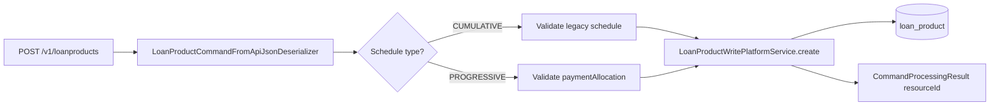

A loan product in Apache Fineract is the template that loan applications
inherit from. It captures the currency, repayment frequency defaults, interest
rules, accounting rules, charge attachments, and the long list of feature
toggles that govern how a `POST /v1/loans` document is interpreted. The
`LoanProductsApiResource` provides full CRUD over those templates, plus the
`?template=true` discovery endpoint that drives the product creation screen in
the reference UI.

The resource is mounted at `/v1/loanproducts` and uses the
`LOANPRODUCT` resource name for permission checks
(`READ_LOANPRODUCT`, `CREATE_LOANPRODUCT`, `UPDATE_LOANPRODUCT`,
`DELETE_LOANPRODUCT`).

## Source file

`fineract-provider/src/main/java/org/apache/fineract/portfolio/loanproduct/api/LoanProductsApiResource.java`

## Endpoint catalog

| Verb | Path | `command` | Permission |
| --- | --- | --- | --- |
| `POST` | `/v1/loanproducts` | – | `CREATE_LOANPRODUCT` |
| `GET` | `/v1/loanproducts` | – | `READ_LOANPRODUCT` |
| `GET` | `/v1/loanproducts/template` | – | `READ_LOANPRODUCT` |
| `GET` | `/v1/loanproducts/{productId}` | – | `READ_LOANPRODUCT` |
| `PUT` | `/v1/loanproducts/{productId}` | – | `UPDATE_LOANPRODUCT` |
| `GET` | `/v1/loanproducts/external-id/{externalProductId}` | – | `READ_LOANPRODUCT` |
| `PUT` | `/v1/loanproducts/external-id/{externalProductId}` | – | `UPDATE_LOANPRODUCT` |

<Info>
`GET /v1/loanproducts/template` returns the dropdowns required to draft a new
product: currencies, amortization types, interest methods, repayment strategies,
fund/charge/account options, and the list of allowed delinquency buckets.
</Info>

## Product creation payload

The shortest valid payload still has to fix the currency, the default amount,
interest setup, and a transaction processing strategy. The example below is a
classic flat-rate, declining-balance product that will accept individual loan
applications.

<CodeGroup>

```json POST /v1/loanproducts
{
  "name": "Personal Loan 12m",
  "shortName": "PL12",
  "currencyCode": "USD",
  "digitsAfterDecimal": 2,
  "inMultiplesOf": 0,
  "principal": 10000,
  "numberOfRepayments": 12,
  "repaymentEvery": 1,
  "repaymentFrequencyType": 2,
  "interestRatePerPeriod": 12,
  "interestRateFrequencyType": 3,
  "amortizationType": 1,
  "interestType": 0,
  "interestCalculationPeriodType": 1,
  "transactionProcessingStrategyCode": "mifos-standard-strategy",
  "daysInYearType": 365,
  "daysInMonthType": 30,
  "accountingRule": 1,
  "locale": "en"
}
```

```json POST /v1/loanproducts (multi-disburse)
{
  "name": "Construction Tranche",
  "shortName": "CONT",
  "currencyCode": "USD",
  "digitsAfterDecimal": 2,
  "principal": 50000,
  "numberOfRepayments": 24,
  "repaymentEvery": 1,
  "repaymentFrequencyType": 2,
  "interestRatePerPeriod": 18,
  "interestRateFrequencyType": 3,
  "amortizationType": 1,
  "interestType": 0,
  "interestCalculationPeriodType": 1,
  "transactionProcessingStrategyCode": "mifos-standard-strategy",
  "multiDisburseLoan": true,
  "maxTrancheCount": 4,
  "outstandingLoanBalance": 50000,
  "allowVariableInstallments": false,
  "accountingRule": 3,
  "fundSourceAccountId": 12,
  "loanPortfolioAccountId": 14,
  "interestOnLoanAccountId": 35,
  "incomeFromFeeAccountId": 36,
  "incomeFromPenaltyAccountId": 37,
  "writeOffAccountId": 39,
  "overpaymentLiabilityAccountId": 44,
  "transfersInSuspenseAccountId": 41,
  "receivableInterestAccountId": 42,
  "receivableFeeAccountId": 43,
  "receivablePenaltyAccountId": 45,
  "locale": "en"
}
```

</CodeGroup>

### Progressive loan schedule

Setting `loanScheduleType` to `PROGRESSIVE` switches the product to the
advanced payment allocation engine that ships with newer Fineract releases.
That mode demands `loanScheduleProcessingType`, `repaymentStartDateType`, and a
`paymentAllocation` array describing how each transaction type is split across
penalty / fee / interest / principal.

```json
{
  "loanScheduleType": "PROGRESSIVE",
  "loanScheduleProcessingType": "HORIZONTAL",
  "repaymentStartDateType": 1,
  "transactionProcessingStrategyCode": "advanced-payment-allocation-strategy",
  "paymentAllocation": [
    {
      "transactionType": "DEFAULT",
      "futureInstallmentAllocationRule": "NEXT_INSTALLMENT",
      "paymentAllocationOrder": [
        { "paymentAllocationRule": "PAST_DUE_PENALTY", "order": 1 },
        { "paymentAllocationRule": "PAST_DUE_FEE", "order": 2 },
        { "paymentAllocationRule": "PAST_DUE_INTEREST", "order": 3 },
        { "paymentAllocationRule": "PAST_DUE_PRINCIPAL", "order": 4 },
        { "paymentAllocationRule": "DUE_PENALTY", "order": 5 },
        { "paymentAllocationRule": "DUE_FEE", "order": 6 },
        { "paymentAllocationRule": "DUE_INTEREST", "order": 7 },
        { "paymentAllocationRule": "DUE_PRINCIPAL", "order": 8 }
      ]
    }
  ]
}
```

<Note>
Progressive products cannot mix with the legacy `mifos-standard-strategy` —
Fineract validates that the payment-allocation strategy is `advanced-payment-allocation-strategy`
whenever `loanScheduleType` is `PROGRESSIVE`.
</Note>

## Example response

```json
{
  "resourceId": 7
}
```

A successful create returns just the new product id. Fetching the product back
yields the fully expanded view:

```json
{
  "id": 7,
  "name": "Personal Loan 12m",
  "shortName": "PL12",
  "status": "loanProduct.active",
  "currency": {
    "code": "USD",
    "name": "US Dollar",
    "decimalPlaces": 2,
    "displaySymbol": "$"
  },
  "principal": 10000.00,
  "numberOfRepayments": 12,
  "repaymentEvery": 1,
  "repaymentFrequencyType": { "id": 2, "code": "repaymentFrequency.periodFrequencyType.months", "value": "Months" },
  "interestRatePerPeriod": 12.000000,
  "annualInterestRate": 12.000000,
  "amortizationType": { "id": 1, "code": "amortizationType.equal.installments", "value": "Equal installments" },
  "interestType": { "id": 0, "code": "interestType.declining.balance", "value": "Declining Balance" },
  "transactionProcessingStrategyCode": "mifos-standard-strategy",
  "accountingRule": { "id": 1, "code": "accountingRuleType.none", "value": "NONE" }
}
```

## Lookup by external id

When products are mastered externally the resource accepts an
`externalId` at create time and exposes the twin route:

```bash
GET  /v1/loanproducts/external-id/CL-PL12-2025
PUT  /v1/loanproducts/external-id/CL-PL12-2025
```

Both forms resolve to the same handler — the path parameter is just an
alternate lookup key.

## Validation flow



## Common pitfalls

<Warning>
- `transactionProcessingStrategyCode` is the **string** code, not the numeric
  id used in legacy releases. Allowed values come from the template endpoint.
- Accounting rule `1` ("NONE") cannot be combined with any of the
  `*AccountId` fields. Use rule `2` (Cash) or `3` (Accrual periodic) when you
  want journal entries to flow.
- `maxTrancheCount` is only honored when `multiDisburseLoan` is `true`.
</Warning>

## Feature toggle reference

The product schema is wide because every loan-engine feature is opt-in. The
table below summarizes the most frequently used switches that the JSON
deserializer recognizes.

| Field | Type | Purpose |
| --- | --- | --- |
| `allowVariableInstallments` | boolean | Permit per-installment amount overrides on the application |
| `multiDisburseLoan` | boolean | Activate tranche disbursal up to `maxTrancheCount` |
| `disallowExpectedDisbursements` | boolean | Reject applications that name a future disbursal date |
| `allowApprovedDisbursedAmountsOverApplied` | boolean | Let the approved amount exceed `principal` by `overAppliedNumber`% |
| `holdGuaranteeFunds` | boolean | Lock matching savings balances until loan closes |
| `principalThresholdForLastInstalment` | decimal | Sweep small residuals into the final installment |
| `accountMovesOutOfNPAOnlyOnArrearsCompletion` | boolean | Stay non-performing until every overdue cent is cleared |
| `isInterestRecalculationEnabled` | boolean | Enables the daily interest recalculation engine |
| `interestRecalculationCompoundingMethod` | int | `0` None, `1` Interest, `2` Fees, `3` Interest + Fees |
| `rescheduleStrategyMethod` | int | `1` Reduce instalment, `2` Reduce no. of inst., `3` Reschedule next |
| `preClosureInterestCalculationStrategy` | int | `1` Till preclose date, `2` Till repayment period end |

<Info>
The `template` endpoint surfaces enumerated options for every dropdown
above. Never hard-code these ids — they are tenant-configurable through the
code-values resource (`/v1/codes`).
</Info>

## Charges and fund mapping

A product can be wired to:

- a `fundId` (drawing capital pool),
- one or more `charges` (default to attach when a loan is created),
- a complete accounting wiring (`fundSourceAccountId`, `loanPortfolioAccountId`,
  `interestOnLoanAccountId`, `incomeFromFeeAccountId`,
  `incomeFromPenaltyAccountId`, `writeOffAccountId`,
  `overpaymentLiabilityAccountId`, `transfersInSuspenseAccountId`,
  `receivableInterestAccountId`, `receivableFeeAccountId`,
  `receivablePenaltyAccountId`),
- and an income/expense mapping for advanced products that recognize fees
  separately on the income statement.

```json POST /v1/loanproducts (with charges and fund)
{
  "name": "SME Working Capital",
  "shortName": "SMEW",
  "currencyCode": "USD",
  "digitsAfterDecimal": 2,
  "principal": 25000,
  "numberOfRepayments": 6,
  "repaymentEvery": 1,
  "repaymentFrequencyType": 2,
  "interestRatePerPeriod": 15,
  "interestRateFrequencyType": 3,
  "amortizationType": 1,
  "interestType": 0,
  "interestCalculationPeriodType": 1,
  "transactionProcessingStrategyCode": "mifos-standard-strategy",
  "fundId": 4,
  "charges": [
    { "id": 11 },
    { "id": 14 }
  ],
  "accountingRule": 2,
  "fundSourceAccountId": 11,
  "loanPortfolioAccountId": 14,
  "interestOnLoanAccountId": 35,
  "incomeFromFeeAccountId": 36,
  "incomeFromPenaltyAccountId": 37,
  "writeOffAccountId": 39,
  "overpaymentLiabilityAccountId": 44,
  "locale": "en"
}
```

## See also

<CardGroup cols={2}>
  <Card title="Loans API" href="/api/loans-api">
    Apply for and manage individual loans against these products.
  </Card>
  <Card title="Accounting APIs" href="/api/accounting-api">
    Map product accounting rules to GL accounts and journal entries.
  </Card>
</CardGroup>
