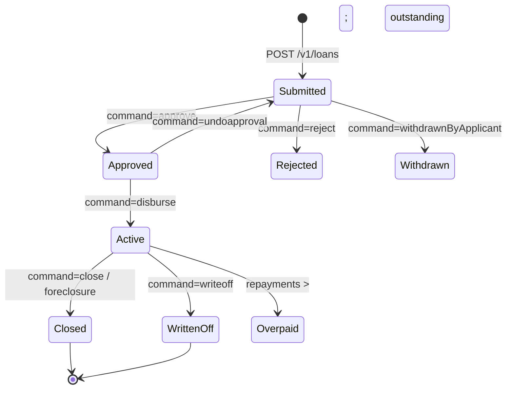

The Loans API is the most heavily-used surface of Apache Fineract. It exposes
the full lifecycle of an individual loan account — application, approval,
disbursal, repayment, charge management, and closure — through two cooperating
JAX-RS resources, `LoansApiResource` (loan applications and state transitions)
and `LoanTransactionsApiResource` (money movements on an existing loan).

Both resources are mounted under `/v1/loans` and follow the canonical Apache
Fineract command pattern: the HTTP verb describes the resource action, while a
`?command=` query parameter selects the specific business operation. The
permission check uses the `LOAN` resource name for read/create/update/delete and
maker-checker compatible permissions like `APPROVE_LOAN`, `DISBURSE_LOAN`,
`REPAYMENT_LOAN`, `WAIVEINTERESTPORTION_LOAN`, and `WRITEOFF_LOAN` for the
command transitions.

## Resource files

| Concern | File |
| --- | --- |
| Applications and state transitions | `fineract-provider/src/main/java/org/apache/fineract/portfolio/loanaccount/api/LoansApiResource.java` |
| Transactions on an existing loan | `fineract-provider/src/main/java/org/apache/fineract/portfolio/loanaccount/api/LoanTransactionsApiResource.java` |
| GLIM (group loan individual monitoring) | `LoansApiResource#glimStateTransitions` |
| Delinquency tag history | `LoansApiResource#getDelinquencyTagHistory` |

<Note>
Every mutating endpoint returns a `CommandProcessingResult` envelope with
`officeId`, `clientId`, `loanId`, `resourceId`, and a `changes` map describing
the fields that were updated. When maker-checker is enabled for the permission,
the same envelope carries a `commandId` instead so the change can be approved
later.
</Note>

## Endpoint catalog

### Applications and state transitions

| Verb | Path | `command` | Permission |
| --- | --- | --- | --- |
| `GET` | `/v1/loans/template` | – | `READ_LOAN` |
| `GET` | `/v1/loans` | – | `READ_LOAN` |
| `GET` | `/v1/loans/{loanId}` | – | `READ_LOAN` |
| `GET` | `/v1/loans/{loanId}/template` | – | `READ_LOAN` |
| `GET` | `/v1/loans/external-id/{loanExternalId}` | – | `READ_LOAN` |
| `POST` | `/v1/loans` | – | `CREATE_LOAN` |
| `PUT` | `/v1/loans/{loanId}` | `markAsFraud` | `UPDATE_LOAN` |
| `DELETE` | `/v1/loans/{loanId}` | – | `DELETE_LOAN` |
| `POST` | `/v1/loans/{loanId}` | `approve` | `APPROVE_LOAN` |
| `POST` | `/v1/loans/{loanId}` | `undoapproval` | `APPROVALUNDO_LOAN` |
| `POST` | `/v1/loans/{loanId}` | `disburse` | `DISBURSE_LOAN` |
| `POST` | `/v1/loans/{loanId}` | `disburseToSavings` | `DISBURSETOSAVINGS_LOAN` |
| `POST` | `/v1/loans/{loanId}` | `undodisbursal` | `DISBURSALUNDO_LOAN` |
| `POST` | `/v1/loans/{loanId}` | `reject` | `REJECT_LOAN` |
| `POST` | `/v1/loans/{loanId}` | `withdrawnByApplicant` | `WITHDRAW_LOAN` |
| `POST` | `/v1/loans/{loanId}` | `foreclosure` | `FORECLOSURE_LOAN` |
| `POST` | `/v1/loans/{loanId}` | `recoverGuarantees` | `RECOVERGUARANTEES_LOAN` |
| `POST` | `/v1/loans/{loanId}` | `assignLoanOfficer` | `UPDATELOANOFFICER_LOAN` |
| `POST` | `/v1/loans/uploadtemplate` | – | `CREATE_LOAN` |

### Transactions

All transaction endpoints live under the same `/v1/loans` root but operate on
the `{loanId}/transactions` subtree (or its `external-id/...` mirror).

| Verb | Path | `command` | Permission |
| --- | --- | --- | --- |
| `GET` | `/v1/loans/{loanId}/transactions/template` | `repayment`, `waiveinterest`, … | `READ_LOAN` |
| `GET` | `/v1/loans/{loanId}/transactions` | – | `READ_LOAN` |
| `GET` | `/v1/loans/{loanId}/transactions/{transactionId}` | – | `READ_LOAN` |
| `POST` | `/v1/loans/{loanId}/transactions` | `repayment` | `REPAYMENT_LOAN` |
| `POST` | `/v1/loans/{loanId}/transactions` | `merchantIssuedRefund` | `MERCHANTISSUEDREFUND_LOAN` |
| `POST` | `/v1/loans/{loanId}/transactions` | `payoutRefund` | `PAYOUTREFUND_LOAN` |
| `POST` | `/v1/loans/{loanId}/transactions` | `goodwillCredit` | `GOODWILLCREDIT_LOAN` |
| `POST` | `/v1/loans/{loanId}/transactions` | `chargeRefund` | `CHARGEREFUND_LOAN` |
| `POST` | `/v1/loans/{loanId}/transactions` | `waiveinterest` | `WAIVEINTERESTPORTION_LOAN` |
| `POST` | `/v1/loans/{loanId}/transactions` | `writeoff` | `WRITEOFF_LOAN` |
| `POST` | `/v1/loans/{loanId}/transactions` | `close-rescheduled` | `CLOSERESCHEDULED_LOAN` |
| `POST` | `/v1/loans/{loanId}/transactions` | `close` | `CLOSE_LOAN` |
| `POST` | `/v1/loans/{loanId}/transactions` | `recoverypayment` | `RECOVERYPAYMENT_LOAN` |
| `POST` | `/v1/loans/{loanId}/transactions` | `chargeback` | `CHARGEBACK_LOAN` |
| `POST` | `/v1/loans/{loanId}/transactions/{transactionId}` | `undo` | `ADJUST_LOAN` |
| `PUT` | `/v1/loans/{loanId}/transactions/{transactionId}` | – | `ADJUST_LOAN` |

### Charges

`LoansApiResource` also routes `/v1/loans/{loanId}/charges` for charge
attachment, waiver, and payment.

| Verb | Path | `command` | Permission |
| --- | --- | --- | --- |
| `GET` | `/v1/loans/{loanId}/charges` | – | `READ_LOANCHARGE` |
| `POST` | `/v1/loans/{loanId}/charges` | – | `CREATE_LOANCHARGE` |
| `POST` | `/v1/loans/{loanId}/charges/{chargeId}` | `pay` | `PAY_LOANCHARGE` |
| `POST` | `/v1/loans/{loanId}/charges/{chargeId}` | `waive` | `WAIVE_LOANCHARGE` |
| `PUT` | `/v1/loans/{loanId}/charges/{chargeId}` | – | `UPDATE_LOANCHARGE` |
| `DELETE` | `/v1/loans/{loanId}/charges/{chargeId}` | – | `DELETE_LOANCHARGE` |

## Loan application payload

The application is a single deeply-nested JSON document. The most commonly
required fields are the client/group binding, the loan product, the schedule
parameters, and the disbursement/repayment frequencies.

<CodeGroup>

```json POST /v1/loans
{
  "clientId": 1,
  "productId": 1,
  "principal": "10000.00",
  "loanTermFrequency": 12,
  "loanTermFrequencyType": 2,
  "numberOfRepayments": 12,
  "repaymentEvery": 1,
  "repaymentFrequencyType": 2,
  "interestRatePerPeriod": "12",
  "amortizationType": 1,
  "interestType": 0,
  "interestCalculationPeriodType": 1,
  "transactionProcessingStrategyCode": "mifos-standard-strategy",
  "expectedDisbursementDate": "20 January 2025",
  "submittedOnDate": "20 January 2025",
  "loanType": "individual",
  "dateFormat": "dd MMMM yyyy",
  "locale": "en"
}
```

```json POST /v1/loans/{loanId}?command=approve
{
  "approvedOnDate": "25 January 2025",
  "approvedLoanAmount": "10000.00",
  "expectedDisbursementDate": "27 January 2025",
  "note": "Approved subject to KYC refresh",
  "dateFormat": "dd MMMM yyyy",
  "locale": "en"
}
```

```json POST /v1/loans/{loanId}?command=disburse
{
  "actualDisbursementDate": "27 January 2025",
  "transactionAmount": "10000.00",
  "paymentTypeId": 1,
  "dateFormat": "dd MMMM yyyy",
  "locale": "en"
}
```

</CodeGroup>

## Repayment transaction

<CodeGroup>

```json POST /v1/loans/{loanId}/transactions?command=repayment
{
  "transactionDate": "27 February 2025",
  "transactionAmount": "925.00",
  "paymentTypeId": 1,
  "note": "First instalment",
  "externalId": "RPMT-0001",
  "dateFormat": "dd MMMM yyyy",
  "locale": "en"
}
```

</CodeGroup>

## Example response

```json
{
  "officeId": 1,
  "clientId": 1,
  "loanId": 42,
  "resourceId": 42,
  "changes": {
    "status": {
      "id": 300,
      "code": "loanStatusType.active",
      "value": "Active",
      "active": true
    },
    "actualDisbursementDate": [2025, 1, 27],
    "locale": "en",
    "dateFormat": "dd MMMM yyyy"
  }
}
```

## Lifecycle at a glance



## External-id mirror

Every numeric `{loanId}` route has an `external-id/{loanExternalId}` twin that
accepts the tenant-supplied identifier instead of the auto-generated one. The
same applies to transaction routes:
`/v1/loans/external-id/{loanExternalId}/transactions/external-id/{externalTransactionId}`.

<Tip>
Use external ids when integrating with an upstream system of record so the
caller never has to round-trip to discover the Fineract auto-id. Both forms map
to the same command handlers.
</Tip>

## Bulk import and downloads

| Verb | Path | Purpose |
| --- | --- | --- |
| `GET` | `/v1/loans/downloadtemplate` | Empty Excel workbook for loan applications |
| `POST` | `/v1/loans/uploadtemplate` | Multipart upload of populated workbook |
| `GET` | `/v1/loans/repayments/downloadtemplate` | Repayments workbook |
| `POST` | `/v1/loans/repayments/uploadtemplate` | Bulk repayments upload |

<Warning>
The `?command=foreclosure` operation settles outstanding principal, interest,
and fees on the supplied `transactionDate` in a single command. There is no
"undo foreclosure" — adjust the resulting transaction instead via
`POST /v1/loans/{loanId}/transactions/{transactionId}?command=undo`.
</Warning>

## See also

<CardGroup cols={2}>
  <Card title="Loan Products" href="/api/loan-products-api">
    Configure the products that loans reference via `productId`.
  </Card>
  <Card title="Clients API" href="/api/clients-api">
    The borrowers referenced by `clientId` or via `loanType: "group"`.
  </Card>
  <Card title="Accounting APIs" href="/api/accounting-api">
    Journal entries posted automatically when a loan disburses or repays.
  </Card>
  <Card title="Scheduler" href="/api/scheduler-jobs-api">
    The COB and `Apply Charge To Overdue Loans` jobs that drive delinquency.
  </Card>
</CardGroup>
