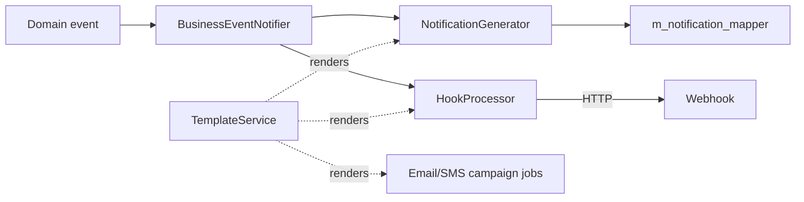
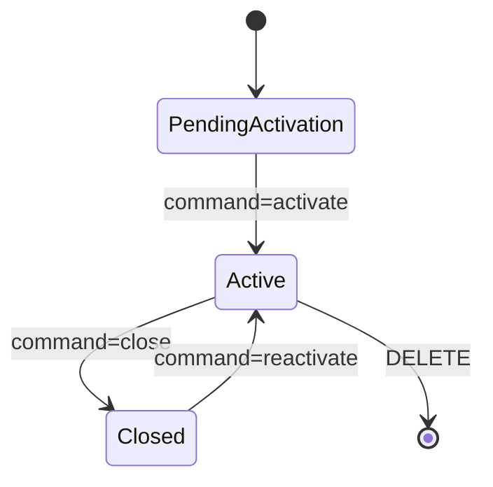

Apache Fineract communicates with the outside world through four layered subsystems, each with its own REST surface. `NotificationApiResource` exposes the in-app notification feed produced by the platform's internal event bus. `TemplatesApiResource` stores and renders Mustache templates, used both as message bodies and as generic API-call orchestrators. `HookApiResource` is the webhook registry that fires HTTP, Elasticsearch or SMS-bridge events on business actions. Finally `EmailCampaignApiResource` and `SmsCampaignApiResource` glue templates, recipient queries and schedules into batch mailings.

All five endpoints sit under `/fineract-provider/api/v1/...` and obey the standard tenant + auth filter. Writes go through `CommandWrapperBuilder`.

## Source files

| Resource | File |
| --- | --- |
| `NotificationApiResource` | `fineract-provider/.../notification/api/NotificationApiResource.java` |
| `TemplatesApiResource` | `fineract-provider/.../template/api/TemplatesApiResource.java` |
| `HookApiResource` | `fineract-provider/.../infrastructure/hooks/api/HookApiResource.java` |
| `EmailCampaignApiResource` | `fineract-provider/.../infrastructure/campaigns/email/api/EmailCampaignApiResource.java` |
| `SmsCampaignApiResource` | `fineract-provider/.../infrastructure/campaigns/sms/api/SmsCampaignApiResource.java` |

## Event flow



## `NotificationApiResource` — `/v1/notifications`

The in-app inbox. Notifications are produced by the business-event bus, fan-out is controlled per role (the `m_notification_mapper` join table), and each user only sees the subset addressed to them.

| Verb | Path | Purpose |
| --- | --- | --- |
| GET | `/v1/notifications` | Paged feed for the signed-in user. Query: `isRead`, `orderBy`, `sortOrder`. |
| PUT | `/v1/notifications` | Mark all as read for the signed-in user. |

### Example: list unread notifications

```http
GET /fineract-provider/api/v1/notifications?isRead=false&offset=0&limit=20
```

Response:

```json
{
  "totalFilteredRecords": 3,
  "pageItems": [
    { "id": 187, "objectType": "loan", "objectId": 421, "action": "approved",
      "actorId": 11, "content": "Loan #421 approved by Amelia Harris",
      "isRead": false, "createdAt": "2024-05-12T09:24:01Z" }
  ]
}
```

### Example: mark all as read

```http
PUT /fineract-provider/api/v1/notifications
```

```json
{}
```

## `TemplatesApiResource` — `/v1/templates`

A `Template` is a Mustache document with bound parameters and optional outbound mappers. Templates back three things: webhook payload rendering, email/SMS bodies, and ad-hoc document generation through `POST /templates/{id}`.

| Verb | Path | Purpose |
| --- | --- | --- |
| GET | `/v1/templates` | List templates filtered by `entityId` and `typeId`. |
| GET | `/v1/templates/template` | Form data: entities, types, mappers. |
| GET | `/v1/templates/{templateId}` | Fetch one. |
| GET | `/v1/templates/{templateId}/template` | Fetch with form data overlay (for edit screens). |
| POST | `/v1/templates` | Create a template. |
| PUT | `/v1/templates/{templateId}` | Update body, mappers, parameters. |
| DELETE | `/v1/templates/{templateId}` | Delete. |
| POST | `/v1/templates/{templateId}` | Merge — execute the template against a JSON context and return the rendered body. |

### Example: create a loan-approval Mustache template

```http
POST /fineract-provider/api/v1/templates
```

```json
{
  "name": "Loan approved SMS",
  "entity": 0,
  "type": 0,
  "text": "Dear {{client.displayName}}, your loan #{{loan.accountNo}} for {{loan.currency.code}} {{loan.approvedPrincipal}} has been approved.",
  "mappers": [
    { "mappersorder": 1, "mapperskey": "client", "mappersvalue": "clients/{{loan.clientId}}" },
    { "mappersorder": 2, "mapperskey": "loan",   "mappersvalue": "loans/{{loanId}}" }
  ]
}
```

`mappers` fetch sub-objects from internal Fineract URLs before the Mustache engine runs, so `{{client.displayName}}` resolves cleanly.

### Example: merge a template ad-hoc

```http
POST /fineract-provider/api/v1/templates/12
```

```json
{ "loanId": 421 }
```

The response body is the rendered text — useful for previewing.

## `HookApiResource` — `/v1/hooks`

Hooks register external listeners. The hook type ("Web", "Elastic Search", "SMS Bridge") is picked from `/template`; the `events` array enumerates the `(entity, action)` pairs the hook reacts to.

| Verb | Path | Purpose |
| --- | --- | --- |
| GET | `/v1/hooks` | List hooks. |
| GET | `/v1/hooks/{hookId}` | Fetch one. |
| GET | `/v1/hooks/template` | Hook types, available events, template options. |
| POST | `/v1/hooks` | Create a hook. |
| PUT | `/v1/hooks/{hookId}` | Update. |
| DELETE | `/v1/hooks/{hookId}` | Delete. |

### Example: webhook on loan disbursal

```http
POST /fineract-provider/api/v1/hooks
```

```json
{
  "name": "Web",
  "displayName": "Notify CRM on disbursal",
  "isActive": true,
  "events": [
    { "actionName": "DISBURSE", "entityName": "LOAN" }
  ],
  "config": [
    { "fieldName": "Payload URL", "fieldValue": "https://crm.example.com/fineract/disbursal" },
    { "fieldName": "Content Type", "fieldValue": "json" }
  ],
  "templateId": 12
}
```

When `templateId` is set, the configured template is rendered first and the result is posted as the body.

### Example: ElasticSearch indexer

```json
{
  "name": "Elastic Search",
  "displayName": "Index loans to ES",
  "isActive": true,
  "events": [
    { "actionName": "CREATE", "entityName": "LOAN" },
    { "actionName": "APPROVE", "entityName": "LOAN" }
  ],
  "config": [
    { "fieldName": "Node",    "fieldValue": "https://es.local:9200" },
    { "fieldName": "Index Name", "fieldValue": "loans" }
  ]
}
```

## `EmailCampaignApiResource` — `/v1/email/campaign`

Campaigns combine a recipient-producing report (`businessRuleId`), a Mustache template body, and a schedule.

| Verb | Path | Purpose |
| --- | --- | --- |
| GET | `/v1/email/campaign` | List campaigns. |
| GET | `/v1/email/campaign/{id}` | Fetch one. |
| POST | `/v1/email/campaign` | Create. |
| PUT | `/v1/email/campaign/{id}` | Update. |
| POST | `/v1/email/campaign/{id}?command=activate\|close\|reactivate` | Lifecycle action. |
| POST | `/v1/email/campaign/preview` | Render the body against a sample row. |
| GET | `/v1/email/campaign/template` | Form data: campaign types, recurrence options. |
| GET | `/v1/email/campaign/template/{id}` | Per-id form overlay. |
| DELETE | `/v1/email/campaign/{id}` | Delete. |

### Example: schedule a monthly statement email

```http
POST /fineract-provider/api/v1/email/campaign
```

```json
{
  "campaignName": "Monthly statement",
  "campaignType": 1,
  "businessRuleId": 84,
  "emailSubject": "Your {{client.displayName}} statement",
  "emailMessage": "Dear {{client.displayName}}, your balance is {{loan.totalOutstandingAmount}}.",
  "recurrenceStartDate": "01 June 2024 00:00",
  "recurrence": "FREQ=MONTHLY;INTERVAL=1;BYMONTHDAY=1",
  "locale": "en",
  "dateFormat": "dd MMMM yyyy HH:mm"
}
```

`campaignType = 1` is "scheduled". The job at `Execute Email at Specific Time` rolls campaigns whose `recurrenceStartDate` has hit.

### Example: activate a campaign

```http
POST /fineract-provider/api/v1/email/campaign/7?command=activate
```

```json
{ "activationDate": "01 June 2024", "locale": "en", "dateFormat": "dd MMMM yyyy" }
```

## `SmsCampaignApiResource` — `/v1/smscampaigns`

Same model as email campaigns, plus an SMS-bridge provider id pointing at a configured external gateway.

| Verb | Path | Purpose |
| --- | --- | --- |
| GET | `/v1/smscampaigns` | List campaigns (paged via `offset`/`limit`). |
| GET | `/v1/smscampaigns/{id}` | Fetch one. |
| GET | `/v1/smscampaigns/template` | Form options. |
| POST | `/v1/smscampaigns` | Create. |
| PUT | `/v1/smscampaigns/{id}` | Update. |
| POST | `/v1/smscampaigns/{id}?command=activate\|close\|reactivate` | Lifecycle action. |
| POST | `/v1/smscampaigns/preview` | Render against a sample. |
| DELETE | `/v1/smscampaigns/{id}` | Delete. |

### Example: birthday-greeting SMS campaign

```http
POST /fineract-provider/api/v1/smscampaigns
```

```json
{
  "campaignName": "Birthday wishes",
  "campaignType": 0,
  "triggerType": 2,
  "providerId": 1,
  "businessRuleId": 91,
  "message": "Happy birthday {{client.firstname}}! From the team at Fineract Bank.",
  "submittedOnDate": "12 May 2024",
  "recurrenceStartDate": "12 May 2024 06:00",
  "recurrence": "FREQ=DAILY;INTERVAL=1",
  "locale": "en",
  "dateFormat": "dd MMMM yyyy"
}
```

`triggerType = 2` is "schedule"; `triggerType = 1` is "direct" (fired one-shot); `triggerType = 3` is "triggered" (fired by a business event).

### Example: preview

```http
POST /fineract-provider/api/v1/smscampaigns/preview
```

```json
{
  "message": "Hi {{client.firstname}}, balance: {{loan.totalOutstanding}}",
  "paramValue": "{ \"client\": { \"firstname\": \"Amelia\" }, \"loan\": { \"totalOutstanding\": 1500 } }"
}
```

Returns `{ "preview": "Hi Amelia, balance: 1500" }`.

## Activation lifecycle



The state machine is identical for email and SMS campaigns and is enforced by the respective `CommandHandler` implementations.

## Common failures

<AccordionGroup>
  <Accordion title="Template renders `{{name}}` literally">
  The Mustache key was not in scope. Check the `mappers` you registered on the template: every `mapperskey` is wrapped as a sub-context, so use `{{key.field}}` not `{{field}}`.
  </Accordion>
  <Accordion title="Webhook never fires">
  Either `isActive = false`, or the event is not in the `events` array, or the URL returns non-2xx and the hook retry budget has been exhausted. Check `m_hook` and `m_hook_failure`.
  </Accordion>
  <Accordion title="Email campaign activates but sends nothing">
  The `businessRuleId` resolves to a stretchy report whose first column is supposed to be the recipient email; if that column is empty, the campaign job silently skips the row.
  </Accordion>
</AccordionGroup>

## See also

<CardGroup cols={2}>
  <Card title="Notification architecture" icon="bell" href="/notification/overview">Producer/consumer model.</Card>
  <Card title="Template service" icon="file-lines" href="/notification/templates">Mustache mapper resolution.</Card>
  <Card title="Hooks" icon="plug" href="/notification/hooks">Hook types and retries.</Card>
  <Card title="Campaigns" icon="megaphone" href="/notification/email-campaigns">Campaign jobs and providers.</Card>
</CardGroup>
