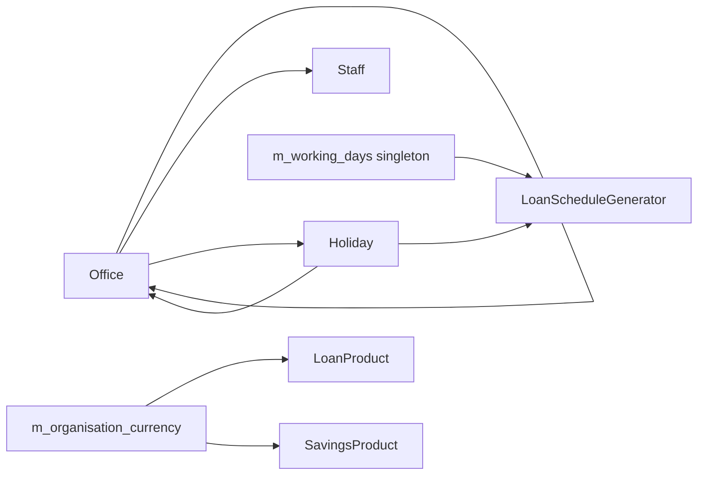
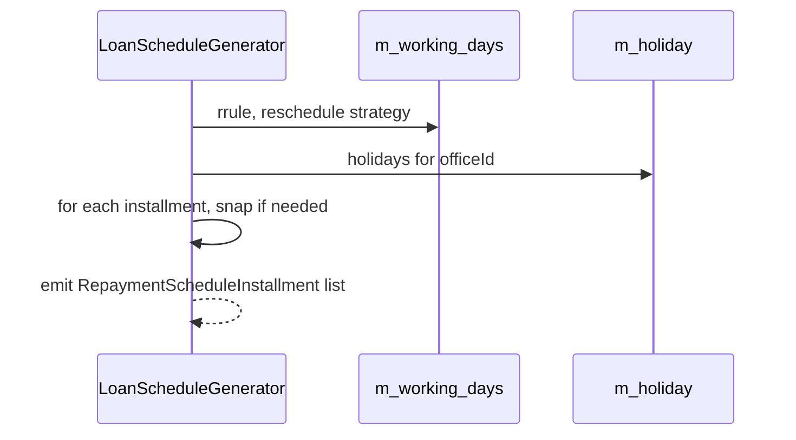

Apache Fineract groups every "where and when" piece of branch configuration under a small number of REST resources: `OfficesApiResource` for the head-office / branch hierarchy, `StaffApiResource` for the people that work in those offices, `HolidaysApiResource` for the date table that re-schedules due dates, `WorkingDaysApiResource` for the weekly recurrence rule that drives the same re-scheduler, and `CurrenciesApiResource` for the tenant-level allowed-currency list. Together they define the *operational geography* the loan and savings engines see.

All endpoints live under `/fineract-provider/api/v1/...`. Writes go through `CommandWrapperBuilder` and respect maker-checker. Holiday and working-day changes immediately influence the next `LoanScheduleGenerator` run for any loan whose product has the matching `reschedulingStrategyId`.

## Source files

| Resource | File |
| --- | --- |
| `OfficesApiResource` | `fineract-provider/.../organisation/office/api/OfficesApiResource.java` |
| `StaffApiResource` | `fineract-provider/.../organisation/staff/api/StaffApiResource.java` |
| `HolidaysApiResource` | `fineract-provider/.../organisation/holiday/api/HolidaysApiResource.java` |
| `WorkingDaysApiResource` | `fineract-provider/.../organisation/workingdays/api/WorkingDaysApiResource.java` |
| `CurrenciesApiResource` | `fineract-core/.../organisation/monetary/api/CurrenciesApiResource.java` |

## Entity map



## `OfficesApiResource` — `/v1/offices`

An `Office` is a node in a self-referential parent/child tree. Every other resource — `AppUser`, `Staff`, `Client`, `Group` — anchors back to exactly one office, and the hierarchy is what `AppUserAccessUtil` walks to enforce data scoping. The external-id variants mirror the numeric-id endpoints for clients that prefer the immutable `externalId` as the stable handle.

| Verb | Path | Purpose |
| --- | --- | --- |
| GET | `/v1/offices` | List all offices the caller can see. |
| GET | `/v1/offices/{officeId}` | Fetch one office by id. |
| GET | `/v1/offices/external-id/{externalId}` | Fetch one office by external id. |
| GET | `/v1/offices/template` | Form data: parent-office dropdown. |
| POST | `/v1/offices` | Create a branch under a parent. |
| PUT | `/v1/offices/{officeId}` | Update name, opening date, external id. |
| PUT | `/v1/offices/external-id/{externalId}` | Same, addressed by external id. |
| GET | `/v1/offices/downloadtemplate` | Excel template for bulk import. |
| POST | `/v1/offices/uploadtemplate` | Upload populated import. |

### Example: open a sub-branch under the head office

```http
POST /fineract-provider/api/v1/offices
```

```json
{
  "name": "Mombasa Coast",
  "parentId": 1,
  "openingDate": "12 March 2024",
  "externalId": "BR-MBA-001",
  "locale": "en",
  "dateFormat": "dd MMMM yyyy"
}
```

The new office inherits visibility from `parentId = 1` (the head office, always present). All clients later created against `officeId = <new>` are reachable by any user whose role gives access to the head office hierarchy.

### Example: rename and rebrand a branch by external id

```http
PUT /fineract-provider/api/v1/offices/external-id/BR-MBA-001
```

```json
{
  "name": "Mombasa Coastal Hub",
  "externalId": "BR-MBA-002"
}
```

## `StaffApiResource` — `/v1/staff`

Staff records represent loan officers, tellers and field officers. They are linked to an office, optionally flagged as `isLoanOfficer = true` (so they appear in the loan-officer dropdowns), and can be inactivated by setting `isActive = false` rather than deleted.

| Verb | Path | Purpose |
| --- | --- | --- |
| GET | `/v1/staff` | List staff. Supports `officeId`, `staffInOfficeHierarchy`, `loanOfficersOnly`. |
| GET | `/v1/staff/{staffId}` | Fetch one staff record. |
| POST | `/v1/staff` | Create staff. |
| PUT | `/v1/staff/{staffId}` | Update name, status, office. |
| GET | `/v1/staff/downloadtemplate` | Excel template. |
| POST | `/v1/staff/uploadtemplate` | Bulk import. |

### Example: register a loan officer

```http
POST /fineract-provider/api/v1/staff
```

```json
{
  "officeId": 4,
  "firstname": "Naledi",
  "lastname": "Okafor",
  "isLoanOfficer": true,
  "isActive": true,
  "externalId": "STF-1078",
  "mobileNo": "+254712000111",
  "joiningDate": "01 April 2024",
  "locale": "en",
  "dateFormat": "dd MMMM yyyy"
}
```

### Example: move a loan officer between branches

```http
PUT /fineract-provider/api/v1/staff/42
```

```json
{
  "officeId": 7
}
```

When a loan officer is reassigned, existing loans keep their original officer reference until they are explicitly reassigned via `POST /loans/{id}?command=updateLoanOfficer`.

## `HolidaysApiResource` — `/v1/holidays`

Holidays are dated rows attached to one or more offices. When a loan's due date falls on a holiday, the active `RescheduleStrategy` (move forward / move backward / move to repayment day) snaps the installment to the configured `repaymentsRescheduledTo` date. Holidays are created in a `PENDING_FOR_ACTIVATION` state and only affect scheduling after they are activated.

| Verb | Path | Purpose |
| --- | --- | --- |
| POST | `/v1/holidays` | Create a holiday. |
| GET | `/v1/holidays?officeId=` | List holidays scoped to an office. |
| GET | `/v1/holidays/{holidayId}` | Fetch one. |
| GET | `/v1/holidays/template` | Reschedule-strategy options + offices. |
| PUT | `/v1/holidays/{holidayId}` | Update before activation. |
| POST | `/v1/holidays/{holidayId}?command=activate` | Activate. |
| DELETE | `/v1/holidays/{holidayId}` | Delete (only pending or future). |

### Example: declare a public holiday for two branches

```http
POST /fineract-provider/api/v1/holidays
```

```json
{
  "name": "Madaraka Day",
  "description": "Kenyan public holiday",
  "fromDate": "01 June 2024",
  "toDate": "01 June 2024",
  "repaymentsRescheduledTo": "03 June 2024",
  "reschedulingType": 2,
  "offices": [{ "officeId": 4 }, { "officeId": 7 }],
  "locale": "en",
  "dateFormat": "dd MMMM yyyy"
}
```

`reschedulingType = 2` is "reschedule to next repayment date"; `1` is "reschedule to a specific date" and requires `repaymentsRescheduledTo`.

### Example: activate the holiday

```http
POST /fineract-provider/api/v1/holidays/12?command=activate
```

```json
{}
```

After activation, the next time a loan's schedule is generated (or re-generated), installments falling on `01 June 2024` for offices 4 and 7 will roll forward.

## `WorkingDaysApiResource` — `/v1/workingdays`

There is exactly one row in `m_working_days`. The endpoint returns and updates it: an iCalendar `RRULE` (e.g. `FREQ=WEEKLY;BYDAY=MO,TU,WE,TH,FR`) and the strategy that decides what to do when a due date falls on a non-working day.

| Verb | Path | Purpose |
| --- | --- | --- |
| GET | `/v1/workingdays` | Fetch the singleton. |
| GET | `/v1/workingdays/template` | Dropdown options for `repaymentRescheduleType`. |
| PUT | `/v1/workingdays` | Update recurrence and strategy. |

### Example: enable Saturday as a working day

```http
PUT /fineract-provider/api/v1/workingdays
```

```json
{
  "recurrence": "FREQ=WEEKLY;INTERVAL=1;BYDAY=MO,TU,WE,TH,FR,SA",
  "repaymentRescheduleType": 2,
  "extendTermForDailyRepayments": false,
  "extendTermForRepaymentsOnHolidays": false,
  "locale": "en"
}
```

`repaymentRescheduleType` values mirror the loan-side enum: `1 = same day`, `2 = move to next working day`, `3 = move to previous working day`, `4 = move to next repayment meeting date`.

## `CurrenciesApiResource` — `/v1/currencies`

The tenant database carries the full ISO list in `m_currency`; the *allowed* set per tenant is stored in `m_organisation_currency`. `CurrenciesApiResource` shows both and lets you replace the allowed set.

| Verb | Path | Purpose |
| --- | --- | --- |
| GET | `/v1/currencies` | List allowed currencies; `?fields=selectedCurrencyOptions` returns only the allowed set, otherwise both the allowed and full master list. |
| PUT | `/v1/currencies` | Replace the allowed-currency list for the tenant. |

### Example: pin the tenant to KES and USD only

```http
PUT /fineract-provider/api/v1/currencies
```

```json
{
  "currencies": ["KES", "USD"]
}
```

Once narrowed, loan and savings product creation will only accept these codes; existing products in other currencies remain readable but cannot be cloned or activated.

## Scheduler interaction



This is the same generator used at disbursal, at recompute, and inside the daily `Recalculate Interest For Loans` job.

## Common pitfalls

<AccordionGroup>
  <Accordion title="A new holiday has no effect">
  The holiday is still in `PENDING_FOR_ACTIVATION`. Activate it (`POST /holidays/{id}?command=activate`) and either re-disburse the affected loans or wait for the next recompute job.
  </Accordion>
  <Accordion title="Office hierarchy rejects the user even after creating the branch">
  Office hierarchy paths (`m_office.hierarchy`) are denormalised. They are rebuilt on insert; if you have manually edited rows, run the migration that recomputes paths or recreate the affected branch.
  </Accordion>
  <Accordion title="DELETE staff returns 405">
  Staff is not deletable — set `isActive = false` instead. The data model relies on the referential link from clients and loans staying intact.
  </Accordion>
</AccordionGroup>

## See also

<CardGroup cols={2}>
  <Card title="Office hierarchy" icon="building" href="/organisation/offices">How `m_office.hierarchy` is built and walked.</Card>
  <Card title="Holiday rescheduler" icon="calendar" href="/organisation/holidays">Strategy enum and recompute interaction.</Card>
  <Card title="Working days" icon="clock" href="/organisation/working-days">iCalendar recurrence parsing.</Card>
  <Card title="Currencies" icon="coins" href="/organisation/monetary-currency">`m_organisation_currency` model.</Card>
</CardGroup>
