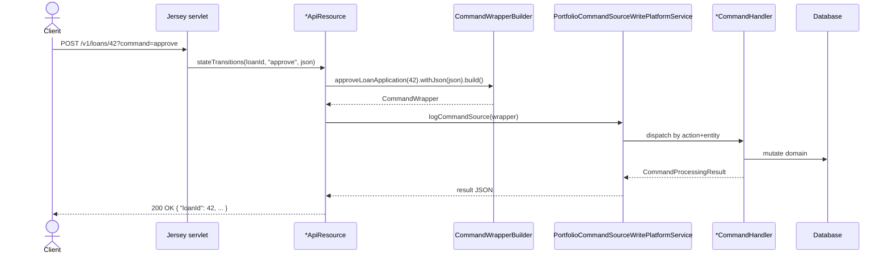

Apache Fineract exposes its entire platform through a single, consistent JSON-over-HTTP API. Every business
capability — loans, savings, accounting, identity, scheduler — is implemented as a JAX-RS `*ApiResource`
class that is wired into the same Jersey servlet, secured by the same filter chain, dispatched through the
same command/handler infrastructure, and described by the same OpenAPI document. Once you understand the
shape of one endpoint you understand the shape of all of them.

This section is a catalog of the REST surface. Each page walks one `ApiResource` family: the file it
lives in, the URI template it serves, the HTTP verbs it accepts, the `command` query parameter values it
recognises, the permission code the security context checks, and a handful of representative request
payloads. The intent is to give integrators a quick map from "what I want to do" to "which line of which
file does it" without having to scrape Swagger or guess from sample data.

## Base path

All public Apache Fineract endpoints live under a single prefix:

```
/fineract-provider/api/v1/
```

- `/fineract-provider` is the servlet context root configured in `application.properties`.
- `/api` is the Jersey servlet mapping.
- `/v1` is part of every `@Path` annotation — Apache Fineract has never broken the v1 contract.

A complete example URL for "approve loan 42":

```
POST https://fineract.example.org/fineract-provider/api/v1/loans/42?command=approve
```

<Info>
The `fineract-provider` segment is the WAR context. Some deployments mount the application at the root
(`/api/v1/...`); the path templates documented in this section are written without the context prefix
because they come directly from the `@Path` annotations.
</Info>

## Required headers

Every Apache Fineract request — except a small handful of public health/info endpoints — must carry the
following headers.

<ParamField header="Fineract-Platform-TenantId" type="string" required>
  Logical tenant identifier. The `TenantAwareJpaPlatformUserDetailsService` and the multi-tenant DataSource
  routing look this up against the `fineract_tenants` database. The default development tenant is
  `default`.
</ParamField>

<ParamField header="Authorization" type="string" required>
  HTTP Basic credentials (`Basic base64(username:password)`) when `fineract.security.basicauth.enabled=true`,
  or a Bearer JWT when `fineract.security.oauth2.enabled=true`. See
  [Authentication and self-service APIs](/api/authentication).
</ParamField>

<ParamField header="Content-Type" type="string">
  `application/json` for almost every write endpoint. A few document/import endpoints accept
  `multipart/form-data`.
</ParamField>

<ParamField header="Accept" type="string">
  `application/json` is the universal response media type. Reports and exports may return CSV, PDF, or
  XLS depending on the `output-type` query parameter.
</ParamField>

## The dispatcher pattern

Apache Fineract REST endpoints are intentionally thin. Most write endpoints follow this shape:



The resource class never touches a JPA entity directly. It validates the URI, builds a `CommandWrapper`,
hands it to the command source service, and serialises the resulting `CommandProcessingResult`. This is why
every write endpoint feels identical: the dispatcher is the API, and the resource is just routing sugar.

## The command query parameter

State transitions, approvals, money movements, and other verbs that do not fit CRUD are expressed as a
`?command=<action>` query parameter on a `POST` (or `PUT`). For example:

| Verb | Path | Command |
| --- | --- | --- |
| `POST` | `/v1/loans/{loanId}` | `approve`, `disburse`, `undoapproval`, `reject`, `withdrawnByApplicant` |
| `POST` | `/v1/loans/{loanId}/transactions` | `repayment`, `waiveinterest`, `writeoff`, `foreclosure`, `chargeoff` |
| `POST` | `/v1/savingsaccounts/{accountId}` | `approve`, `activate`, `postInterest`, `close`, `block` |
| `POST` | `/v1/clients/{clientId}` | `activate`, `close`, `reject`, `withdraw`, `acceptTransfer` |
| `POST` | `/v1/groups/{groupId}` | `activate`, `associateClients`, `assignStaff`, `close` |

Unknown commands raise `UnrecognizedQueryParamException` and surface as `400 Bad Request`.

## Permissions

Every endpoint validates a permission code against the authenticated user. The pattern is
`<ACTION>_<ENTITY>` (e.g. `CREATE_LOAN`, `APPROVE_LOAN`, `READ_SAVINGSACCOUNT`). Resources call
`context.authenticatedUser().validateHasReadPermission("LOAN")` for reads; writes route through the
command framework which performs the same check based on the resolved `CommandWrapper`.

When a permission is missing, Apache Fineract returns `403 Forbidden` with a structured error body listing
the missing permission code, which makes it easy to map back to a role definition.

## OpenAPI / Swagger

The platform publishes a machine-readable OpenAPI 3 document and a Swagger UI:

- OpenAPI JSON: `GET /fineract-provider/api/v1/openapi.json` (also reachable as `/v3/api-docs`)
- Swagger UI: `GET /fineract-provider/swagger-ui/index.html`

The document is generated from the `@Operation`, `@RequestBody`, and `@ApiResponse` annotations attached
to every resource method. Swagger codegen models live alongside each resource as
`<Resource>Swagger.java` classes; their nested static classes are the canonical request and response
schemas. Because the OpenAPI doc is generated from the source, it always matches the running build.

## Pagination, sorting, and filtering

Read endpoints share a common query vocabulary:

<ParamField query="offset" type="integer" default="0">
  Zero-based starting row.
</ParamField>

<ParamField query="limit" type="integer" default="200">
  Maximum number of rows. A negative or zero value disables paging.
</ParamField>

<ParamField query="orderBy" type="string">
  Column name to sort by. Validated against an allow-list per resource.
</ParamField>

<ParamField query="sortOrder" type="string">
  `ASC` or `DESC`.
</ParamField>

<ParamField query="locale" type="string">
  Locale used to parse incoming numbers and dates and to format responses.
</ParamField>

<ParamField query="dateFormat" type="string">
  Pattern used to parse date fields in the request body. Most clients send `dd MMMM yyyy`.
</ParamField>

List responses are wrapped in a `Page<T>` envelope:

```json
{
  "totalFilteredRecords": 421,
  "pageItems": [ /* ... */ ]
}
```

## Error envelope

Validation errors and business rule violations share a single envelope:

```json
{
  "developerMessage": "Validation errors exist.",
  "httpStatusCode": "400",
  "defaultUserMessage": "Validation errors exist.",
  "userMessageGlobalisationCode": "validation.msg.validation.errors.exist",
  "errors": [
    {
      "developerMessage": "The parameter principal is required.",
      "defaultUserMessage": "The parameter principal is required.",
      "userMessageGlobalisationCode": "validation.msg.loan.principal.cannot.be.blank",
      "parameterName": "principal"
    }
  ]
}
```

`userMessageGlobalisationCode` is the canonical i18n key — front-ends translate against it.

## Catalog

<CardGroup cols={2}>
  <Card title="Authentication" icon="key" href="/api/authentication">
    Basic auth, OAuth2/JWT, `/v1/authentication`, `/v1/userdetails`, password reset.
  </Card>
  <Card title="Loans API" icon="file-invoice-dollar" href="/api/loans-api">
    `LoansApiResource`, `LoanTransactionsApiResource`, `LoanChargesApiResource`.
  </Card>
  <Card title="Loan products" icon="layer-group" href="/api/loan-products-api">
    `LoanProductsApiResource` — terms, schedule, multi-disburse, progressive variants.
  </Card>
  <Card title="Savings API" icon="piggy-bank" href="/api/savings-api">
    `SavingsAccountsApiResource`, `SavingsProductsApiResource`, charges and transactions.
  </Card>
  <Card title="Deposits" icon="vault" href="/api/deposit-accounts-api">
    Fixed and recurring deposit accounts, premature close, maturity transfer.
  </Card>
  <Card title="Clients" icon="user" href="/api/clients-api">
    Client lifecycle, identifiers, addresses, charges, image upload.
  </Card>
  <Card title="Groups & centers" icon="users" href="/api/groups-and-centers-api">
    `GroupsApiResource`, `CentersApiResource`, staff transfer, meeting management.
  </Card>
  <Card title="Accounting" icon="book" href="/api/accounting-api">
    GL accounts, journal entries, rules, closures, financial-activity mappings.
  </Card>
  <Card title="Scheduler & jobs" icon="clock" href="/api/scheduler-jobs-api">
    Scheduler control, job CRUD, inline execution, batch composition.
  </Card>
  <Card title="OpenAPI" icon="code" href="/provider/swagger-openapi">
    Live Swagger UI and the machine-readable contract.
  </Card>
</CardGroup>

## How to read the catalog pages

Every catalog page follows the same template:

1. **Frontmatter** with the page title, sidebar label, and short description.
2. **Resource summary** linking to the underlying `*ApiResource.java` file.
3. **Endpoint table** listing verb, path, the matching `command` (when applicable), and the permission code.
4. **Payload examples** — three small JSON bodies pulled straight from the resource or its Swagger model.
5. **Cross references** to related pages.

This is not a substitute for the generated OpenAPI document — it is a human-friendly index that turns
"which file owns this URL?" into a one-click answer.
