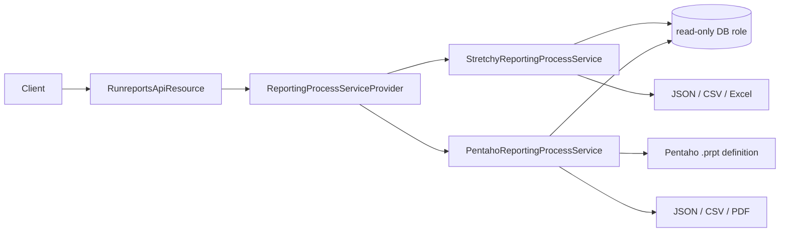
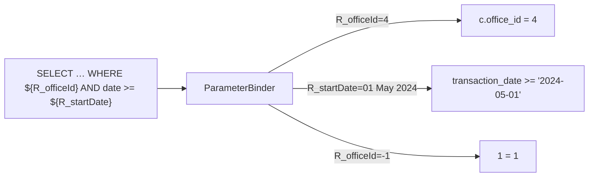

Apache Fineract's analytics surface is built on two complementary REST resources. `ReportsApiResource` is the *catalogue* — it lets you register, edit, and delete the SQL or Pentaho documents that ship with the platform or that a tenant installs. `RunreportsApiResource` is the *execution gateway* — given a report name and a set of named parameters, it dispatches to the appropriate `ReportingProcessService` (stretchy SQL, Pentaho, or a custom binding) and streams the result in whichever export format the client requests via query parameters.

Both resources live under `/fineract-provider/api/v1/` and use the standard tenant + auth filter; no maker-checker semantics, since reports are read-only.

## Source files

| Resource | File |
| --- | --- |
| `ReportsApiResource` | `fineract-provider/.../infrastructure/dataqueries/api/ReportsApiResource.java` |
| `RunreportsApiResource` | `fineract-provider/.../infrastructure/dataqueries/api/RunreportsApiResource.java` |

## Architecture



The provider picks the right service based on the report's `report_type` column (`Table`, `Chart`, `SMS`, `Pentaho`, …). A `Table` report is the most common — a parameterised SQL statement whose first row of column names becomes the JSON keys.

## `ReportsApiResource` — `/v1/reports`

This is the catalogue. A `m_report` row has a `report_name`, `report_type`, `report_category`, the SQL or Pentaho file reference in `report_sql`, plus the parameter join rows in `m_report_parameter`.

| Verb | Path | Purpose |
| --- | --- | --- |
| GET | `/v1/reports` | List the catalogue. |
| GET | `/v1/reports/{id}` | Fetch one report definition. |
| GET | `/v1/reports/template` | Form data: report types, categories, available parameters. |
| POST | `/v1/reports` | Register a new report. |
| PUT | `/v1/reports/{id}` | Update name, SQL, parameters. |
| DELETE | `/v1/reports/{id}` | Delete (system reports flagged `core_report = 1` cannot be deleted). |

### Example: register a stretchy report

```http
POST /fineract-provider/api/v1/reports
```

```json
{
  "reportName": "Active Loans By Office",
  "reportType": "Table",
  "reportSubType": "",
  "reportCategory": "Loan",
  "description": "Open loans grouped by office.",
  "reportSql": "SELECT o.name AS office, COUNT(l.id) AS active, SUM(l.principal_outstanding_derived) AS principal_outstanding FROM m_loan l JOIN m_client c ON c.id = l.client_id JOIN m_office o ON o.id = c.office_id WHERE l.loan_status_id = 300 AND ${R_officeId} GROUP BY o.name ORDER BY o.name",
  "coreReport": false,
  "useReport": true,
  "reportParameters": [
    { "parameterId": 5, "reportParameterName": "officeIdSelectOne" }
  ]
}
```

The `${R_<paramName>}` token is the convention used by `StretchyReportingProcessService`: parameter values are substituted into the SQL with the appropriate type-cast wrapper (e.g. `officeIdSelectOne` resolves to either `c.office_id = ?` or `1 = 1` depending on the supplied value).

### Example: update SQL

```http
PUT /fineract-provider/api/v1/reports/87
```

```json
{
  "reportSql": "SELECT o.name AS office, COUNT(l.id) AS active FROM m_loan l JOIN m_client c ON c.id = l.client_id JOIN m_office o ON o.id = c.office_id WHERE l.loan_status_id = 300 AND ${R_officeId} GROUP BY o.name",
  "useReport": true
}
```

Whenever a report is updated, `m_report_parameter` is rewritten to reflect the new `reportParameters` array; supply the full set, not a delta.

## `RunreportsApiResource` — `/v1/runreports`

The execution endpoint. Two GETs: one to discover available export formats per report, one to actually run the report.

| Verb | Path | Purpose |
| --- | --- | --- |
| GET | `/v1/runreports/availableExports/{reportName}` | List the export targets the report's `ReportingProcessService` supports. |
| GET | `/v1/runreports/{reportName}` | Execute the report and stream the result. |

### Query parameters on `GET /runreports/{reportName}`

| Parameter | Meaning |
| --- | --- |
| `R_<paramName>` | Value for a named report parameter. Repeat per parameter. |
| `parameterType` | If `true`, return the parameter metadata instead of the data. |
| `exportCSV` | Stream CSV. |
| `exportPDF` | Stream PDF (Pentaho only). |
| `exportXLS` | Stream a single-sheet Excel workbook. |
| `exportXLSX` | Stream an `.xlsx` workbook. |
| `exportS3` | Stream straight to an S3 bucket (requires `fineract.report.export.s3.enabled = true`). |
| `pretty` | When the response is JSON, pretty-print. |

Omitting all export flags returns JSON (`application/json`).

### Example: run a report as JSON

```http
GET /fineract-provider/api/v1/runreports/Active%20Loans%20By%20Office?R_officeId=4
Accept: application/json
```

Response:

```json
{
  "columnHeaders": [
    { "columnName": "office",                "columnType": "VARCHAR",   "isColumnNullable": false },
    { "columnName": "active",                "columnType": "BIGINT",    "isColumnNullable": false },
    { "columnName": "principal_outstanding", "columnType": "DECIMAL",   "isColumnNullable": true  }
  ],
  "data": [
    { "row": ["Nairobi CBD", "84", "5430000.00"] },
    { "row": ["Mombasa Coast", "37", "1820000.00"] }
  ]
}
```

### Example: run a report as CSV

```http
GET /fineract-provider/api/v1/runreports/Active%20Loans%20By%20Office?R_officeId=4&exportCSV=true
Accept: text/csv
```

Response (status `200`, `Content-Type: text/csv`):

```
office,active,principal_outstanding
Nairobi CBD,84,5430000.00
Mombasa Coast,37,1820000.00
```

### Example: list export targets

```http
GET /fineract-provider/api/v1/runreports/availableExports/Active%20Loans%20By%20Office
```

Response:

```json
["JSON", "CSV", "XLS", "XLSX"]
```

A Pentaho-typed report would also list `PDF` and `HTML`.

### Example: parameter discovery

```http
GET /fineract-provider/api/v1/runreports/Active%20Loans%20By%20Office?parameterType=true
```

Response shape (per parameter row):

```json
{
  "columnHeaders": [
    { "columnName": "parameter_name" },
    { "columnName": "parameter_variable" },
    { "columnName": "parameter_label" },
    { "columnName": "parameter_displayType" }
  ],
  "data": [
    { "row": ["officeIdSelectOne", "R_officeId", "Office", "select"] }
  ]
}
```

The front-end uses this to render the parameter form before the actual run.

## Parameter substitution



Substitution is intentionally textual — `${R_<name>}` is replaced with a SQL fragment driven by the parameter's `select_one` or `select_multiple` type. Sentinel value `-1` on a select-one parameter expands to `1 = 1` (i.e. "all"). Date parameters get wrapped in single quotes and re-formatted to `yyyy-MM-dd`.

## Permissions

Every report carries a permission code `READ_<reportName>` (with spaces stripped and uppercased). The signed-in user must hold that permission, otherwise `RunreportsApiResource` returns `403`. Permissions are auto-created on report registration via `report-permissions.sql` migrations.

## Common pitfalls

<AccordionGroup>
  <Accordion title="403 even though I am an admin">
  Reports get their own `READ_<NAME>` permission. Bind it to the role through `PUT /v1/roles/{id}/permissions` — admin role does not auto-include report permissions.
  </Accordion>
  <Accordion title="The SQL appears correct but returns no rows">
  The `${R_<name>}` substitution was skipped because the parameter is missing from `reportParameters`. Confirm with `?parameterType=true` that the parameter is registered.
  </Accordion>
  <Accordion title="CSV download is wrapped in JSON">
  The client did not set `exportCSV=true`. Without an export flag the resource defaults to JSON regardless of `Accept`.
  </Accordion>
  <Accordion title="Pentaho report 500s with a missing-class error">
  The Pentaho jar set is an opt-in dependency. Check that `fineract.report.pentaho.enabled = true` and the `pentaho-reporting` jars are on the classpath.
  </Accordion>
</AccordionGroup>

## See also

<CardGroup cols={2}>
  <Card title="Stretchy reporting" icon="database" href="/integrations/report-mailing-job">SQL substitution rules.</Card>
  <Card title="Pentaho reports" icon="file-pdf" href="/integrations/report-mailing-job">.prpt loading and parameter mapping.</Card>
  <Card title="Report mailing job" icon="paper-plane" href="/integrations/report-mailing-job">Scheduled deliveries.</Card>
  <Card title="Datatables & queries" icon="table" href="/api/datatables-and-data-queries-api">Sibling reference for analytics tables.</Card>
</CardGroup>
