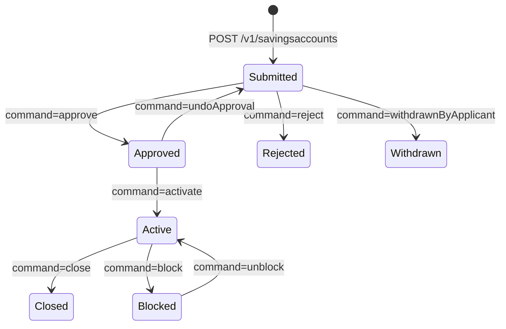

The savings surface of Apache Fineract is split between two cooperating
resources: `SavingsProductsApiResource` (the product templates) and
`SavingsAccountsApiResource` (the customer-facing passbook accounts and their
transactions). Together they cover the full lifecycle: design a product, open
an account against a client or group, accept deposits, allow withdrawals,
accrue and post interest, place legal holds, and finally close the account.

Both resources are mounted under `/v1/savings*` and check the
`SAVINGSACCOUNT` and `SAVINGSPRODUCT` permission names.

## Source files

| Concern | File |
| --- | --- |
| Accounts and transactions | `fineract-provider/src/main/java/org/apache/fineract/portfolio/savings/api/SavingsAccountsApiResource.java` |
| Products | `fineract-provider/src/main/java/org/apache/fineract/portfolio/savings/api/SavingsProductsApiResource.java` |

## Endpoint catalog

### Products — `/v1/savingsproducts`

| Verb | Path | `command` | Permission |
| --- | --- | --- | --- |
| `POST` | `/v1/savingsproducts` | – | `CREATE_SAVINGSPRODUCT` |
| `PUT` | `/v1/savingsproducts/{productId}` | – | `UPDATE_SAVINGSPRODUCT` |
| `GET` | `/v1/savingsproducts` | – | `READ_SAVINGSPRODUCT` |
| `GET` | `/v1/savingsproducts/{productId}` | – | `READ_SAVINGSPRODUCT` |
| `GET` | `/v1/savingsproducts/template` | – | `READ_SAVINGSPRODUCT` |
| `DELETE` | `/v1/savingsproducts/{productId}` | – | `DELETE_SAVINGSPRODUCT` |

### Accounts — `/v1/savingsaccounts`

| Verb | Path | `command` | Permission |
| --- | --- | --- | --- |
| `GET` | `/v1/savingsaccounts/template` | – | `READ_SAVINGSACCOUNT` |
| `GET` | `/v1/savingsaccounts` | – | `READ_SAVINGSACCOUNT` |
| `GET` | `/v1/savingsaccounts/{accountId}` | – | `READ_SAVINGSACCOUNT` |
| `GET` | `/v1/savingsaccounts/external-id/{externalId}` | – | `READ_SAVINGSACCOUNT` |
| `POST` | `/v1/savingsaccounts` | – | `CREATE_SAVINGSACCOUNT` |
| `POST` | `/v1/savingsaccounts/gsim` | – | `CREATE_GSIMACCOUNT` |
| `PUT` | `/v1/savingsaccounts/{accountId}` | – | `UPDATE_SAVINGSACCOUNT` |
| `PUT` | `/v1/savingsaccounts/gsim/{parentAccountId}` | – | `UPDATE_GSIMACCOUNT` |
| `DELETE` | `/v1/savingsaccounts/{accountId}` | – | `DELETE_SAVINGSACCOUNT` |
| `POST` | `/v1/savingsaccounts/{accountId}` | `approve` | `APPROVE_SAVINGSACCOUNT` |
| `POST` | `/v1/savingsaccounts/{accountId}` | `undoApproval` | `APPROVALUNDO_SAVINGSACCOUNT` |
| `POST` | `/v1/savingsaccounts/{accountId}` | `activate` | `ACTIVATE_SAVINGSACCOUNT` |
| `POST` | `/v1/savingsaccounts/{accountId}` | `reject` | `REJECT_SAVINGSACCOUNT` |
| `POST` | `/v1/savingsaccounts/{accountId}` | `withdrawnByApplicant` | `WITHDRAW_SAVINGSACCOUNT` |
| `POST` | `/v1/savingsaccounts/{accountId}` | `close` | `CLOSE_SAVINGSACCOUNT` |
| `POST` | `/v1/savingsaccounts/{accountId}` | `calculateInterest` | `CALCULATEINTEREST_SAVINGSACCOUNT` |
| `POST` | `/v1/savingsaccounts/{accountId}` | `postInterest` | `POSTINTEREST_SAVINGSACCOUNT` |
| `POST` | `/v1/savingsaccounts/{accountId}` | `applyAnnualFees` | `APPLYANNUALFEE_SAVINGSACCOUNT` |
| `POST` | `/v1/savingsaccounts/{accountId}` | `updateWithHoldTax` | `UPDATEWITHHOLDTAX_SAVINGSACCOUNT` |
| `POST` | `/v1/savingsaccounts/{accountId}` | `blockDebit` / `unblockDebit` | `BLOCKDEBIT_SAVINGSACCOUNT` |
| `POST` | `/v1/savingsaccounts/{accountId}` | `blockCredit` / `unblockCredit` | `BLOCKCREDIT_SAVINGSACCOUNT` |
| `POST` | `/v1/savingsaccounts/{accountId}` | `block` / `unblock` | `BLOCK_SAVINGSACCOUNT` |

### Transactions — `/v1/savingsaccounts/{accountId}/transactions`

| Verb | Path | `command` | Permission |
| --- | --- | --- | --- |
| `POST` | `…/transactions` | `deposit` | `DEPOSIT_SAVINGSACCOUNT` |
| `POST` | `…/transactions` | `withdrawal` | `WITHDRAWAL_SAVINGSACCOUNT` |
| `POST` | `…/transactions` | `holdAmount` | `HOLDAMOUNT_SAVINGSACCOUNT` |
| `POST` | `…/transactions/{transactionId}` | `undo` | `ADJUSTTRANSACTION_SAVINGSACCOUNT` |
| `POST` | `…/transactions/{transactionId}` | `releaseAmount` | `RELEASEAMOUNT_SAVINGSACCOUNT` |
| `POST` | `…/transactions/{transactionId}` | `reverse` | `ADJUSTTRANSACTION_SAVINGSACCOUNT` |
| `POST` | `…/transactions/{transactionId}` | `modify` | `ADJUSTTRANSACTION_SAVINGSACCOUNT` |
| `GET` | `…/transactions/template` | – | `READ_SAVINGSACCOUNT` |
| `GET` | `…/transactions/{transactionId}` | – | `READ_SAVINGSACCOUNT` |

## Opening an account

<CodeGroup>

```json POST /v1/savingsaccounts
{
  "clientId": 1,
  "productId": 1,
  "submittedOnDate": "01 February 2025",
  "nominalAnnualInterestRate": 5.0,
  "interestCompoundingPeriodType": 1,
  "interestPostingPeriodType": 4,
  "interestCalculationType": 1,
  "interestCalculationDaysInYearType": 365,
  "withdrawalFeeForTransfers": false,
  "allowOverdraft": false,
  "enforceMinRequiredBalance": false,
  "locale": "en",
  "dateFormat": "dd MMMM yyyy"
}
```

```json POST /v1/savingsaccounts/{accountId}?command=approve
{
  "approvedOnDate": "02 February 2025",
  "note": "All KYC documents on file",
  "locale": "en",
  "dateFormat": "dd MMMM yyyy"
}
```

</CodeGroup>

## Deposits, withdrawals and holds

<CodeGroup>

```json POST .../transactions?command=deposit
{
  "transactionDate": "05 February 2025",
  "transactionAmount": "250.00",
  "paymentTypeId": 1,
  "note": "Cash deposit at branch",
  "locale": "en",
  "dateFormat": "dd MMMM yyyy"
}
```

```json POST .../transactions?command=withdrawal
{
  "transactionDate": "10 February 2025",
  "transactionAmount": "75.00",
  "paymentTypeId": 1,
  "locale": "en",
  "dateFormat": "dd MMMM yyyy"
}
```

```json POST .../transactions?command=holdAmount
{
  "transactionDate": "11 February 2025",
  "transactionAmount": "100.00",
  "reasonForBlock": "Garnishment order #4421",
  "lienAllowed": false,
  "locale": "en",
  "dateFormat": "dd MMMM yyyy"
}
```

</CodeGroup>

A subsequent `POST .../transactions/{transactionId}?command=releaseAmount`
releases the hold; the response carries the resulting reversal transaction id.

## Example response

```json
{
  "officeId": 1,
  "clientId": 1,
  "savingsId": 14,
  "resourceId": 87,
  "changes": {
    "accountNumber": "000000014",
    "locale": "en",
    "dateFormat": "dd MMMM yyyy",
    "transactionDate": [2025, 2, 5],
    "transactionAmount": "250.00",
    "paymentTypeId": "1"
  }
}
```

## Lifecycle



## Interest posting and tax

The `?command=calculateInterest` operation recomputes the accrued interest
without writing a journal entry — it is what the scheduled
`Post Interest For Savings` job calls under the hood. `postInterest` actually
posts the interest as a transaction and creates the matching withholding-tax
debit when `withHoldTax` is enabled on the product.

<Tip>
For high-volume tenants, prefer the scheduled job over ad-hoc
`postInterest` calls — it batches all eligible accounts in a single
transaction and respects the configured posting frequency.
</Tip>

## Bulk import

| Verb | Path | Purpose |
| --- | --- | --- |
| `GET` | `/v1/savingsaccounts/downloadtemplate` | Empty workbook for account opening |
| `POST` | `/v1/savingsaccounts/uploadtemplate` | Bulk upload populated workbook |
| `GET` | `/v1/savingsaccounts/transactions/downloadtemplate` | Empty transactions workbook |
| `POST` | `/v1/savingsaccounts/transactions/uploadtemplate` | Bulk deposit / withdrawal upload |

## Charges on a savings account

Savings products can pre-attach charges (monthly fees, annual fees, withdrawal
fees, overdraft fees). They are also attachable ad-hoc against an existing
account.

| Verb | Path | `command` | Permission |
| --- | --- | --- | --- |
| `GET` | `/v1/savingsaccounts/{accountId}/charges` | – | `READ_SAVINGSCHARGE` |
| `POST` | `/v1/savingsaccounts/{accountId}/charges` | – | `CREATE_SAVINGSCHARGE` |
| `POST` | `/v1/savingsaccounts/{accountId}/charges/{savingsAccountChargeId}` | `paycharge` | `PAY_SAVINGSCHARGE` |
| `POST` | `/v1/savingsaccounts/{accountId}/charges/{savingsAccountChargeId}` | `waive` | `WAIVE_SAVINGSCHARGE` |
| `POST` | `/v1/savingsaccounts/{accountId}/charges/{savingsAccountChargeId}` | `inactivate` | `INACTIVATE_SAVINGSCHARGE` |
| `PUT` | `/v1/savingsaccounts/{accountId}/charges/{savingsAccountChargeId}` | – | `UPDATE_SAVINGSCHARGE` |
| `DELETE` | `/v1/savingsaccounts/{accountId}/charges/{savingsAccountChargeId}` | – | `DELETE_SAVINGSCHARGE` |

```json POST /v1/savingsaccounts/{accountId}/charges
{
  "chargeId": 9,
  "amount": "2.50",
  "dueDate": "01 March 2025",
  "feeOnMonthDay": "01 03",
  "monthDayFormat": "dd MM",
  "locale": "en",
  "dateFormat": "dd MMMM yyyy"
}
```

## Product creation

```json POST /v1/savingsproducts
{
  "name": "Regular Savings",
  "shortName": "RSAV",
  "currencyCode": "USD",
  "digitsAfterDecimal": 2,
  "nominalAnnualInterestRate": 5,
  "interestCompoundingPeriodType": 1,
  "interestPostingPeriodType": 4,
  "interestCalculationType": 1,
  "interestCalculationDaysInYearType": 365,
  "minRequiredOpeningBalance": 0,
  "lockinPeriodFrequency": 0,
  "lockinPeriodFrequencyType": 2,
  "withdrawalFeeForTransfers": false,
  "allowOverdraft": false,
  "accountingRule": 1,
  "locale": "en"
}
```

<Info>
`interestPostingPeriodType` values: `4` Monthly, `5` Quarterly, `6`
Bi-annual, `7` Annual. The product setting becomes the default on every
account that inherits from it, but the account-level value can override it
at creation time.
</Info>

## GSIM — group savings individual monitoring

GSIM accounts model a group bank account where each member has a passbook
sub-account. The parent account lives at
`/v1/savingsaccounts/gsim/{parentAccountId}` and a single `gsimcommands`
endpoint fans command actions across every member account in one call.

```bash
POST /v1/savingsaccounts/gsim
POST /v1/savingsaccounts/gsimcommands/{parentAccountId}?command=approve
PUT  /v1/savingsaccounts/gsim/{parentAccountId}
```

## See also

<CardGroup cols={2}>
  <Card title="Deposits API" href="/api/deposit-accounts-api">
    Fixed and recurring deposit variants of these endpoints.
  </Card>
  <Card title="Accounting APIs" href="/api/accounting-api">
    The journal entries posted by savings transactions.
  </Card>
</CardGroup>
