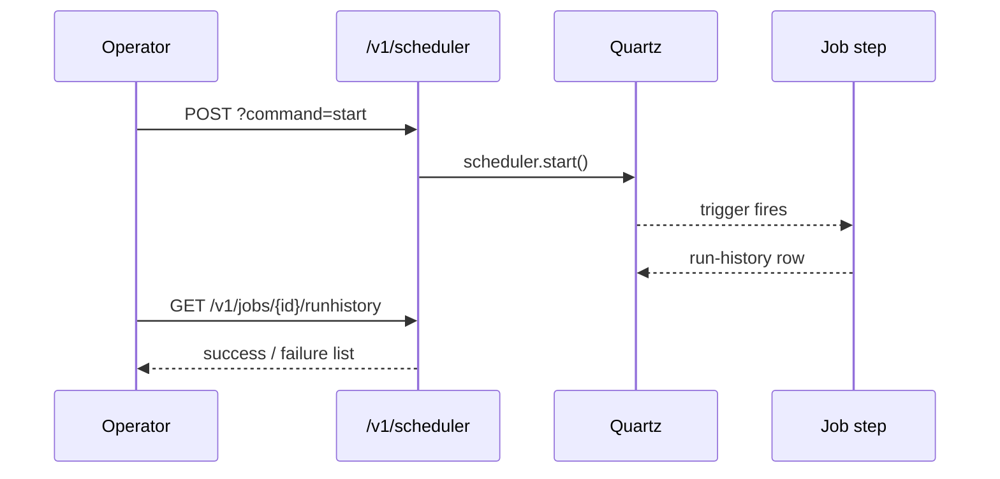

Apache Fineract ships a Quartz-backed scheduler that owns every recurring
back-office activity: interest accrual, COB (close-of-business), loan
delinquency tagging, deposit maturity, statement generation, email and SMS
dispatch, and more. Four REST resources let operators inspect and steer it,
plus a Batch API that lets clients pack multiple Fineract calls into one
HTTP round-trip.

## Source files

| Concern | File |
| --- | --- |
| Scheduler engine | `fineract-provider/src/main/java/org/apache/fineract/infrastructure/jobs/api/SchedulerApiResource.java` |
| Job catalog | `fineract-provider/src/main/java/org/apache/fineract/infrastructure/jobs/api/SchedulerJobApiResource.java` |
| Inline (synchronous) job runs | `fineract-provider/src/main/java/org/apache/fineract/infrastructure/jobs/api/InlineJobApiResource.java` |
| Batch / composite calls | `fineract-core/src/main/java/org/apache/fineract/batch/api/BatchApiResource.java` |

## Endpoint catalog

### Scheduler engine — `/v1/scheduler`

| Verb | Path | `command` | Permission |
| --- | --- | --- | --- |
| `GET` | `/v1/scheduler` | – | `READ_SCHEDULER` |
| `POST` | `/v1/scheduler` | `start` | `UPDATE_SCHEDULER` |
| `POST` | `/v1/scheduler` | `stop` | `UPDATE_SCHEDULER` |

### Job catalog — `/v1/jobs`

| Verb | Path | `command` | Permission |
| --- | --- | --- | --- |
| `GET` | `/v1/jobs` | – | `READ_SCHEDULER` |
| `GET` | `/v1/jobs/{jobId}` | – | `READ_SCHEDULER` |
| `GET` | `/v1/jobs/{jobId}/runhistory` | – | `READ_SCHEDULER` |
| `GET` | `/v1/jobs/short-name/{shortName}` | – | `READ_SCHEDULER` |
| `GET` | `/v1/jobs/short-name/{shortName}/runhistory` | – | `READ_SCHEDULER` |
| `POST` | `/v1/jobs/{jobId}` | `executeJob` | `EXECUTEJOB_SCHEDULER` |
| `POST` | `/v1/jobs/short-name/{shortName}` | `executeJob` | `EXECUTEJOB_SCHEDULER` |
| `PUT` | `/v1/jobs/{jobId}` | – | `UPDATE_SCHEDULER` |
| `PUT` | `/v1/jobs/short-name/{shortName}` | – | `UPDATE_SCHEDULER` |

### Inline jobs — `/v1/jobs/{jobName}/inline`

| Verb | Path | `command` | Permission |
| --- | --- | --- | --- |
| `POST` | `/v1/jobs/{jobName}/inline` | – | `EXECUTEJOB_SCHEDULER` |

### Batch API — `/v1/batches`

| Verb | Path | Query | Purpose |
| --- | --- | --- | --- |
| `POST` | `/v1/batches` | `enclosingTransaction=true\|false` | Execute up to N inner requests in declared order |

<Info>
The Batch API is independent of the Quartz scheduler — it composes the same
REST surface that an outside caller would use, but inside a single HTTP
request and (optionally) a single database transaction.
</Info>

## Starting and stopping the scheduler

```bash
GET  /v1/scheduler
POST /v1/scheduler?command=start
POST /v1/scheduler?command=stop
```

The GET response includes the `active` flag, the in-flight `mode` (single-node
or batch), and the next-fire time for every registered job:

```json
{
  "active": true,
  "mode": 0,
  "jobs": [
    { "jobName": "Update loan summary", "active": true, "currentlyRunning": false },
    { "jobName": "Apply Charge To Overdue Loans", "active": true, "currentlyRunning": false },
    { "jobName": "Loan COB", "active": true, "currentlyRunning": false }
  ]
}
```

## Inspecting and re-firing a job

```json GET /v1/jobs/3
{
  "jobId": 3,
  "displayName": "Apply Charge To Overdue Loans",
  "shortName": "ACTOL",
  "nextRunTime": "2025-02-28T00:00:00",
  "cronExpression": "0 0 0 1/1 * ? *",
  "active": true,
  "currentlyRunning": false,
  "lastRunHistory": {
    "version": 4521,
    "startTime": "2025-02-27T00:00:00",
    "endTime": "2025-02-27T00:00:11",
    "status": "success",
    "triggerType": "cron"
  }
}
```

To re-fire it on demand the operator posts the `executeJob` command:

```bash
POST /v1/jobs/3?command=executeJob
POST /v1/jobs/short-name/ACTOL?command=executeJob
```

To change its cron expression or disable it:

<CodeGroup>

```json PUT /v1/jobs/3
{
  "cronExpression": "0 30 0 1/1 * ? *",
  "active": true
}
```

```json PUT /v1/jobs/3 (disable)
{
  "active": false
}
```

</CodeGroup>

## Inline execution

For tests and integration scenarios where the caller must block until the job
finishes, the `inline` endpoint runs the job synchronously on the request
thread instead of scheduling it through Quartz. The job name in the path is
the Quartz job name (with spaces URL-encoded or replaced with `%20`).

```bash
POST /v1/jobs/LOAN_COB/inline
POST /v1/jobs/Apply%20Charge%20To%20Overdue%20Loans/inline
```

```json
{
  "businessDate": "2025-02-27",
  "loanIds": [42, 43]
}
```

`InlineJobApiResource` validates the body using the same parsers as the
scheduled run and returns a `200 OK` once the job step completes.

<Warning>
Inline runs hold the HTTP connection for the entire job duration. Use them for
deterministic catch-up scenarios (single loan COB, a missed accrual), not for
bulk tenant-wide jobs.
</Warning>

## Batch API

The Batch resource lets a caller pack several Fineract requests into one
payload. Each inner request can name the previous one via `reference`, so the
caller can chain operations whose ids are not known up front.

```json POST /v1/batches?enclosingTransaction=true
[
  {
    "requestId": 1,
    "relativeUrl": "clients",
    "method": "POST",
    "headers": [{ "name": "Content-Type", "value": "application/json" }],
    "body": "{ \"officeId\": 1, \"firstname\": \"Aisha\", \"lastname\": \"Okafor\", \"active\": true, \"activationDate\": \"01 February 2025\", \"locale\": \"en\", \"dateFormat\": \"dd MMMM yyyy\" }"
  },
  {
    "requestId": 2,
    "reference": 1,
    "relativeUrl": "loans",
    "method": "POST",
    "headers": [{ "name": "Content-Type", "value": "application/json" }],
    "body": "{ \"clientId\": \"$.clientId\", \"productId\": 1, \"principal\": \"5000\", \"loanType\": \"individual\", \"locale\": \"en\", \"dateFormat\": \"dd MMMM yyyy\", \"submittedOnDate\": \"01 February 2025\", \"expectedDisbursementDate\": \"01 February 2025\" }"
  }
]
```

When `enclosingTransaction=true` the whole batch runs in one DB transaction
and any failure rolls everything back; with `false` each step commits on its
own and a partial success is possible.

## Example response

```json
[
  { "requestId": 1, "statusCode": 200, "body": "{\"officeId\":1,\"clientId\":102,\"resourceId\":102}" },
  { "requestId": 2, "statusCode": 200, "body": "{\"officeId\":1,\"clientId\":102,\"loanId\":45,\"resourceId\":45}" }
]
```

## Lifecycle



## Job run history

Every fire of a scheduled job appends a row to the run-history table. The
endpoint returns it paginated newest-first:

```json GET /v1/jobs/3/runhistory?offset=0&limit=10
{
  "totalFilteredRecords": 27,
  "pageItems": [
    {
      "version": 4521,
      "startTime": "2025-02-27T00:00:00",
      "endTime": "2025-02-27T00:00:11",
      "status": "success",
      "triggerType": "cron"
    },
    {
      "version": 4520,
      "startTime": "2025-02-26T00:00:00",
      "endTime": "2025-02-26T00:00:09",
      "status": "success",
      "triggerType": "cron"
    }
  ]
}
```

Failures expose the underlying exception via the `errorMessage` and
`errorLog` fields, making it easy to bake an alerting hook on top of the
endpoint.

## Common scheduled jobs

A representative subset of the jobs registered out of the box:

| Short name | Display name | Module |
| --- | --- | --- |
| `LOAN_COB` | Loan COB | core |
| `SAVINGS_COB` | Savings COB | savings-cob |
| `POST_INT_SAV` | Post Interest For Savings | savings |
| `ACTOL` | Apply Charge To Overdue Loans | loan |
| `UDLA` | Update Loan Arrears Aging | loan |
| `UPDM` | Update Deposit Accounts Maturity details | savings |
| `EXTACTRA` | Add Periodic Accrual Entries | loan |
| `MAILJOB` | Send messages via email | infrastructure |
| `SMSJOB` | Send messages via SMS | infrastructure |
| `REPORTMAIL` | Execute and email scheduled reports | report |

<Tip>
Short names are convenient for human-friendly URLs, but in CI/CD pipelines
prefer the numeric job id — it never changes when the display name is
edited via PUT.
</Tip>

## Batch error semantics

Two flags control failure handling on a batch call:

- `enclosingTransaction=true` &mdash; the JDBC transaction wraps every step.
  A non-2xx response on any step rolls back all earlier steps.
- `enclosingTransaction=false` &mdash; each step commits independently; the
  array response shows the actual status code per step so the caller can
  retry selectively.

## See also

<CardGroup cols={2}>
  <Card title="Business Step API" href="/api/business-step-config-api">
    Reorder the COB business steps that Loan COB and friends execute.
  </Card>
  <Card title="Loans API" href="/api/loans-api">
    The COB and overdue-charge jobs drive delinquency on loan accounts.
  </Card>
</CardGroup>
