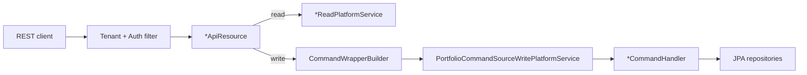
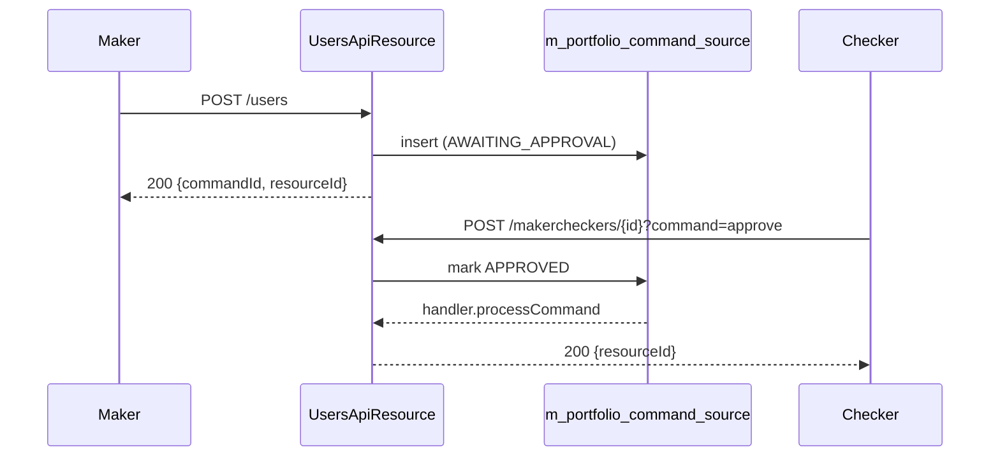

Apache Fineract exposes its identity and access-control model through a small cluster of JAX-RS resources living under `fineract-provider/src/main/java/org/apache/fineract/useradministration/api/`. Together they cover everything an operator console needs to manage who can sign into the platform and what they can do once signed in: `UsersApiResource` for `AppUser` CRUD, `RolesApiResource` for role definition and permission binding, `PermissionsApiResource` for the catalogue of platform permission codes, `PasswordPreferencesApiResource` for the active password validation policy, and `ForgotPasswordApiResource` for the unauthenticated reset flow.

Every endpoint on this page is mounted under `/fineract-provider/api/v1/...` and goes through the standard Fineract authentication filter — except the forgot-password POST which is whitelisted in `SpringSecurityConfig`. All writes are routed through the maker-checker `CommandWrapper` plumbing, so the payloads on this page are equally usable from `BatchApiResource` or queued as four-eyes commands.

## Source files

| Resource | File |
| --- | --- |
| `UsersApiResource` | `fineract-provider/.../useradministration/api/UsersApiResource.java` |
| `RolesApiResource` | `fineract-provider/.../useradministration/api/RolesApiResource.java` |
| `PermissionsApiResource` | `fineract-provider/.../useradministration/api/PermissionsApiResource.java` |
| `PasswordPreferencesApiResource` | `fineract-provider/.../useradministration/api/PasswordPreferencesApiResource.java` |
| `ForgotPasswordApiResource` | `fineract-provider/.../useradministration/api/ForgotPasswordApiResource.java` |

## Request flow



## `UsersApiResource` — `/v1/users`

`UsersApiResource` is the operator-facing CRUD for `AppUser`. The `template` endpoint returns the dropdown data (offices, roles, staff) that the web app needs to render the create form; `pwd` is the explicit "change password" sub-command separate from `update`; the upload/download template endpoints back the Excel bulk-import flow.

| Verb | Path | Purpose |
| --- | --- | --- |
| GET | `/v1/users` | List all users. |
| GET | `/v1/users/{userId}` | Fetch one user. |
| GET | `/v1/users/template` | Form template (offices, roles, staff). |
| POST | `/v1/users` | Create a user. |
| PUT | `/v1/users/{userId}` | Update name, email, office, roles, password-never-expires flag. |
| POST | `/v1/users/{userId}/pwd` | Change password (separate maker-checker command). |
| DELETE | `/v1/users/{userId}` | Soft-delete the user. |
| GET | `/v1/users/downloadtemplate` | Download Excel import template. |
| POST | `/v1/users/uploadtemplate` | Upload populated template (bulk create). |

<Note>
`AppUser` is soft-deleted: the `is_deleted` column flips to `true` and the username is suffixed with the user id, so the slot can be re-used.
</Note>

### Example: create a user

```http
POST /fineract-provider/api/v1/users
Content-Type: application/json
```

```json
{
  "username": "amelia.harris",
  "firstname": "Amelia",
  "lastname": "Harris",
  "email": "amelia.harris@example.org",
  "officeId": 1,
  "staffId": 12,
  "roles": [1, 4],
  "sendPasswordToEmail": true,
  "passwordNeverExpires": false,
  "isSelfServiceUser": false
}
```

Setting `sendPasswordToEmail` to `true` makes Fineract generate a random password and dispatch it via the SMTP configuration; setting it to `false` requires `password` and `repeatPassword` in the same body.

### Example: change a user's password

```http
POST /fineract-provider/api/v1/users/57/pwd
```

```json
{
  "password": "Tractor-Octopus-49!",
  "repeatPassword": "Tractor-Octopus-49!"
}
```

The candidate is fed through the active `PasswordValidationPolicy` (see below) before the BCrypt hash lands in `m_appuser.password`.

### Example: update roles only

```json
{
  "roles": [1, 4, 8]
}
```

`UsersApiResource.update` accepts any subset of mutable fields — supplying just `roles` rewrites the `m_appuser_role` rows for the user without touching name or office.

## `RolesApiResource` — `/v1/roles`

`RolesApiResource` covers both the role catalogue (`Role` rows) and the permission binding for each role. Note the action-on-roles POST that toggles the `disabled` flag — disabling a role keeps the membership rows in place but causes the security filter to ignore them.

| Verb | Path | Purpose |
| --- | --- | --- |
| GET | `/v1/roles` | List roles. |
| GET | `/v1/roles/{roleId}` | Fetch one role. |
| POST | `/v1/roles` | Create a role. |
| PUT | `/v1/roles/{roleId}` | Rename / re-describe the role. |
| POST | `/v1/roles/{roleId}?command=disable\|enable` | Toggle disabled flag. |
| GET | `/v1/roles/{roleId}/permissions` | Permissions bound to the role. |
| PUT | `/v1/roles/{roleId}/permissions` | Replace the permission set. |
| DELETE | `/v1/roles/{roleId}` | Delete an empty role. |

### Example: create a role and bind permissions

```http
POST /fineract-provider/api/v1/roles
```

```json
{
  "name": "Branch Loan Officer",
  "description": "Can originate and disburse loans within their office."
}
```

```http
PUT /fineract-provider/api/v1/roles/9/permissions
```

```json
{
  "permissions": {
    "READ_LOAN":              true,
    "CREATE_LOAN":            true,
    "DISBURSE_LOAN":          true,
    "READ_CLIENT":            true,
    "CREATE_LOANCHARGE":      true,
    "READ_LOANPRODUCT":       true,
    "READ_SAVINGSACCOUNT":    false
  }
}
```

The PUT replaces the role's permission set wholesale: any code mapped to `true` becomes a row in `m_role_permission`, any `false` removes it. Permission codes come from `PermissionsApiResource` (below) — they are the strings registered in `m_permission.code`.

### Example: disable a role

```http
POST /fineract-provider/api/v1/roles/9?command=disable
```

```json
{}
```

## `PermissionsApiResource` — `/v1/permissions`

Permissions in Fineract are a flat catalogue plus a per-tenant "maker-checker required" override. There is no create — codes are loaded by Liquibase. The PUT toggles which codes require a checker.

| Verb | Path | Purpose |
| --- | --- | --- |
| GET | `/v1/permissions` | List every permission code with the maker-checker flag. |
| PUT | `/v1/permissions` | Bulk-update which codes require maker-checker. |

### Example: enable maker-checker on a permission

```http
PUT /fineract-provider/api/v1/permissions
```

```json
{
  "permissions": {
    "DISBURSE_LOAN":          true,
    "WRITE_OFF_LOAN":         true,
    "ADJUST_LOAN_TRANSACTION": true,
    "REJECT_LOAN":            false
  }
}
```

Each `true` flag flips `m_permission.can_maker_checker = 1`. Once set, the corresponding command goes through `m_portfolio_command_source` with `processing_result = AWAITING_APPROVAL` and a checker has to call `MakercheckersApiResource` to release it.

## `PasswordPreferencesApiResource` — `/v1/passwordpreferences`

Fineract ships several `PasswordValidationPolicy` rows in `m_password_validation_policy`. Exactly one is `active = true` at a time; `PasswordPreferencesApiResource` is the way to switch which one wins.

| Verb | Path | Purpose |
| --- | --- | --- |
| GET | `/v1/passwordpreferences` | Active policy. |
| GET | `/v1/passwordpreferences/template` | All available policies (for a dropdown). |
| PUT | `/v1/passwordpreferences` | Switch the active policy. |

### Example: pick the strongest policy

```http
PUT /fineract-provider/api/v1/passwordpreferences
```

```json
{ "validationPolicyId": 4 }
```

The active policy is consulted by both `POST /users` and `POST /users/{id}/pwd`; existing hashes are not re-validated.

## `ForgotPasswordApiResource` — `/v1/password/forgot`

Unauthenticated entry point. It generates a temporary password, writes it to `m_appuser.password` + `password_never_expires = false`, and emails the user. The endpoint is rate-limited at the filter chain — see `fineract-security`.

| Verb | Path | Purpose |
| --- | --- | --- |
| POST | `/v1/password/forgot` | Issue a temporary password and email it. |

### Example: trigger a reset by email

```http
POST /fineract-provider/api/v1/password/forgot
```

```json
{ "email": "amelia.harris@example.org" }
```

The server responds 200 whether or not the email matches a user — this is intentional to avoid disclosing valid accounts. Check the SMTP outbox / `m_email_outbound` to confirm delivery.

## Maker-checker behaviour



If the permission's `can_maker_checker` flag is `false`, the handler runs inline and the response carries the new `resourceId` immediately.

<Tip>
The same five command codes — `CREATE_USER`, `UPDATE_USER`, `DELETE_USER`, `CREATEPASSWORD_USER`, `UPDATEROLE_USER` — show up in the `commandHandlers` map; if you bind a custom handler you must register it against those exact codes or your code will never fire.
</Tip>

## Common failure modes

<AccordionGroup>
  <Accordion title="403 PERMISSION_NOT_GRANTED on PUT /users/{id}">
  The signed-in user must hold `UPDATE_USER` *and* be in the same office hierarchy as the target (`AppUserAccessUtil` enforces this). Add the user to a head-office role or move the target.
  </Accordion>
  <Accordion title="400 validation.msg.user.password.does.not.match.regexp">
  The candidate failed the active `PasswordValidationPolicy`. Either pick a weaker policy via `PasswordPreferencesApiResource` or comply with the regex listed in `m_password_validation_policy.value`.
  </Accordion>
  <Accordion title="DELETE /users/{id} returns 404 the second time">
  Deletes are idempotent only on the first call — the row stays but `is_deleted = true` and the username is suffixed with `_<id>`. Subsequent deletes hit `UserNotFoundException`.
  </Accordion>
</AccordionGroup>

## See also

<CardGroup cols={2}>
  <Card title="Users entity reference" icon="user" href="/users/users">Field-by-field walkthrough of `AppUser`.</Card>
  <Card title="Roles and permissions" icon="shield" href="/users/roles">How `Role` and `Permission` rows compose.</Card>
  <Card title="Password preferences" icon="key" href="/users/password-preferences">The `PasswordValidationPolicy` table.</Card>
  <Card title="Forgot password" icon="envelope" href="/users/forgot-password">Reset flow internals and SMTP wiring.</Card>
</CardGroup>
