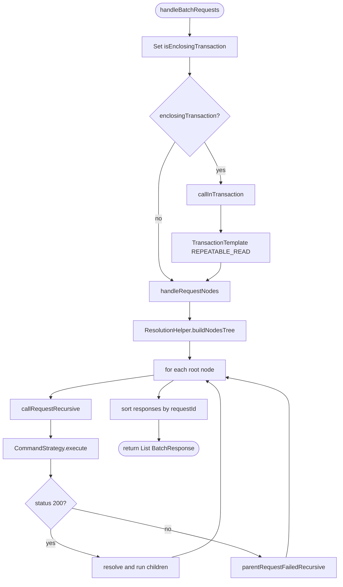

`BatchApiService` is the engine that turns a list of `BatchRequest`s into a
list of `BatchResponse`s. In Apache Fineract it lives in
`org.apache.fineract.batch.service` and is implemented by `BatchApiServiceImpl`,
which orchestrates strategy lookup, request preprocessing, parent/child
resolution, transaction wrapping, retry, and error short-circuiting.

## The contract

```java BatchApiService.java
public interface BatchApiService {

    /** enclosingTransaction=false: every root runs in its own transaction. */
    List<BatchResponse> handleBatchRequestsWithoutEnclosingTransaction(
            List<BatchRequest> requestList, UriInfo uriInfo);

    /** enclosingTransaction=true: one wrapping transaction; any failure rolls back all. */
    List<BatchResponse> handleBatchRequestsWithEnclosingTransaction(
            List<BatchRequest> requestList, UriInfo uriInfo);
}
```

Both methods funnel into a private `handleBatchRequests(list, uriInfo, enclosingTransaction)`.

```java BatchApiServiceImpl.java
private List<BatchResponse> handleBatchRequests(
        List<BatchRequest> requestList, UriInfo uriInfo, boolean enclosingTransaction) {
    BatchRequestContextHolder.setIsEnclosingTransaction(enclosingTransaction);
    try {
        return enclosingTransaction
                ? callInTransaction(Function.identity()::apply,
                        () -> handleRequestNodes(requestList, uriInfo))
                : handleRequestNodes(requestList, uriInfo);
    } finally {
        BatchRequestContextHolder.resetIsEnclosingTransaction();
    }
}
```

<Note>
  `BatchRequestContextHolder.setIsEnclosingTransaction(boolean)` is a thread
  local. Downstream code — including domain services — can call
  `BatchRequestContextHolder.isEnclosingTransaction()` to alter behaviour (for
  example, skip an internal `@Transactional` boundary because the outer one
  already exists).
</Note>

## Collaborators

`BatchApiServiceImpl` is constructor-injected with everything it needs.

<ResponseField name="CommandStrategyProvider strategyProvider" type="bean">
  Resolves a `(method, relativeUrl)` pair to a `CommandStrategy` bean.
</ResponseField>

<ResponseField name="ResolutionHelper resolutionHelper" type="bean">
  Builds the dependency tree from `reference` links and substitutes JSON Path
  tokens in child requests using parent responses.
</ResponseField>

<ResponseField name="ErrorHandler errorHandler" type="bean">
  Wraps caught exceptions into `ErrorInfo` objects with a status, an
  application error code, and a message.
</ResponseField>

<ResponseField name="List<BatchFilter> batchFilters" type="beans">
  An interceptor chain wrapped around the strategy via `BatchCallHandler`.
  Filters may translate, audit, or log requests and responses.
</ResponseField>

<ResponseField name="List<BatchRequestPreprocessor> batchPreprocessors" type="beans">
  Each preprocessor can mutate the request or short-circuit with an exception
  before strategy execution.
</ResponseField>

<ResponseField name="RetryConfigurationAssembler retryConfigurationAssembler" type="bean">
  Provides a Resilience4j `Retry` for enclosing-transaction batches so a
  serialisation failure (REPEATABLE_READ deadlock) can be retried transparently.
</ResponseField>

<ResponseField name="PlatformTransactionManager transactionManager" type="bean">
  Used to build a fresh `TransactionTemplate` for each enclosing transaction.
</ResponseField>

<ResponseField name="EntityManager entityManager" type="JPA">
  `flush()` is called after each child write inside an enclosing transaction so
  the next child sees the previous child's persisted state.
</ResponseField>

## End-to-end flow



## Strategy lookup

For every request, `executeRequest` asks the provider for a strategy keyed on
HTTP method and URL pattern:

```java
final CommandStrategy commandStrategy = this.strategyProvider.getCommandStrategy(
        CommandContext.resource(request.getRelativeUrl()).method(request.getMethod()).build());
```

`CommandStrategyProvider` keeps a map of `CommandContext -> beanName`. Each
context's URL is a regex; matching happens with `commandContext.matcher`. If no
pattern matches, the provider returns `UnknownCommandStrategy`, which emits a
501-style response. See [Strategies](/batch/command-strategies) for the full
catalogue.

<Tip>
  Patterns are pre-compiled at provider construction time. Adding a new
  endpoint to the Batch API is a one-line registration in `init()` plus a new
  `*CommandStrategy` bean.
</Tip>

## Preprocessors

Before the strategy runs, the request is threaded through every registered
`BatchRequestPreprocessor`:

```java
private Either<RuntimeException, BatchRequest> runPreprocessor(
        List<BatchRequestPreprocessor> remaining, BatchRequest request) {
    if (remaining.isEmpty()) return Either.right(request);
    BatchRequestPreprocessor pp = remaining.get(0);
    Either<RuntimeException, BatchRequest> result = pp.preprocess(request);
    return result.isLeft()
            ? result
            : runPreprocessor(remaining.subList(1, remaining.size()), result.get());
}
```

Each preprocessor returns an `Either<RuntimeException, BatchRequest>`:

- `Right(request)` — possibly mutated, hand it to the next preprocessor.
- `Left(exception)` — short-circuit; the service converts the exception to a
  failure response and skips strategy execution.

<Warning>
  Preprocessors run *per child*, not once for the whole batch. A preprocessor
  that resolves an idempotency key, for instance, must be idempotent because
  the same key may flow through multiple children in the same batch.
</Warning>

## Parent/child resolution

The list of `BatchRequest`s is converted to a forest by
`ResolutionHelper.buildNodesTree(list)`. The rules:

<Steps>
  <Step title="Walk inputs in order">
    A request with `reference == null` becomes a new root node appended to
    the root list.
  </Step>
  <Step title="Attach references">
    A request with a non-null `reference` is searched recursively through the
    existing forest for a node whose `requestId` matches. When found, it is
    attached as a child.
  </Step>
  <Step title="Fail closed on dangling reference">
    If no parent is found, `BatchReferenceInvalidException` is thrown — the
    whole batch returns a single error response.
  </Step>
  <Step title="Recurse on each root">
    For each root, `callRequestRecursive` executes the request and, if the
    status is 200, resolves each child's JSON Path tokens against the response
    and recurses.
  </Step>
</Steps>

```java
for (BatchRequestNode rootNode : rootNodes) {
    this.callRequestRecursive(rootNode.getRequest(), rootNode, responseList, uriInfo);
}
responseList.sort(Comparator.comparing(BatchResponse::getRequestId));
```

### Reference substitution

`ResolutionHelper.resolveRequest(child, parentResponse)` parses the parent's
response body with Jayway JSONPath and rewrites the child:

- Tokens like `$.clientId` inside `relativeUrl` become the literal ID.
- Tokens inside `body` get substituted in place; the result remains a valid
  JSON document.

A `JsonPathException` during resolution does **not** crash the batch — the
child is converted to a per-child error response and its descendants are
marked failed.

## The recursive runner

```java
private void callRequestRecursive(BatchRequest request, BatchRequestNode requestNode,
        List<BatchResponse> responseList, UriInfo uriInfo) {
    BatchResponse response = executeRequest(request, uriInfo);
    responseList.add(response);
    if (response.getStatusCode() != null && response.getStatusCode() == SC_OK) {
        requestNode.getChildNodes().forEach(childNode -> {
            BatchRequest childRequest = childNode.getRequest();
            try {
                BatchRequest resolvedChildRequest =
                        this.resolutionHelper.resolveRequest(childRequest, response);
                callRequestRecursive(resolvedChildRequest, childNode, responseList, uriInfo);
            } catch (JsonPathException jpex) {
                responseList.add(buildOrThrowErrorResponse(jpex, childRequest));
            }
        });
    } else {
        responseList.addAll(parentRequestFailedRecursive(request, requestNode, response, null));
    }
}
```

When the status is not 200, `parentRequestFailedRecursive` short-circuits
**every descendant**, returning HTTP 409 responses bearing the message
`Parent request with id <n> was erroneous!`.

<Info>
  Inside an enclosing transaction, the same method also calls
  `setRollbackOnly()` on the transaction status held by
  `BatchRequestContextHolder`. The whole batch is doomed at that point.
</Info>

## Per-child execution

`executeRequest` is the chokepoint where headers become thread-local
attributes, filters wrap the strategy, and exceptions become responses.

```java
BatchRequestContextHolder.setRequestAttributes(new HashMap<>(
        Optional.ofNullable(request.getHeaders())
                .map(list -> list.stream().collect(Collectors.toMap(Header::getName, Header::getValue)))
                .orElse(Collections.emptyMap())));
if (BatchRequestContextHolder.isEnclosingTransaction()
        && BatchRequestContextHolder.getEnclosingTransaction().stream().anyMatch(ts -> !ts.isReadOnly())) {
    entityManager.flush();
}
BatchCallHandler callHandler = new BatchCallHandler(this.batchFilters, commandStrategy::execute);
final BatchResponse rootResponse = callHandler.serviceCall(request, uriInfo);
```

Two subtleties worth calling out:

<CardGroup cols={2}>
  <Card title="entityManager.flush()" icon="floppy-disk">
    Inside a write-mode enclosing transaction the previous child's writes are
    flushed before the next child runs. Without this, the next child would not
    see freshly-minted IDs through queries.
  </Card>
  <Card title="BatchCallHandler" icon="shuffle">
    The filter chain wraps `commandStrategy::execute` as the terminal handler.
    Filters can short-circuit by returning their own `BatchResponse`.
  </Card>
</CardGroup>

## Retry for enclosing transactions

Enclosing-transaction batches run under
`TransactionDefinition.ISOLATION_REPEATABLE_READ`. Under load, the database can
reject a transaction with a serialisation conflict. To keep the batch
recoverable, the service wraps the work in a Resilience4j `Retry`:

```java
Retry retry = retryConfigurationAssembler.getRetryConfigurationForBatchApiWithEnclosingTransaction();
Supplier<List<BatchResponse>> retryingBatch = Retry.decorateSupplier(retry, batchSupplier);
try {
    return retryingBatch.get();
} catch (TransactionException | NonTransientDataAccessException ex) {
    return buildErrorResponses(ex, responseList);
} catch (BatchExecutionException ex) {
    log.error("Exception during the batch request processing", ex);
    responseList.add(buildErrorResponse(ex.getCause(), ex.getRequest()));
    return responseList;
}
```

Inside the supplier, `responseList.clear()` runs before each retry so partial
output from the previous attempt doesn't leak into the next.

<Tabs>
  <Tab title="Retry succeeds">
    Final response list is whatever the last attempt produced — typically the
    intended sorted list of per-child responses.
  </Tab>
  <Tab title="Retry exhausted (TransactionException)">
    `buildErrorResponses` flushes the accumulated list and replaces it with a
    single envelope describing the database failure.
  </Tab>
  <Tab title="BatchExecutionException">
    Thrown by strategies for unrecoverable errors. The cause is attached to the
    offending request's response and the rest of the list is preserved.
  </Tab>
</Tabs>

## Thread-local discipline

The implementation is meticulous about cleaning up after itself. Every
`set*` on `BatchRequestContextHolder` is paired with a `reset*` in a `finally`:

```java
try {
    // ... build attributes, dispatch ...
} finally {
    BatchRequestContextHolder.resetRequestAttributes();
}
```

Likewise the outer try/finally resets `isEnclosingTransaction` even if a child
throws. This is critical because Fineract reuses servlet threads — leaking
batch state into a subsequent unrelated request would be a latent correctness
bug.

## Summary

<CardGroup cols={2}>
  <Card title="Lookup → preprocess → execute" icon="arrow-right">
    Per request: strategy by URL+method, preprocessor chain, then call.
  </Card>
  <Card title="Tree → recurse → resolve" icon="sitemap">
    Per batch: build dependency tree, run roots, resolve & recurse children.
  </Card>
  <Card title="Fail-fast on parent" icon="bolt">
    Any non-200 marks every descendant as `409` with the parent-error body.
  </Card>
  <Card title="Atomic when asked" icon="lock">
    Enclosing transaction triggers rollback-only on first failure.
  </Card>
</CardGroup>
