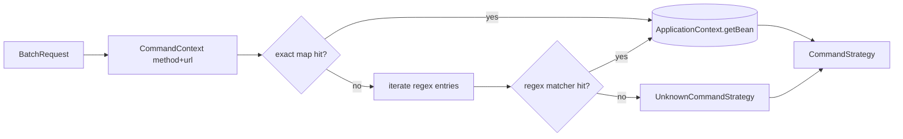

The Batch API in Apache Fineract is open by composition: every endpoint
reachable through `/v1/batches` is implemented by a `CommandStrategy` bean.
The dispatcher selects the right bean from the URL + method, calls
`execute(BatchRequest, UriInfo)`, and the strategy in turn delegates to the
underlying domain service exactly as the standalone REST endpoint would.

## The interface

```java CommandStrategy.java
public interface CommandStrategy {

    /**
     * Returns a BatchResponse for one BatchRequest. Implementations typically
     * delegate to the same domain service that backs the standalone REST endpoint.
     */
    BatchResponse execute(BatchRequest batchRequest, UriInfo uriInfo);
}
```

Two implementations matter:

- **Concrete strategies** in `org.apache.fineract.batch.command.internal`
  (lives in `fineract-provider`) — one per Batch-API-supported operation.
- **`UnknownCommandStrategy`** in `fineract-core` — the fallback that runs
  when no URL pattern matches.

<Note>
  The interface is intentionally tiny. Cross-cutting concerns — header
  propagation, transaction scope, response correlation — happen in
  `BatchApiServiceImpl` and `BatchCallHandler`, not in strategies.
</Note>

## CommandStrategyProvider

`CommandStrategyProvider` is a Spring `@Component` that owns a static
`Map<CommandContext, beanName>`. Registration is hard-coded in `init()`:

```java
commandStrategies.put(CommandContext.resource("v1\\/clients").method(POST).build(),
        "createClientCommandStrategy");
commandStrategies.put(CommandContext.resource("v1\\/clients\\/" + NUMBER_REGEX).method(PUT).build(),
        "updateClientCommandStrategy");
commandStrategies.put(CommandContext.resource("v1\\/loans").method(POST).build(),
        "applyLoanCommandStrategy");
// ... many more
```

When `getCommandStrategy` is called:

<Steps>
  <Step title="Versioned URL?">
    `isResourceVersioned` checks the URL starts with `v1/`. Backwards-compat:
    if not, `v1/` is prepended.
  </Step>
  <Step title="Exact match">
    A constant-time map lookup finds a strategy whose regex equals the
    incoming `relativeUrl`.
  </Step>
  <Step title="Pattern match">
    Otherwise, iterate the map and call `commandContext.matcher(entry.getKey())`
    until one regex matches.
  </Step>
  <Step title="Fallback">
    No match → return `new UnknownCommandStrategy()`. The batch response for
    that child carries HTTP 501.
  </Step>
</Steps>

The matched bean name is resolved through Spring's `ApplicationContext` and
returned to `BatchApiServiceImpl`.



## URL pattern grammar

The provider uses a handful of shared regex constants:

<ResponseField name="NUMBER_REGEX" type="\\d+">
  Numeric resource ID, e.g. `v1/loans/\\d+`.
</ResponseField>

<ResponseField name="UUID_PARAM_REGEX" type="[\\w\\d-]+">
  Resource identifier that may include hyphens, used for external IDs.
</ResponseField>

<ResponseField name="OPTIONAL_QUERY_PARAM_REGEX" type="(\\?…)?">
  Matches zero or more `key=value` query params.
</ResponseField>

<ResponseField name="MANDATORY_COMMAND_PARAM_REGEX" type="\\?command=\\w+">
  Required `?command=approve` style switches used by lifecycle endpoints.
</ResponseField>

<ResponseField name="OPTIONAL_COMMAND_PARAM_REGEX" type="(\\?command=…)?">
  Same, but optional — used where the bare endpoint already does the
  default action.
</ResponseField>

<ResponseField name="ALPHANUMBERIC_WITH_UNDERSCORE_REGEX" type="[a-zA-Z0-9_]*">
  Identifier-like path segments (datatable names, query identifiers).
</ResponseField>

## Concrete strategies

The provider module exposes the following beans under
`org.apache.fineract.batch.command.internal`. They are listed by the resource
they operate on.

### Clients

<Accordion title="Client lifecycle strategies">
  - `CreateClientCommandStrategy` — `POST v1/clients`
  - `UpdateClientCommandStrategy` — `PUT v1/clients/{id}`
  - `ActivateClientCommandStrategy` — `POST v1/clients/{id}?command=activate`
</Accordion>

### Loans (apply, modify, lifecycle)

<Accordion title="Loan applications">
  - `ApplyLoanCommandStrategy` — `POST v1/loans`
  - `ApplyWorkingCapitalLoanCommandStrategy` — working-capital loan flavour
  - `ModifyLoanApplicationCommandStrategy` — `PUT v1/loans/{id}`
  - `ModifyLoanApplicationByExternalIdCommandStrategy` — `PUT v1/loans/external-id/{externalId}`
  - `ModifyWorkingCapitalLoanApplicationCommandStrategy`
  - `ModifyWorkingCapitalLoanApplicationByExternalIdCommandStrategy`
  - `DeleteWorkingCapitalLoanApplicationCommandStrategy`
  - `DeleteWorkingCapitalLoanApplicationByExternalIdCommandStrategy`
</Accordion>

<Accordion title="Loan state transitions">
  - `ApproveLoanCommandStrategy` — `POST v1/loans/{id}?command=approve`
  - `DisburseLoanCommandStrategy` — `POST v1/loans/{id}?command=disburse`
  - `DisburseToSavingsCommandStrategy` — `?command=disburseToSavings`
  - `LoanStateTransistionsByExternalIdCommandStrategy` — external-id flavour
    that covers all transitions on a loan
  - `StateTransitionWorkingCapitalLoanCommandStrategy`
  - `StateTransitionWorkingCapitalLoanByExternalIdCommandStrategy`
</Accordion>

<Accordion title="Loan reads">
  - `GetLoanByIdCommandStrategy` — `GET v1/loans/{id}`
  - `GetLoanByExternalIdCommandStrategy` — `GET v1/loans/external-id/{ext}`
  - `GetWorkingCapitalLoanByIdCommandStrategy`
  - `GetWorkingCapitalLoanByExternalIdCommandStrategy`
</Accordion>

### Loan reschedule and interest pause

<Accordion title="Reschedule">
  - `CreateLoanRescheduleRequestCommandStrategy`
  - `ApproveLoanRescheduleCommandStrategy`
  - `RejectLoanRescheduleCommandStrategy`
</Accordion>

<Accordion title="Interest pause">
  - `CreateLoanInterestPauseByLoanIdCommandStrategy`
  - `CreateLoanInterestPauseByExternalIdCommandStrategy`
  - `UpdateLoanInterestPauseByLoanIdCommandStrategy`
  - `UpdateLoanInterestPauseByExternalIdCommandStrategy`
  - `GetLoanInterestPausesByLoanIdCommandStrategy`
  - `GetLoanInterestPausesByExternalIdCommandStrategy`
</Accordion>

### Loan charges

<Accordion title="Charges on loans">
  - `CollectChargesCommandStrategy` — list charges by loan id
  - `CollectChargesByLoanExternalIdCommandStrategy`
  - `CreateChargeCommandStrategy` — add a charge to a loan
  - `CreateChargeByLoanExternalIdCommandStrategy`
  - `GetChargeByIdCommandStrategy`
  - `GetChargeByChargeExternalIdCommandStrategy`
  - `AdjustChargeCommandStrategy`
  - `AdjustChargeByChargeExternalIdCommandStrategy`
</Accordion>

### Loan transactions

<Accordion title="Transactions on loans">
  - `CreateTransactionLoanCommandStrategy` — `POST v1/loans/{id}/transactions?command=...` (repay, refund, waiver, …)
  - `CreateTransactionByLoanExternalIdCommandStrategy`
  - `CreateWorkingCapitalTransactionLoanCommandStrategy`
  - `CreateWorkingCapitalTransactionByLoanExternalIdCommandStrategy`
  - `AdjustLoanTransactionCommandStrategy`
  - `AdjustLoanTransactionByExternalIdCommandStrategy`
  - `GetLoanTransactionByIdCommandStrategy`
  - `GetLoanTransactionByExternalIdCommandStrategy`
  - `GetWorkingCapitalLoanTransactionByIdCommandStrategy`
  - `GetWorkingCapitalLoanTransactionByExternalIdCommandStrategy`
  - `GetWorkingCapitalLoanTransactionByLoanIdAndExternalTransactionIdCommandStrategy`
  - `GetWorkingCapitalLoanTransactionByExternalLoanIdAndTransactionIdCommandStrategy`
  - `GetReagePreviewByLoanIdCommandStrategy`
  - `GetReagePreviewByLoanExternalIdCommandStrategy`
</Accordion>

### Savings

<Accordion title="Savings accounts">
  - `ApplySavingsCommandStrategy`
  - `GetSavingsAccountByIdCommandStrategy`
  - `CreateSavingsAccountChargeCommandStrategy`
  - `PaySavingsAccountChargeCommandStrategy`
  - `SavingsAccountTransactionCommandStrategy`
  - `SavingsAccountAdjustTransactionCommandStrategy`
</Accordion>

### Account transfers and datatables

<Accordion title="Cross-account and datatable operations">
  - `CreateAccountTransferCommandStrategy`
  - `CreateDatatableEntryCommandStrategy`
  - `UpdateDatatableEntryOneToOneCommandStrategy`
  - `UpdateDatatableEntryOneToManyCommandStrategy`
  - `DeleteDatatableEntryOneToOneCommandStrategy`
  - `DeleteDatatableEntryOneToManyCommandStrategy`
  - `GetDatatableEntryByAppTableIdCommandStrategy`
  - `GetDatatableEntryByAppTableIdAndDataTableIdCommandStrategy`
  - `GetDatatableEntryByQueryCommandStrategy`
</Accordion>

<Info>
  This is the catalogue as of current `main`. Adding a new strategy means
  creating a `*CommandStrategy` bean and a corresponding line in
  `CommandStrategyProvider.init()`.
</Info>

## Anatomy of a strategy

Strategies typically follow the same skeleton.

<CodeGroup>
```java sketch
@Component
@RequiredArgsConstructor
public class ApproveLoanCommandStrategy implements CommandStrategy {

    private final LoansApiResource loansApiResource;

    @Override
    public BatchResponse execute(BatchRequest request, UriInfo uriInfo) {
        BatchResponse response = new BatchResponse();
        String responseBody;

        response.setRequestId(request.getRequestId());
        response.setHeaders(request.getHeaders());

        // Pull the {id} out of the URL using a path-segment helper.
        Long loanId = Long.parseLong(request.getRelativeUrl().substring(/* ... */));

        // Delegate to the same resource the standalone endpoint uses.
        responseBody = loansApiResource.stateTransitions(
                loanId, "approve", request.getBody());

        response.setStatusCode(HttpStatus.SC_OK);
        response.setBody(responseBody);
        return response;
    }
}
```

```java pattern
// CommandStrategyProvider.init():
commandStrategies.put(
    CommandContext
        .resource("v1\\/loans\\/" + NUMBER_REGEX + MANDATORY_COMMAND_PARAM_REGEX)
        .method(POST)
        .build(),
    "approveLoanCommandStrategy");
```
</CodeGroup>

What the skeleton highlights:

<CardGroup cols={2}>
  <Card title="Delegation, not duplication" icon="recycle">
    Strategies call the same `*ApiResource` or service the standalone endpoint
    calls, so behaviour stays identical.
  </Card>
  <Card title="Copy back request metadata" icon="paperclip">
    `requestId` and `headers` of the response mirror the incoming request so
    consumers can correlate.
  </Card>
  <Card title="HTTP-style status codes" icon="hashtag">
    Strategies set `statusCode` to a real HTTP value — 200, 400, 404, 409 —
    matching what the standalone endpoint would have returned.
  </Card>
  <Card title="Body is opaque JSON" icon="code">
    The body field is a String of JSON. The wrapping service never re-parses
    it except when a child references it for resolution.
  </Card>
</CardGroup>

## UnknownCommandStrategy

When no pattern matches, the provider returns `UnknownCommandStrategy`. It
constructs a `BatchResponse` with status 501 indicating the URL is not
supported under the Batch API. The unsupported child is still placed in the
output list so the caller can correlate it by `requestId`.

<Warning>
  Hitting `UnknownCommandStrategy` does not mean the underlying endpoint does
  not exist on the REST API — it means it has not been registered with the
  Batch dispatcher. Many newer endpoints are added to `CommandStrategyProvider`
  in a follow-up patch.
</Warning>

## Adding a new strategy

<Steps>
  <Step title="Identify the URL and method">
    Build the regex carefully. Reuse `NUMBER_REGEX`,
    `MANDATORY_COMMAND_PARAM_REGEX`, and friends to avoid drift.
  </Step>
  <Step title="Write a bean implementing CommandStrategy">
    Place it in `org.apache.fineract.batch.command.internal` and annotate with
    `@Component`. Inject the existing `*ApiResource` and delegate.
  </Step>
  <Step title="Register in CommandStrategyProvider.init()">
    Add a single `commandStrategies.put(CommandContext..., "yourBeanName")`
    line keyed on bean name (not the class).
  </Step>
  <Step title="Cover with tests">
    `fineract-provider/src/test/java/org/apache/fineract/batch/command/internal`
    already holds patterns for unit testing strategies — mirror them.
  </Step>
</Steps>

<Tip>
  Naming convention: the bean name in Spring is the strategy class name with a
  lower-case first letter. `ApproveLoanCommandStrategy` becomes
  `approveLoanCommandStrategy` in the provider's map.
</Tip>

## Where to go next

<CardGroup cols={2}>
  <Card title="Serialization" href="/batch/serialization">
    Exact shape of the JSON envelope strategies fill in.
  </Card>
  <Card title="BatchApiService" href="/batch/batch-api-service">
    The orchestrator that drives every strategy you write.
  </Card>
</CardGroup>
