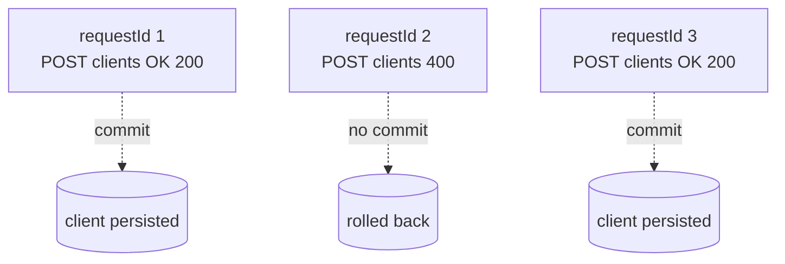
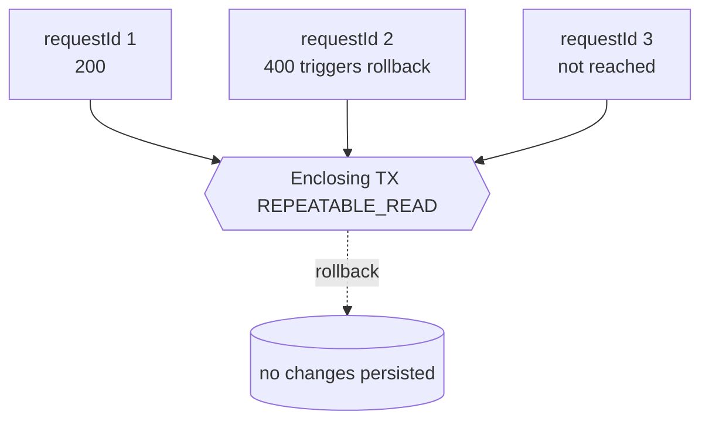

Errors are where the Apache Fineract Batch API earns its keep. A well-behaved
batch wraps many operations whose individual success is uncertain, and the
consumer needs to know exactly which of them succeeded, which failed, and
whether anything was rolled back. This page walks through the failure paths
in `BatchApiServiceImpl`, the per-child error shape produced by `ErrorHandler`,
and the difference between partial success and enclosing-transaction rollback.

## The two failure modes

The Batch API has two operating modes, and they differ entirely in how errors
are handled:

<CardGroup cols={2}>
  <Card title="enclosingTransaction=false (default)" icon="layer-group">
    Each root request runs in its own JDBC transaction. A failure in one root
    does not roll back siblings — their writes are committed independently.
    Descendants of the failed root are short-circuited with HTTP 409.
  </Card>
  <Card title="enclosingTransaction=true" icon="lock">
    A single `TransactionTemplate` (REPEATABLE_READ) wraps the entire batch. A
    failure anywhere calls `setRollbackOnly()` on the enclosing transaction.
    Every sibling's writes — even the ones that returned 200 individually —
    are rolled back. The response collapses to a single error envelope.
  </Card>
</CardGroup>

## Detecting the mode at runtime

Downstream code inside strategies or services can check the mode through the
thread-local context holder:

```java BatchRequestContextHolder usage
if (BatchRequestContextHolder.isEnclosingTransaction()) {
    // we are inside the wrapping transaction; defer flush to the outer scope
} else {
    // we are a standalone root request; flush eagerly
}

BatchRequestContextHolder
        .getEnclosingTransaction()
        .ifPresent(TransactionExecution::setRollbackOnly);
```

`BatchApiServiceImpl` sets and resets this thread local in `try`/`finally`
blocks so leakage across servlet threads is impossible.

<Note>
  `isEnclosingTransaction()` returns `true` only inside `/v1/batches` with the
  query parameter set. Standalone REST handlers never see it set.
</Note>

## Parent failure short-circuits descendants

For both modes, the runner uses the response status code to decide what to do
next:

```java callRequestRecursive
BatchResponse response = executeRequest(request, uriInfo);
responseList.add(response);
if (response.getStatusCode() != null && response.getStatusCode() == SC_OK) {
    requestNode.getChildNodes().forEach(childNode -> {
        BatchRequest childRequest = childNode.getRequest();
        try {
            BatchRequest resolvedChildRequest =
                this.resolutionHelper.resolveRequest(childRequest, response);
            callRequestRecursive(resolvedChildRequest, childNode, responseList, uriInfo);
        } catch (JsonPathException jpex) {
            responseList.add(buildOrThrowErrorResponse(jpex, childRequest));
        }
    });
} else {
    responseList.addAll(parentRequestFailedRecursive(request, requestNode, response, null));
}
```

When the parent's status is non-200, descendants are *not* executed. Instead
`parentRequestFailedRecursive` walks the subtree and synthesises responses:

```java parentRequestFailedRecursive (excerpt)
if (parentId == null) {   // current node is the root that just failed
    BatchRequestContextHolder
        .getEnclosingTransaction()
        .ifPresent(TransactionExecution::setRollbackOnly);
} else {                  // descendant of a failed root
    responseList.add(buildErrorResponse(
        request.getRequestId(),
        response.getStatusCode(),
        "Parent request with id " + parentId + " was erroneous!",
        null));
}
requestNode.getChildNodes().forEach(childNode -> responseList
    .addAll(parentRequestFailedRecursive(
        childNode.getRequest(), childNode, response, request.getRequestId())));
```

Two important behaviours:

<Steps>
  <Step title="The failed root keeps its real status">
    The root response contains whatever code and body the strategy or
    `ErrorHandler` produced. Only descendants get the synthetic 409 message.
  </Step>
  <Step title="Rollback is requested if and only if we're enclosed">
    `getEnclosingTransaction()` is an `Optional` — outside an enclosing
    transaction the `ifPresent` is a no-op, so partial success is preserved.
  </Step>
</Steps>

## Synthetic 409 responses for descendants

A descendant of a failed parent receives an `ErrorInfo` body like:

```json descendant 409
{
  "requestId": 3,
  "statusCode": 409,
  "headers": [],
  "body": "{\"errorMessage\":\"Parent request with id 2 was erroneous!\"}"
}
```

<Warning>
  The 409 status on descendants is synthetic. It does **not** mean a domain
  conflict occurred — only that an ancestor failed. Always inspect the failed
  root's status to find the real cause.
</Warning>

## ErrorHandler envelopes

When a strategy throws, `BatchApiServiceImpl#buildErrorResponse(Throwable, BatchRequest)`
funnels the exception through `errorHandler.handle(...)`. The handler
translates Fineract platform exceptions, JSR-303 violations, and generic
runtime exceptions into an `ErrorInfo` object containing:

<ResponseField name="statusCode" type="int">
  The HTTP status that the standalone REST endpoint would have returned for
  this exception (e.g. 400, 403, 404, 500).
</ResponseField>

<ResponseField name="errorCode" type="int">
  Fineract-specific application error code.
</ResponseField>

<ResponseField name="message" type="String">
  Human-readable text, including any parameter substitutions and a stable
  user-friendly key when available.
</ResponseField>

The error envelope ends up serialised into the `body` of the failing
`BatchResponse`, with the response's `statusCode` field set to
`ErrorInfo.statusCode`:

```json failing root
{
  "requestId": 2,
  "statusCode": 400,
  "headers": [],
  "body": "{\"errorMessage\":\"Validation errors exist.\",\"errorCode\":4001,\"developerMessage\":\"...\"}"
}
```

## Partial-success example

With `enclosingTransaction=false`, the response array always has one entry per
input request. Suppose three independent root requests are submitted and the
second one fails:



The response array contains all three entries; clients 1 and 3 are persisted;
client 2 is not.

```json partial success
[
  { "requestId": 1, "statusCode": 200, "body": "{\"clientId\":42}" },
  { "requestId": 2, "statusCode": 400, "body": "{\"errorCode\":4001,\"errorMessage\":\"...\"}" },
  { "requestId": 3, "statusCode": 200, "body": "{\"clientId\":43}" }
]
```

## Enclosing-transaction example

The same three requests with `enclosingTransaction=true`. The second one fails
and triggers `setRollbackOnly()`. Even though the first and third strategies
returned 200, their JDBC writes are rolled back:



The output collapses to a single envelope describing the first failure:

```json enclosing-transaction failure
[
  {
    "requestId": 2,
    "statusCode": 400,
    "headers": [],
    "body": "{\"errorCode\":4001,\"errorMessage\":\"Validation errors exist.\"}"
  }
]
```

<Info>
  This single-entry behaviour is documented on `BatchApiResource`: *"If there
  has been a rollback in a transaction then a single response will be
  provided, with a '400' status code and a body consisting of the error
  details of the first failed request."*
</Info>

## Retry under serialization conflicts

Enclosing transactions run at `ISOLATION_REPEATABLE_READ`, which makes
serialisation conflicts more likely under contention. `BatchApiServiceImpl`
guards against this by wrapping the transactional supplier in a Resilience4j
`Retry`:

```java retry wrapping
Retry retry = retryConfigurationAssembler.getRetryConfigurationForBatchApiWithEnclosingTransaction();
Supplier<List<BatchResponse>> retryingBatch = Retry.decorateSupplier(retry, batchSupplier);
try {
    return retryingBatch.get();
} catch (TransactionException | NonTransientDataAccessException ex) {
    return buildErrorResponses(ex, responseList);
} catch (BatchExecutionException ex) {
    log.error("Exception during the batch request processing", ex);
    responseList.add(buildErrorResponse(ex.getCause(), ex.getRequest()));
    return responseList;
}
```

<Tabs>
  <Tab title="Retried and succeeded">
    The caller never sees the conflict — they get a normal response array.
  </Tab>
  <Tab title="Retries exhausted">
    `TransactionException` or `NonTransientDataAccessException` falls through
    to `buildErrorResponses`, which discards any partial output and returns a
    single error envelope describing the database failure.
  </Tab>
  <Tab title="BatchExecutionException">
    Thrown by code paths that need to attach the originating request to the
    cause. The corresponding response is appended; preceding successful
    responses are preserved.
  </Tab>
</Tabs>

## BatchReferenceInvalidException

If a child references a parent that doesn't exist in the same batch, the tree
builder throws `BatchReferenceInvalidException`. This is handled before any
strategy runs:

```java
try {
    rootNodes = this.resolutionHelper.buildNodesTree(requestList);
} catch (BatchReferenceInvalidException e) {
    return List.of(buildOrThrowErrorResponse(e, null));
}
```

The result is a single-element response list with the exception explained.
None of the requests run.

<Warning>
  This is an "argument validation" failure, not a domain failure. Fix the
  caller — usually by reordering so parents precede children.
</Warning>

## JsonPathException during resolution

A child whose `$.` token cannot be resolved against the parent's response
raises `JsonPathException`. The runner catches it and emits a per-child
failure but **does not** propagate it to siblings or descendants:

```java JsonPath failure
try {
    resolvedChildRequest = this.resolutionHelper.resolveRequest(childRequest, response);
    callRequestRecursive(resolvedChildRequest, childNode, responseList, uriInfo);
} catch (JsonPathException jpex) {
    responseList.add(buildOrThrowErrorResponse(jpex, childRequest));
}
```

The descendants of the badly-resolved child are not run (they never reach
`callRequestRecursive`); but unrelated sibling subtrees continue normally — in
non-enclosing mode.

## Propagation to scheduled jobs

Some Batch operations have asynchronous follow-ups — for example
`ClientDetailsJob` and similar housekeeping jobs that respond to client and
loan lifecycle events. When the Batch API runs with
`enclosingTransaction=true` and rolls back, those jobs see no events: nothing
was committed, so nothing triggers. In partial-success mode, jobs respond to
the requests that *did* commit, which is normally the desired outcome.

<Tip>
  If you rely on a scheduled job firing in response to a batched lifecycle
  change, make sure the relevant request commits. Either run it standalone, or
  use `enclosingTransaction=false` and accept that earlier-in-the-array writes
  may stand even if a later request fails.
</Tip>

## Choosing a mode

<Accordion title="Use enclosingTransaction=true when…">
  - Operations form a single business unit (onboarding, repayment + charge).
  - Partial state would leave the database inconsistent.
  - You can tolerate the retry budget when the database is under contention.
</Accordion>

<Accordion title="Use enclosingTransaction=false when…">
  - You are running unrelated read-mostly fan-outs.
  - You import many independent records and want maximum throughput; failed
    rows can be retried individually.
  - You explicitly want commit-on-success semantics per root request.
</Accordion>

## Summary

<CardGroup cols={2}>
  <Card title="One root fails" icon="triangle-exclamation">
    Descendants get synthetic 409. Siblings continue unless enclosed.
  </Card>
  <Card title="Atomic batch" icon="lock">
    `enclosingTransaction=true` collapses any failure into a single rollback
    and a one-entry response.
  </Card>
  <Card title="ErrorHandler-shaped bodies" icon="bug">
    Each failure body is a JSON `ErrorInfo` with status, code, and message.
  </Card>
  <Card title="Thread-local clean-up" icon="broom">
    `BatchRequestContextHolder` is reset in `finally` blocks so no state leaks
    to the next servlet thread.
  </Card>
</CardGroup>

<CardGroup cols={2}>
  <Card title="Back to overview" href="/batch/overview">
    The big picture of `/v1/batches`.
  </Card>
  <Card title="Serialization" href="/batch/serialization">
    The exact JSON shape errors travel in.
  </Card>
</CardGroup>
