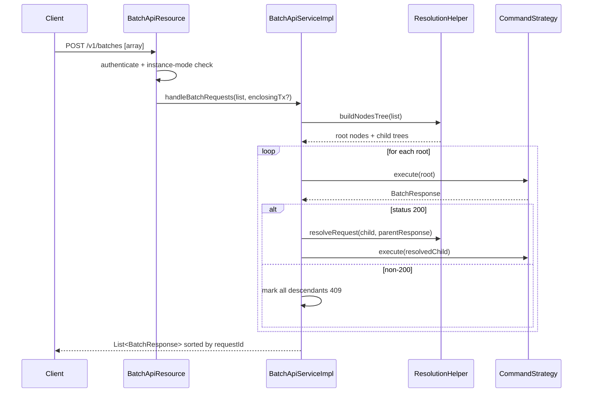

The Batch API is Apache Fineract's mechanism for shipping many logical HTTP
requests in a single round trip. Instead of opening one connection per resource
mutation, a consumer wraps a list of operations into a JSON array, POSTs it to
`/v1/batches`, and receives a parallel array of per-child responses. Operations
can be independent or chained — a child request can reference the response of a
parent and have JSON Path expressions inside its URL or body resolved before
execution.

## Why fan-out matters

Microfinance workflows are rarely atomic at the REST level. Onboarding a client
often means: create the client, activate the client, apply for a loan, approve
the loan, disburse the loan. Five HTTP calls become five network round trips,
five authentication checks, and five opportunities for inconsistent state if a
later step fails.

The Batch API collapses that sequence into a single signed HTTP request whose
children share a JDBC connection, a security context, and (optionally) a single
database transaction.

<CardGroup cols={2}>
  <Card title="One HTTP request" icon="layer-group">
    Consumers send a JSON array; Fineract returns a JSON array of responses, one
    per child request.
  </Card>
  <Card title="Optional atomicity" icon="lock">
    `enclosingTransaction=true` rolls back every child when any child fails.
  </Card>
  <Card title="Reference chaining" icon="link">
    Children may declare `reference` and use `$.id` style JSON Path against the
    parent's response body.
  </Card>
  <Card title="Per-resource strategies" icon="puzzle-piece">
    A `CommandStrategy` is selected per request from a `method + relativeUrl`
    registry, then invoked just like the standalone endpoint would be.
  </Card>
</CardGroup>

## The endpoint

`BatchApiResource` exposes a single POST. It deserialises the array of
`BatchRequest` items, authenticates the caller through
`PlatformSecurityContext`, validates that the running instance is allowed to
process write methods, and dispatches to `BatchApiService`.

```java BatchApiResource.java
@Path("/v1/batches")
@Component
public class BatchApiResource {

    @POST
    @Consumes(MediaType.APPLICATION_JSON)
    @Produces(MediaType.APPLICATION_JSON)
    public List<BatchResponse> handleBatchRequests(
            @DefaultValue("false") @QueryParam("enclosingTransaction") boolean enclosingTransaction,
            List<BatchRequest> requestList,
            @Context UriInfo uriInfo) {
        this.context.authenticatedUser();
        validateRequestMethodsAllowedOnInstanceType(requestList);
        return enclosingTransaction
                ? service.handleBatchRequestsWithEnclosingTransaction(requestList, uriInfo)
                : service.handleBatchRequestsWithoutEnclosingTransaction(requestList, uriInfo);
    }
}
```

<Note>
  Only `POST /v1/batches` exists. There is no GET sibling and no per-child
  endpoint — the array is the API.
</Note>

## Anatomy of a request

A single child carries everything the dispatcher needs to recreate a real REST
call internally.

<ParamField path="requestId" type="Long" required>
  Caller-assigned correlation ID. The response with the matching `requestId` is
  the response for this request; `requestId` is also what children point at
  through `reference`.
</ParamField>

<ParamField path="relativeUrl" type="String" required>
  The portion after `/api/`. For example `v1/clients`, `v1/loans/15/charges`,
  `v1/loans/$.loanId?command=approve`.
</ParamField>

<ParamField path="method" type="String" required>
  Standard HTTP verb: `GET`, `POST`, `PUT`, or `DELETE`.
</ParamField>

<ParamField path="headers" type="Set<Header>">
  Per-child headers. They are merged into `BatchRequestContextHolder` for the
  duration of the child invocation and surface to filters and command handlers
  exactly like real request headers would.
</ParamField>

<ParamField path="reference" type="Long">
  The `requestId` of the parent. When set, the child only runs after the parent
  succeeds, and JSON Path tokens in `relativeUrl` and `body` are resolved
  against the parent's response body first.
</ParamField>

<ParamField path="body" type="String">
  The serialised JSON body the underlying handler would consume. The Batch API
  passes the string through unchanged once references are resolved.
</ParamField>

## Header propagation

`BatchApiServiceImpl#executeRequest` collects the per-child headers into a map
and stashes it on `BatchRequestContextHolder` before dispatching to the
strategy:

```java
BatchRequestContextHolder.setRequestAttributes(new HashMap<>(
    Optional.ofNullable(request.getHeaders())
        .map(list -> list.stream().collect(Collectors.toMap(Header::getName, Header::getValue)))
        .orElse(Collections.emptyMap())));
```

The map is reset in a `finally` block so headers from one child never leak into
the next. This means a child request can override tenant identifiers, request
locales, or idempotency keys exactly as if it were a stand-alone REST call.

<Tip>
  The outer caller's `Authorization` and `Fineract-Platform-TenantId` headers
  still apply to the batch as a whole. Per-child headers add to or override
  request-scoped attributes, not the security context.
</Tip>

## Enclosing transaction

The `enclosingTransaction` query parameter changes the outermost wrapping.

<Tabs>
  <Tab title="enclosingTransaction=false (default)">
    Each root request runs in its own transaction. A failure inside one root
    only marks that root (and its descendants) as failed; siblings continue.
    The response array contains a `BatchResponse` per request, with status
    codes that mirror what the standalone endpoint would have returned.
  </Tab>
  <Tab title="enclosingTransaction=true">
    A single `TransactionTemplate` wraps the whole batch with isolation level
    `REPEATABLE_READ`. A failure anywhere calls
    `TransactionExecution#setRollbackOnly` on the enclosing transaction; every
    successful sibling's writes are rolled back too. The response is a single
    item whose status is the failure status and whose body is the failure body.
  </Tab>
</Tabs>

## Lifecycle at a glance



## Reference linking

References are how callers express "this child needs an ID that the parent will
mint." A child sets `reference` to its parent's `requestId` and uses JSON Path
tokens — `$.clientId`, `$.resourceId`, `$.loanId` — inside its own `body` or
`relativeUrl`. After the parent runs, `ResolutionHelper.resolveRequest`
substitutes those tokens against the parent's JSON response.

<CodeGroup>
```json client + activate
[
  {
    "requestId": 1,
    "relativeUrl": "v1/clients",
    "method": "POST",
    "body": "{ \"officeId\": 1, \"firstname\": \"Petra\", \"lastname\": \"Yared\", \"locale\": \"en\", \"active\": false, \"dateFormat\": \"dd MMMM yyyy\" }"
  },
  {
    "requestId": 2,
    "reference": 1,
    "relativeUrl": "v1/clients/$.clientId?command=activate",
    "method": "POST",
    "body": "{ \"locale\": \"en\", \"dateFormat\": \"dd MMMM yyyy\", \"activationDate\": \"01 March 2024\" }"
  }
]
```

```json deeply nested
[
  { "requestId": 1, "relativeUrl": "v1/clients", "method": "POST", "body": "{...}" },
  { "requestId": 2, "reference": 1, "relativeUrl": "v1/loans", "method": "POST", "body": "{ \"clientId\": $.clientId, ... }" },
  { "requestId": 3, "reference": 2, "relativeUrl": "v1/loans/$.loanId?command=approve", "method": "POST", "body": "{...}" }
]
```
</CodeGroup>

<Info>
  Reference resolution is recursive: request 3 references request 2 which
  references request 1. The dispatcher walks the tree depth-first.
</Info>

## Response ordering

Responses are sorted by `requestId` before they leave the service:

```java
responseList.sort(Comparator.comparing(BatchResponse::getRequestId));
```

That means callers can use a `requestId` they already keyed off (sequence
number, UUID hash) to find any response in O(log n) — the order in which the
strategies actually ran is hidden from the consumer.

<Warning>
  Although responses are ordered by `requestId`, the *physical* execution order
  is determined by the dependency tree. Independent root requests are processed
  in input order; descendants run after their parent. Never assume strict
  sequential execution between unrelated roots.
</Warning>

## When to use the Batch API

<Accordion title="Onboarding flows">
  Client creation + activation + loan application + approval + disbursal are
  the canonical case. With `enclosingTransaction=true`, a downstream failure
  guarantees the partially-onboarded customer never appears.
</Accordion>

<Accordion title="Bulk imports">
  Importing thousands of clients from a legacy system. Each row becomes a
  `BatchRequest`, several batches per second amortise the HTTP overhead.
</Accordion>

<Accordion title="Read fan-out">
  Front-ends frequently need a client's basic record, loan accounts, and
  savings accounts simultaneously. A read-only batch issues all three GETs in
  one trip; `enclosingTransaction` is unnecessary because there are no writes.
</Accordion>

<Accordion title="Repayment workflows">
  Collect outstanding charges by loan, then create the repayment transaction —
  two writes that should either both happen or neither.
</Accordion>

## What's next

<CardGroup cols={2}>
  <Card title="BatchApiService" href="/batch/batch-api-service">
    The fan-out engine: strategy lookup, preprocessing, recursive execution.
  </Card>
  <Card title="Command strategies" href="/batch/command-strategies">
    The catalogue of `*CommandStrategy` beans and how URL patterns map to them.
  </Card>
  <Card title="Serialization" href="/batch/serialization">
    The exact JSON envelope for `BatchRequest`, `BatchResponse`, and `Header`.
  </Card>
  <Card title="Errors and rollback" href="/batch/error-handling">
    What happens when a child fails, with or without enclosing transactions.
  </Card>
</CardGroup>
