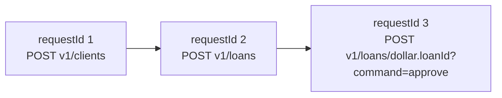

This page documents the exact JSON envelope used by the Apache Fineract Batch
API. The shape is small and stable: three DTOs (`BatchRequest`, `BatchResponse`,
`Header`), one helper (`ResolutionHelper`) that walks parent responses to
substitute `$.` tokens, and one Gson-based deserializer
(`BatchRequestJsonHelper`).

## BatchRequest

Defined in
`org.apache.fineract.batch.domain.BatchRequest`. It is a Lombok `@Data` bean
with chained setters and no behaviour:

```java BatchRequest.java
@NoArgsConstructor
@Data
@Accessors(chain = true)
public class BatchRequest {
    private Long requestId;
    private String relativeUrl;
    private String method;
    private Set<Header> headers;
    private Long reference;
    private String body;
}
```

<ParamField path="requestId" type="Long" required>
  Consumer-assigned correlation ID. Unique within one batch.
  `BatchApiServiceImpl` sorts the response list by this value before returning.
</ParamField>

<ParamField path="relativeUrl" type="String" required>
  The portion of the URL after `/api/`. Includes the version prefix `v1/`
  and any query string. JSON Path tokens such as `$.clientId` are allowed and
  are resolved against the parent's response body when `reference` is set.
</ParamField>

<ParamField path="method" type="String" required>
  HTTP verb: `GET`, `POST`, `PUT`, or `DELETE`. Used by
  `CommandStrategyProvider` to pick a strategy together with `relativeUrl`.
</ParamField>

<ParamField path="headers" type="Set<Header>">
  Per-child headers. Merged into `BatchRequestContextHolder` for the duration of
  this request so filters and handlers see them as ordinary request headers.
</ParamField>

<ParamField path="reference" type="Long">
  The `requestId` of the parent request. When present, the child runs only
  after the parent succeeds, and the parent's response body is the JSON Path
  context for resolving `$.` tokens in this child.
</ParamField>

<ParamField path="body" type="String">
  The serialised JSON body the strategy will pass to the underlying domain
  service. Stored as `String` so the envelope deserializer doesn't try to parse
  domain-specific payloads — that is the strategy's job.
</ParamField>

## BatchResponse

Returned by each strategy and collected by `BatchApiServiceImpl` into the final
array:

```java BatchResponse.java
@NoArgsConstructor
@Data
@Accessors(chain = true)
public class BatchResponse {
    private Long requestId;
    private Integer statusCode;
    private Set<Header> headers;
    private String body;
}
```

<ResponseField name="requestId" type="Long">
  The `requestId` of the corresponding `BatchRequest`. Strategies must copy
  this value through so the consumer can correlate.
</ResponseField>

<ResponseField name="statusCode" type="Integer">
  The HTTP-style status code the standalone endpoint would have returned.
  `BatchApiServiceImpl` keys on `200` to decide whether descendants run.
</ResponseField>

<ResponseField name="headers" type="Set<Header>">
  Echo of `BatchRequest.headers` plus anything the strategy chose to add.
</ResponseField>

<ResponseField name="body" type="String">
  Serialised JSON response body from the underlying service. For errors it is
  the JSON form of an `ErrorInfo` produced by `ErrorHandler`.
</ResponseField>

## Header

The `Header` DTO is identical for requests and responses:

```java Header.java
@NoArgsConstructor
@AllArgsConstructor
@Data
@Accessors(chain = true)
public class Header {
    private String name;
    private String value;
}
```

<Note>
  Because `Set<Header>` is used rather than `List<Header>`, two headers with the
  same name and value collapse to one entry. If you need duplicates, append a
  disambiguator or use the response stream after the batch returns.
</Note>

## Reference resolution

`ResolutionHelper` is the substitution engine. When a child has `reference`
set, `BatchApiServiceImpl` invokes `resolveRequest(child, parentResponse)`
before handing the child to its strategy. The helper:

<Steps>
  <Step title="Builds a JSON Path context">
    Parses the parent's `body` with Jayway JSONPath
    (`JsonPath.parse(parentResponse.getBody())`).
  </Step>
  <Step title="Scans the child URL">
    Finds tokens of the form `$.identifier` in `relativeUrl` and replaces each
    with the corresponding value from the parent.
  </Step>
  <Step title="Walks the child body">
    Parses `body` as JSON, walks every primitive looking for `$.` tokens, and
    substitutes them in place. Numeric-looking results stay numeric; strings
    stay quoted. The mutated tree is re-serialised.
  </Step>
  <Step title="Returns a new BatchRequest">
    The original `BatchRequest` is left untouched; a copy with resolved URL and
    body is what reaches the strategy.
  </Step>
</Steps>

A failure in any of those steps throws `JsonPathException`, which the service
catches and converts to a per-child error response (its descendants are then
marked failed).

## Tree building

`ResolutionHelper.buildNodesTree` consumes the request array exactly once,
in input order, producing a forest:

```java buildNodesTree
public List<BatchRequestNode> buildNodesTree(final List<BatchRequest> requests) {
    final List<BatchRequestNode> rootNodes = new ArrayList<>();
    for (BatchRequest request : requests) {
        if (request.getReference() == null) {
            rootNodes.add(new BatchRequestNode(request));
        } else {
            if (!addDependingRequest(request, rootNodes)) {
                throw new BatchReferenceInvalidException(request.getReference());
            }
        }
    }
    return rootNodes;
}
```

<Warning>
  Order matters. A child whose parent appears *after* it in the array will not
  find its parent and will trigger `BatchReferenceInvalidException` — which
  aborts the whole batch with a single error response. Always submit parents
  before children.
</Warning>

## Sample request envelope

This is the canonical "create a client, then activate them" batch. The
activation child references the creation parent by `requestId`.

```json POST /v1/batches
[
  {
    "requestId": 1,
    "relativeUrl": "v1/clients",
    "method": "POST",
    "headers": [
      { "name": "Content-Type", "value": "application/json" }
    ],
    "body": "{ \"officeId\": 1, \"firstname\": \"Petra\", \"lastname\": \"Yared\", \"locale\": \"en\", \"active\": false, \"dateFormat\": \"dd MMMM yyyy\", \"submittedOnDate\": \"01 March 2024\" }"
  },
  {
    "requestId": 2,
    "reference": 1,
    "relativeUrl": "v1/clients/$.clientId?command=activate",
    "method": "POST",
    "headers": [
      { "name": "Content-Type", "value": "application/json" }
    ],
    "body": "{ \"locale\": \"en\", \"dateFormat\": \"dd MMMM yyyy\", \"activationDate\": \"01 March 2024\" }"
  }
]
```

What happens at runtime:

1. The first request runs unmodified. Its response body contains
   `{"clientId": 42, ...}`.
2. The second request has `reference=1`; the URL becomes
   `v1/clients/42?command=activate`.
3. Both responses are placed in the output array and sorted by `requestId`.

## Sample response envelope

```json 200 OK
[
  {
    "requestId": 1,
    "statusCode": 200,
    "headers": [{ "name": "Content-Type", "value": "application/json" }],
    "body": "{\"officeId\":1,\"clientId\":42,\"resourceId\":42}"
  },
  {
    "requestId": 2,
    "statusCode": 200,
    "headers": [{ "name": "Content-Type", "value": "application/json" }],
    "body": "{\"officeId\":1,\"clientId\":42,\"resourceId\":42,\"changes\":{\"activationDate\":\"01 March 2024\"}}"
  }
]
```

<Tabs>
  <Tab title="enclosingTransaction=false">
    On success the array always has the same length as the input. Each entry's
    `requestId` matches one input, and ordering is by `requestId`.
  </Tab>
  <Tab title="enclosingTransaction=true (all OK)">
    Identical to above. The enclosing transaction commits after the last
    strategy returns.
  </Tab>
  <Tab title="enclosingTransaction=true (failure)">
    A single-entry array with the failing child's status code and an
    `ErrorInfo` body. All sibling writes are rolled back.
  </Tab>
</Tabs>

## A multi-step chain

References can nest arbitrarily deep. Here a client is created, a loan is
applied for, and the loan is approved — all in one batch.

```json
[
  {
    "requestId": 1,
    "relativeUrl": "v1/clients",
    "method": "POST",
    "body": "{ \"officeId\": 1, \"firstname\": \"Ahmed\", \"lastname\": \"Patel\", \"locale\": \"en\", \"active\": true, \"dateFormat\": \"dd MMMM yyyy\", \"submittedOnDate\": \"01 March 2024\", \"activationDate\": \"01 March 2024\" }"
  },
  {
    "requestId": 2,
    "reference": 1,
    "relativeUrl": "v1/loans",
    "method": "POST",
    "body": "{ \"clientId\": $.clientId, \"productId\": 1, \"principal\": 1000, \"loanTermFrequency\": 12, \"loanTermFrequencyType\": 2, \"loanType\": \"individual\", \"numberOfRepayments\": 12, \"repaymentEvery\": 1, \"repaymentFrequencyType\": 2, \"interestRatePerPeriod\": 12, \"amortizationType\": 1, \"interestType\": 0, \"interestCalculationPeriodType\": 1, \"transactionProcessingStrategyCode\": \"mifos-standard-strategy\", \"expectedDisbursementDate\": \"02 March 2024\", \"submittedOnDate\": \"01 March 2024\", \"locale\": \"en\", \"dateFormat\": \"dd MMMM yyyy\" }"
  },
  {
    "requestId": 3,
    "reference": 2,
    "relativeUrl": "v1/loans/$.loanId?command=approve",
    "method": "POST",
    "body": "{ \"approvedOnDate\": \"02 March 2024\", \"approvedLoanAmount\": 1000, \"locale\": \"en\", \"dateFormat\": \"dd MMMM yyyy\" }"
  }
]
```

The resolver walks the chain: request 3's `loanId` token resolves against
request 2's response, and request 2's `clientId` token resolves against
request 1's response.



## BatchRequestJsonHelper

The deserializer that turns the incoming JSON array into a
`List<BatchRequest>` lives in
`org.apache.fineract.batch.serialization.BatchRequestJsonHelper`. It is a thin
Gson wrapper that:

- Registers an `ArrayList<BatchRequest>` type token so the array becomes a
  strongly-typed list.
- Tolerates the `body` field being either an embedded JSON object **or** a
  pre-serialised string. Both forms end up as a `String` on the DTO so the
  strategy can pass it through to the downstream service unchanged.

<Tip>
  Sending `body` as an embedded JSON object is more ergonomic for hand-written
  callers; SDKs typically send it as a pre-serialised string. Either works.
</Tip>

## Common pitfalls

<Accordion title="Forgetting to set requestId">
  Strategies need `requestId` to populate the response. A `null` will sort
  before any populated entry — and clients keying off `requestId` will lose
  correlation.
</Accordion>

<Accordion title="Submitting children before parents">
  The tree builder walks the array once. Out-of-order references throw
  `BatchReferenceInvalidException` and the whole batch fails.
</Accordion>

<Accordion title="Using $. in a request without a reference">
  No `reference` means no parent body to resolve against. The token is left
  literal and the underlying endpoint rejects the payload as malformed.
</Accordion>

<Accordion title="Expecting headers to leak between children">
  Per-child headers reset between requests. Set the same `Content-Type` on
  every child if every child needs it.
</Accordion>

## What's next

<CardGroup cols={2}>
  <Card title="Errors and rollback" href="/batch/error-handling">
    What the envelope looks like when something goes wrong.
  </Card>
  <Card title="Strategies" href="/batch/command-strategies">
    The beans that turn each `BatchRequest` into a `BatchResponse`.
  </Card>
</CardGroup>
