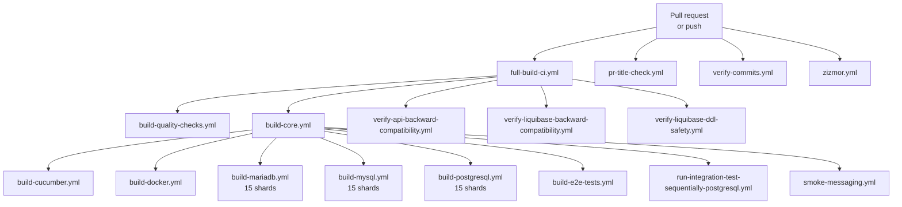

Apache Fineract runs its CI on two surfaces: GitHub Actions handles every pull request and push, and Jenkins (under the ASF infrastructure) handles release production. Together they cover unit, integration, Cucumber, three database backends, Docker image build, regression safety checks, and API/Liquibase backward compatibility. This page walks the workflows folder file by file.

## GitHub Actions overview

All YAMLs live under `.github/workflows/`. The full list:

```
build-core.yml                                       parent orchestrator
build-cucumber.yml                                   cucumber e2e suites
build-docker.yml                                     Jib image build
build-documentation.yml                              docs build
build-e2e-tests.yml                                  e2e Gherkin
build-mariadb.yml                                    MariaDB integration shards
build-mysql.yml                                      MySQL integration shards
build-postgresql.yml                                 PostgreSQL integration shards
build-progressive-loan.yml                           progressive-loan module
build-quality-checks.yml                             spotless, checkstyle, RAT, etc.
full-build-ci.yml                                    top-level CI entrypoint
liquibase-only-postgresql.yml                        migrate-and-exit shape
pr-title-check.yml                                   conventional commit title
publish-dockerhub.yml                                push image to Docker Hub
regression-safety-db-changes.yml                     DB safety
run-integration-test-sequentially-postgresql.yml     sequential mode
smoke-messaging.yml                                  JMS/Kafka smoke
sonarqube.yml                                        SonarQube analysis
stale.yml                                            close stale issues
verify-api-backward-compatibility.yml                swagger-brake gate
verify-commits.yml                                   commit message check
verify-liquibase-backward-compatibility.yml          Liquibase changelog gate
verify-liquibase-ddl-safety.yml                      DDL safety
zizmor.yml                                           workflow lint
```

## Orchestration graph



## full-build-ci.yml

The top-level entry point. It fires on every push to `develop`, every PR, every `release/**` branch push, and on manual `workflow_dispatch`:

```yaml
on:
  push:
    branches:
      - develop
      - 'release/**'
      - '1.*'
    paths-ignore:
      - '**/*.md'
  pull_request:
    paths-ignore:
      - '**/*.md'
  workflow_dispatch:

concurrency:
  group: ${{ github.workflow }}-${{ github.event.pull_request.number || github.ref }}
  cancel-in-progress: true

permissions:
  contents: read
```

`paths-ignore: ['**/*.md']` keeps documentation-only changes from triggering the heavy matrix. `concurrency` cancels in-flight runs when a new commit lands.

A short-circuit job exists for private forks of the repo so contributors who fork into a private workspace don't accidentally rack up Actions minutes:

```yaml
jobs:
  private-repository-ci-disabled:
    if: >-
      ${{
        github.event.repository.private == true &&
        github.event_name != 'workflow_dispatch' &&
        vars.ENABLE_PRIVATE_REPOSITORY_CI != 'true'
      }}
```

Otherwise the job invokes the per-area workflows via `workflow_call`.

## build-mariadb.yml — sample shape

The integration shards are the heaviest portion of CI. The MariaDB workflow runs each shard on a fresh runner:

```yaml
jobs:
  test:
    name: MariaDB Tests (Shard ${{ matrix.shard_index }} of ${{ matrix.total_shards }})
    runs-on: ubuntu-24.04
    timeout-minutes: 90

    strategy:
      fail-fast: false
      matrix:
        shard_index: [ 1, 2, 3, 4, 5, 6, 7, 8, 9, 10, 11, 12, 13, 14, 15 ]
        total_shards: [ 15 ]

    env:
      TZ: Asia/Kolkata
      IMAGE_NAME: fineract
      COMPOSE_FILE: docker-compose-mariadb-test.yml
      DOCKER_LOG_DIR: ci-logs/mariadb-shard-${{ matrix.shard_index }}
      AWS_ENDPOINT_URL: http://localhost:4566
      AWS_ACCESS_KEY_ID: localstack
      AWS_SECRET_ACCESS_KEY: localstack
      AWS_REGION: us-east-1
      FINERACT_REPORT_EXPORT_S3_ENABLED: true
      FINERACT_REPORT_EXPORT_S3_BUCKET_NAME: fineract-reports
      FINERACT_TEST_EXTERNAL_HOST: host.docker.internal
```

Each shard:

1. Sets up JDK 21 (`zulu`).
2. Downloads a workspace artifact (the built classes) produced by an earlier "core" job, avoiding redundant compilation.
3. `docker compose -f docker-compose-mariadb-test.yml up -d` starts the Fineract container plus MariaDB and (for tests that need it) Localstack S3.
4. Runs the integration tests filtered to the shard's slice.
5. Uploads JUnit and docker logs as artifacts.

The PostgreSQL and MySQL workflows have the same shape, swapping the compose file. The Asia/Kolkata `TZ` matches the default tenant timezone for deterministic COB outputs.

## build-quality-checks.yml

Runs:

```bash
./gradlew spotlessCheck checkstyleMain checkstyleTest spotbugsMain modernizerMain rat dependencyCheckAnalyze
```

Reports go up as artifacts. The job is short — typically minutes — so it appears as a fast-feedback PR check.

## build-cucumber.yml + build-e2e-tests.yml

These boot the e2e runner (`fineract-e2e-tests-runner`) against a containerized Fineract and run all Gherkin scenarios, then publish HTML/JSON Cucumber reports. They are sharded by tag (smoke vs full regression) and by feature group.

## build-docker.yml

A dedicated workflow that runs `./gradlew :fineract-provider:jibDockerBuild`, optionally tags, and exports the image as a tarball artifact. PRs use this to verify that image builds succeed; the publish-side workflow (below) is separate.

## publish-dockerhub.yml

Runs on release-tag pushes. Logs in to Docker Hub with secret credentials, then:

```bash
./gradlew :fineract-provider:jib \
  -Djib.to.image=apache/fineract \
  -Djib.to.tags=$VERSION,latest
```

It also produces multi-arch (`amd64` + `arm64`) manifest entries.

## verify-api-backward-compatibility.yml

Runs `./gradlew :fineract-provider:resolve` to regenerate the OpenAPI spec, then invokes `swagger-brake` against the baseline checked into `fineract-provider/config/swagger/fineract-baseline.json`. Failures block merge with annotated diff comments. See [Code quality](/build/code-quality).

## verify-liquibase-backward-compatibility.yml + verify-liquibase-ddl-safety.yml

Two Liquibase-focused gates:

- The backward-compatibility job replays older changelogs against the new tree to ensure they still apply.
- The DDL-safety job checks for migrations that lock tables or rewrite large datasets without a safe rollout strategy.

`regression-safety-db-changes.yml` and `liquibase-only-postgresql.yml` add further safety nets.

## smoke-messaging.yml

A reduced shard that brings up Fineract with ActiveMQ and Kafka attached (`docker-compose-postgresql-activemq.yml` and `docker-compose-postgresql-kafka.yml`) and asserts that the messaging-driven flows (external events, remote job handler) function end-to-end.

## pr-title-check.yml and verify-commits.yml

`pr-title-check.yml` enforces conventional-commit prefixes in PR titles (`feat:`, `fix:`, `chore:` …). `verify-commits.yml` checks signed-off-by lines and DCO compliance.

## zizmor.yml

Runs `zizmor` (a GitHub Actions security linter) on the workflow files themselves to catch over-privileged tokens, unpinned third-party actions, etc.

## sonarqube.yml

Runs `./gradlew sonar` against a configured SonarQube/SonarCloud project. JaCoCo coverage XMLs from the unit and integration runs feed into the analysis.

## stale.yml

A simple housekeeping workflow that closes issues and PRs with no activity for the configured threshold.

## CI environment

Common patterns across all workflows:

```mermaid
flowchart LR
    SETUP[actions/setup-java@v5<br/>JDK 21 Zulu] --> CACHE[Gradle cache restore]
    CACHE --> COMPILE[compile or download artifact]
    COMPILE --> RUN[gradle task]
    RUN --> UPLOAD[upload JUnit + Cucumber + docker logs]
```

The workflows pin third-party Actions to commit SHAs (e.g. `actions/setup-java@be666c2fcd27ec809703dec50e508c2fdc7f6654 # v5`) so supply-chain compromise of a tag does not affect Fineract's CI.

## Jenkins

The Apache Software Foundation runs Jenkins jobs (under `https://ci-builds.apache.org/job/Fineract/`) that:

- Run the release-management tasks under the release manager's account.
- Produce GPG-signed source and binary distributions.
- Publish snapshots to Apache's snapshot Maven repository.
- Connect to Apache's Develocity instance (`https://develocity.apache.org`, projectId `fineract`, configured in `settings.gradle`).

Jenkins's role complements GitHub Actions: GA proves correctness on PRs, Jenkins owns the trust-rooted release artifacts.

## Local reproduction

Most workflows can be reproduced locally:

```bash
# Quality
./gradlew spotlessCheck checkstyleMain rat

# Integration against PostgreSQL
docker compose -f docker-compose-postgresql-test.yml up -d
./gradlew :integration-tests:test
docker compose -f docker-compose-postgresql-test.yml down

# Cucumber
./gradlew :fineract-provider:cucumber

# Image
./gradlew :fineract-provider:jibDockerBuild
```

## See also

- [Build, test and deployment overview](/build/overview)
- [Testing](/build/testing)
- [Code quality](/build/code-quality)
- [Release process](/build/release-process)
- [Docker image](/build/docker-image)
