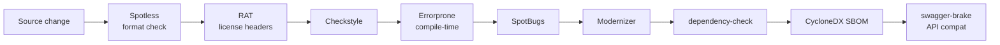

Apache Fineract enforces code quality through a stack of Gradle plugins: Spotless for formatting and license headers, Checkstyle for stylistic rules, SpotBugs for static bug detection, Errorprone at compile time, Modernizer for outdated API patterns, dependency-check for CVEs, swagger-brake for API compatibility, and Apache RAT for license-header completeness. Every check runs in CI through the `build-quality-checks.yml` workflow; failures block PR merges.

## Quality gate pipeline



## Spotless

The `com.diffplug.spotless` plugin handles both formatting and the Apache license header. Configuration lives at the root and applies to Java, Groovy, and properties files.

Typical command:

```bash
./gradlew spotlessApply   # write fixes
./gradlew spotlessCheck   # verify only — used in CI
```

What Spotless does for Fineract:

1. **Java formatter** — Eclipse-style with project rules (4-space indent, 200-char line length in places).
2. **Import ordering** — deterministic.
3. **License-header injection** — every `.java` and `.gradle` file must begin with the Apache 2.0 ASF header. Spotless writes a missing header automatically.
4. **trailing-whitespace and final-newline normalization**.

The header template lives under `config/spotless/`. Look for `apache-license-header.txt` (or similar) — Spotless reads it and applies it to files missing the header.

## Checkstyle

`config/checkstyle/checkstyle.xml` (with a `suppressions.xml` companion) drives the Checkstyle plugin. The configuration is closer to "Apache standard" than "Google Java Style":

- Mandatory braces on every `if/for/while`.
- Final parameters not enforced (Lombok is used heavily).
- Specific naming rules for constants and packages.
- Empty-line and import rules.

Run with:

```bash
./gradlew checkstyleMain checkstyleTest
```

Reports land under `build/reports/checkstyle/`. The suppressions file is the place to silence noisy rules for generated code (`fineract-client` and `fineract-avro-schemas` get blanket exclusions).

## Errorprone

`net.ltgt.errorprone` integrates Google's Errorprone compiler plugin. It is applied through the convention scripts to all production modules. Common patterns it catches:

- `equals` on `Optional`.
- `BigDecimal` constructed from `double`.
- Possibly-null dereferences.
- `instanceof` patterns that hide a cast.

Disabling individual checks is done via `@SuppressWarnings("ErrorPronePatternName")` at the call site, or globally in the convention script's `errorprone { disable("PatternName") }` block.

## SpotBugs

`com.github.spotbugs` runs after compile and finds bug patterns at the bytecode level:

- Resource leaks.
- Null-pointer dereferences.
- Switch-fallthrough.
- Inefficient string handling.

Many generated and DTO modules disable SpotBugs explicitly. For example, in `fineract-client/build.gradle`:

```groovy
spotbugsMain { enabled = false }
spotbugsTest { enabled = false }
```

This avoids futile findings against generated code.

## Modernizer

`com.github.andygoossens.modernizer` finds outdated APIs. For a JDK-21 codebase like Fineract it flags pre-Java-8 idioms (anonymous inner classes that could be lambdas, manual collection iteration, etc.). The plugin runs as part of `check`.

## Apache RAT (license-header completeness)

The `org.nosphere.apache.rat` plugin runs the Release Audit Tool. It enumerates every file in the source tree and asserts:

1. The file is excluded (e.g. binary fixtures, generated outputs, the `LICENSE` file itself), OR
2. The file carries the canonical Apache 2.0 header.

Exclusions are listed under `config/rat/` (or via the plugin's DSL in the root build). Build failure messages list every offending file.

## dependency-check

The OWASP `dependency-check` Gradle plugin scans all resolved jars for known CVEs. Output: an HTML and JSON report under each module's `build/reports/dependency-check-report.*`. The suppressions file at `config/dependencyCheck/dependency-check-suppressions.xml` (or similar) lists false-positive matches the project has triaged.

CI invokes:

```bash
./gradlew dependencyCheckAnalyze
```

Severities above a configured threshold fail the build.

## CycloneDX SBOM

The `org.cyclonedx.bom` plugin emits a software bill-of-materials in CycloneDX format. The output is shipped alongside binary distributions, satisfying SBOM expectations from downstream Apache committee requirements and from operators of the Fineract container image.

## swagger-brake

`com.docktape.swagger-brake` is the API breaking-change detector. Configuration in `fineract-provider/build.gradle`:

```groovy
swaggerBrake {
    newApi = findProperty('apiNew') ?: "${project.buildDir}/resources/main/static/fineract.json"
    oldApi = findProperty('apiBaseline') ?: "${projectDir}/config/swagger/fineract-baseline.json"
    outputFormats = ['JSON']
    outputFilePath = "${project.buildDir}/swagger-brake"
    deprecatedApiDeletionAllowed = true
    strictValidation = false
}

checkBreakingChanges.onlyIf {
    def baseline = findProperty('apiBaseline') ?: "${projectDir}/config/swagger/fineract-baseline.json"
    file(baseline).exists() && file(findProperty('apiNew')).exists()
}
```

The plugin compares the freshly generated `fineract.json` OpenAPI spec against a baseline snapshot. PR builds fail when an unintended breaking change is detected. The CI workflow `verify-api-backward-compatibility.yml` drives this.

A complementary `verify-liquibase-backward-compatibility.yml` workflow does the same for schema changes — see [CI](/build/ci-and-github-actions).

## SonarQube

The root build applies `org.sonarqube`. SonarQube analysis runs in the `sonarqube.yml` workflow and posts code-coverage, code-smell, and security results to the project's SonarCloud / SonarQube instance. JaCoCo (version `0.8.14`, pinned in the root `ext` block) emits coverage XML that SonarQube consumes.

## Where the configs live

| Tool | Location |
|---|---|
| Spotless | `config/spotless/` + root build snippets |
| Checkstyle | `config/checkstyle/checkstyle.xml`, `config/checkstyle/suppressions.xml` |
| SpotBugs | per-module DSL in `build.gradle` |
| Errorprone | convention script, per-module overrides |
| Modernizer | convention script |
| dependency-check | `config/dependencyCheck/` (suppressions) |
| RAT | root build DSL + exclusions |
| swagger-brake | `fineract-provider/config/swagger/fineract-baseline.json` |
| SonarQube | root build DSL + `sonarqube.yml` workflow |

## Run-everything command

```bash
./gradlew check
```

This task aggregates Spotless check, Checkstyle, SpotBugs, Modernizer, RAT, unit tests, and Cucumber. CI runs this on every push.

For a partial run:

```bash
./gradlew :fineract-loan:check        # one module
./gradlew :fineract-provider:checkBreakingChanges
./gradlew dependencyCheckAnalyze cyclonedxBom
```

## CI hookup

The `.github/workflows/build-quality-checks.yml` workflow:

1. Sets up JDK 21 (`zulu` distribution).
2. Restores Gradle cache.
3. Runs `./gradlew spotlessCheck checkstyleMain checkstyleTest spotbugsMain modernizerMain rat`.
4. Uploads reports as workflow artifacts on failure.

Quality findings appear as annotations on the PR diff and as a single status check in the merge UI.

## Developer workflow

1. Run `./gradlew spotlessApply` before committing — fixes formatting and headers.
2. Run `./gradlew :affected-module:check` for a fast-feedback loop.
3. Push; CI runs the full gate.
4. Address findings in the next commit; `pr-title-check.yml` ensures the PR title matches the conventional-commit pattern.

## See also

- [Gradle layout](/build/gradle-layout)
- [Dependency management](/build/dependency-management)
- [Testing](/build/testing)
- [CI / CD](/build/ci-and-github-actions)
