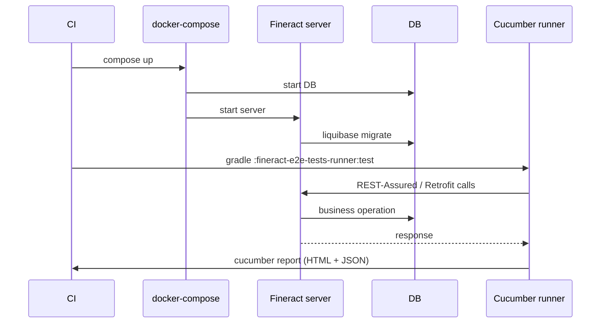

Apache Fineract uses Cucumber and the Gherkin DSL for two distinct categories of tests: in-module BDD-style scenarios that drive subsystems through their service APIs (notably under `fineract-provider`), and broad end-to-end scenarios under `fineract-e2e-tests-runner` that hit a live server through the generated SDK. Both share runner conventions and tag schemes, so understanding one carries over to the other.

## Where the features live

```
custom/acme/loan/starter/src/test/resources/features/cob.feature
custom/acme/note/starter/src/test/resources/features/note.feature
fineract-e2e-tests-runner/src/test/resources/features/0_COB.feature
fineract-e2e-tests-runner/src/test/resources/features/AccountTransfer.feature
fineract-e2e-tests-runner/src/test/resources/features/AssetExternalization-Part1.feature
fineract-e2e-tests-runner/src/test/resources/features/AssetExternalization-Part2.feature
fineract-e2e-tests-runner/src/test/resources/features/BatchApi.feature
fineract-e2e-tests-runner/src/test/resources/features/BusinessDate.feature
fineract-e2e-tests-runner/src/test/resources/features/Client.feature
fineract-e2e-tests-runner/src/test/resources/features/Configuration.feature
fineract-e2e-tests-runner/src/test/resources/features/Currency.feature
fineract-e2e-tests-runner/src/test/resources/features/Datatables.feature
fineract-e2e-tests-runner/src/test/resources/features/EMICalculation-Part1..4.feature
fineract-e2e-tests-runner/src/test/resources/features/InlineCOB.feature
fineract-e2e-tests-runner/src/test/resources/features/Loan-Part1..4.feature
fineract-e2e-tests-runner/src/test/resources/features/LoanAccrualActivity-Part1.feature
```

Plus `*.feature` files under `fineract-provider/src/test/resources/features/` that exercise the in-process domain.

## Gradle wiring

In `fineract-provider/build.gradle`:

```groovy
apply plugin: 'se.thinkcode.cucumber-runner'
...
check.dependsOn('cucumber')
```

The `cucumber` task is contributed by the plugin. It runs all features under `src/test/resources/features/` with a Cucumber-JVM runner configured to discover step definitions on the test classpath.

For the e2e runner module, a similar plugin application runs all features there.

## A real feature

`Client.feature` from the e2e runner:

```gherkin
@ClientFeature
Feature: Client

  @TestRailId:C14 @Smoke
  Scenario Outline: Client creation functionality for Fineract
    When Admin creates a client with Firstname <firstName> and Lastname <lastName>
    Then Client is created successfully
    Examples:
      | firstName    | lastName |
      | "FirstName1" | "Test1"  |


  @TestRailId:C15
  Scenario Outline: Client creation with address functionality for Fineract
    When Global configuration "enable-address" is enabled
    When Admin creates a client with Firstname <firstName> and Lastname <lastName> with address
    Then Client is created successfully
    Examples:
      | firstName    | lastName |
      | "FirstName2" | "Test2"  |
```

Each scenario carries a `@TestRailId:CNN` tag that the test plan maps to a TestRail case. `@Smoke` marks scenarios that must pass before a release candidate is accepted.

## Tag conventions

| Tag | Meaning |
|---|---|
| `@Smoke` | Fast subset; runs on every PR. |
| `@TestRailId:CXX` | Cross-references TestRail. |
| `@<FeatureName>Feature` | Per-feature grouping (e.g. `@ClientFeature`). |
| `@Wip` | Work-in-progress — typically excluded from CI by `--tags "not @Wip"`. |
| `@Slow` | Long-running; gated out of the smoke shard. |

## Step definitions

Step definitions live in `fineract-e2e-tests-core/src/main/java/.../stepdefinitions/` (and corresponding test classpaths). They use the standard Cucumber-JVM annotations and lean on Cucumber-Spring for dependency injection:

```java
@RequiredArgsConstructor
public class ClientStepDefinitions {

    private final ClientApiServices clientApi;
    private final TestContext testContext;

    @When("Admin creates a client with Firstname {string} and Lastname {string}")
    public void createClient(String firstName, String lastName) {
        var request = PostClientsRequest.builder()
                .firstname(firstName)
                .lastname(lastName)
                ...
                .build();
        var response = clientApi.create(request).execute().body();
        testContext.put("client", response);
    }

    @Then("Client is created successfully")
    public void verifyClientCreated() {
        var response = testContext.get("client", PostClientsResponse.class);
        assertNotNull(response.getClientId());
    }
}
```

Steps:

1. Receive parameters from Cucumber's argument transformers.
2. Call into Fineract through the generated **fineract-client** Retrofit interfaces.
3. Stash intermediate state in a shared `TestContext` bean so subsequent steps can chain.

## Cucumber-Spring integration

Step definitions are Spring beans. A `@CucumberContextConfiguration` class on the runner side bootstraps the Spring application context:

```java
@CucumberContextConfiguration
@SpringBootTest(classes = FineractE2ETestRunnerApplication.class)
public class CucumberSpringConfiguration {
}
```

This pulls in the test config, including:

- Retrofit `Retrofit` and `OkHttpClient` beans pointed at the target Fineract URL.
- An `AdminContext` bean that holds the logged-in token and tenant header.
- `TestContext` for scenario-scoped state.
- Step-definition classes auto-registered through `@Component`.

## Runner class

A JUnit 5 runner glues Cucumber to the test platform:

```java
@Suite
@IncludeEngines("cucumber")
@SelectClasspathResource("features")
@ConfigurationParameter(key = GLUE_PROPERTY_NAME, value = "org.apache.fineract.test.stepdef")
@ConfigurationParameter(key = FILTER_TAGS_PROPERTY_NAME, value = "@Smoke")
public class SmokeRunner { }
```

Different runners select different tag expressions (`@Smoke`, full regression, etc.).

## Provider-side cucumber

Inside `fineract-provider`, a smaller Cucumber suite focuses on subsystems that benefit from BDD framing — for example the COB pipeline, batch API, and validation rules. These tests do not boot a real HTTP server; they use Spring's in-process test context.

The custom modules under `custom/acme/` ship their own `cob.feature` and `note.feature` examples to demonstrate that downstream forks can attach their own scenarios into the same runner.

## Sample COB feature

`fineract-e2e-tests-runner/src/test/resources/features/0_COB.feature` is one of the entry-point feature files for the close-of-business pipeline. Its scenarios are listed first because the runner naming convention `0_*.feature` (leading digit) influences execution order in some runner configurations — COB scenarios prove that the day-rollover machinery works before other features layer on top.

## End-to-end execution flow



## CI workflows

- `.github/workflows/build-cucumber.yml` — runs the e2e Cucumber suite.
- `.github/workflows/build-e2e-tests.yml` — broader e2e coverage.
- The `Smoke` tag also runs on every PR through the smaller workflows.

Failing scenarios produce annotated reports under each module's `build/reports/cucumber/` and the workflow uploads them as artifacts for triage.

## Authoring guidance

1. Place the feature file under the relevant module's `src/test/resources/features/`.
2. Use the existing tag taxonomy (`@FeatureName`, `@Smoke`, `@TestRailId`).
3. Reuse existing step phrases when possible — the glue picks them up automatically.
4. If new steps are needed, add them under the matching `stepdefinitions` package; they are Spring beans, so constructor-inject any helpers you need.
5. Run `./gradlew :fineract-provider:cucumber` (or the e2e runner equivalent) locally; the cucumber-runner Gradle plugin will list scenarios as they run.

## See also

- [Testing](/build/testing) — unit + integration tiers.
- [Generated client SDKs](/clients/overview) — what the step definitions call.
- [CI / CD](/build/ci-and-github-actions) — how Cucumber jobs are scheduled.
