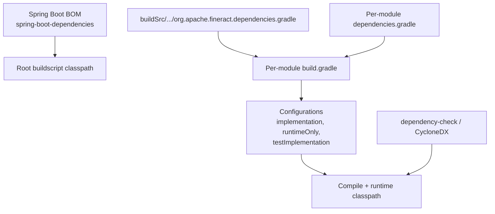
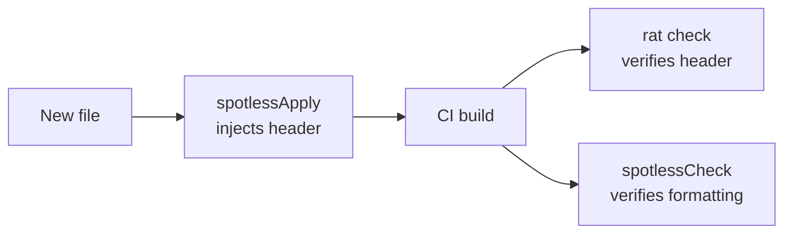

Apache Fineract pins every dependency through a combination of Spring Boot's BOM, a centralized `dependencies.gradle` convention script in `buildSrc/`, and per-module `dependencies.gradle` files. There is also a CVE scanner, license-header enforcement, and the Apache release plugin's RAT check. This page explains how the pieces interact.

## Dependency surfaces



## Spring Boot BOM as anchor

Almost every transitive version is governed by Spring Boot's dependency management. The `org.springframework.boot` plugin is applied to runtime modules (most notably `fineract-provider`); applying that plugin transitively brings in the `spring-boot-dependencies` BOM, which pins:

- Spring framework
- Hibernate Validator, Jakarta APIs
- Jackson
- Logback, SLF4J
- Tomcat embed
- HikariCP, Caffeine
- JUnit Jupiter, Mockito, AssertJ
- Quartz, Liquibase

Module `build.gradle` files therefore can declare dependencies **without versions** in most cases:

```groovy
implementation 'org.springframework.boot:spring-boot-starter-web'
implementation 'org.springframework.boot:spring-boot-starter-validation'
implementation 'com.fasterxml.jackson.core:jackson-databind'
implementation 'org.postgresql:postgresql'
```

## buildSrc convention script

`buildSrc/src/main/groovy/org.apache.fineract.dependencies.gradle` is the shared dependency convention. It is applied by individual modules with:

```groovy
apply from: "${rootDir}/buildSrc/src/main/groovy/org.apache.fineract.dependencies.gradle"
```

This file:

- Adds repository declarations (Maven Central, Apache snapshots).
- Configures `dependencyManagement` to import additional BOMs.
- Pins selected dependency versions explicitly (libraries not in the Spring Boot BOM, or pinned to a specific patch level).
- Wires `compileOnly`/`annotationProcessor` for Lombok across modules.

## Per-module dependencies.gradle

Many modules keep a `dependencies.gradle` file next to their `build.gradle` so the `dependencies { ... }` block is isolated from build logic. Example (excerpted from `fineract-provider/dependencies.gradle`):

```groovy
dependencies {
    modules {
        module("io.swagger.core.v3:swagger-annotations") {
            replacedBy("io.swagger.core.v3:swagger-annotations-jakarta")
        }
    }

    implementation(project(path: ':fineract-core'))
    implementation(project(path: ':fineract-cob'))
    implementation(project(path: ':fineract-command'))
    implementation(project(path: ':fineract-command-audit'))
    implementation(project(path: ':fineract-command-jdbc'))
    implementation(project(path: ':fineract-validation'))
    implementation(project(path: ':fineract-accounting'))
    // ... domain modules ...
    providedRuntime("org.springframework.boot:spring-boot-starter-tomcat")
}
```

Note the `modules { ... replacedBy(...) }` block — Fineract migrated to the Jakarta EE 9+ namespace and forces resolution to land on `swagger-annotations-jakarta` instead of the legacy javax artifact.

## Integration-test dependencies

`integration-tests/dependencies.gradle` wires the test harness:

```groovy
tomcat 'org.apache.tomcat:tomcat:10.1.55@zip'
testImplementation(
    project(path: ':fineract-core', configuration: 'runtimeElements'),
    project(path: ':fineract-accounting', configuration: 'runtimeElements'),
    ...
    project(path: ':fineract-provider', configuration: 'runtimeElements'),
    project(path: ':fineract-avro-schemas', configuration: 'runtimeElements'),
    project(path: ':fineract-progressive-loan', configuration: 'runtimeElements')
)
testImplementation project(path: ':fineract-client', configuration: 'runtimeElements')
testImplementation(project(path: ':fineract-client-feign', configuration: 'runtimeElements')) {
    exclude group: 'org.apache.fineract', module: 'fineract-client'
}
testImplementation 'org.mock-server:mockserver-junit-jupiter'
testImplementation 'io.rest-assured:rest-assured'
testImplementation 'org.apache.groovy:groovy-xml'
testImplementation 'org.awaitility:awaitility'
```

Highlights:

- The Tomcat tarball is pulled as a separate `tomcat` configuration so the harness can extract it to host the server.
- Both `fineract-client` (Retrofit) and `fineract-client-feign` (Feign) are available; the Feign module excludes the Retrofit one to avoid duplicated models.
- REST-Assured is the HTTP test client of choice; MockServer supports outbound stubbing; Awaitility handles async assertions.

## CVE scanning

The OWASP `dependency-check` plugin runs as part of the quality pipeline, emitting an HTML/JSON report into each module's `build/reports`. Suppressions live in `config/dependencyCheck/`. The CI workflow `build-quality-checks.yml` runs the scan and fails the job on high-severity findings.

A complementary **CycloneDX SBOM** plugin (`org.cyclonedx.bom`) emits a software bill-of-materials per module for downstream auditing.

## License headers

Fineract requires every source file to carry the Apache 2.0 header. Two plugins collaborate:

- `com.diffplug.spotless` runs a header-format step that auto-applies the header.
- `org.nosphere.apache.rat` (Apache Release Audit Tool) runs as a check that fails the build on any file missing the header.

The header template lives in `config/spotless/` and the RAT exclusions list in `config/rat/`.



## License REPORT

`com.github.jk1.dependency-license-report` collects the licenses of every dependency into an HTML/JSON file. The output is checked into `licenses/binary/` for the WAR distribution — Apache requires the binary distribution to ship a complete `LICENSE` listing of every dependency's terms.

## Updating dependencies

Bumping a dependency typically involves three steps:

1. Edit the version in `buildSrc/.../org.apache.fineract.dependencies.gradle` (or the per-module file) if the dependency is pinned outside the Spring Boot BOM.
2. Re-run `./gradlew build` locally to catch breakage.
3. Re-run `./gradlew dependencyCheckAnalyze` and `cyclonedxBom` to refresh CVE and SBOM reports.

For automated bumps, Fineract relies on **Renovate** — the repo has a `renovate.json` at the root that configures Renovate Bot to open pull requests when newer versions are available.

## Replacing artifacts

Where the Spring Boot BOM ships a transitive artifact that conflicts with a Jakarta-EE-9 replacement, Fineract uses Gradle's `replacedBy`:

```groovy
modules {
    module("io.swagger.core.v3:swagger-annotations") {
        replacedBy("io.swagger.core.v3:swagger-annotations-jakarta")
    }
}
```

This avoids excluding the artifact everywhere it appears transitively.

## Exclusion patterns

Some test-only dependencies pull in `javax.mail` or legacy XML APIs that conflict with Jakarta replacements. Per-module exclusions are common:

```groovy
testImplementation('io.rest-assured:rest-assured') {
    exclude group: 'commons-logging'
    exclude group: 'org.apache.sling'
    exclude group: 'com.sun.xml.bind'
}
testImplementation('org.mock-server:mockserver-junit-jupiter') {
    exclude group: 'com.sun.mail', module: 'mailapi'
    exclude group: 'javax.servlet', module: 'javax.servlet-api'
    exclude group: 'javax.validation'
}
```

## Versions worth noting

The root `buildscript` block fixes a handful of direct-dependency versions for plugin-loaded code:

```groovy
classpath 'com.bmuschko:gradle-cargo-plugin:2.9.0'
classpath 'org.eclipse.persistence:eclipselink:4.0.9'
classpath 'jakarta.ws.rs:jakarta.ws.rs-api:3.1.0'
classpath 'com.google.cloud.tools:jib-layer-filter-extension-gradle:0.3.0'
classpath 'org.apache.commons:commons-lang3:3.20.0'
classpath 'io.swagger.core.v3:swagger-jaxrs2-jakarta:2.2.49'
classpath 'jakarta.servlet:jakarta.servlet-api:6.1.0'
```

And in the plugin `ext` block:

```groovy
jacocoVersion = '0.8.14'
retrofitVersion = '2.9.0'
okhttpVersion = '4.9.3'
```

## Dependency-graph commands

| Task | Output |
|---|---|
| `./gradlew :fineract-provider:dependencies` | Tree of all configurations. |
| `./gradlew :fineract-provider:dependencyInsight --dependency org.eclipse.persistence:eclipselink` | Why a specific version is selected. |
| `./gradlew dependencyCheckAnalyze` | OWASP CVE report. |
| `./gradlew cyclonedxBom` | SBOM. |
| `./gradlew generateLicenseReport` | License inventory. |

## See also

- [Gradle layout](/build/gradle-layout)
- [Code quality](/build/code-quality)
- [Release process](/build/release-process)
