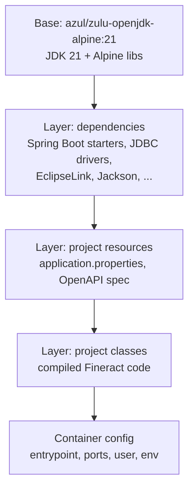

Apache Fineract does not ship a hand-written `Dockerfile` for its main image. Instead, the container is produced by Google's **Jib** Gradle plugin, configured in `fineract-provider/build.gradle`. Jib reads the project's classes and dependencies, layers them efficiently, and pushes (or saves) an OCI image — no Docker daemon required for the build itself, although `jibDockerBuild` can target the local daemon for convenience.

## The Jib configuration

`fineract-provider/build.gradle` declares:

```groovy
apply plugin: 'com.google.cloud.tools.jib'

jib {
    from {
        image = 'azul/zulu-openjdk-alpine:21'
        platforms {
            platform {
                architecture = System.getProperty("os.arch").equals("aarch64") ? "arm64" : "amd64"
                os = 'linux'
            }
        }
    }

    to {
        image = 'fineract'
        tags = [
            "${project.version}",
            'latest'
        ]
    }

    container {
        creationTime = 'USE_CURRENT_TIMESTAMP'
        mainClass = 'org.apache.fineract.ServerApplication'
        extraClasspath = ['/app/plugins/*']
        args = [
            '-Duser.home=/tmp',
            '-Dfile.encoding=UTF-8',
            '-Duser.timezone=UTC',
            '-Djava.security.egd=file:/dev/./urandom'
        ]
        ports = ['8080/tcp', '8443/tcp']
        labels = [maintainer: 'Aleksandar Vidakovic <aleks@apache.org>']
        user = 'nobody:nogroup'
    }

    allowInsecureRegistries = true

    dependencies {
        implementation 'org.postgresql:postgresql'
    }
}
```

Key facts:

- **Base image**: `azul/zulu-openjdk-alpine:21`. Alpine + Zulu JDK 21 keeps the image small and the JVM well-maintained.
- **Architecture aware**: the build picks `arm64` on Apple Silicon and `amd64` elsewhere, automatically.
- **Tags**: every push gets both `latest` and the project version (e.g. `1.10.1`).
- **Entrypoint**: `org.apache.fineract.ServerApplication` is the Spring Boot main class.
- **Extra classpath**: `/app/plugins/*` lets downstream forks drop additional JARs into a mounted directory and have them picked up automatically.
- **Runtime args**: standard JVM flags for timezone (UTC), encoding (UTF-8), random seeding, and a writable `user.home`.
- **Ports**: HTTP on 8080, HTTPS on 8443.
- **User**: runs as `nobody:nogroup` — non-root by default.

## Build commands

```bash
# Build and save into the local Docker daemon
./gradlew :fineract-provider:jibDockerBuild

# Build and push to a remote registry
./gradlew :fineract-provider:jib \
  -Djib.to.image=ghcr.io/your-org/fineract \
  -Djib.to.tags=$(git rev-parse --short HEAD),latest

# Build a tarball for air-gapped transfer
./gradlew :fineract-provider:jibBuildTar
```

The `:fineract-provider:resolve` task (Swagger spec generation) runs first as a build dependency so the OpenAPI JSON is bundled into the image's `static/` resources.

## Image contents



Jib's layered approach means subsequent rebuilds only ship the classes layer in most cases — much faster than monolithic Dockerfiles.

## Runtime environment

The image is pure JDK + Fineract classes. **All configuration is via environment variables** — see [Environment variables](/config/environment-variables) for the full list. A typical run:

```bash
docker run -p 8443:8443 \
  -e FINERACT_DEFAULT_TENANTDB_HOSTNAME=db \
  -e FINERACT_DEFAULT_TENANTDB_PORT=5432 \
  -e FINERACT_DEFAULT_TENANTDB_UID=fineract \
  -e FINERACT_DEFAULT_TENANTDB_PWD=secret \
  -e SPRING_DATASOURCE_URL=jdbc:postgresql://db:5432/fineract_tenants \
  -e SPRING_DATASOURCE_USERNAME=fineract \
  -e SPRING_DATASOURCE_PASSWORD=secret \
  fineract:latest
```

For local development the `docker-compose-postgresql.yml` (and sister files) at the repo root pre-wire all the variables and start a matching DB container.

## Docker compose files

The repository ships many compose files for different runtime shapes:

| File | Purpose |
|---|---|
| `docker-compose.yml` | Default dev stack. |
| `docker-compose-postgresql.yml` | Fineract + PostgreSQL. |
| `docker-compose-postgresql-activemq.yml` | + ActiveMQ for JMS remote jobs. |
| `docker-compose-postgresql-kafka.yml` | + Kafka for events. |
| `docker-compose-postgresql-kafka-msk.yml` | AWS MSK variant. |
| `docker-compose-mariadb.yml` / `-mysql.yml` | Alternative DBs. |
| `docker-compose-mariadb-test.yml` / `-mysql-test.yml` / `-postgresql-test.yml` | Test variants used by CI. |
| `docker-compose-twofactor-test.yml` | 2FA-enabled for the 2FA test suite. |
| `docker-compose-oauth2-test.yml` | OAuth2 + IdP container for the OAuth2 test suite. |
| `docker-compose-community-app.yml` | Bundles the community web UI. |
| `docker-compose-development.yml` | Hot-reload dev stack. |
| `docker-compose-web-app.yml` | Bundles the web app. |
| `docker-compose-custom.yml` | Template for downstream overrides. |

## Health and probes

Fineract exposes Spring Boot Actuator endpoints. A typical Kubernetes deployment uses:

```yaml
livenessProbe:
  httpGet:
    path: /fineract-provider/actuator/health/liveness
    port: 8080
readinessProbe:
  httpGet:
    path: /fineract-provider/actuator/health/readiness
    port: 8080
```

The actuator exposes Liquibase status, datasource status, and disk-space. See `ActuatorIntegrationTest.java` for examples.

## TLS

The container's 8443 listener is configured by Spring Boot when a keystore is provided via `SERVER_SSL_KEY_STORE` / `SERVER_SSL_KEY_STORE_PASSWORD`. The CI images use a self-signed certificate baked into `config/`; production deployments mount their own keystore.

## Published images

Two public destinations exist:

- **Docker Hub** — `apache/fineract` (the long-standing community image), published from `.github/workflows/publish-dockerhub.yml`.
- **GitHub Container Registry** — used as a staging registry for nightly builds.

The publish workflow runs on tag pushes and on merges to `develop`. It calls `jib` with `-Djib.to.image=...` and authenticates using a registry token from GitHub secrets.

## Adding plugins to the image

The `extraClasspath = ['/app/plugins/*']` entry means operators can:

1. Mount a directory containing additional JARs at `/app/plugins/` in the container.
2. The JVM will load them on startup alongside Fineract's own classes.
3. This is the supported extension point for custom report parsers, validation hooks, or downstream module forks.

## Build-time dependencies

The `jib { dependencies { implementation 'org.postgresql:postgresql' } }` block ensures the PostgreSQL JDBC driver is on the image classpath. The MariaDB and MySQL drivers can be added the same way (or mounted via the plugins directory).

## Multi-arch builds

Out of the box, Jib emits a single-platform image matching the build host. To produce a multi-platform image (amd64 + arm64) in CI, run:

```bash
./gradlew :fineract-provider:jib \
  -Djib.from.platforms='{"architecture":"amd64","os":"linux"},{"architecture":"arm64","os":"linux"}'
```

The `publish-dockerhub.yml` workflow does this for release tags.

## When to override the base image

The default Alpine base is small but uses `musl` libc, which occasionally surprises native libraries. To switch to a glibc base:

```bash
./gradlew :fineract-provider:jibDockerBuild \
  -Djib.from.image=azul/zulu-openjdk:21
```

## See also

- [Environment variables reference](/config/environment-variables)
- [Build, test and deployment overview](/build/overview)
- [Release process](/build/release-process)
- [CI / CD](/build/ci-and-github-actions)
