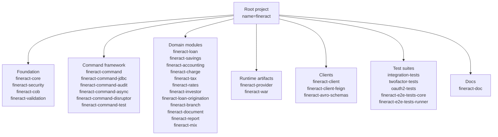

Apache Fineract is a Gradle multi-project build. The top-level `settings.gradle` enumerates every subproject; the root `build.gradle` configures plugins and version derivation; convention scripts under `buildSrc/` centralize shared dependency declarations and the release pipeline. This page walks the layout end-to-end.

## settings.gradle

The root `settings.gradle` performs three jobs:

1. Connects the build to Apache's **Develocity** instance (build scans, build cache).
2. Enables a local build cache.
3. Includes every subproject by name.

```groovy
plugins {
    id 'com.gradle.develocity' version '3.18.2'
    id 'com.gradle.common-custom-user-data-gradle-plugin' version '2.6.0'
}

def isCI = System.getenv('JENKINS_URL') != null

develocity {
    projectId = "fineract"
    server = "https://develocity.apache.org"
    buildScan {
        uploadInBackground = !isCI
        publishing.onlyIf { it.authenticated }
        obfuscation { ipAddresses { ... } }
    }
}

buildCache { local { enabled = true } }

rootProject.name = 'fineract'
```

Then come the `include` lines, one per module:

```groovy
include ':fineract-core'
include ':fineract-security'
include ':fineract-cob'
include ':fineract-validation'
include ':fineract-command'
include ':fineract-command-test'
include ':fineract-command-jdbc'
include ':fineract-command-audit'
include ':fineract-command-async'
include ':fineract-command-disruptor'
include ':fineract-accounting'
include ':fineract-provider'
include ':fineract-branch'
include ':fineract-document'
include ':fineract-investor'
include ':fineract-rates'
include ':fineract-charge'
include ':fineract-tax'
include ':fineract-loan-origination'
include ':fineract-loan'
include ':fineract-savings'
include ':fineract-report'
include ':fineract-mix'
include ':fineract-war'
include ':integration-tests'
include ':twofactor-tests'
include ':oauth2-tests'
include ':fineract-client'
include ':fineract-client-feign'
include ':fineract-doc'
include ':fineract-avro-schemas'
```

Additional includes (progressive loan modules, e2e test runners, working-capital loan) follow.

## Subproject categories



## Root build.gradle

The root `build.gradle` begins with a `buildscript` block declaring versions used by other scripts:

```groovy
buildscript {
    ext {
        jacocoVersion = '0.8.14'
        retrofitVersion = '2.9.0'
        okhttpVersion = '4.9.3'
        fineractCustomProjects = []
        fineractJavaProjects = subprojects.findAll{ ... }
        fineractPublishProjects = subprojects.findAll{ ... }
        npmRepository = 'https://npm.pkg.github.com'
    }
}
```

Two project lists are derived from `subprojects`:

- **`fineractJavaProjects`** — every module that gets the Java plugin applied (almost everything).
- **`fineractPublishProjects`** — modules whose jars are published as Apache release artifacts. The runtime test modules (`integration-tests`, `twofactor-tests`, `oauth2-tests`) and the test-runner modules are excluded.

## Plugin block

The root applies a long list of plugins, most with `apply false` so they are only activated by individual modules:

```groovy
plugins {
    id 'me.qoomon.git-versioning' version '6.4.4'
    id "org.barfuin.gradle.taskinfo" version "2.2.1"
    id 'com.adarshr.test-logger' version '4.0.0'
    id 'com.diffplug.spotless' version '6.25.0' apply false
    id 'org.nosphere.apache.rat' version '0.8.1' apply false
    id 'com.github.hierynomus.license' version '0.16.1' apply false
    id 'com.github.jk1.dependency-license-report' version '2.9' apply false
    id 'org.springframework.boot' version '3.5.14' apply false
    id 'net.ltgt.errorprone' version '4.4.0' apply false
    id 'io.swagger.core.v3.swagger-gradle-plugin' version '2.2.49' apply false
    id 'com.gorylenko.gradle-git-properties' version '2.5.7' apply false
    id 'org.asciidoctor.jvm.convert' version '4.0.5' apply false
    id 'com.google.cloud.tools.jib' version '3.5.3' apply false
    id 'org.sonarqube' version '6.3.1.5724'
    id 'com.github.andygoossens.modernizer' version '1.13.0' apply false
    id 'com.github.spotbugs' version '6.5.4' apply false
    id 'se.thinkcode.cucumber-runner' version '0.0.14' apply false
    id 'org.openapi.generator' version '7.22.0' apply false
    id 'com.gradleup.shadow' version '9.4.1' apply false
    id 'me.champeau.jmh' version '0.7.3' apply false
    id 'org.cyclonedx.bom' version '3.2.4' apply false
    id 'com.docktape.swagger-brake' version '2.7.0' apply false
}
```

The few plugins applied at the root (no `apply false`) cover:

- Git-based versioning (Git tags → project version).
- TaskInfo for inspection.
- Test logging.
- SonarQube wiring.

## Convention scripts in buildSrc

`buildSrc/src/main/groovy/` contains two convention scripts that are applied across modules:

| File | Role |
|---|---|
| `org.apache.fineract.dependencies.gradle` | Centralizes inter-module `implementation(project(':...'))` declarations and common BOMs/test deps. |
| `org.apache.fineract.release.gradle` | Wires the Apache release pipeline — signing, source & binary distribution zips, RAT (license check). |

The root `build.gradle` applies the release script:

```groovy
apply from: "${rootDir}/buildSrc/src/main/groovy/org.apache.fineract.release.gradle"
```

Individual modules apply the dependencies script in their own `build.gradle`.

## Versioning

```groovy
version = '0.0.0-SNAPSHOT'

gitVersioning.apply {
    refs {
        considerTagsOnBranches = true
        describeTagPattern = '.*(\\d+\\.\\d+\\.\\d+).*'
        describeTagFirstParent = false
        branch("release\\/\\d+\\.\\d+\\.\\d+") { ... }
    }
}
```

`me.qoomon.git-versioning` derives the project version from git tags and branches:

- On `release/X.Y.Z` branches the version becomes `X.Y.Z`.
- Elsewhere the version is `0.0.0-SNAPSHOT` unless overridden.
- The same scheme propagates to the Jib image tag.

## Inter-module dependencies

`fineract-provider`, the HTTP-layer module, depends on most domain modules:

```groovy
implementation(project(path: ':fineract-core'))
implementation(project(path: ':fineract-cob'))
implementation(project(path: ':fineract-command'))
implementation(project(path: ':fineract-command-audit'))
implementation(project(path: ':fineract-command-jdbc'))
implementation(project(path: ':fineract-validation'))
implementation(project(path: ':fineract-accounting'))
implementation(project(path: ':fineract-investor'))
implementation(project(path: ':fineract-rates'))
implementation(project(path: ':fineract-charge'))
implementation(project(path: ':fineract-loan'))
implementation(project(path: ':fineract-savings'))
implementation(project(path: ':fineract-branch'))
implementation(project(path: ':fineract-document'))
implementation(project(path: ':fineract-progressive-loan'))
implementation(project(path: ':fineract-report'))
implementation(project(path: ':fineract-tax'))
implementation(project(path: ':fineract-loan-origination'))
implementation(project(path: ':fineract-security'))
implementation(project(path: ':fineract-working-capital-loan'))
implementation(project(path: ':fineract-mix'))
```

Domain modules generally depend on `fineract-core`, `fineract-command`, `fineract-validation`, and possibly each other.

## fineract-war

A thin module that re-packages the provider as a deployable WAR. It applies the `war` and `distribution` plugins:

```groovy
apply plugin: 'war'
apply plugin: 'distribution'
apply from: "${rootDir}/buildSrc/src/main/groovy/org.apache.fineract.dependencies.gradle"

war {
    archiveFileName = 'fineract-provider.war'
    outputs.cacheIf { true }
    ...
}
```

## Generated client modules

`fineract-client` (Retrofit-based) and `fineract-client-feign` (Feign-based) consume the OpenAPI spec produced by `fineract-provider:resolve` and use `org.openapi.generator` to emit Java sources, then compile them into publishable jars. See [Generated client SDKs overview](/clients/overview).

## settings recap

| File | Purpose |
|---|---|
| `settings.gradle` | Project name, Develocity, local cache, all `include` lines. |
| `build.gradle` | Root plugins, project version, plugin list, project-group derivation. |
| `buildSrc/src/main/groovy/org.apache.fineract.dependencies.gradle` | Shared dependency conventions. |
| `buildSrc/src/main/groovy/org.apache.fineract.release.gradle` | Apache release packaging. |
| `gradle.properties` | JVM args, parallel flags. |
| `gradle/wrapper/gradle-wrapper.properties` | Pinned Gradle version. |
| `static-weaving.gradle` | EclipseLink JPA static weaving wiring. |

## Useful tasks

| Task | What it does |
|---|---|
| `./gradlew :settings` | Confirms module list. |
| `./gradlew projects` | Hierarchical project view. |
| `./gradlew :fineract-provider:dependencies` | Inspect transitive resolution. |
| `./gradlew tasks --all` | Full task catalog. |
| `./gradlew buildScan` | Upload a build scan to Develocity. |

## See also

- [Dependency management](/build/dependency-management)
- [Code quality](/build/code-quality)
- [Docker image](/build/docker-image)
- [Generated client SDKs](/clients/overview)
