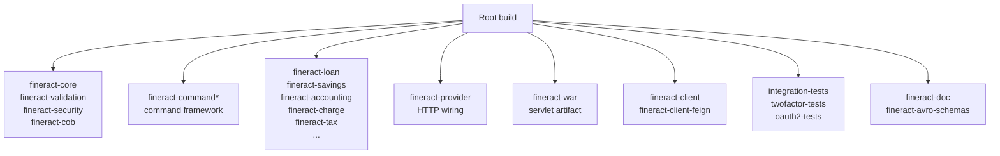

Apache Fineract ships as a multi-module Gradle build with more than 40 subprojects, layered code-quality checks, multiple test tiers (unit, integration, Cucumber, E2E), and a container image produced through Jib. Everything is wired so a single `./gradlew build` produces signed jars, a runnable WAR, and a Docker image. This page is the orientation map for the pages that drill into each piece.

## Pipeline overview


## Module map

The build is governed by `settings.gradle`, which includes the following subprojects:

```
fineract-core, fineract-security, fineract-cob, fineract-validation,
fineract-command, fineract-command-test, fineract-command-jdbc,
fineract-command-audit, fineract-command-async, fineract-command-disruptor,
fineract-accounting, fineract-provider,
fineract-branch, fineract-document, fineract-investor,
fineract-rates, fineract-charge, fineract-tax,
fineract-loan-origination, fineract-loan, fineract-savings,
fineract-report, fineract-mix, fineract-war,
integration-tests, twofactor-tests, oauth2-tests,
fineract-client, fineract-client-feign,
fineract-doc, fineract-avro-schemas
```

Plus a handful of additional modules used by the progressive-loan and e2e test runners.

See [Gradle layout](/build/gradle-layout) for how the modules relate.

## Build tooling stack

- **JDK 21** — every workflow declares `java-version: '21', distribution: 'zulu'`.
- **Gradle wrapper** — pinned in `gradle/wrapper/gradle-wrapper.properties`.
- **Develocity / build scans** — `develocity` plugin in `settings.gradle` connects to `https://develocity.apache.org`.
- **Convention plugins** in `buildSrc/` — `org.apache.fineract.dependencies.gradle` and `org.apache.fineract.release.gradle`.
- **Plugins applied at root**:
  - `me.qoomon.git-versioning` — derives version from Git tags/branches.
  - `org.springframework.boot` — Spring Boot packaging.
  - `com.diffplug.spotless` — formatter.
  - `com.github.spotbugs` — static analysis.
  - `com.github.andygoossens.modernizer` — modern API enforcement.
  - `net.ltgt.errorprone` — Errorprone compiler plugin.
  - `org.openapi.generator` — generates the Java/TypeScript SDKs.
  - `org.cyclonedx.bom` — SBOM emission.
  - `com.google.cloud.tools.jib` — container image without a Dockerfile.
  - `io.swagger.core.v3.swagger-gradle-plugin` — OpenAPI spec generation.

## Subproject grouping



## Test tiers

| Tier | Where | Page |
|---|---|---|
| Unit tests | each `src/test/java` | [Testing](/build/testing) |
| Integration tests | `integration-tests` (Retrofit + REST-Assured against a live Spring Boot process) | [Testing](/build/testing) |
| Cucumber/Gherkin features | `*.feature` in test resources, runner uses `se.thinkcode.cucumber-runner` plugin | [Cucumber](/build/cucumber-features) |
| End-to-end | `fineract-e2e-tests-core`, `fineract-e2e-tests-runner` | [Cucumber](/build/cucumber-features) |
| Two-factor | `twofactor-tests` against a configured 2FA Fineract | [Testing](/build/testing) |
| OAuth2 | `oauth2-tests` against an OAuth2-enabled Fineract | [Testing](/build/testing) |

Each tier runs in its own GitHub Actions matrix shard.

## Container image

Fineract does not ship a `Dockerfile` for the main image — it uses Google's **Jib** plugin in `fineract-provider/build.gradle`:

```groovy
jib {
    from { image = 'azul/zulu-openjdk-alpine:21' }
    to {
        image = 'fineract'
        tags = ["${project.version}", 'latest']
    }
    container {
        mainClass = 'org.apache.fineract.ServerApplication'
        ports = ['8080/tcp', '8443/tcp']
        user = 'nobody:nogroup'
    }
}
```

See [Docker image](/build/docker-image).

## Release process

Apache projects follow a strict release ritual. Fineract's `buildSrc/src/main/groovy/org.apache.fineract.release.gradle` plugin packages signed source and binary distributions for the Apache Release vote. See [Release process](/build/release-process).

## CI pipelines

Two CI surfaces:

- **GitHub Actions** under `.github/workflows/`, the primary public-PR CI. Build matrix covers MariaDB, MySQL, PostgreSQL, Cucumber, Docker, integration tests (sharded), and quality checks.
- **Jenkins** for ASF-side gatekeeping and signed-artifact production, plus `develocity` build-scan integration on Apache's instance.

See [CI: GitHub Actions and Jenkins](/build/ci-and-github-actions).

## Quick commands

| Goal | Command |
|---|---|
| Full local build | `./gradlew build` |
| Run server | `./gradlew bootRun` |
| Apply Spotless | `./gradlew spotlessApply` |
| Build image (Jib local Docker) | `./gradlew :fineract-provider:jibDockerBuild` |
| Run integration tests | `./gradlew :integration-tests:test` |
| Run Cucumber features | `./gradlew :fineract-provider:cucumber` |
| Generate Java SDK | `./gradlew :fineract-client:buildJavaSdk` |
| Produce OpenAPI spec | `./gradlew :fineract-provider:resolve` |

## Code quality gates

- **Spotless** — license header and formatter; check is part of `build`.
- **Checkstyle** — `config/checkstyle/checkstyle.xml` + suppressions.
- **PMD** — historical, partially active.
- **SpotBugs** — most modules; disabled for generated code.
- **Modernizer** — flags pre-Java-8 idioms.
- **Errorprone** — bug patterns at compile time.
- **dependency-check** / **CycloneDX SBOM** — produces CVE reports and bill-of-materials.
- **swagger-brake** — API breaking-change detection.

See [Code quality](/build/code-quality).

## Where to go next

<CardGroup>
  <Card title="Gradle layout" href="/build/gradle-layout">
    settings.gradle, root build, convention plugins, module list.
  </Card>
  <Card title="Dependency management" href="/build/dependency-management">
    Version pinning, the dependencies.gradle script.
  </Card>
  <Card title="Code quality" href="/build/code-quality">
    Spotless, Checkstyle, PMD, SpotBugs, Errorprone.
  </Card>
  <Card title="Testing" href="/build/testing">
    Unit, integration, two-factor and OAuth2 test modules.
  </Card>
  <Card title="Cucumber features" href="/build/cucumber-features">
    Gherkin scenarios and step definitions.
  </Card>
  <Card title="Docker image" href="/build/docker-image">
    Jib-built container, runtime configuration.
  </Card>
  <Card title="Release process" href="/build/release-process">
    Apache RC voting, signed distributions.
  </Card>
  <Card title="CI / CD" href="/build/ci-and-github-actions">
    GitHub Actions workflows, Jenkins, Develocity.
  </Card>
</CardGroup>
