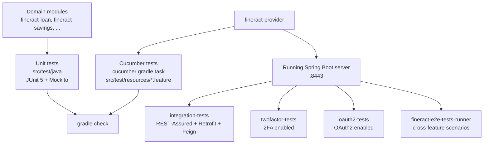
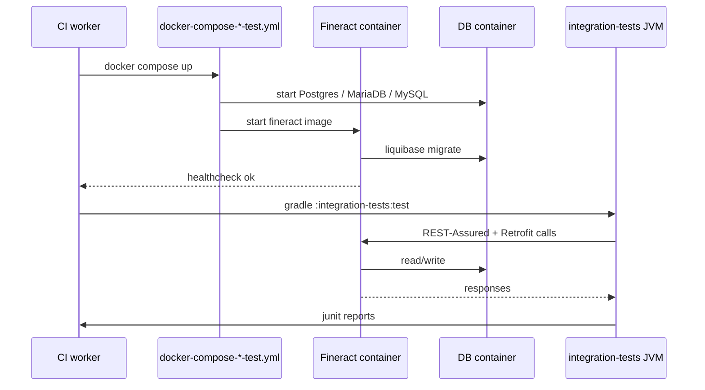

Apache Fineract has a layered test suite: in-module JUnit 5 unit tests, a dedicated `integration-tests` module that exercises a running Spring Boot server, Cucumber feature files under `fineract-e2e-tests-runner`, and two specialized harnesses (`twofactor-tests`, `oauth2-tests`) that boot Fineract with security toggles flipped. Together they form the safety net for the Apache Software Foundation release process.

## Test surfaces



## Unit tests

Every module carries `src/test/java` for JUnit 5 unit tests. The conventions:

- **JUnit Jupiter** (`org.junit.jupiter:junit-jupiter`) for tests.
- **AssertJ** for fluent assertions.
- **Mockito** for collaborators.
- Lombok in tests is uncommon — fixtures tend to be plain.
- Test classes live alongside the production class they target, matching the package path.

Run one module's unit tests with:

```bash
./gradlew :fineract-loan:test
```

Or all modules:

```bash
./gradlew test
```

## Integration tests

The `integration-tests` Gradle module hosts the broadest end-to-end tests against an actual Fineract server. From its `dependencies.gradle`:

```groovy
tomcat 'org.apache.tomcat:tomcat:10.1.55@zip'

testImplementation(
    project(path: ':fineract-core', configuration: 'runtimeElements'),
    project(path: ':fineract-accounting', configuration: 'runtimeElements'),
    project(path: ':fineract-investor', configuration: 'runtimeElements'),
    project(path: ':fineract-charge', configuration: 'runtimeElements'),
    project(path: ':fineract-rates', configuration: 'runtimeElements'),
    project(path: ':fineract-tax', configuration: 'runtimeElements'),
    project(path: ':fineract-loan', configuration: 'runtimeElements'),
    project(path: ':fineract-savings', configuration: 'runtimeElements'),
    project(path: ':fineract-provider', configuration: 'runtimeElements'),
    project(path: ':fineract-avro-schemas', configuration: 'runtimeElements'),
    project(path: ':fineract-progressive-loan', configuration: 'runtimeElements')
)

testImplementation project(path: ':fineract-client', configuration: 'runtimeElements')
testImplementation(project(path: ':fineract-client-feign', configuration: 'runtimeElements')) {
    exclude group: 'org.apache.fineract', module: 'fineract-client'
}

testImplementation 'org.mock-server:mockserver-junit-jupiter'
testImplementation 'io.rest-assured:rest-assured'
testImplementation 'org.apache.groovy:groovy-xml'
testImplementation 'org.apache.groovy:groovy-json'
testImplementation 'org.awaitility:awaitility'
```

Two HTTP test approaches coexist:

- **REST-Assured** for hand-written request/response assertions.
- **Retrofit** via the generated **fineract-client** SDK for typed calls.
- **Feign** via **fineract-client-feign** is now in parallel use.

The test classes live under `integration-tests/src/test/java/org/apache/fineract/integrationtests/` and number in the hundreds. A small sample of the file list illustrates the coverage:

- `AccountTransferTest.java`
- `AccountingScenarioIntegrationTest.java`
- `AccrualsOnLoanClosureTest.java`
- `ActuatorIntegrationTest.java`
- `AdvancedPaymentAllocationLoanRepaymentScheduleTest.java`
- `ApiDocsTest.java`
- `AuditIntegrationTest.java`
- `AuthenticationIntegrationTest.java`
- `BaseLoanIntegrationTest.java`
- `BatchApiTest.java`
- `BatchLoanIntegrationTest.java`
- `BlockTransactionsOnClosedOverpaidLoansTest.java`
- `BusinessConfigurationApiTest.java`
- `ChargesTest.java`
- `ClientAuditingIntegrationTest.java`
- `ClientCollateralIntegrationTest.java`
- `ClientExternalIdTest.java`
- `ClientLoanIntegrationTest.java`

Each class extends a shared base or uses utility helpers to log in, set a tenant, and seed required reference data.

## How integration tests run



The matching compose files at the repo root (`docker-compose-mariadb-test.yml`, `docker-compose-mysql-test.yml`, `docker-compose-postgresql-test.yml`, `docker-compose-twofactor-test.yml`, `docker-compose-oauth2-test.yml`) bring the right server-plus-DB combination online for each CI shard.

## Sharded integration tests

The full suite is too long for a single 30-minute CI job. The MariaDB workflow shards into 15 buckets:

```yaml
strategy:
  fail-fast: false
  matrix:
    shard_index: [ 1, 2, 3, 4, 5, 6, 7, 8, 9, 10, 11, 12, 13, 14, 15 ]
    total_shards: [ 15 ]
```

Each shard is given a slice of test classes by Gradle's `test.filter` or by index modulo. The same shape is used by the PostgreSQL and MySQL workflows.

## Two-factor and OAuth2 tests

The `twofactor-tests` and `oauth2-tests` modules each carry their own test classes that target the same `integration-tests` harness pattern but boot Fineract with the relevant security toggle on. They run on dedicated workflows (`docker-compose-twofactor-test.yml`, `docker-compose-oauth2-test.yml`).

## Cucumber tests inside fineract-provider

A subset of provider-side tests are written in Gherkin and live next to the unit tests. The `se.thinkcode.cucumber-runner` plugin runs them as part of `check`:

```groovy
check.dependsOn('cucumber')
```

See [Cucumber features](/build/cucumber-features) for detail.

## E2E test runner

`fineract-e2e-tests-runner/src/test/resources/features/` carries the broadest scenario coverage in Gherkin. Example file names:

- `0_COB.feature`
- `AccountTransfer.feature`
- `AssetExternalization-Part1.feature`
- `AssetExternalization-Part2.feature`
- `BatchApi.feature`
- `BusinessDate.feature`
- `Client.feature`
- `Configuration.feature`
- `Currency.feature`
- `Datatables.feature`
- `EMICalculation-Part1.feature` (through Part4)
- `InlineCOB.feature`
- `Loan-Part1.feature` (through Part4 and more)
- `LoanAccrualActivity-Part1.feature`

Each feature uses tags such as `@Smoke`, `@TestRailId:CXX`, and step macros that resolve through the runner's step definitions in `fineract-e2e-tests-core`.

A real example from `Client.feature`:

```gherkin
@ClientFeature
Feature: Client

  @TestRailId:C14 @Smoke
  Scenario Outline: Client creation functionality for Fineract
    When Admin creates a client with Firstname <firstName> and Lastname <lastName>
    Then Client is created successfully
    Examples:
      | firstName    | lastName |
      | "FirstName1" | "Test1"  |
```

## Test data lifecycle

Most integration tests assume a fresh DB or use per-test isolation patterns:

- Each test creates the office, client, product, and loan/savings it needs.
- A handful of base classes (`BaseLoanIntegrationTest`) provide reusable seeders.
- Awaitility is used for jobs and async transitions (`fineract.events.external.*`).

## Mock server

Outbound HTTP calls (for example to an OIDC IdP or to mocked partner endpoints) are stubbed with `mock-server`. The harness boots a JVM-local mock server before each test that exercises that integration.

## Common gradle commands

| Command | Effect |
|---|---|
| `./gradlew test` | All unit tests across all modules. |
| `./gradlew :fineract-loan:test` | One module's unit tests. |
| `./gradlew :integration-tests:test` | Integration tests; requires a running server. |
| `./gradlew :fineract-provider:cucumber` | Provider-side Gherkin features. |
| `./gradlew :twofactor-tests:test` | 2FA tests. |
| `./gradlew :oauth2-tests:test` | OAuth2 tests. |
| `./gradlew check` | The aggregate gate (unit + cucumber + quality). |

## See also

- [Cucumber features](/build/cucumber-features)
- [Generated client SDKs overview](/clients/overview)
- [CI / CD](/build/ci-and-github-actions)
- [Docker image](/build/docker-image)
