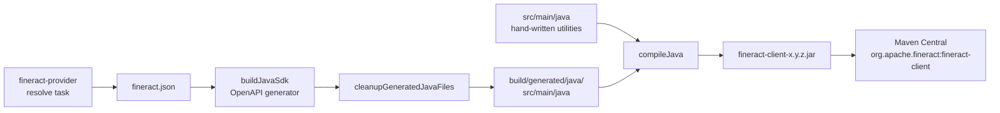

`fineract-client` is the official Retrofit-based Java SDK for Apache Fineract. It is a Gradle subproject that consumes the OpenAPI spec produced by `fineract-provider:resolve` and emits typed service interfaces, request/response models, and helper utilities. The integration-tests harness uses this SDK as its primary calling surface, and the same artifact is published to Maven Central for external consumers.

## Module layout

```
fineract-client/
├── build.gradle              # OpenAPI generator + jib + compile config
├── dependencies.gradle       # Retrofit, OkHttp, Jackson, JUnit
├── README.md                 # Brief overview
└── src/
    ├── main/
    │   ├── java/             # Hand-written utility classes
    │   │   └── org/apache/fineract/client/util/
    │   │       ├── CallFailedRuntimeException.java
    │   │       ├── Calls.java
    │   │       ├── FineractClient.java
    │   │       ├── JSON.java
    │   │       ├── Parts.java
    │   │       └── adapter/
    │   └── resources/
    │       └── templates/java/   # Mustache overrides (e.g. api.mustache)
    └── test/
```

The README characterizes the project succinctly:

> *"This is the source of the official Apache Fineract Java Client library. It is mostly autogenerated using Swagger Codegen, but includes a number of hand-written utility classes to aid in its usage."*

## Code generation

The `buildJavaSdk` task in `fineract-client/build.gradle`:

```groovy
task buildJavaSdk(type: org.openapitools.generator.gradle.plugin.tasks.GenerateTask) {
    generatorName = 'java'
    verbose = false
    validateSpec = false
    skipValidateSpec = true
    inputSpec = file(swaggerFile)
    outputDir = file("$buildDir/generated/temp-java")
    templateDir = file("$projectDir/src/main/resources/templates/java")
    groupId = 'org.apache.fineract'
    apiPackage = 'org.apache.fineract.client.services'
    invokerPackage = 'org.apache.fineract.client'
    modelPackage = 'org.apache.fineract.client.models'
    configOptions = [
        dateLibrary: 'java8',
        useRxJava2: 'false',
        library: 'retrofit2',
        hideGenerationTimestamp: 'true',
        containerDefaultToNull: 'true',
        oauth2Implementation: 'none'
    ]
    generateModelTests = false
    generateApiTests = false
    ignoreFileOverride = file("$projectDir/.openapi-generator-ignore")
    dependsOn(':fineract-provider:resolve')
}
```

The output flows through a cleanup task that removes the OAuth shim and copies generated code into `build/generated/java/src/main/java`. Gradle's `sourceSets` declaration then picks that path as a source root.

## Generated packages

| Package | Source | Examples |
|---|---|---|
| `org.apache.fineract.client.services` | `apiPackage` | `ClientsApi`, `LoansApi`, `SavingsAccountApi`, `JobsApi`, `BatchApiApi`, `AuthenticationHttpBasicApi` |
| `org.apache.fineract.client.models` | `modelPackage` | `PostClientsRequest`, `PostClientsResponse`, `GetLoansLoanIdResponse`, `PutClientsClientIdRequest`, etc. |
| `org.apache.fineract.client` | `invokerPackage` | `ApiClient`, `ApiCallback`, `ApiException`, `Configuration`, `RFC3339DateFormat` |
| `org.apache.fineract.client.auth` | invoker subpackage | `Authentication`, `HttpBasicAuth`, `HttpBearerAuth` |

A typical generated service interface looks like:

```java
public interface ClientsApi {
    @POST("v1/clients")
    Call<PostClientsResponse> createClient(@Body PostClientsRequest body);

    @GET("v1/clients/{clientId}")
    Call<GetClientsClientIdResponse> retrieveOne(
            @Path("clientId") Long clientId,
            @Query("staffInSelectedOfficeOnly") Boolean staffInSelectedOfficeOnly);

    @PUT("v1/clients/{clientId}")
    Call<PutClientsClientIdResponse> updateClient(
            @Path("clientId") Long clientId,
            @Body PutClientsClientIdRequest body);
    // ...
}
```

Each method returns Retrofit's `Call<T>` so the caller chooses sync (`execute()`) or async (`enqueue(...)`) invocation.

## Hand-written utilities

A small set of classes lives next to the generated code under `org.apache.fineract.client.util`:

### `FineractClient`

A facade that builds a ready-to-use Retrofit instance with the right base URL, authentication, JSON converters, and tenant header. Typical usage:

```java
FineractClient client = FineractClient.builder()
    .baseURL("https://localhost:8443/fineract-provider/api/")
    .tenant("default")
    .basicAuth("mifos", "password")
    .insecure(true)               // skip TLS validation for dev
    .build();

ClientsApi clientsApi = client.clients;
PostClientsResponse created = Calls.ok(
    clientsApi.createClient(req)
);
```

`FineractClient` exposes every `*Api` interface as a public field for ergonomic access.

### `Calls`

Small helper that turns Retrofit's `Call<T>` into either a returned value or a thrown `CallFailedRuntimeException`. The typical signature is:

```java
public static <T> T ok(Call<T> call) throws CallFailedRuntimeException;
public static <T> T okR(Call<T> call);  // unchecked variant
```

Used pervasively in integration tests so each assertion stays focused on the business outcome rather than HTTP plumbing.

### `CallFailedRuntimeException`

Wraps non-2xx responses with the status code, the parsed Fineract error envelope, and the original `Response<T>` so callers can inspect headers and the raw body.

### `JSON`

A custom Gson/Jackson holder configured with the same date conventions as the server (RFC-3339 plus the locale rules Fineract uses for amounts).

### `Parts`

Helpers for multipart upload calls (document uploads).

### `adapter/`

Type adapters that translate non-Java types in the spec (e.g. `BigDecimal` precision constraints, optional containers) into idiomatic Java.

## Mustache template overrides

`src/main/resources/templates/java/api.mustache` (and siblings) override portions of the default OpenAPI generator templates. The customizations include:

- Suppressing the auto-generated timestamp comment (`hideGenerationTimestamp = 'true'`).
- Adjusting method body formatting to match the project's Checkstyle rules.
- Tightening import lists so SpotBugs and Errorprone do not flag unused imports.

The templates live in `src/main/resources/templates/java/`, and the OpenAPI generator picks them up via `templateDir`.

## Build flow



## Source sets and jar tasks

```groovy
sourceSets {
    main {
        java {
            srcDir new File(buildDir, "generated/java/src/main/java")
            destinationDirectory = layout.buildDirectory.dir('classes/java/main').get().asFile
        }
        output.resourcesDir = layout.buildDirectory.dir('resources/main').get().asFile
    }
    test {
        java {
            destinationDirectory = layout.buildDirectory.dir('classes/java/test').get().asFile
        }
        output.resourcesDir = layout.buildDirectory.dir('resources/test').get().asFile
    }
}

tasks.withType(Jar).configureEach {
    duplicatesStrategy = DuplicatesStrategy.EXCLUDE
}
```

The generated tree and the hand-written tree are both wired into `main` so they compile together.

## Static-analysis exceptions

Generated code is exempt from SpotBugs:

```groovy
spotbugsMain { enabled = false }
spotbugsTest { enabled = false }
```

Spotless and Checkstyle exemptions live in their respective suppression files. The license-header check is still active — the OpenAPI generator emits the Apache header on every generated file because Fineract overrides the templates to inject it.

## Use in integration tests

The `integration-tests` module wires the SDK at the runtime configuration:

```groovy
testImplementation project(path: ':fineract-client', configuration: 'runtimeElements')
```

Tests typically:

```java
private final FineractClient client = FineractClient.builder()
    .baseURL(TestData.BASE_URL)
    .tenant("default")
    .basicAuth("mifos", "password")
    .insecure(true)
    .build();

@Test
void canCreateClient() {
    var resp = Calls.ok(client.clients.createClient(
        PostClientsRequest.builder()
            .firstname("Ada")
            .lastname("Lovelace")
            .officeId(1L)
            .active(true)
            .activationDate("01 January 2024")
            .dateFormat("dd MMMM yyyy")
            .locale("en")
            .build()
    ));
    assertNotNull(resp.getClientId());
}
```

The Feign client (`fineract-client-feign`) is wired in parallel — the integration-tests module pulls both, excluding the Retrofit module from Feign's classpath to avoid duplicated DTOs:

```groovy
testImplementation(project(path: ':fineract-client-feign', configuration: 'runtimeElements')) {
    exclude group: 'org.apache.fineract', module: 'fineract-client'
}
```

## Version coordination

The SDK's version matches the project version (`me.qoomon.git-versioning` derived from Git tags). When Fineract releases `1.11.0`, the SDK jar is `fineract-client-1.11.0.jar` and is published to Maven Central under `org.apache.fineract:fineract-client:1.11.0`. The `swagger-brake` gate ensures the OpenAPI spec — and therefore the SDK shape — never breaks across patch releases unintentionally.

## Adding new utilities

When a new convenience helper is required:

1. Add the class to `src/main/java/org/apache/fineract/client/util/`.
2. Stay package-private unless callers genuinely need it.
3. Cover with unit tests in `src/test/java`.
4. Do **not** modify generated code under `build/generated/` — those changes are wiped on every regeneration; instead update the Mustache templates.

## See also

- [Generated client SDKs overview](/clients/overview) — the broader generation pipeline.
- [Testing](/build/testing) — how the SDK is exercised in integration tests.
- [Gradle layout](/build/gradle-layout) — where `fineract-client` sits among the modules.
- [Code quality](/build/code-quality) — swagger-brake and how it protects SDK consumers.
