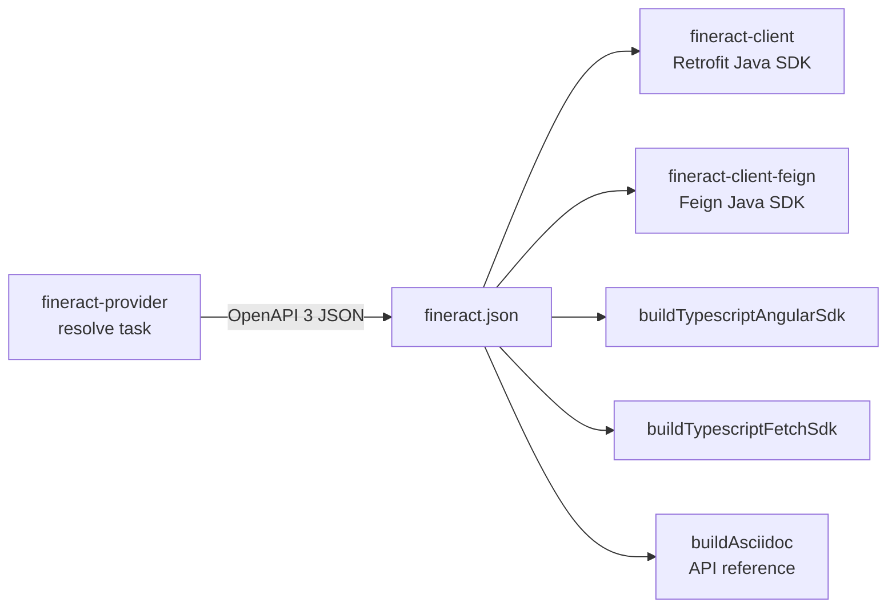

Apache Fineract publishes its REST API as an OpenAPI 3 specification and uses the Swagger / OpenAPI generator to emit typed client SDKs. Two Java SDKs are shipped today — `fineract-client` (Retrofit-based) and `fineract-client-feign` (Feign-based) — plus TypeScript Angular and TypeScript Fetch SDKs and an AsciiDoc rendering of the API. All of them flow from the same source spec, generated by `fineract-provider:resolve`.

## Pipeline at a glance



## Source of truth: the OpenAPI spec

The OpenAPI document is built from JAX-RS annotations in `fineract-provider`. The `io.swagger.core.v3.swagger-gradle-plugin` is configured in `fineract-provider/build.gradle`:

```groovy
resolve {
    logging.captureStandardOutput LogLevel.INFO
    outputFileName = 'fineract'
    outputFormat = 'JSONANDYAML'
    prettyPrint = false
    classpath = sourceSets.main.runtimeClasspath
    buildClasspath = classpath
    outputDir = file("${buildDir}/resources/main/static")
    openApiFile = file("${buildDir}/tmp/swagger/fineract-input.yaml")
    readerClass = 'org.apache.fineract.infrastructure.openapi.FineractOperationIdReader'
    sortOutput = true
    dependsOn(prepareInputYaml, classes)
}
```

The `prepareInputYaml` task copies `config/swagger/fineract-input.yaml.template` into the build dir and substitutes `@VERSION@` with the current project version. The `FineractOperationIdReader` is a custom reader class that ensures stable operation IDs across releases — important for the breaking-change detector (`swagger-brake`).

Output: `build/resources/main/static/fineract.json` (and the matching YAML). This file is what every downstream generator consumes.

## fineract-client (Retrofit)

`fineract-client/build.gradle` applies `org.openapi.generator` and registers `buildJavaSdk`:

```groovy
task buildJavaSdk(type: org.openapitools.generator.gradle.plugin.tasks.GenerateTask) {
    generatorName = 'java'
    verbose = false
    validateSpec = false
    skipValidateSpec = true
    inputSpec = file(swaggerFile)
    outputDir = file("$buildDir/generated/temp-java")
    templateDir = file("$projectDir/src/main/resources/templates/java")
    groupId = 'org.apache.fineract'
    apiPackage = 'org.apache.fineract.client.services'
    invokerPackage = 'org.apache.fineract.client'
    modelPackage = 'org.apache.fineract.client.models'
    configOptions = [
        dateLibrary: 'java8',
        useRxJava2: 'false',
        library: 'retrofit2',
        hideGenerationTimestamp: 'true',
        containerDefaultToNull: 'true',
        oauth2Implementation: 'none'
    ]
    generateModelTests = false
    generateApiTests = false
    ignoreFileOverride = file("$projectDir/.openapi-generator-ignore")
    dependsOn(':fineract-provider:resolve')
}
```

Highlights:

- The Retrofit 2 generator library is selected.
- Date/time uses `java.time` (`dateLibrary = 'java8'`).
- A custom template directory at `src/main/resources/templates/java` overrides Mustache templates so the output matches Fineract's coding conventions.
- Container parameters default to `null` rather than empty collection instances — preserves OpenAPI semantics.
- OAuth2 wiring is intentionally `none`; an authentication layer is added by hand via an OkHttp interceptor.

After generation, sources are copied to `build/generated/java/src/main/java`, then compiled.

## fineract-client-feign (Feign)

`fineract-client-feign/build.gradle` is structurally similar but selects the Feign library:

```groovy
tasks.register('buildJavaSdk', org.openapitools.generator.gradle.plugin.tasks.GenerateTask) {
    generatorName = 'java'
    library = 'feign'
    inputSpec = file(swaggerFile)
    outputDir = file("$buildDir/generated/temp-java")
    templateDir = file("$projectDir/src/main/resources/templates/java")
    groupId = 'org.apache.fineract'
    apiPackage = 'org.apache.fineract.client.feign.services'
    invokerPackage = 'org.apache.fineract.client.feign'
    modelPackage = 'org.apache.fineract.client.models'
    configOptions = [
        dateLibrary             : 'java8',
        library                 : 'feign',
        feignVersion            : '13.6',
        feignApacheHttpClient   : 'true',
        useFeign13              : 'true',
        useFeignApacheHttpClient: 'true',
        hideGenerationTimestamp : 'true',
        containerDefaultToNull  : 'true',
        oauth2Implementation    : 'none',
        useJakartaEe            : 'true'
    ]
    dependsOn(':fineract-provider:resolve')
}
```

Notable differences from the Retrofit module:

- `useJakartaEe = 'true'` — emits `jakarta.*` imports.
- `library = 'feign'` and the Apache HttpClient transport.
- Model package is **shared** (`org.apache.fineract.client.models`) — both clients reuse the same DTOs.

## TypeScript SDKs

Two TypeScript generators run from the Retrofit module's `build.gradle`:

```groovy
task buildTypescriptAngularSdk(type: org.openapitools.generator.gradle.plugin.tasks.GenerateTask) {
    generatorName = 'typescript-angular'
    inputSpec = file(swaggerFile)
    outputDir = file("$buildDir/generated/typescript")
    apiPackage = 'apache-fineract-client/services'
    invokerPackage = 'apache-fineract-client/invoker'
    modelPackage = 'apache-fineract-client/models'
    configOptions = [
        apiModulePrefix: 'apacheFineractClient',
        configurationPrefix: 'apacheFineractClient',
        ngVersion: '12.0.0',
        npmName: '@apache/fineract-client',
        npmRepository: "${npmRepository}"
    ]
    dependsOn(':fineract-provider:resolve')
}

task buildTypescriptFetchSdk(type: org.openapitools.generator.gradle.plugin.tasks.GenerateTask) {
    generatorName = 'typescript-fetch'
    outputDir = file("$buildDir/generated/typescript-fetch")
    configOptions = [
        npmName: '@apache/fineract-client-fetch',
        npmVersion: '1.12.0-SNAPSHOT',
        typescriptThreePlus: 'true',
        supportsES6: 'true',
        withInterfaces: 'true'
    ]
    dependsOn(':fineract-provider:resolve')
}
```

The Angular SDK targets Angular 12+ and is intended for the official community web app. The Fetch SDK works in any modern browser or Node runtime.

## AsciiDoc renderer

A third task emits an HTML/AsciiDoc rendering of the API as documentation:

```groovy
task buildAsciidoc(type: GenerateTask) {
    generatorName = 'asciidoc'
    inputSpec = file(swaggerFile)
    outputDir = file("$buildDir/generated/asciidoc")
    configOptions = [
        appName: 'Apache Fineract REST API',
        appDescription: '''Apache Fineract is a secure, multi-tenanted microfinance platform.
            The goal of the Apache Fineract API is to empower developers to build apps on top of the Apache Fineract Platform.
            ...''',
        infoEmail: 'dev@fineract.apache.org',
        infoUrl: 'https://fineract.apache.org',
        licenseInfo: 'Apache 2.0',
        licenseUrl: 'http://www.apache.org/licenses/LICENSE-2.0.html',
        useMethodAndPath: 'true'
    ]
    dependsOn(':fineract-provider:resolve')
}
```

This output feeds into the `fineract-doc` module's documentation build.

## Module list

| Module | Generator | Output | Purpose |
|---|---|---|---|
| `fineract-client` | Retrofit 2 | `org.apache.fineract.client.services.*` interfaces | Original Java SDK |
| `fineract-client-feign` | Feign | `org.apache.fineract.client.feign.services.*` interfaces | Newer alternative |
| `fineract-client` (Angular task) | typescript-angular | `@apache/fineract-client` npm package | Community web app |
| `fineract-client` (Fetch task) | typescript-fetch | `@apache/fineract-client-fetch` npm | Browser/Node |
| `fineract-client` (AsciiDoc task) | asciidoc | API reference | Documentation site |

## Configuration knobs

Each generator obeys the same input pipeline:

1. `fineract.json` (input spec).
2. A `templateDir` that overrides default Mustache templates so generated code follows Fineract's conventions (field naming, builder usage, null-handling).
3. An `.openapi-generator-ignore` file that excludes specific generated paths.
4. `configOptions` map — generator-specific overrides.

For the Retrofit module a cleanup step removes a hand-corrected file:

```groovy
task cleanupGeneratedJavaFiles() {
    // ...
    doFirst {
        delete fileTree(tempDir) {
            include "src/main/java/org/apache/fineract/client/auth/OAuthOkHttpClient.java"
        }
    }
}
```

The deleted file is a stale Oltu-based OAuth shim; Fineract uses a different OAuth flow at runtime, so the generated stub is excised.

## Integration with the provider

The generator depends on `:fineract-provider:resolve`, which means a full build forces:

1. `fineract-provider` compiles.
2. `prepareInputYaml` writes the templated input YAML.
3. The Swagger plugin's `resolve` task scans JAX-RS classes and emits `fineract.json`.
4. The client modules' `buildJavaSdk` tasks run.
5. Generated Java compiles.
6. The client jar publishes.

The integration test module (`integration-tests`) depends on the Retrofit client (`runtimeElements`), so the SDK is exercised end-to-end on every CI shard. See [Testing](/build/testing).

## See also

- [fineract-client](/clients/fineract-client) — Retrofit module structure and conventions.
- [Gradle layout](/build/gradle-layout) — where the modules sit in the build.
- [Testing](/build/testing) — how the SDKs are exercised in CI.
- [Code quality](/build/code-quality) — swagger-brake breaking-change check.
