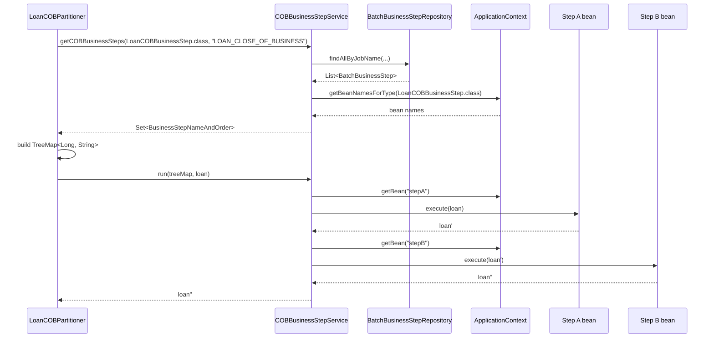

Every daily action Apache Fineract performs against a portfolio aggregate — posting accruals, recomputing delinquency, applying overdue charges, recording installment events — is implemented as a *business step*. The engine that drives them lives in the `fineract-cob` module and is small on purpose: an SPI, a resolver that pairs Spring beans with database-configured ordering, and a runner that walks the resulting `TreeMap` against an aggregate. Concrete steps are ordinary Spring components annotated with `@Component`; their position in the chain is data, not code.

## The SPI: `COBBusinessStep<T>`

The interface is three methods and a generic type bound to `AbstractPersistableCustom<Long>` — the marker Apache Fineract uses for JPA aggregates with a `Long` primary key.

```java
package org.apache.fineract.cob;

import org.apache.fineract.infrastructure.core.domain.AbstractPersistableCustom;

public interface COBBusinessStep<T extends AbstractPersistableCustom<Long>> {

    T execute(T input);

    String getEnumStyledName();

    String getHumanReadableName();
}
```

The contract:

| Method | Purpose |
|--------|---------|
| `execute(T input)` | Receive the aggregate, mutate or replace it, return what the next step should see. Returning a different instance is allowed — `COBBusinessStepServiceImpl` threads the return value into the next step as `item`. |
| `getEnumStyledName()` | Stable identifier used in `m_batch_business_steps.step_name` — typically upper-snake-case, e.g. `LOAN_DELINQUENCY_CLASSIFICATION`. This is what the resolver matches on. |
| `getHumanReadableName()` | Display label surfaced through the `ConfigureBusinessStepApiResource` and visible in admin UIs. |

### Per-portfolio marker interfaces

Each portfolio that participates in COB declares a marker sub-interface so the resolver can ask Spring for "all loan steps" without picking up savings steps. The marker is empty — it only narrows the generic.

```java
// fineract-loan/.../cob/loan/LoanCOBBusinessStep.java
public interface LoanCOBBusinessStep extends COBBusinessStep<Loan> { }

// fineract-savings/.../cob/savings/SavingsCOBBusinessStep.java
public interface SavingsCOBBusinessStep extends COBBusinessStep<SavingsAccount> { }
```

The working-capital module goes one step further and uses an abstract class
(`WorkingCapitalLoanCOBBusinessStep implements COBBusinessStep<WorkingCapitalLoan>`)
so concrete steps can inherit helper methods.

## Registration: `m_batch_business_steps`

There is no `@Order` annotation, no `application.properties` list, no Java-side priority. Ordering is held entirely in the `m_batch_business_steps` table mapped by `BatchBusinessStep`.

```java
@Entity
@Table(name = "m_batch_business_steps")
public class BatchBusinessStep extends AbstractPersistableCustom<Long> {

    @Column(name = "job_name", nullable = false)
    private String jobName;

    @Column(name = "step_name", nullable = false)
    private String stepName;

    @Column(name = "step_order", nullable = false)
    private Long stepOrder;
}
```

| Column | Meaning |
|--------|---------|
| `job_name` | One of the job constants — `LOAN_CLOSE_OF_BUSINESS`, `SAVINGS_CLOSE_OF_BUSINESS`, `WORKING_CAPITAL_LOAN_CLOSE_OF_BUSINESS`, or `INLINE_LOAN_COB`. |
| `step_name` | Must equal the bean's `getEnumStyledName()` — e.g. `APPLY_CHARGE_TO_OVERDUE_LOANS`. |
| `step_order` | Long; lower runs earlier. Gaps are fine. |

### Adding a step via Liquibase

The tenant-side custom module pattern in `custom/acme/loan/cob` shows how to wire a new step in via a changeset:

```xml
<changeSet author="acme" id="1">
    <insert tableName="m_batch_business_steps">
        <column name="job_name" value="LOAN_CLOSE_OF_BUSINESS"/>
        <column name="step_name" value="ACME_LOAN_NOOP"/>
        <column name="step_order" value="5"/>
    </insert>
</changeSet>
```

Combined with an `@Component`-annotated bean whose `getEnumStyledName()` returns `"ACME_LOAN_NOOP"` and that implements `LoanCOBBusinessStep`, this is the entire wiring needed to inject behaviour into the daily run.

## Resolving the chain: `getCOBBusinessSteps`

`COBBusinessStepServiceImpl.getCOBBusinessSteps(Class<T>, String cobJobName)` performs the join between Spring's bean registry and the database rows:

```java
List<BatchBusinessStep> cobStepConfigs =
        batchBusinessStepRepository.findAllByJobName(cobJobName);
List<String> businessSteps =
        Arrays.stream(beanFactory.getBeanNamesForType(businessStepClass)).toList();

Set<BusinessStepNameAndOrder> executionMap = new HashSet<>();
for (String businessStep : businessSteps) {
    T bean = applicationContext.getBean(businessStep, businessStepClass);
    Optional<BatchBusinessStep> cfg = cobStepConfigs.stream()
        .filter(c -> bean.getEnumStyledName().equals(c.getStepName()))
        .findFirst();
    cfg.ifPresent(c -> executionMap.add(
        new BusinessStepNameAndOrder(businessStep, c.getStepOrder())));
}
return executionMap;
```

What this means in practice:

- A bean that exists but has no row in `m_batch_business_steps` is **never executed** — its absence from the chain is silent. This is the standard mechanism for disabling a step per tenant.
- A row that references a bean that does not exist is silently dropped — `Optional.empty()` from the `findFirst`.
- The result is a `Set` of `(beanName, order)` pairs. The partitioner later flattens it into a `TreeMap<Long, String>` keyed by `step_order` for deterministic execution.

## Running the chain: `COBBusinessStepService.run`

The partitioner hands each worker step a `TreeMap<Long, String>` (the ordered map of step beans) and an `item` (the aggregate just unlocked and reloaded). `run` walks the map and threads `item` through every step.

```java
public <T extends COBBusinessStep<S>, S extends AbstractPersistableCustom<Long>>
       S run(TreeMap<Long, String> executionMap, S item) {

    boolean bulkEventEnabled = configurationDomainService.isCOBBulkEventEnabled();
    try {
        if (bulkEventEnabled) {
            businessEventNotifierService.startExternalEventRecording();
        }
        for (String businessStep : executionMap.values()) {
            try {
                ThreadLocalContextUtil.setActionContext(ActionContext.COB);
                COBBusinessStep<S> bean =
                    (COBBusinessStep<S>) applicationContext.getBean(businessStep);
                item = reloaderService.reload(item);   // re-attach to current EM
                item = bean.execute(item);
            } catch (Exception e) {
                throw new BusinessStepException(
                    "Error happened during business step execution", e);
            } finally {
                ThreadLocalContextUtil.setActionContext(ActionContext.COB);
            }
        }
        if (bulkEventEnabled) {
            businessEventNotifierService.stopExternalEventRecording();
        }
    } catch (Exception e) {
        if (bulkEventEnabled) {
            businessEventNotifierService.resetEventRecording();
        }
        throw e;
    }
    return item;
}
```

A few details worth remembering:

<Note>
The runner sets `ActionContext.COB` before each step and resets it in the
`finally` so any nested service that branches on the action context — for
example, suppressing API-only validation — does the right thing.
</Note>

- **Reload between steps**. `reloaderService.reload(item)` re-fetches the aggregate so each step sees a fresh JPA-managed entity. This avoids stale state if a previous step flushed to the database.
- **Bulk event recording**. When `isCOBBulkEventEnabled()` is true, the runner brackets the whole chain with `start/stopExternalEventRecording`. Individual steps still call `BusinessEventNotifierService.notifyPostBusinessEvent` as normal; the events are buffered and emitted in one shot at the end, in the same order they were raised.
- **Failure semantics**. Any exception is wrapped in `BusinessStepException` and propagated; the surrounding chunk processor (see [Tasklets](/cob/cob-tasklets)) catches it and writes the stacktrace into `m_loan_account_locks.error` / `stacktrace` for inspection.

## End-to-end flow



## Querying the configured chain over REST

`fineract-provider`'s `ConfigureBusinessStepApiResource` exposes the configured chain so admin UIs can render it.

```
GET  /v1/jobs/{jobName}/steps                ← list configured steps
PUT  /v1/jobs/{jobName}/steps                ← reorder / enable / disable
```

The `BusinessStepRequest` payload (a list of `{stepName, order}`) is parsed by `BusinessStepConfigDataParser`, validated, and applied by `BusinessStepConfigUpdateHandler`. The resource is gated behind the standard command/auth machinery, so changes go through the command bus and are audited like any other write operation.

## Writing your own step

<Steps>
  <Step title="Pick the SPI">
    Implement the per-portfolio marker — `LoanCOBBusinessStep`,
    `SavingsCOBBusinessStep`, or extend `WorkingCapitalLoanCOBBusinessStep`.
  </Step>
  <Step title="Make the bean discoverable">
    Annotate with `@Component`. The bean name defaults to the class name
    with a lowercase first letter — that name is what ends up in the
    `Set<BusinessStepNameAndOrder>`.
  </Step>
  <Step title="Return a stable enum-styled name">
    `getEnumStyledName()` must be unique across the codebase for the job;
    it is the join key against `m_batch_business_steps.step_name`.
  </Step>
  <Step title="Insert a row via Liquibase">
    Add a changeset that inserts `(job_name, step_name, step_order)`. Use
    `step_order` values that leave room — increments of 10 are typical.
  </Step>
  <Step title="Mutate the aggregate and return it">
    Either mutate in place and `return input`, or call a write service that
    returns a fresh aggregate and pass that on. Avoid calling Spring
    transaction APIs directly — the surrounding chunk processor already
    owns the transaction boundary.
  </Step>
</Steps>

## Related pages

- [Tasklets & Spring Batch wiring](/cob/cob-tasklets) — where the SPI is
  actually invoked from inside a chunk processor.
- [Loan COB job](/cob/loan-cob-job) — concrete `LoanCOBBusinessStep`
  implementations shipped with Apache Fineract.
- [Catch-up](/cob/cob-catch-up) — the same chain replayed for skipped days.

<Note>
`COBBusinessStep` deliberately does not extend Spring Batch's `Tasklet`.
Steps are not Spring Batch steps; they are user-defined units of work the
chunk processor invokes via the engine. This decoupling is what lets
inline COB call the same chain synchronously from a JAX-RS handler.
</Note>
