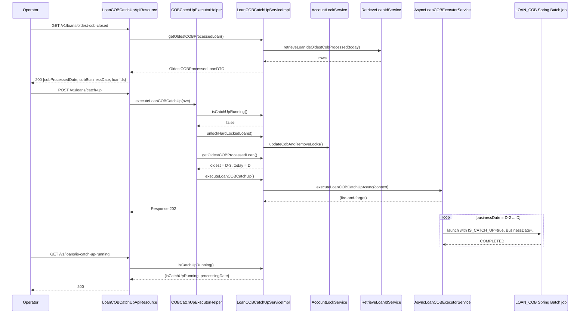

When the Apache Fineract scheduled `LOAN_COB` job is missed — because the platform was offline, because a tenant was paused, or because a previous run was cancelled mid-flight — the tenant ends up with loans whose `last_closed_business_date` lags the current COB business date by more than one day. Inline COB can chew through a single loan one day at a time, but doing that loan-by-loan across a multi-day backlog is operationally painful. The dedicated *catch-up* endpoints — `LoanCOBCatchUpApiResource` and its working-capital twin — launch an asynchronous replay that walks the whole tenant forward day-by-day until every loan is current. This page documents the endpoints, the oldest-COB detection logic, the async executor, and the catch-up state machine.

## Endpoints

There are two REST resources, one per portfolio that supports catch-up:

| Resource | Base path | Backed by |
|----------|-----------|-----------|
| `LoanCOBCatchUpApiResource` | `/v1/loans` | `LoanCOBCatchUpServiceImpl` (extends `CommonCOBCatchUpService<LoanAccountLock>`) |
| `WorkingCapitalLoanCOBCatchUpApiResource` | `/v1/working-capital-loans` | `WorkingCapitalLoanCOBCatchUpServiceImpl` (same superclass with `WorkingCapitalLoanAccountLock`) |

Both expose the same three operations under different base paths.

### `GET /v1/loans/oldest-cob-closed`

Returns the COB business date *and* the oldest `last_closed_business_date` actually observed across all non-closed loans.

```java
@GET
@Path("oldest-cob-closed")
@Produces({ MediaType.APPLICATION_JSON })
@Operation(summary = "Retrieves the oldest COB processed loan",
           description = "Retrieves the COB business date and the oldest COB processed loan")
public OldestCOBProcessedLoanDTO getOldestCOBProcessedLoan() {
    return loanCOBCatchUpServiceOp.map(COBCatchUpService::getOldestCOBProcessedLoan)
            .orElseThrow(() -> new JobIsNotFoundOrNotEnabledException(JobName.LOAN_COB.name()));
}
```

Response shape:

```java
@Data
public class OldestCOBProcessedLoanDTO {
    private List<Long> loanIds;
    private LocalDate cobProcessedDate;
    private LocalDate cobBusinessDate;
}
```

| Field | Meaning |
|-------|---------|
| `loanIds` | Ids of all loans currently sharing the oldest `last_closed_business_date`. |
| `cobProcessedDate` | The oldest `last_closed_business_date` (or today's COB date if no lagging loans exist). |
| `cobBusinessDate` | The tenant's current COB business date. |

When `cobProcessedDate == cobBusinessDate`, the tenant is up to date and no catch-up is needed.

### `POST /v1/loans/catch-up`

Kicks off the catch-up. The status code tells you what happened:

| Status | Meaning |
|--------|---------|
| `200 OK` | The tenant is already up to date — nothing to do. |
| `202 Accepted` | A catch-up run has been started; track progress via `is-catch-up-running`. |
| `400 Bad Request` | A catch-up run is already in progress. |

The executor helper enforces all three branches:

```java
public static Response executeLoanCOBCatchUp(COBCatchUpService loanCOBCatchUpService) {
    if (loanCOBCatchUpService.isCatchUpRunning().isCatchUpRunning()) {
        return Response.status(Response.Status.BAD_REQUEST).build();
    }
    loanCOBCatchUpService.unlockHardLockedLoans();
    OldestCOBProcessedLoanDTO oldest = loanCOBCatchUpService.getOldestCOBProcessedLoan();
    if (oldest.getCobProcessedDate().equals(oldest.getCobBusinessDate())) {
        return Response.status(Response.Status.OK).build();
    }
    loanCOBCatchUpService.executeLoanCOBCatchUp();
    return Response.status(Response.Status.ACCEPTED).build();
}
```

Order of operations:

1. Reject if already running.
2. *Pre-clear* hard locks left over from the previous failed run via `unlockHardLockedLoans()`.
3. Re-evaluate the gap — if zero, return 200 without launching anything.
4. Dispatch the async runner.

### `GET /v1/loans/is-catch-up-running`

Polls the running state.

```java
@GET
@Path("is-catch-up-running")
public IsCatchUpRunningDTO isCatchUpRunning() {
    return loanCOBCatchUpServiceOp
        .map(COBCatchUpService::isCatchUpRunning)
        .orElseGet(() -> new IsCatchUpRunningDTO(false, null));
}
```

Response:

```java
@Data
@AllArgsConstructor
public class IsCatchUpRunningDTO {
    private boolean isCatchUpRunning;
    private LocalDate processingDate;
}
```

`processingDate` is the business date currently being replayed — useful for surfacing progress in operator UIs.

## The service interface

```java
public interface COBCatchUpService {
    void unlockHardLockedLoans();
    OldestCOBProcessedLoanDTO getOldestCOBProcessedLoan();
    void executeLoanCOBCatchUp();
    IsCatchUpRunningDTO isCatchUpRunning();
}
```

Implementation lives in `CommonCOBCatchUpService<T extends AccountLock>` with portfolio-specific subclasses (`LoanCOBCatchUpServiceImpl`, `WorkingCapitalLoanCOBCatchUpServiceImpl`).

### `unlockHardLockedLoans`

Delegates to `AccountLockService.updateCobAndRemoveLocks`. Behaviour:

- For every lock row with non-null `error` whose `lock_placed_on_cob_business_date` is older than today, advance the corresponding loan's `last_closed_business_date` to match (effectively "give up" on that day) and remove the lock.
- This is what unblocks loans that have been stuck on an error since the previous COB run. The data fix is intentionally aggressive — catch-up's job is to make forward progress, not to relitigate previous failures.

### `getOldestCOBProcessedLoan`

```java
public OldestCOBProcessedLoanDTO getOldestCOBProcessedLoan() {
    List<COBIdAndLastClosedBusinessDate> rows = retrieveIdService
        .retrieveLoanIdsOldestCobProcessed(
            ThreadLocalContextUtil.getBusinessDateByType(BusinessDateType.COB_DATE));
    OldestCOBProcessedLoanDTO dto = new OldestCOBProcessedLoanDTO();
    dto.setLoanIds(rows.stream().map(COBIdAndLastClosedBusinessDate::getId).toList());
    dto.setCobProcessedDate(rows.stream()
        .map(COBIdAndLastClosedBusinessDate::getLastClosedBusinessDate)
        .findFirst()
        .orElse(ThreadLocalContextUtil.getBusinessDateByType(BusinessDateType.COB_DATE)));
    dto.setCobBusinessDate(
        ThreadLocalContextUtil.getBusinessDateByType(BusinessDateType.COB_DATE));
    return dto;
}
```

`retrieveIdService.retrieveLoanIdsOldestCobProcessed(currentDate)` returns the loans whose `last_closed_business_date` equals the *minimum* such date in the tenant. When the tenant is up to date that set may be empty — the DTO then reports `cobProcessedDate == cobBusinessDate` and the helper returns 200.

### `executeLoanCOBCatchUp`

Calls `asyncLoanCOBExecutorService.executeLoanCOBCatchUpAsync(context)` and returns immediately. The async wrapper carries the tenant context across thread boundaries.

```java
@Service
@Conditional(LoanCOBEnabledCondition.class)
public class AsyncLoanCOBExecutorServiceImpl extends AsyncCommonCOBExecutorService {

    @Async(TaskExecutorConstant.LOAN_COB_CATCH_UP_TASK_EXECUTOR_BEAN_NAME)
    public void executeLoanCOBCatchUpAsync(FineractContext context) {
        super.executeLoanCOBCatchUpAsync(context);
    }
    // …
}
```

`@Async` is bound to a dedicated `TaskExecutor` so catch-up runs never starve the request-handling pool. `AsyncCommonCOBExecutorService` does the per-day loop: while `lastClosed < cobBusinessDate`, it advances `BusinessDate` in the `FineractContext`, sets `IS_CATCH_UP=true`, and launches the same `LOAN_COB` Spring Batch job — which means every replay day runs the configured business-step chain identically to the live run.

### `isCatchUpRunning`

Queries the Spring Batch metadata to find a job execution whose custom parameter `IS_CATCH_UP` is `"true"`:

```java
LocalDate runningBusinessDate = jobExecutionRepository
    .getBusinessDateOfRunningJobByExecutionParameter(
        getJobName(),
        COBConstant.COB_CUSTOM_JOB_PARAMETER_KEY,
        COBConstant.IS_CATCH_UP_PARAMETER_NAME,
        "true",
        COBConstant.BUSINESS_DATE_PARAMETER_NAME);
return new IsCatchUpRunningDTO(runningBusinessDate != null, runningBusinessDate);
```

This means catch-up status is sourced from the canonical Spring Batch tables (`BATCH_JOB_EXECUTION`, `BATCH_JOB_EXECUTION_PARAMS`) — no auxiliary status column.

## End-to-end flow



## Working-capital twin

`WorkingCapitalLoanCOBCatchUpApiResource` is byte-for-byte the loan resource with two changes:

- Path prefix is `/v1/working-capital-loans`.
- Backing service is `WorkingCapitalLoanCOBCatchUpServiceImpl`, which extends `CommonCOBCatchUpService<WorkingCapitalLoanAccountLock>` and uses the working-capital flavour of `RetrieveIdService` and `AsyncCOBExecutorService`.

The catch-up state of the two portfolios is independent: a tenant may have its regular loans up to date while its working-capital loans lag, or vice versa.

## Operating catch-up

<Steps>
  <Step title="Confirm the gap">
    `GET /v1/loans/oldest-cob-closed` first. If `cobProcessedDate == cobBusinessDate`,
    do nothing — the platform is fine.
  </Step>
  <Step title="Launch the run">
    `POST /v1/loans/catch-up`. Expect `202 Accepted` for a multi-day gap.
    The body is empty — the response is a status code.
  </Step>
  <Step title="Poll for progress">
    `GET /v1/loans/is-catch-up-running`. While running, `processingDate`
    advances. When finished, `isCatchUpRunning` flips to false.
  </Step>
  <Step title="Verify completion">
    Re-call `GET /v1/loans/oldest-cob-closed`. Successful catch-up brings
    `cobProcessedDate` up to `cobBusinessDate`. Loans whose data was bad
    may have been advanced via `unlockHardLockedLoans` — inspect their
    lock history for any rows with `error` populated.
  </Step>
</Steps>

## Failure modes and recovery

<AccordionGroup>
  <Accordion title="Catch-up dies mid-run">
    The async task throws; the `BATCH_JOB_EXECUTION` row for the
    in-flight day is marked `FAILED`. Re-issue `POST /catch-up` — the
    helper calls `unlockHardLockedLoans` again and resumes from the new
    oldest date. The failure of one day does not skip subsequent days,
    because the day-by-day loop is deterministic on `last_closed_business_date`.
  </Accordion>
  <Accordion title="Catch-up will not start: 400 Bad Request">
    `isCatchUpRunning` says true. Either there really is a running job
    (poll `is-catch-up-running` to confirm) or the previous job exited
    abnormally and the metadata row is stuck in `STARTED`. Manual cleanup
    of `BATCH_JOB_EXECUTION` is the recovery path of last resort.
  </Accordion>
  <Accordion title="Some loans were silently advanced">
    `unlockHardLockedLoans` rewrites `last_closed_business_date` past
    errored locks. The lock rows themselves are deleted; the historical
    fact is in audit logs only. If you need to reprocess those loans for
    the dropped day, use inline COB on each one.
  </Accordion>
</AccordionGroup>

## Related pages

- [Inline COB](/cob/inline-cob) — single-loan, single-day catch-up;
  use it when you know the offending loan id.
- [Loan account lock](/cob/loan-account-lock) — the lock model
  `unlockHardLockedLoans` manipulates.
- [Loan COB job](/cob/loan-cob-job) — the job catch-up relaunches once
  per missed day.
- [Working-capital COB](/cob/working-capital-cob) — the sibling pipeline
  with its own catch-up endpoint.
