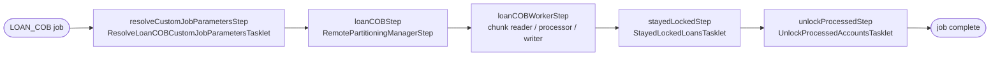
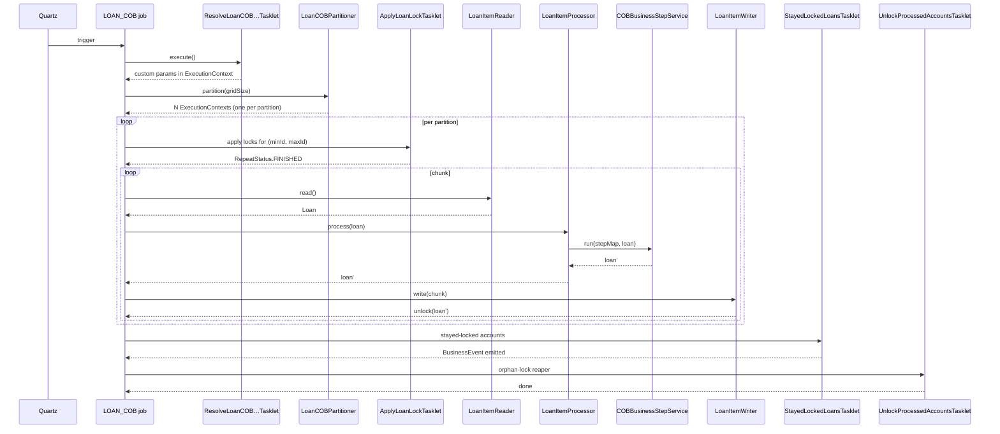

The Close-of-Business engine in Apache Fineract is, mechanically, a Spring Batch job. Two manager configurations (`LoanCOBManagerConfiguration`, `WorkingCapitalLoanCOBManagerConfiguration`) drive remote-partitioning manager steps; one worker configuration per portfolio (`LoanCOBWorkerConfiguration`, `WorkingCapitalLoanCOBWorkerConfiguration`) runs the chunk pipeline. Between those sit a handful of small `Tasklet` beans that lock accounts, resolve catch-up flags, surface stayed-locked accounts, and clean up orphaned locks. This page walks through each of them in source order and shows how they thread together.

## The job skeleton

Every COB job shares the same skeleton. Below is the loan flavour from `LoanCOBManagerConfiguration`:



Each box is a separate Spring Batch `Step` registered in the configuration class. The middle box (the partitioning step) fans out to worker steps over a Spring Integration `DirectChannel` configured by `RemotePartitioningManagerStepBuilderFactory`.

## Manager-side tasklets

These run once per job execution on the manager node before partitioning fires.

### `ResolveLoanCOBCustomJobParametersTasklet`

Reads the per-tenant custom job parameters stored in `m_custom_job_parameter` and copies the resolved values into the step execution context. It delegates to a shared `CustomJobParameterResolver` that the working-capital job also uses. After this step runs, every downstream tasklet can read parameter values from the `ExecutionContext` rather than re-reading the database.

### `StayedLockedLoansTasklet`

Runs at the end, after partitioning has finished. Asks `RetrieveLoanIdService` for any loan ids that are still locked with the COB business date that was processed — those are loans whose business steps threw, leaving the lock in place with `error` and `stacktrace` populated. The tasklet wraps the list in a `LoanAccountsStayedLockedBusinessEvent` and posts it through `BusinessEventNotifierService` so external consumers can alert.

```java
@Bean
public StayedLockedLoansTasklet stayedLockedTasklet() {
    return new StayedLockedLoansTasklet(
        businessEventNotifierService, retrieveIdService);
}
```

The savings job has its own twin `SavingsAccountsStayedLockedBusinessEvent`; the working-capital job emits a working-capital-specific event.

## Locking tasklets in `fineract-cob/tasklet/`

The engine ships two abstract `Tasklet` bases that the loan and working-capital workers extend. Both live in `org.apache.fineract.cob.tasklet`.

### `ApplyCommonLockTasklet`

`ApplyCommonLockTasklet` is the worker-side gatekeeper. It runs at the start of each partition's worker step and acquires a `LOAN_COB_CHUNK_PROCESSING` lock on every account in the partition that is not already locked.

```java
public abstract class ApplyCommonLockTasklet implements Tasklet {

    private static final long NUMBER_OF_RETRIES = 3;
    private final FineractProperties fineractProperties;
    private final LockingService loanLockingService;
    private final RetrieveIdService retrieveIdService;
    private final TransactionTemplate batchJdbcTransactionTemplate;

    public abstract String getCOBParameter();
    public abstract LockOwner getLockOwner();

    @Override
    public RepeatStatus execute(StepContribution contribution, ChunkContext ctx) {
        ExecutionContext executionContext =
            contribution.getStepExecution().getExecutionContext();
        COBParameter cobParam = COBParameterConverter.convert(
            executionContext.get(getCOBParameter()));
        boolean isCatchUp = CatchUpFlagResolver.resolve(contribution.getStepExecution());

        List<Long> loanIds = retrieveIdService
            .retrieveAllNonClosedLoansByLastClosedBusinessDateAndMinAndMaxLoanId(
                cobParam, isCatchUp);

        List<Long> alreadyLocked = new ArrayList<>();
        Lists.partition(loanIds, getInClauseParameterSizeLimit())
            .forEach(p -> alreadyLocked.addAll(
                loanLockingService.findLockIdsByLoanIdIn(p)));

        List<Long> toBeProcessed = new ArrayList<>(loanIds);
        toBeProcessed.removeAll(alreadyLocked);

        try {
            applyLocks(toBeProcessed);
        } catch (Exception e) {
            if (contribution.getStepExecution().getCommitCount() > NUMBER_OF_RETRIES) {
                throw new LockCannotBeAppliedException(
                    "There was an error applying lock to loan accounts.", e);
            }
            return RepeatStatus.CONTINUABLE;
        }
        return RepeatStatus.FINISHED;
    }
}
```

Highlights:

| Behaviour | Source | Why |
|-----------|--------|-----|
| Reads `COBParameter` from execution context | `executionContext.get(getCOBParameter())` | Each partition carries its `(minId, maxId)` range — set by the partitioner. |
| Filters out closed loans | `retrieveAllNonClosedLoansByLastClosedBusinessDateAndMinAndMaxLoanId` | Closed loans don't need a COB pass. |
| Skips already-locked ids | `findLockIdsByLoanIdIn(partition)` | Inline COB or a previous partial run may already hold a lock. |
| Retries up to 3 commits | `NUMBER_OF_RETRIES` constant | Lock contention with inline jobs is expected; throw only after the chunk commits 3+ times. |
| Uses a dedicated JDBC transaction | `batchJdbcTransactionTemplate` with `PROPAGATION_REQUIRES_NEW` | Lock writes must not roll back when a downstream business step fails. |

The loan-side concrete class is `ApplyLoanLockTasklet`; the working-capital twin is `ApplyWorkingCapitalLoanLockTasklet`. Both differ only in returning a portfolio-specific `LockOwner` and `COBParameter` key.

### `UnlockProcessedAccountsTasklet<T extends AccountLock>`

Cleanup tasklet — runs near the end of the job and asks `AccountLockService` to remove locks that were placed during the run, whose owning loan now has `last_closed_business_date` equal to `lock_placed_on_cob_business_date`, and whose lock record has no `error` populated.

```java
public abstract class UnlockProcessedAccountsTasklet<T extends AccountLock>
        implements Tasklet {

    private final AccountLockService<T> accountLockService;

    @Override
    public RepeatStatus execute(StepContribution c, ChunkContext ctx) {
        int removed = accountLockService.removeOrphanedLocksForProcessedAccounts();
        if (removed > 0) {
            log.debug("Unlocked {} account(s) that completed COB processing "
                    + "but remained locked", removed);
        }
        return RepeatStatus.FINISHED;
    }
}
```

This handles a subtle case: a chunk processor commits the loan update (advancing `last_closed_business_date`) but then dies before the writer's per-row unlock runs. The orphan reaper closes the loop on the next run.

## Worker chunk pipeline

After the lock tasklet, each partition runs a Spring Batch chunk-oriented step built by `LoanCOBWorkerConfiguration#loanCOBWorkerStep`.

```java
SimpleStepBuilder<Loan, Loan> stepBuilder = stepBuilderFactory
        .get("Loan COB worker - Step").inputChannel(inboundRequests)
        .<Loan, Loan>chunk(propertyService.getChunkSize(JobName.LOAN_COB.name()),
                           transactionManager)
        .reader(cobWorkerItemReader())
        .processor(cobWorkerItemProcessor())
        .writer(cobWorkerItemWriter())
        .faultTolerant()
        .retry(Exception.class)
        .retryLimit(propertyService.getRetryLimit(LoanCOBConstant.JOB_NAME))
        .skip(Exception.class)
        .skipLimit(propertyService.getChunkSize(LoanCOBConstant.JOB_NAME) + 1)
        .listener(loanItemListener())
        .listener(cobWorkerStepListener())
        .transactionManager(transactionManager);

if (propertyService.getThreadPoolMaxPoolSize(LoanCOBConstant.JOB_NAME) > 1) {
    stepBuilder.taskExecutor(cobTaskExecutor());
}
```

| Knob | Source | Effect |
|------|--------|--------|
| `chunk(size, txManager)` | `PropertyService.getChunkSize` | Number of loans per transaction commit. |
| `retry(Exception.class)` + `retryLimit` | `PropertyService.getRetryLimit` | Re-runs a chunk after a transient exception. |
| `skip(Exception.class)` + `skipLimit` | `chunkSize + 1` | Allows the chunk to drop a poison loan after retries are exhausted, surfacing it through the stayed-locked event. |
| `taskExecutor` | `ThreadPoolTaskExecutor` when `threadPoolMaxPoolSize > 1` | Multi-thread the worker; falls back to `SyncTaskExecutor` when size is 1. |

### `LoanItemReader`

The reader is a thin wrapper around `AbstractLoanItemReader<Loan>`. Before the step runs, a `@BeforeStep` callback delegates to `BeforeStepLockingItemReaderHelper#filterRemainingData(StepExecution)` which:

1. Reads the partition's `LoanIds` list from the execution context.
2. Removes any ids that were marked failed in a prior chunk attempt.
3. Loads the surviving loans through `LoanRepository`.

The reader then emits them one by one to the processor.

### `LoanItemProcessor`

Extends `AbstractLoanItemProcessor`. The `@BeforeStep` callback wires the step's `BusinessDate` into the processor; for each loan, `process(loan)` calls `COBBusinessStepService.run(treeMap, loan)` — the engine described in [Business step engine](/cob/business-step-engine) — and returns the mutated aggregate.

```java
public class LoanItemProcessor extends AbstractLoanItemProcessor {
    public LoanItemProcessor(COBBusinessStepService cobBusinessStepService,
            ProgressiveLoanModelProcessingService progressiveLoanModelProcessingService) {
        super(cobBusinessStepService, progressiveLoanModelProcessingService);
    }

    @BeforeStep
    public void beforeStep(StepExecution stepExecution) {
        setExecutionContext(stepExecution.getExecutionContext());
        setBusinessDate(stepExecution);
    }
}
```

### `LoanItemWriter`

The writer commits the loan (Spring Batch's `chunk(size, txManager)` flushes the JPA context here) and then removes the per-loan lock with `LockOwner.LOAN_COB_CHUNK_PROCESSING`.

```java
public class LoanItemWriter extends AbstractLoanItemWriter {
    public LoanItemWriter(LockingService loanLockingService) {
        super(loanLockingService);
    }
    @Override
    protected LockOwner getLockOwner() {
        return LockOwner.LOAN_COB_CHUNK_PROCESSING;
    }
}
```

The shared `AbstractLoanItemWriter` is responsible for the actual unlock call — it iterates the chunk and asks the `LockingService` to release each loan id.

### `ChunkProcessingLoanItemListener`

Wired with `.listener(loanItemListener())`. Its `onReadError`, `onProcessError`, `onWriteError`, and `onSkip` callbacks capture the exception into the loan's `LoanAccountLock` row (`error` + `stacktrace`) so the stayed-locked tasklet can surface it.

### `CobWorkerStepListener`

A `StepExecutionListener` that bridges `ThreadLocalContextUtil` state (tenant, action context, business date) across the Spring Batch worker thread. Without it, multi-threaded chunk execution would lose the tenant context when a thread is recycled.

## Resolvers used inside tasklets

Both `ApplyCommonLockTasklet` and the chunk processor read scalar values from the step execution context. Two small resolver classes do the parsing:

| Resolver | Reads | Used by |
|----------|-------|---------|
| `BusinessDateResolver` | `BusinessDate` parameter (`COBConstant.BUSINESS_DATE_PARAMETER_NAME`) | Processor before-step hook, every business step that needs "today". |
| `CatchUpFlagResolver` | `IS_CATCH_UP` parameter (`COBConstant.IS_CATCH_UP_PARAMETER_NAME`) | `ApplyCommonLockTasklet` (to widen the candidate loan set when replaying), `LoanCOBPartitioner`. |

## Putting it together



## Tuning checklist

<AccordionGroup>
  <Accordion title="Chunk size">
    `fineract.batch.chunk-size.LOAN_COB`. Each chunk is a transaction —
    very large chunks can blow JPA's first-level cache on big tenants.
  </Accordion>
  <Accordion title="Partition size">
    `fineract.batch.partition-size.LOAN_COB`. Number of loan ids per
    partition; larger partitions mean fewer Spring Integration messages
    but more contention on the lock tasklet.
  </Accordion>
  <Accordion title="Thread pool max size">
    `fineract.batch.thread-pool-max-size.LOAN_COB`. When > 1, the worker
    step is parallelised. The `CobWorkerStepListener` keeps the
    `ThreadLocalContextUtil` in sync across threads.
  </Accordion>
  <Accordion title="Retry limit">
    `fineract.batch.retry-limit.LOAN_COB`. Number of retries per chunk
    before the skip policy kicks in.
  </Accordion>
</AccordionGroup>

## Related pages

- [Business step engine](/cob/business-step-engine) — what the processor
  delegates to.
- [Loan account lock](/cob/loan-account-lock) — the lock entity these
  tasklets manipulate.
- [Loan COB job](/cob/loan-cob-job) — the concrete business steps the
  processor invokes.
