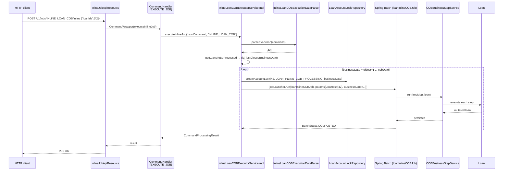

The scheduled `LOAN_COB` job processes every active loan in the tenant once a day. That cadence is too coarse for some operations: when a user is about to disburse a loan, repay it, or modify its schedule, Apache Fineract sometimes needs the loan to be "up to date" relative to the current COB business date before the next mutation runs. The answer is *inline COB* — a synchronous, single-loan (or small-batch) execution of the same Spring Batch chain, driven through the generic `POST /v1/jobs/{jobName}/inline` endpoint and bound to the dedicated `INLINE_LOAN_COB` job.

This page covers the API, the executor service, when inline COB is triggered automatically, and how the inline job differs from the scheduled one.

## The endpoint

The HTTP surface is one method on `InlineJobApiResource` (`fineract-provider/.../infrastructure/jobs/api/`).

```java
@Path("/v1/jobs")
@Component
@Tag(name = "Inline Job", description = "")
@RequiredArgsConstructor
public class InlineJobApiResource {

    private final PortfolioCommandSourceWritePlatformService commandWritePlatformService;
    private final DefaultToApiJsonSerializer<LoanIdsResponseDTO> serializer;

    @POST
    @Path("{jobName}/inline")
    @Consumes({ MediaType.APPLICATION_JSON })
    @Produces({ MediaType.APPLICATION_JSON })
    @Operation(summary = "Starts an inline Job",
               description = "Starts an inline Job")
    public String executeInlineJob(
            @PathParam("jobName") @Parameter(description = "jobName") final String jobName,
            @Parameter(hidden = true) final String jsonRequestBody) {

        final CommandWrapper commandRequest = new CommandWrapperBuilder()
            .executeInlineJob(jobName).withJson(jsonRequestBody).build();
        CommandProcessingResult result =
            commandWritePlatformService.logCommandSource(commandRequest);
        return serializer.serialize(result);
    }
}
```

A few characteristics inherited from the command bus wrapper:

| Property | Where it comes from |
|----------|---------------------|
| Audited | `PortfolioCommandSourceWritePlatformService.logCommandSource` writes a `m_portfolio_command_source` row. |
| Idempotent (per request) | The command bus de-duplicates by `idempotency-key` header. |
| Transactional | The handler `executeInlineJob` returns inside a transaction — but the inline executor itself disables that transaction (see below). |
| Authenticated | Standard tenant-aware filter chain; the caller must hold the right permission for the underlying command (`EXECUTE_JOB`). |

### Request body

The JSON is parsed by `InlineLoanCOBExecutionDataParser`:

```java
public List<Long> parseExecution(JsonCommand command) {
    JsonObject element = extractJsonObject(command);
    String[] loanArray = jsonHelper.extractArrayNamed("loanIds", element);
    return Arrays.stream(loanArray).map(Long::parseLong).toList();
}
```

So the request is:

```http
POST /fineract-provider/api/v1/jobs/INLINE_LOAN_COB/inline
Content-Type: application/json
Fineract-Platform-TenantId: default

{
  "loanIds": [42, 99]
}
```

The same endpoint handles the working-capital variant — call it with `INLINE_WORKING_CAPITAL_LOAN_COB` and the WC parser/executor pair takes over.

## The executor: `InlineLoanCOBExecutorServiceImpl`

`InlineLoanCOBExecutorServiceImpl` extends the abstract `InlineCommonLockableCOBExecutorService<T extends AccountLock>` and only injects the loan-specific lock repository and a factory for `LoanAccountLock`:

```java
@Service
@Slf4j
@Conditional(LoanCOBEnabledCondition.class)
public class InlineLoanCOBExecutorServiceImpl
        extends InlineCommonLockableCOBExecutorService<LoanAccountLock> {

    public InlineLoanCOBExecutorServiceImpl(
            LoanAccountLockRepository loanAccountLockRepository,
            InlineLoanCOBExecutionDataParser dataParser,
            JobLauncher jobLauncher,
            JobLocator jobLocator,
            JobExplorer jobExplorer,
            TransactionTemplate transactionTemplate,
            CustomJobParameterRepository customJobParameterRepository,
            PlatformSecurityContext context,
            RetrieveLoanIdService retrieveIdService,
            FineractProperties fineractProperties) {
        super(loanAccountLockRepository, dataParser, jobLauncher, jobLocator,
              jobExplorer, transactionTemplate, customJobParameterRepository,
              context, retrieveIdService, fineractProperties);
    }

    @Override
    public LoanAccountLock createAccountLock(
            Long loanId, LockOwner loanInlineCobProcessing, LocalDate businessDate) {
        return new LoanAccountLock(loanId, LockOwner.LOAN_INLINE_COB_PROCESSING, businessDate);
    }
}
```

`InlineExecutorService<Long>` is the SPI that the command bus dispatches to once it has resolved which `jobName` the request targets. The base class drives the per-day loop:

```java
@Override
public void execute(List<Long> loanIds, String jobName) {
    LocalDate cobBusinessDate =
        ThreadLocalContextUtil.getBusinessDateByType(BusinessDateType.COB_DATE);
    List<COBIdAndLastClosedBusinessDate> toBeProcessed =
        getLoansToBeProcessed(loanIds, cobBusinessDate);
    LocalDate executingBusinessDate =
        getOldestCOBBusinessDate(toBeProcessed).plusDays(1);
    if (!toBeProcessed.isEmpty()) {
        while (!DateUtils.isAfter(executingBusinessDate, cobBusinessDate)) {
            execute(getLoanIdsToBeProcessed(toBeProcessed, executingBusinessDate),
                    jobName, executingBusinessDate);
            executingBusinessDate = executingBusinessDate.plusDays(1);
        }
    }
}
```

So inline COB does not just process today; it walks forward one day at a time from the earliest loan's `last_closed_business_date + 1` up to the current COB business date and runs the inline job once per day.

### Per-day execution

```java
private void execute(List<Long> loanIds, String jobName, LocalDate businessDate) {
    lockLoanAccounts(loanIds, businessDate);   // LOAN_INLINE_COB_PROCESSING
    Job inlineLoanCOBJob = jobLocator.getJob(jobName);
    JobParameters params = new JobParametersBuilder(jobExplorer)
        .getNextJobParameters(inlineLoanCOBJob)
        .addJobParameters(new JobParameters(
            getJobParametersMap(loanIds, businessDate)))
        .toJobParameters();
    JobExecution exec = jobLauncher.run(inlineLoanCOBJob, params);
    if (!BatchStatus.COMPLETED.equals(exec.getStatus())) {
        throw new PlatformInternalServerException(
            "error.msg.sheduler.job.execution.failed",
            "Job execution failed for job with name: ", jobName);
    }
}
```

Two important details:

- **`@Transactional(propagation = NOT_SUPPORTED)`** on `executeInlineJob`. The command bus opens a transaction, but inline COB explicitly drops it so each lock/unlock and each day's Spring Batch job execute in their own transactions. This avoids holding row locks for the duration of a multi-day catch-up.
- **`LOAN_INLINE_COB_PROCESSING` lock owner**. Distinct from `LOAN_COB_PROCESSING` so that the `LoanCOBApiFilter` can decide whether to reject API calls during inline execution (it does — see [Loan account lock](/cob/loan-account-lock)).

## The inline job: `LoanInlineCOBConfig`

Inline runs target a separate Spring Batch job — `loanInlineCOBJob`, name `INLINE_LOAN_COB` — defined in `LoanInlineCOBConfig`.

```java
@Bean(name = "loanInlineCOBJob")
public Job loanInlineCOBJob() {
    return new JobBuilder(LoanCOBConstant.INLINE_LOAN_COB_JOB_NAME, jobRepository)
        .start(inlineCOBBuildExecutionContextStep())
        .next(inlineLoanCOBStep())
        .next(inlineCOBResetContextStep())
        .incrementer(new RunIdIncrementer())
        .build();
}
```

The three steps:

| Step | Tasklet/processor | Role |
|------|-------------------|------|
| `inlineCOBBuildExecutionContextStep` | `InlineLoanCOBBuildExecutionContextTasklet<Loan, LoanCOBBusinessStep>` | Resolves the configured chain for `LOAN_CLOSE_OF_BUSINESS` and promotes the resulting `TreeMap` plus `LoanIds` parameter into the job execution context. |
| `inlineLoanCOBStep` | `InlineCOBLoanItemReader` / `InlineCOBLoanItemProcessor` / `InlineCOBLoanItemWriter` | Chunk-oriented step that reads the specified loans, runs each through `COBBusinessStepService.run`, writes, and releases the inline lock. |
| `inlineCOBResetContextStep` | `ResetContextTasklet` | Resets `ThreadLocalContextUtil` (tenant, business date, action context) so the calling thread is clean when control returns to the HTTP handler. |

The same business-step beans are reused — there is no separate "inline" code path inside individual steps. What differs is the partitioner (none — the executor passes a pre-known loan id list), the lock owner, and the surrounding transaction semantics.

## End-to-end flow



## When inline COB is triggered

Two pathways reach the executor:

1. **Direct HTTP call** by an operator or upstream service to `POST /v1/jobs/INLINE_LOAN_COB/inline`.
2. **Automatic catch-up before a lifecycle command**. Several loan write-services check, before mutating a loan, whether the loan's `last_closed_business_date` lags the current COB business date. When it does, they call the inline executor for that single loan so the next mutation works against an up-to-date aggregate.

The automatic case is what keeps single-loan operations correct after the user has paused them, after the system has been offline for a day, or after an operator manually edits the COB date.

## Comparison with the scheduled job

| Aspect | `LOAN_COB` (scheduled) | `INLINE_LOAN_COB` (inline) |
|--------|------------------------|------------------------------|
| Trigger | Quartz, once per day | HTTP POST or write-service hook |
| Scope | All non-closed loans | Caller-specified list |
| Partitioning | Remote partitioning (manager + workers) | None — a single chunk-oriented step |
| Lock owner | `LOAN_COB_PROCESSING` | `LOAN_INLINE_COB_PROCESSING` |
| Days processed | One (the COB business date) | One per day from `min(lastClosed)+1` to today |
| Business-step config row | `LOAN_CLOSE_OF_BUSINESS` | Same — chain is resolved from the same row set |
| Custom job parameters | Resolved up-front in manager step | Resolved in `InlineLoanCOBBuildExecutionContextTasklet` |

## Common pitfalls

<AccordionGroup>
  <Accordion title="Calling inline COB on a loan that is locked by the scheduled job">
    The lock-acquisition path throws `AccountLockCannotBeOverruledException`
    and the inline run fails fast. The endpoint returns HTTP 4xx; retry
    after the scheduled job has progressed past the loan's partition.
  </Accordion>
  <Accordion title="Loan ids list too large">
    `validateLoanIdsListSize` rejects payloads above the configured
    `fineract.batch.inline.maxBatchSize`. The endpoint returns
    `PlatformRequestBodyItemLimitValidationException`. Batch your calls.
  </Accordion>
  <Accordion title="Step exists in LOAN_CLOSE_OF_BUSINESS but missing from INLINE_LOAN_COB">
    The configuration tables are independent. A step might be wired in
    for the daily run but skipped inline. Verify the `m_batch_business_steps`
    rows for both job names when troubleshooting "why is X not running
    inline?".
  </Accordion>
</AccordionGroup>

## Related pages

- [Loan COB job](/cob/loan-cob-job) — the scheduled twin sharing the
  same business-step beans.
- [Loan account lock](/cob/loan-account-lock) — the lock owner taxonomy
  that inline COB plays into.
- [Catch-up](/cob/cob-catch-up) — when many days are missed, prefer
  the `catch-up` endpoint over many inline calls.
- [Business step engine](/cob/business-step-engine) — what the inline
  processor actually runs.
