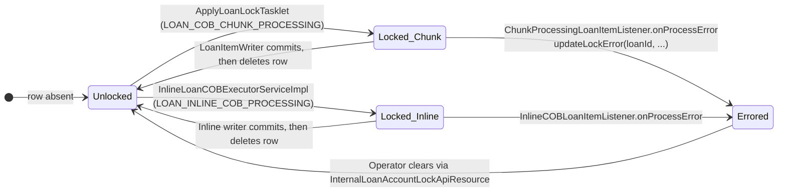
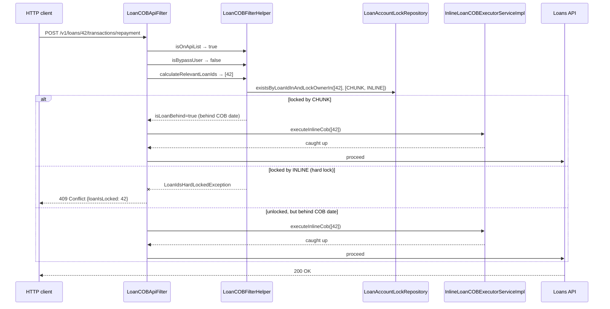

While Apache Fineract is running Close-of-Business steps against a loan, the loan aggregate is being mutated mid-flight: schedule rows are being rewritten, accruals posted, delinquency tags applied. Concurrent API calls — say, a repayment posted by a teller — must not race with that work. The defence is a database-backed *account lock*: a row in `m_loan_account_locks` keyed by the loan id. The COB chunk acquires the row before mutating; the `LoanCOBApiFilter` rejects HTTP requests that target a locked loan. This page is a tour of the lock model — the entity, the owner taxonomy, the service, the filter, and the lifecycle.

## The entity hierarchy

There are two concrete lock entities (loan and savings) and a shared `@MappedSuperclass` base.

```java
@Getter @Setter
@MappedSuperclass
@NoArgsConstructor
public abstract class AccountLock implements Persistable<Long>, Serializable {

    @Id
    @Column(name = "loan_id", nullable = false)
    private Long loanId;

    @Version
    @Column(name = "version")
    private Long version;

    @Enumerated(EnumType.STRING)
    @Column(name = "lock_owner", nullable = false)
    private LockOwner lockOwner;

    @Column(name = "lock_placed_on", nullable = false)
    private OffsetDateTime lockPlacedOn;

    @Column(name = "error")
    private String error;

    @Column(name = "stacktrace")
    private String stacktrace;

    @Column(name = "lock_placed_on_cob_business_date")
    private LocalDate lockPlacedOnCobBusinessDate;
}
```

The loan-side subclass binds it to `m_loan_account_locks`:

```java
@Entity
@Table(name = "m_loan_account_locks")
@NoArgsConstructor
public class LoanAccountLock extends AccountLock {

    public LoanAccountLock(Long loanId, LockOwner lockOwner,
                           LocalDate lockPlacedOnCobBusinessDate) {
        super(loanId, lockOwner, lockPlacedOnCobBusinessDate);
    }
}
```

`SavingsAccountLock` follows the same pattern with table `m_savings_account_locks`.

| Column | Type | Why it exists |
|--------|------|---------------|
| `loan_id` | `BIGINT` (PK) | One row per loan — re-locking the same loan with a different owner is *upgrading* the lock, not adding a row. |
| `version` | JPA `@Version` | Optimistic-locking guard against two threads racing to mutate the same row. |
| `lock_owner` | `VARCHAR` (`LockOwner` enum) | Distinguishes scheduled from inline runs (see below). |
| `lock_placed_on` | `OffsetDateTime` | Wall-clock when the lock was placed; used for staleness alerts. |
| `error` | `TEXT` | Populated when a step fails. Non-null means "stayed locked". |
| `stacktrace` | `TEXT` | Populated alongside `error`. |
| `lock_placed_on_cob_business_date` | `LocalDate` | The COB business date the run was processing; used by the orphan reaper to detect a successful run. |

## The `LockOwner` enum

```java
public enum LockOwner {
    LOAN_COB_CHUNK_PROCESSING,
    LOAN_INLINE_COB_PROCESSING;
}
```

Only two values. They map cleanly to the two execution paths:

| Value | Set by | Cleared by | Filter effect |
|-------|--------|-----------|---------------|
| `LOAN_COB_CHUNK_PROCESSING` | `LoanItemWriter` / `ApplyLoanLockTasklet` (scheduled job) | `LoanItemWriter` after the chunk commit, or `UnlockProcessedAccountsTasklet` if the writer never ran | `LoanCOBApiFilter` may auto-recover by running inline COB |
| `LOAN_INLINE_COB_PROCESSING` | `InlineLoanCOBExecutorServiceImpl.createAccountLock` | The inline job's writer | Hard-locked — the filter rejects with `409 Conflict` and `LoanIdsHardLockedException` |

The distinction matters because the filter (described below) treats an inline lock as a transient hard lock — the caller is told to retry — but treats a scheduled-job lock as something the filter itself can resolve by running the inline catch-up.

## The locking service

`LockingService` is the verb surface for COB code paths:

```java
public interface LockingService {

    void upgradeLock(List<Long> accountsToLock, LockOwner lockOwner);

    void deleteByLoanIdInAndLockOwner(List<Long> loanIds, LockOwner lockOwner);

    List<Long> findLockIdsByLoanIdIn(List<Long> loanIds);

    List<Long> findLockIdsByLoanIdInAndLockOwner(List<Long> loanIds, LockOwner lockOwner);

    void applyLock(List<Long> loanIds, LockOwner lockOwner);

    void updateLockError(Long loanId, LockOwner lockOwner, String error, String stacktrace);
}
```

The loan-side implementation is `LoanLockingServiceImpl`; the working-capital twin is `WorkingCapitalLoanLockingServiceImpl`. The savings module ships `SavingsLockingService` for its own surface.

The backing repository (`AccountLockRepository<T extends AccountLock>`) exposes the spring-data finders used by tasklets and the filter:

```java
@NoRepositoryBean
public interface AccountLockRepository<T extends AccountLock> {

    Optional<T> findByLoanIdAndLockOwner(Long loanId, LockOwner lockOwner);

    boolean existsByLoanIdInAndLockOwnerIn(
        List<Long> loanIds, List<LockOwner> lockOwners);

    boolean existsByLoanIdAndLockOwnerAndErrorIsNotNull(
        Long loanId, LockOwner lockOwner);

    int deleteOrphanedLocksForProcessedAccounts(List<LockOwner> lockOwners);
    // …
}
```

`deleteOrphanedLocksForProcessedAccounts` is what the `UnlockProcessedAccountsTasklet` calls at the end of every COB run.

## Lifecycle



Lifecycle highlights:

- **Acquisition is per-batch**. `ApplyLoanLockTasklet` and the inline executor both call `applyLock(loanIds, owner)` for the whole list in one transaction. Acquiring "one at a time" is not supported by the public surface.
- **Release is per-chunk**. `LoanItemWriter.write(chunk)` calls `LockingService.deleteByLoanIdInAndLockOwner` after the JPA flush, so locks released by Spring Batch are released in the same commit boundary as the loan mutations.
- **Errored state is sticky**. The `error` and `stacktrace` columns are populated by the chunk listener and never cleared by the writer. They get cleared by `removeByLockOwnerInAndErrorIsNotNullAndLockPlacedOnCobBusinessDateIsNotNull` only after operator intervention.

## The filter: `LoanCOBApiFilter`

The HTTP-side enforcement is a `OncePerRequestFilter` registered in the Spring Security chain.

```java
@Conditional(LoanCOBEnabledCondition.class)
public class LoanCOBApiFilter extends COBApiFilter {

    public LoanCOBApiFilter(LoanCOBFilterHelper helper) {
        super(helper);
    }
}
```

The work is in the abstract `COBApiFilter` base, parametrised by a `COBFilterHelper`.

```java
@Override
protected void doFilterInternal(HttpServletRequest request,
        HttpServletResponse response, FilterChain chain)
        throws ServletException, IOException {

    request = new BodyCachingHttpServletRequestWrapper(request);

    if (!helper.isOnApiList((BodyCachingHttpServletRequestWrapper) request)) {
        proceed(chain, request, response);
        return;
    }

    if (helper.isBypassUser()) {
        proceed(chain, request, response);
        return;
    }

    try {
        List<Long> loanIds = helper.calculateRelevantLoanIds(
            (BodyCachingHttpServletRequestWrapper) request);
        if (!loanIds.isEmpty() && helper.isLoanBehind(loanIds)) {
            helper.executeInlineCob(loanIds);   // auto-catch-up
        }
        proceed(chain, request, response);
    } catch (LoanIdsHardLockedException e) {
        Reject.reject(e.getLoanIdFromRequest(), HttpStatus.SC_CONFLICT)
              .toServletResponse(response);
    }
}
```

The four moving pieces:

| Check | Helper method | Meaning |
|-------|---------------|---------|
| Is this URL even gated? | `isOnApiList(request)` | Only a subset of write endpoints (loan repayment, disburse, write-off, schedule update, …) are intercepted. Reads pass through unchanged. |
| Is the caller a bypass user? | `isBypassUser()` | Service accounts and the internal `Inline COB` user are flagged so the filter never recurses into itself. |
| Which loans are touched? | `calculateRelevantLoanIds(request)` | Extracts loan ids from the path, query, or cached body. |
| Is at least one of them behind? | `isLoanBehind(loanIds)` | True when any loan's `last_closed_business_date` lags the current COB business date. |

If the loan is *behind* but not hard-locked, the filter calls `executeInlineCob(loanIds)` — the same inline executor described in [Inline COB](/cob/inline-cob) — and lets the request proceed once the loan is up to date.

If the loan is *hard-locked* (either by the scheduled chunk in the middle of running, or by an in-flight inline catch-up), the helper throws `LoanIdsHardLockedException` and the filter writes back a `409 Conflict` with body produced by `ApiGlobalErrorResponse.loanIsLocked(loanId).toJson()`.

```json
{
  "developerMessage": "Loan 42 is currently locked by COB processing, retry later.",
  "httpStatusCode": "409",
  "defaultUserMessage": "Loan 42 is currently locked"
}
```

## Read-side: `LoanAccountLockApiResource`

Operators can introspect the lock table over HTTP:

```java
@Path("/v1/loans")
@Tag(name = "Loan Account Lock")
public class LoanAccountLockApiResource {

    @GET
    @Path("locked")
    @Produces({ MediaType.APPLICATION_JSON })
    @Operation(summary = "List locked loan accounts",
               description = "Returns the locked loan IDs")
    public LoanAccountLockResponseDTO retrieveLockedAccounts(
            @QueryParam("page") Integer pageParam,
            @QueryParam("limit") Integer limitParam) {
        int page  = Objects.requireNonNullElse(pageParam, 0);
        int limit = Objects.requireNonNullElse(limitParam, 50);
        return new LoanAccountLockResponseDTO(page, limit,
            loanAccountLockService.getLockedLoanAccountByPage(page, limit));
    }
}
```

A sibling `InternalLoanAccountLockApiResource` is the operator escape hatch — it supports forced unlock by loan id and is gated behind the internal-API flag. Use this *only* when a stuck error lock cannot be cleared by the orphan reaper.

## Sequence: a repayment while COB runs



## Operational checklist

<AccordionGroup>
  <Accordion title="A loan stayed locked overnight">
    Inspect `m_loan_account_locks` for the row. If `error` is populated,
    the chunk failed — investigate the stacktrace, fix the data, then
    delete the row through `InternalLoanAccountLockApiResource`. The next
    COB run will pick the loan up automatically.
  </Accordion>
  <Accordion title="Filter rejects with 409 but no row exists">
    The 409 path requires `LoanIdsHardLockedException`. Confirm
    `helper.calculateRelevantLoanIds` is returning the right ids — a
    misparsed body can result in a phantom "lock" being checked.
    Increase log level on `LoanCOBFilterHelper`.
  </Accordion>
  <Accordion title="Bypass user setup">
    Service accounts that drive bulk operations should be flagged as
    bypass users so they don't trigger inline COB on every call.
    `isBypassUser()` is wired through the `PlatformSecurityContext` and
    the `Inline COB` role.
  </Accordion>
  <Accordion title="Orphan reaper threshold">
    `UnlockProcessedAccountsTasklet` only removes locks whose
    `lock_placed_on_cob_business_date` matches the loan's
    `last_closed_business_date` and where `error` is null. A lock with
    a non-null `error` will stay until manually cleared — by design.
  </Accordion>
</AccordionGroup>

## Related pages

- [Tasklets & wiring](/cob/cob-tasklets) — where `ApplyLoanLockTasklet`
  and `UnlockProcessedAccountsTasklet` fit in the job graph.
- [Inline COB](/cob/inline-cob) — what the filter triggers when a loan
  is behind but not hard-locked.
- [Catch-up](/cob/cob-catch-up) — when an entire tenant is days behind,
  prefer this over filter-driven inline catch-up.
- [Business step engine](/cob/business-step-engine) — the action context
  every step inherits while a lock is held.
